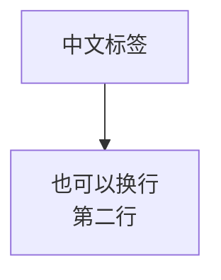

# MiXianTu 文档站（VitePress 多语言）

本站（仓库 `mxt-docs`）是 MiXianTu（模组 ID `mxt`）的文档站，用 [VitePress](https://vitepress.dev/) 构建，
**中文（简体）是主语言，位于站点根路径**，英文镜像放在 `/en/` 下。两套文档的文件名与目录层级完全一致，
导航栏右上角由 VitePress 自动生成语言切换下拉框，不需要额外组件。

模组本体在**另一个仓库**（<https://github.com/Nova-Committee/MiXianTu>），本站不包含它，也不假设它被克隆在哪里。

## 快速开始

```bash
pnpm install          # 安装依赖（首次会执行 esbuild 的 postinstall）
pnpm run dev          # 本地预览 http://localhost:5173
pnpm run build        # 构建全部语言页面到 docs/.vitepress/dist
pnpm run preview      # 预览构建产物
```

## 目录结构

```text
mxt-docs
├─ docs                     # VitePress 源目录（中文，站点根路径 /）
│  ├─ index.md              # 首页（手工维护）
│  ├─ installation.md       # 开始
│  ├─ datapack/             # 数据包：总览、伤害结算、示例、JSON 参考、类型参考
│  ├─ tutorial/             # 教程
│  ├─ player-guide/         # 游玩指南
│  ├─ kubejs/               # KubeJS
│  ├─ java/                 # Java API
│  ├─ technical/            # 技术细节：源码级实现说明（伤害系统、敌我识别系统…）
│  ├─ en/                   # 英文镜像（与根目录一一对应，URL 带 /en/ 前缀）
│  ├─ public/               # logo、favicon、文章配图等静态资源（所有语言共用）
│  └─ .vitepress/
│     ├─ config.ts          # 公共配置 + locales 挂载
│     ├─ locales/
│     │  ├─ zh.ts           # 中文语言包：导航、侧边栏、界面文案
│     │  ├─ en.ts           # 英文语言包
│     │  ├─ build.ts       # 由页面清单生成导航与整站侧边栏树（自动过滤缺失页）
│     │  └─ pages.mjs       # 全站页面清单（唯一结构来源）
│     └─ theme/             # 默认主题 + 自定义样式
└─ scripts/
   ├─ repos.mjs             # 模组仓库等外部仓库的定位（环境变量优先，其次自动发现）
   ├─ migrate-docs.mjs      # 从两份既有文档生成站点内容
   ├─ check-i18n.mjs        # 列出只存在于单一语言的页面
   ├─ check-links.mjs       # 校验站内链接与锚点
   └─ check-config-labels.mjs # 校验配置名与模组语言文件逐字一致
```

## 内容从哪里来

站点内容由两份既有文档生成，`pnpm run migrate` 负责搬运：

| 语言 | 来源 | 处理方式 |
| --- | --- | --- |
| 英文 | 旧的英文文档仓库 `docs` 的 `docs/mod/mxt/`（Docusaurus） | 目录结构原样保留到 `docs/en/`，只转换 front matter 与 `:::note` 之类容器语法 |
| 中文 | 模组仓库 `MiXianTu` 的 `docs/`（Docusaurus） | 按目标结构重新组装：`数据包格式.md` 按注册表拆成 `docs/datapack/json/*.md`，各篇指南合并到对应页面 |

两份来源都是外部仓库，位置由环境变量给出：`MXT_EN_DOCS`（英文来源，默认找本站同级、名为 `docs` 的仓库）与 `MXT_ZH_DOCS`（中文来源，默认就是自动发现到的模组仓库）。迁移已经跑完，这一节是给需要重跑的人看的。

**现在重跑会被拒绝**：模组仓库在 2026-09-21 删掉了 5 篇迁移前的散篇（`灵气环境数据包.md`、`经济系统数据包格式.md`、`通用物品.md`、`curios槽位.md`、`item-bindings.md`），而 `aura_zone`、`currency`、`player-guide/items`、`player-guide/curios-slots` 这几页当初就是由它们生成的。脚本会**先列出缺哪些语料再退出**，不会拿剩下的输入重写页面（那几页现在是手工维护）；真要重跑就从 git 历史恢复语料，或用 `MXT_ZH_DOCS` 指向旧快照。

两点约定：

- **脚本只拥有它生成的页面。** 它把自己的产物记录在 `scripts/.migrated.json`，重跑时只覆盖这些文件；
  `KEEP` 名单（`docs/index.md`、`docs/player-guide/index.md`、`docs/installation.md`）与手工翻译的页面永远不动。
- **长页面会被拆成子页面。** `scripts/migrate-docs.mjs` 顶部的 `SPLITS` 声明「哪个页面的哪些 `##` 分节搬进
  哪个子页面」：父页**保留原路径**并变成该分组的索引，没搬走的内容留在原处，子页放在子目录里，于是在侧边栏
  形成二级目录。搬家时会重写相对链接的深度、把指向被搬走小节锚点的深链改指新页面、并把子页的标题层级提升到
  H2。每次改动只需改 `SPLITS` 与 `pages.mjs`，内容本身不重写。
- **命令页按根命令一页一条。** `COMMAND_PAGES` 把 `player-guide/commands` 的整张命令表按**根命令**（`/mxt`、
  `/aura`、`/formation`…）逐行分发到 `player-guide/commands/<根命令>.md`，并把 `/mxt lightning` 这类详情小节
  一并搬走；父页只剩说明与索引。带顶层别名的行跟随别名（`/mxt curse apply` → `/curse`），只有 `/mxt`
  子命令的行留在 `/mxt` 页。中文表原本缺 `/talisman` 的 4 行，由 `COMMAND_PAGES.supplements` 补齐。
- **索引页的「子页面」链接列表由页面清单生成。** `refreshGroupNav()` 依据 `pages.mjs` 给每个「自身是页面又有
  子页」的分组重建导航块（含二级小分组），所以侧边栏与索引页永远一致。
- **侧边栏按顶部大类分区。** 每个页面左侧只显示**当前大类**的目录（开始 / 游玩指南 / 开发教程 / 数据包 /
  KubeJS / Java API / 技术细节），由 VitePress 按路径前缀匹配最贴切的一份；大类内部的分组（如「JSON 数据格式」的 34 个
  注册表页、「类型参考」下的子分组）默认折叠，读者进入其中时由 VitePress 自动展开。
- **侧边栏按语言过滤。** `docs/.vitepress/locales/pages.mjs` 声明全站页面，`build.ts` 会检查文件是否存在，
  缺失的页面自动从该语言侧边栏消失，因此侧边栏不会指向 404。
- **新增页面或大类之后要让配置重新求值。** 侧边栏与导航栏都是在配置求值时生成的，`pnpm run dev` 只在
  `config.ts` / `pages.mjs` 这些文件变化时重新求值：**只把 `.md` 文件放进去，侧边栏不会自己长出来**，
  要重启 dev（或改动 `pages.mjs` 触发重载），否则浏览器拿到的还是旧的那份。导航项也只在对应大类真的
  有页面时才出现，所以某一类缺页时最坏的结果是少一个入口，而不是点进去看到根大类（开始）的侧边栏。

## 校验

```bash
pnpm run check:i18n          # 列出只有中文或只有英文的页面（翻译待办）
pnpm run check:i18n -- --strict
pnpm run check:links         # 校验站内链接与 #锚点
pnpm run check:links -- --strict
pnpm run check:config        # 校验文档里的配置名与模组语言文件逐字一致（需要模组仓库，见下）
pnpm run build               # 构建失败会报告死链
```

`check:i18n`、`check:links` 和 `build` 只需要本仓库；`check:config` 还要读模组仓库的语言文件，所以额外接受
`MXT_REPO=<模组仓库路径>`（不设时会自动发现，找不到会明确报错）。

## 配置类内容的写法

配置项只在**游戏内的配置界面**里修改（`模组列表 → 觅仙途 → 配置`：客户端设置 + 觅仙途服务端配置，
服务端配置需要 OP 且会同步给客户端）。因此文档里：

- **不写** `config/mxt-server.json` 之类的文件路径，也**不写**原始键（`formation.respect_friends`）；
- 一律写作 **「服务端配置「标签页 → 条目」」** 或 **「客户端配置「标签页 → 条目」」**，名字取自模组自己的
  语言文件（`src/main/resources/assets/mxt/lang/zh_cn.json` / `en_us.json`）；
- `pnpm run check:config` 会把这些名字与语言文件逐个比对，改名字后会立刻报错。它要读模组仓库里的两份
  `lang/*.json`，而模组不在本站里，所以这个检查会去找模组仓库：`MXT_REPO` 环境变量优先，其次是自动发现
  常见位置；找不到时它会直接告诉你 `MXT_REPO` 该设成什么，而不是悄悄跳过。
  ```bash
  MXT_REPO=/path/to/MiXianTu pnpm run check:config
  ```

安装页（中英）里的「配置 / Configuration」一节是这条规则的正典说明，其他页面只引用标签页与条目名。

## 图表（Mermaid）与配图

**Mermaid 是本站自己的三个文件接的，没有用第三方插件**（`vitepress-mermaid-viewer` 已卸载：它的
`optimizeDeps`/alias 补丁在 pnpm 的严格布局下会把 `tsc dev` 打崩）：

| 文件 | 职责 |
| --- | --- |
| `docs/.vitepress/config.ts` | 把 ` ```mermaid ` 围栏改写成 `<ClientOnly><Mermaid code="…" /></ClientOnly>` |
| `docs/.vitepress/theme/index.ts` | 全局注册 `Mermaid` 组件 |
| `docs/.vitepress/theme/components/Mermaid.vue` | 调 `mermaid.render()` 画图，并提供点击放大 |

写图表就是普通代码块：

````

````

四个必须知道的约束：

- **围栏里的源码要经过 `encodeURIComponent` 再进属性**。`JSON.stringify` 会留下 `\"`，Vue 模板编译器
  直接报 `Attribute name cannot contain U+0022`，**整站构建失败**——而且只有含引号的图（也就是全部）会触发。
  组件侧对应 `decodeURIComponent`。
- **`htmlLabels` 顶层与 `flowchart.*` 必须同时为 `true`。** 布局靠渲染出来的盒子量宽度，两处不一致时布局会
  退回 SVG 文本量法、渲染却仍输出 `<foreignObject>`，于是每个标签都塌到 120px 下限，中文变成一字一行
  （看起来像字间塞了全角空格）。`wrappingWidth: 400` 是为了不把长标签自动折行。
- **图在客户端绘制**，所以每张图的源码都留在页面里（它就是内容的唯一来源）。
- **点击图放大**：全屏浮层里按原始尺寸渲染，`缩小 / 放大 / 恢复原始大小 / 关闭`，支持 `Ctrl`+滚轮缩放、
  滚轮平移，`Esc`、点击背景或 `✕` 关闭；按钮提示按当前语言显示（`zh` → 中文，其余 → 英文）。

**配图**放在 `docs/public/images/<主题>/`，两种语言共用同一份（`public/` 不属于任何语言目录），引用写绝对路径
`/images/aura/xxx.png`。研究用的图来自仓库的 `research/`，放进来之前确认它描述的是**当前代码**
（例如 `aura_subchunk_*.png` 是 `1/r²` 模型下的研究，而运行时是 `1/max(1, d²)`，页面里必须写明这一点）。

## 部署（Cloudflare Pages）

本站的 VitePress **源目录是 `docs/`**，而仓库根只是工程目录，所以 Pages 的构建设置必须指向 `docs`：

| 设置项 | 值 |
| --- | --- |
| Root directory（根目录） | 留空（即仓库根） |
| Build command（构建命令） | `pnpm run build`（等于 `vitepress build docs`） |
| Build output directory（输出目录） | `docs/.vitepress/dist` |
| Node / pnpm | 无需设置：`packageManager` 已锁 pnpm 11.5.2，Pages 自带的 Node 22 可用 |

**为什么不能写 `npx vitepress build`**：VitePress 的 CLI 不带目录参数时会把**当前目录**当作源目录，
于是页面路径全变成 `/docs/**`、`docs/.vitepress/config.ts` 也不会被加载，页内所有绝对链接
（`/installation`、`/datapack/json/element`…）统统变成死链，构建以
`[vitepress] 123 dead link(s) found` 失败。本地一条命令即可复现：

```bash
npx vitepress build        # ✗ 在仓库根执行：把仓库根当源目录，报一大堆 dead link
pnpm run build             # ✅ 等价于 vitepress build docs
```

> 注意 `.gitignore`：**不要**写不带路径的 `.vitepress`，那会连 `docs/.vitepress/`（配置、主题、语言包）
> 一起忽略，仓库里就没有配置文件了，线上会得到没有侧边栏、没有语言切换、没有搜索的裸站点。
> 现在文件里是 `/.vitepress/`（只忽略仓库根那个误建目录）。提交后可以这样确认：

```bash
git ls-files docs/.vitepress        # 应列出 config.ts、theme/、locales/ 等
```

## 已知情况

- 文档里的 ` ```mcfunction ` 代码块会以纯文本渲染：当前 VitePress 使用的 Shiki 没有内置 mcfunction 语法，
  构建时会打印 `The language 'mcfunction' is not loaded` 提示，不影响构建结果。
- 首屏 JS 体积超过 500 kB 的提示来自 VitePress 默认主题，与本项目的配置无关。
- **没有**开启「按浏览器语言自动跳转首页」：`docs/index.md` 保持中文首页，英文读者用导航栏的语言下拉框
  （或直接访问 `/en/`）切换。需要时可以在 `docs/index.md` 里加一段 `navigator.language` 判断的
  `<script setup>`，但那样会让中文主页在英文浏览器里被跳过。
