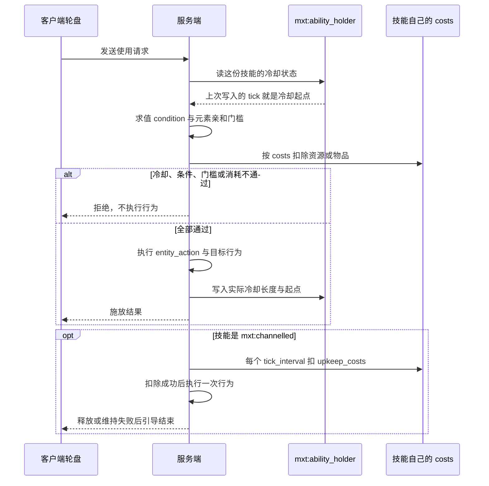

# ability（技能） {#ability}

文件位置：`data/<namespace>/mxt/ability/<path>.json`

**用途**：主动、被动和触发技能。**法器能力与技能是同一个概念**：技能类型是一张共用的表，法器、功法、命令与脚本都能授予同一种技能。

| 字段 | 类型 | 默认 | 说明 |
| --- | --- | --- | --- |
| `name` | Text Component | `ability.mxt.<命名空间>.<路径>` | 可选显示名。省略时用左列的默认键。 |
| `description` | Text Component | `ability.mxt.<命名空间>.<路径>.description` | 可选描述。省略时用左列的默认键；目前只被存储与读取，还没有界面绘制它。 |
| `type` | `AbilityType` | **必填** | 固有技能类型，**就写在顶层**（`{"type": "mxt:active", ...}`），不是嵌套在 `ability` 对象里。可选值见下方[技能类型](#ability-types)。 |
| `costs` | `List<Cost>` | `[]` | 技能执行前扣除的消耗，整份数组**全有或全无**；写法见[共享数据类型 · `Cost`](../types/shared_data_types.md#cost)。 |
| `cast_time` | `NumberProvider` | `0` | 施法时间。 |
| `cooldown` | `NumberProvider` | `0` | 冷却时间。**所有类型都支持**（不只是主动技）：每次付款都会把这次的实际长度与起点写进 `mxt:cooldown` 状态，所以不用在 `components` 里再声明一遍。 |
| `icon` | Icon 引用 | 无 | 主动技能的轮盘图标，必须**恰好**定义 `texture`（16×16 GUI 贴图）或 `item` 之一：两者都给或都不给都会被拒绝。 |
| `components` | `List<DataStorage>` | `[]` | 该技能声明的状态类型（冷却、充能、切换、持续…）。类型的类是槽，值存在技能自己那份附件里。 |
| `modifiers` | `List<AttributeEntry>` | `[]` | 被动原版属性修正；条目包含 `attribute`、`id`、`amount`、`operation`，可选 `value` 公式。 |
| `damage_condition` | `DamageCondition` | `mxt:always_true` | 伤害触发限制。 |
| `condition` | `EntityCondition` | `mxt:always_true` | 技能可用条件；对 `modifier`（被动属性）与 `aura` 类型还会**每 tick 重算一遍**，因此可以拿来把被动"挂条件"（不满足时它贡献的属性会被撤下）。 |
| `entity_action` | `EntityAction` | `mxt:no_op` | 对施法者执行的行为。 |
| `target_selector` | `AbilityTargetSelector` | `mxt:self` | `bi_entity_action` 作用于哪些实体：`mxt:self` 只有施法者；`mxt:area` 取 `radius`（必填，上限 128）与 `include_actor`（默认 `false`）；`mxt:ray` 是沿视线的圆柱（`length` 必填、`radius` 默认 `0.5`）、`mxt:cone` 是沿视线的圆锥（`length` 与半角 `angle` 必填），两者同样支持 `include_actor`；三种区域型选择器还都能写 `limit`（默认 `0`＝不限）与 `order`（`nearest` / `farthest` / `random`，默认 `nearest`）来"只取最近的三个"。`mxt:js` 交给服务端脚本。字段见[技能目标选择器类型](/datapack/types/other/ability-and-curse#ability-target-selector-type)。 |
| `target_condition` | `BiEntityCondition` | `mxt:always_true` | 目标关系条件。 |
| `bi_entity_action` | `BiEntityAction` | `mxt:no_op` | 对施法者和目标执行的行为。 |
| `element_affinity` | `HolderOrTag<element>[]` | `[]` | 技能的元素亲和标记；非空时既是**施放门槛**（没有任何匹配灵根就不放行），也是 `element_modifier` 的来源——[伤害管线](/technical/damage)第一层会把它直接乘进这次施放打出的伤害（匹配灵根的 `element_ability_modifier`，按 `element_affinity_mode` 合并），所以伤害公式里**不要**再手写 `* element_modifier`。 |
| `element_affinity_mode` | `average` / `max` | `average` | 多条灵根都匹配时 `element_modifier` 怎么算：`average` 取平均（老行为），`max` 取最好的那条。 |
| `hidden` | bool | `false` | 不在轮盘与提示框里出现，但照常生效与授予：一条技能"只想要效果、不想占一格"就靠它。 |
| `item_action` | `ItemAction` | `mxt:no_op` | 对**承载这件技能的物品堆**执行的行为，给"技能自己的物品代价／回馈"用。`mxt:upkeep` 的 `on_fail` 是同一件事的专用写法（见该类型）。 |

```json
{
  "type": "mxt:triggered",
  "triggers": [{"type": "mxt:item_use"}],
  "costs": [
    {"id": "example:qi", "amount": "10 + level"}
  ],
  "cooldown": 100,
  "condition": {"type": "mxt:sneaking"},
  "entity_action": {"type": "mxt:damage", "amount": "4 + level"}
}
```

技能的数值字段统一使用 `NumberProvider`；技能必须先通过条件和所有资源消耗，才执行行为。`costs` 里 `mxt:resource` 条目的 `amount` 在施法者上下文之外还带上**该数值自己的公式上下文**（资源族变量，如 `realm_rank`、`absorbed_aura`），见[公式变量](../types/formula_variables.md)。

## `components` 与统一状态存储

`components` 是内容声明的**状态类型**列表，类型由固有注册表 `mxt:data_storage_type` 分派。每个类型就是一个可存储的对象：**槽的身份是这个类型本身的类**，同一个宿主上每种类型最多存一个值，所以既不需要键名，也不需要另外声明一个槽。存进附件的就是这个对象本身——声明字段与状态字段一起编码，持久化直接用类型自带的 `type` 分派，存储因此不需要认识任何形状。

| `type` | 声明字段 | 状态字段 |
| --- | --- | --- |
| `mxt:empty` | 无 | 无（该类型只是注册表默认项，用来表示"不声明状态"）。 |
| `mxt:cooldown` | `ticks`（必填） | `duration`：上次实际冷却长度；写入时刻即冷却开始时刻。**通常不用写**：`cooldown` 字段本身就会写这份状态，只有想把声明长度与字段分开时才显式声明（声明的 `ticks` 优先于字段）。 |
| `mxt:charges` | `maximum`、`recharge_ticks`（均必填） | `remaining`：剩余次数；没有该字段即视为满。充能由运行时自动恢复：距上次写入超过 `recharge_ticks` 就在持有者 tick 里 +1，每次最多一步、满则不再写。 |
| `mxt:toggle` | `default`（默认 `false`） | `state`：当前开关。 |
| `mxt:timer` | `duration`（必填） | `ends_at`：计时结束的 tick。 |
| `mxt:resource` | `resource`（必填） | `amount`：该数值的存量。 |
| `mxt:target_lock` | `range`（必填） | `target`：被锁定实体的 UUID（字符串）。 |

值**跟着拥有它的那份附件一起存**：技能的状态住在 `mxt:ability_holder` 里，地址是「持有者 id + 类型类」——附件本身就是宿主，所以不用再记一个宿主类，存档只记 id，类型由值自己的 `type` 反序列化回来。技能 id 不同就互不影响，同一个技能在不同实体上也互不影响。附件记录每次写入的 tick，读取方由此得到"这次状态是什么时候开始的"。存下去的就是类型实例本身，靠它自带的 `type` 分派编解码，因此存储本身不认识任何家族的形状。

技能的**最后一次授予来源被撤销时，它名下的全部状态会被清除**：重新授予的技能不会带着上一次的充能回来。由内容写入状态用实体行为 `mxt:modify_storage`（`family`、`id`、`value`），其中 `value` 是一个完整的存储对象，例如 `{"type":"mxt:charges","maximum":3,"recharge_ticks":100,"remaining":2}`——解析它的就是那个 `type` 分派；宿主没声明过的类型会被拒绝并记一条警告。运行时的游标虽然也注册在同一张表里，但属于运行时，`mxt:modify_storage` 会直接拒绝：技能有 `mxt:cast_deadline`、`mxt:channel_pulse`、`mxt:aura_pulse` 三个，天劫有 `mxt:entry_began`、`mxt:idle_countdown` 两个（后两者住在天劫附件自己的单槽里，不进技能这套按 id 寻址的存储）。

读取状态用六个实体条件，地址与 `mxt:modify_storage` 完全一致（`family` = 数据包注册表、`id` = 宿主），并且同样只认宿主**声明过**的类型——六种状态因此都能被内容询问：`mxt:storage_toggle`（`expected`，默认 `true`，读 `state`，没写过时读声明的 `default`）、`mxt:storage_timer`（`remaining` 是 `{min?, max?}` 窗口、`ended` 读 `ends_at`；没有 `ends_at` 的计时没有在跑，剩余按 0、`ended` 为真）、`mxt:storage_resource`（`amount` 是窗口；不给窗口就只问"存没存过"）、`mxt:storage_target`（`locked` 默认 `true` 问有没有锁着目标，`max_distance` 额外要求那个 UUID 还能在施动者所在维度里找到且在距离内）、`mxt:storage_charges`（`remaining` 是窗口，读剩余次数；从没花过就读作满，也就是声明的 `maximum`）、`mxt:storage_cooldown`（`remaining` 是窗口、`ready` 问好没好；长度取上次实际冷却时长，内容自己写进去的没带 `duration` 时取声明的 `ticks`，起点是写入那一刻——运行时读的是同一个锚点；从没写过就是没在冷却，剩余 0、`ready` 为真）。`mxt:storage_cooldown` 是唯一**不要求宿主声明过该类型**的：字段 `cooldown` 本身就够（长度取写入时的实际值，没有声明时按 0 计），所以只写一个 `cooldown` 的技能也能被条件读出来。条件在客户端也会被求值（物品 tooltip），此时没有服务端数据包注册表，一律读作不成立。

## 技能类型 {#ability-types}

顶层的 `type` 属于可扩展的固有分派表 `mxt:ability_type`，内置十二种：`empty`、`active`、`triggered`、`modifier`、`aura`、`channelled`、`composite`、`word`、`mount`、`flight_control`、`storage`、`upkeep`。**法器能力与技能共用这张表**——`mxt:storage`、`mxt:upkeep` 与今天的 `mxt:mount` / `mxt:flight_control` 曾经是另一张表 `mxt:artifact_ability_type`（已整张删除），现在它们就是普通的技能类型，任何来源（法器、功法、命令、脚本）都能授予。

其中两种类型会改变行为的执行时机：

| 类型 | 专属字段 | 行为执行时机 |
| --- | --- | --- |
| `mxt:channelled` | `tick_interval`（默认 `1`）、`upkeep_costs`（默认 `[]`） | 激活时执行一次 `entity_action` 与目标行为，随后每个 `tick_interval` 在维持资源扣除成功后各执行一次，直到自身被释放或维持失败。它是持续效果唯一的行为入口。 |
| `mxt:composite` | `abilities`（必填）、`all_required`（默认 `true`） | 自身不执行行为；`all_required: false` 时只执行列表首个技能，为 `true` 时按列表顺序提交全部成本后依次执行每个子技能的行为。 |

三个**需要承载物品**的类型（它们是法器等物品侧技能的写法，被技能书授予时语法合法但没有物品可用，会在使用时拒绝并报"没有承载物"）：

| 类型 | 专属字段 | 作用 |
| --- | --- | --- |
| `mxt:mount` | `speed`（必填 `NumberProvider`）、`seats`（默认 `1`，最多 `4`）、`sit`（默认 `false`＝站）、`display`（载具怎么画，默认＝"放平 + 剑刃朝前 + 两倍大"）、`width` / `height`（默认 `0.35` / `0.12`）、`step_height`（默认 `0`）、`seat_offsets`、`mount_action`（`on_mount` / `on_dismount` / `tick`）、`trail`（尾迹粒子） | **载具（数据）**：一件法器被御器之术取走之后，飞的是什么。它**从不被发动**，只读自己的字段、顶层 `costs`（**每 tick 的燃料**：先扣载具里那件法器存的同门灵气，余额才由驾驶者付；可以写成小数）与 `condition`（每 tick 复查，不满足即落地）；**其余顶层字段写了会在加载期报错**（`cooldown` / `components` / `cast_time` / `entity_action` / `target_selector` / `target_condition` / `bi_entity_action` / `modifiers` / `damage_condition` / `element_affinity` / `element_affinity_mode` / `item_action`，报错会逐个点名）。撞到方块或地面就落剑。`seats` 是**总人数含驾驶者**——驾驶者必须是玩家，其余座位谁都能坐（对载具按右键上座）；`sit` 是全车一个姿势。驾驶者用移动键操作：`跳跃`上升、下降键（默认 `X`，可改绑）下沉、`疾跑`给 1.5 倍水平速度，前后左右**默认沿视线方向**（抬头爬升、低头俯冲，服务端配置「飞行 → 朝视线方向飞行」，默认开；关掉后四个方向都只在水平面上），潜行仍是原版的下坐骑。位移只在服务端算。`mount_action` 的三个行为**都跑在驾驶者身上**（`on_mount` 起剑那一刻、`on_dismount` 落剑那一刻——在下座之前跑、`tick` 每 tick 且燃料已付），`trail` 则由**载具自己**发（`particle`（**对象形式** `{"type": "minecraft:end_rod"}`，裸 id 字符串会在加载期报 `Not a JSON object`）/ `interval` / `count` / `speed` / `spread` / `offset_x` / `offset_y` / `offset_z` / `moving_only`，spread 与 offset 的单位是格）。 |
| `mxt:flight_control` | `hand`（`main` / `off` / `either`，默认 `either`＝主手优先）、`speed_multiplier`（默认 `1`） | **御器之术（需要按键）**：按一下从主手、其次副手找一件声明了 `mxt:mount` 的法器，把那件东西**收进载具实体**并骑上去；再按一下落剑，**落地不收费**。它通常由功法授予（`granted_abilities`），灵根 / 体质 / 技能书 / 命令 / 脚本同样能授予；**没有它，轮盘上根本没有这一格**。起剑一次的价格是它自己的 `costs`，冷却是它自己的 `cooldown`。 |
| `mxt:storage` | `slots`（必填 `NumberProvider`） | 这件承载物自带容器：格数求值后**按 9 向上取整**并夹在 6 行以内（最多 54 格），内容写在物品组件 `mxt:artifact_storage` 上，只认主人与服务端。它也是"需要按键"的：轮盘上按一下打开箱子，没有状态。 |
| `mxt:upkeep` | `interval`（默认 `20`）、`on_fail`（默认 `mxt:no_op`）、`owner_only`（默认 `true`） | **周期性代价**：承载期间每 `interval` 刻结算一次，把技能自己的 `costs` **全部一起**扣掉（全有或全无）。付不出时跑 `on_fail`（对持有者与该物品堆执行）。时钟是**世界时间**：只在能被 `interval` 整除的刻结算。它**不是**"需要按键"的：不进轮盘。 |

其余六种类型与行为字段的关系：

| 类型 | 专属字段 | 说明 |
| --- | --- | --- |
| `mxt:active` | 无 | 可从轮盘施放；**它没有 `slot` 字段**（2026-09-25 删除）：技能落在轮盘哪一格由**玩家自己的 12 格布局**决定，从来不是技能定义的一部分。旧包里写了 `"slot": "..."` 会在**加载期报错并点名 `slot`**（这是"这个类型永远不读的已知键"，不是静默忽略），删掉这一行即可。 |
| `mxt:triggered` | `triggers`（默认 `[]`）、`chance`（默认 `1`） | 当它的某个事件规则匹配时触发，并按 `chance` 掷一次。`triggers` 的每一项是一个 `trigger_type` 条目，除内置信号外还可以是脚本发布的 `mxt:js` 自定义信号。 |
| `mxt:modifier` | 无 | 被动属性：不执行 `entity_action`，只在被授予期间把 `modifiers` 贡献给持有者的属性，并且**每 tick 重新过一遍 `condition`**（不满足时贡献会被撤下）。 |
| `mxt:aura` | `interval`（默认 `20`）、`radius`（默认 `4`） | 范围脉冲：每隔 `interval` 刻对 `radius` 范围内的实体施加一次，同样每轮重算 `condition`。 |
| `mxt:word` | `effect`（必填）、`requires_operator`（默认 `true`）、`amount`（默认 `0`） | 终端载荷：`effect` 是一份**代码白名单**，只有 `self_heal` 与 `purge_self_curses` 两个值（`amount` 只对前者有意义），数据包**加不了第三个**——言灵不是"任意命令字符串"；要别的效果请用普通技能类型加 `entity_action`（如 `mxt:heal`）。它不会再执行目标行为。 |
| `mxt:empty` | 无 | 什么都不做，也是这张表的默认项。 |

```json
{
  "type": "mxt:modifier",
  "condition": {"type": "mxt:sneaking"},
  "modifiers": [{"attribute": "minecraft:armor", "id": "example:guard", "amount": 2, "operation": "add_value"}]
}
```

```json
{
  "type": "mxt:channelled",
  "tick_interval": 20,
  "upkeep_costs": [{"id": "example:qi", "amount": 1}],
  "entity_action": {"type": "mxt:add_resource", "resource": "example:qi", "amount": 2}
}
```

```json
{
  "type": "mxt:composite",
  "abilities": ["example:meditate_channel"],
  "cooldown": 100
}
```

顶层技能若要是可从上手栏释放的引导技，应把 `mxt:channelled` 作为 `mxt:composite` 的子技能：`mxt:active` 与 `mxt:channelled` 是互斥的单一 `type`，而复合技能的子技能才会成为活跃引导。

### 技能只定义一处 {#ability-single-definition}

技能永远只是一个 `mxt:ability` 条目，**`data/<命名空间>/mxt/ability/<路径>.json` 是它唯一的定义处**，它的身份就是自己的注册表 id（`name` / `description` 省略时按上面那条四段式默认键生成，路径里不会再带什么后缀）。宿主（[法器](./artifact.md) 的 `abilities`、符箓与功法的 `granted_abilities` 等）只写它的 **id** 或 **`#标签`**，不写 `key`，也不能把技能整个抄进去：**"写在宿主定义里的内联技能"这个形状已经取消**，旧写法会让宿主那份定义整个不可解析。

技能的计算字段均可使用 NumberProvider/表达式。技能类型写在**顶层** `type` 上（不是嵌套的 `ability` 对象），行为写在 `entity_action` / `bi_entity_action` 中，并通过 `costs` 声明资源或物品消耗：

```json
{
  "type": "mxt:active",
  "costs": [{"type": "mxt:resource", "resource": "mxt:spirit_power", "amount": 10}],
  "entity_action": {"type": "mxt:damage", "amount": "8 + level"}
}
```

技能行为由服务端处理，客户端轮盘只发送"选中了哪一类的哪个 id"（`WheelActionC2SPayload(kind, id)`），授予、条件、消耗与冷却全部由服务端判定。

把这条规则摊成时序，一次技能发动的先后顺序如下。


