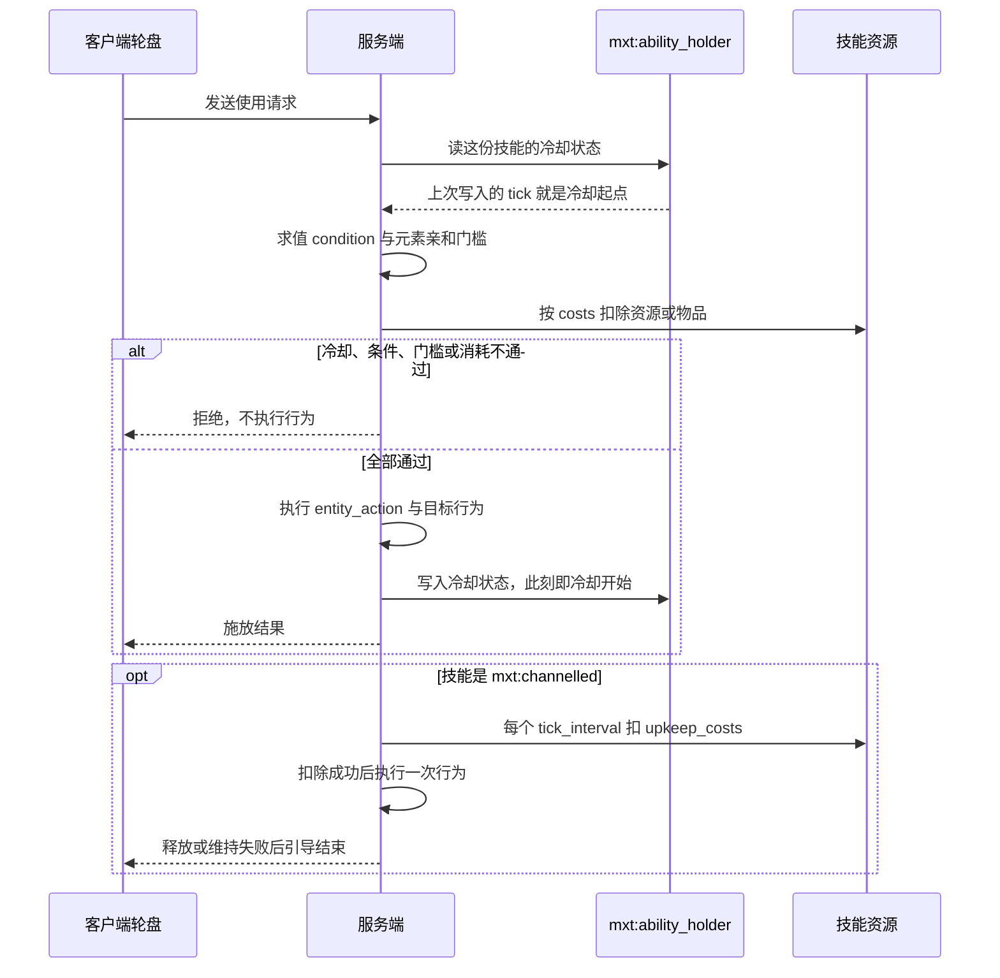

# ability（技能） {#ability}

文件位置：`data/<namespace>/mxt/ability/<path>.json`

**用途**：主动、被动和触发技能。

| 字段 | 类型 | 默认 | 说明 |
| --- | --- | --- | --- |
| `ability` | `AbilityType` 对象 | **必填** | 固有技能类型对象；对象内部必须有 `type` 分派键。 |
| `costs` | `List<ResourceCost>` | `[]` | 技能执行前扣除的资源。 |
| `cast_time` | `NumberProvider` | `0` | 施法时间。 |
| `cooldown` | `NumberProvider` | `0` | 冷却时间。 |
| `icon` | Icon 引用 | 无 | 主动技能的轮盘图标，必须**恰好**定义 `texture`（16×16 GUI 贴图）或 `item` 之一：两者都给或都不给都会被拒绝。 |
| `components` | `List<DataStorage>` | `[]` | 该技能声明的状态类型（冷却、充能、切换、持续…）。类型的类是槽，值存在技能自己那份附件里。 |
| `modifiers` | `List<AttributeEntry>` | `[]` | 被动原版属性修正；条目包含 `attribute`、`id`、`amount`、`operation`，可选 `value` 公式。 |
| `damage_condition` | `DamageCondition` | `mxt:always_true` | 伤害触发限制。 |
| `condition` | `EntityCondition` | `mxt:always_true` | 技能可用条件；对 `modifier`（被动属性）与 `aura` 类型还会**每 tick 重算一遍**，因此可以拿来把被动"挂条件"（不满足时它贡献的属性会被撤下）。 |
| `entity_action` | `EntityAction` | `mxt:no_op` | 对施法者执行的行为。 |
| `target_selector` | `AbilityTargetSelector` | `mxt:self` | `bi_entity_action` 作用于哪些实体：`mxt:self` 只有施法者，`mxt:area` 取 `radius`（必填，上限 128）与 `include_actor`（默认 `false`），`mxt:js` 交给服务端脚本。 |
| `target_condition` | `BiEntityCondition` | `mxt:always_true` | 目标关系条件。 |
| `bi_entity_action` | `BiEntityAction` | `mxt:no_op` | 对施法者和目标执行的行为。 |
| `element_affinity` | `HolderOrTag<element>[]` | `[]` | 技能的元素亲和标记；非空时既是**施放门槛**（没有任何匹配灵根就不放行），也是 `element_modifier` 的来源——[伤害管线](/technical/damage)第一层会把它直接乘进这次施放打出的伤害（匹配灵根的 `element_ability_modifier`，按 `element_affinity_mode` 合并），所以伤害公式里**不要**再手写 `* element_modifier`。 |
| `element_affinity_mode` | `average` / `max` | `average` | 多条灵根都匹配时 `element_modifier` 怎么算：`average` 取平均（老行为），`max` 取最好的那条。 |

```json
{
  "ability": {
    "type": "mxt:triggered",
    "triggers": [{"type": "mxt:item_use"}]
  },
  "costs": [
    {"id": "example:qi", "amount": "10 + level"}
  ],
  "cooldown": 100,
  "condition": {"type": "mxt:sneaking"},
  "entity_action": {"type": "mxt:damage", "amount": "4 + level"}
}
```

技能的数值字段统一使用 `NumberProvider`；技能必须先通过条件和所有资源消耗，才执行行为。

## `components` 与统一状态存储

`components` 是内容声明的**状态类型**列表，类型由固有注册表 `mxt:data_storage_type` 分派。每个类型就是一个可存储的对象：**槽的身份是这个类型本身的类**，同一个宿主上每种类型最多存一个值，所以既不需要键名，也不需要另外声明一个槽。存进附件的就是这个对象本身——声明字段与状态字段一起编码，持久化直接用类型自带的 `type` 分派，存储因此不需要认识任何形状。

| `type` | 声明字段 | 状态字段 |
| --- | --- | --- |
| `mxt:empty` | 无 | 无（该类型只是注册表默认项，用来表示"不声明状态"）。 |
| `mxt:cooldown` | `ticks`（必填） | `duration`：上次实际冷却长度；写入时刻即冷却开始时刻。 |
| `mxt:charges` | `maximum`、`recharge_ticks`（均必填） | `remaining`：剩余次数；没有该字段即视为满。充能由运行时自动恢复：距上次写入超过 `recharge_ticks` 就在持有者 tick 里 +1，每次最多一步、满则不再写。 |
| `mxt:toggle` | `default`（默认 `false`） | `state`：当前开关。 |
| `mxt:timer` | `duration`（必填） | `ends_at`：计时结束的 tick。 |
| `mxt:resource` | `resource`（必填） | `amount`：该数值的存量。 |
| `mxt:target_lock` | `range`（必填） | `target`：被锁定实体的 UUID（字符串）。 |

值**跟着拥有它的那份附件一起存**：技能的状态住在 `mxt:ability_holder` 里，地址是「持有者 id + 类型类」——附件本身就是宿主，所以不用再记一个宿主类，存档只记 id，类型由值自己的 `type` 反序列化回来。技能 id 不同就互不影响，同一个技能在不同实体上也互不影响。附件记录每次写入的 tick，读取方由此得到"这次状态是什么时候开始的"。存下去的就是类型实例本身，靠它自带的 `type` 分派编解码，因此存储本身不认识任何家族的形状。

技能的**最后一次授予来源被撤销时，它名下的全部状态会被清除**：重新授予的技能不会带着上一次的充能回来。由内容写入状态用实体行为 `mxt:modify_storage`（`family`、`id`、`value`），其中 `value` 是一个完整的存储对象，例如 `{"type":"mxt:charges","maximum":3,"recharge_ticks":100,"remaining":2}`——解析它的就是那个 `type` 分派；宿主没声明过的类型会被拒绝并记一条警告。运行时的游标虽然也注册在同一张表里，但属于运行时，`mxt:modify_storage` 会直接拒绝：技能有 `mxt:cast_deadline`、`mxt:channel_pulse`、`mxt:aura_pulse` 三个，天劫有 `mxt:entry_began`、`mxt:idle_countdown` 两个（后两者住在天劫附件自己的单槽里，不进技能这套按 id 寻址的存储）。

读取状态用六个实体条件，地址与 `mxt:modify_storage` 完全一致（`family` = 数据包注册表、`id` = 宿主），并且同样只认宿主**声明过**的类型——六种状态因此都能被内容询问：`mxt:storage_toggle`（`expected`，默认 `true`，读 `state`，没写过时读声明的 `default`）、`mxt:storage_timer`（`remaining` 是 `{min?, max?}` 窗口、`ended` 读 `ends_at`；没有 `ends_at` 的计时没有在跑，剩余按 0、`ended` 为真）、`mxt:storage_resource`（`amount` 是窗口；不给窗口就只问"存没存过"）、`mxt:storage_target`（`locked` 默认 `true` 问有没有锁着目标，`max_distance` 额外要求那个 UUID 还能在施动者所在维度里找到且在距离内）、`mxt:storage_charges`（`remaining` 是窗口，读剩余次数；从没花过就读作满，也就是声明的 `maximum`）、`mxt:storage_cooldown`（`remaining` 是窗口、`ready` 问好没好；长度取上次实际冷却时长，内容自己写进去的没带 `duration` 时取声明的 `ticks`，起点是写入那一刻——运行时读的是同一个锚点；从没写过就是没在冷却，剩余 0、`ready` 为真）。条件在客户端也会被求值（物品 tooltip），此时没有服务端数据包注册表，一律读作不成立。

`ability.type` 是可扩展的固有分派表 `mxt:ability_type`，内置 `empty`、`active`、`triggered`、`modifier`、`aura`、`channelled`、`composite` 和 `word`。其中两种类型会改变行为的执行时机：

| 类型 | 专属字段 | 行为执行时机 |
| --- | --- | --- |
| `mxt:channelled` | `tick_interval`（默认 `1`）、`upkeep_costs`（默认 `[]`） | 激活时执行一次 `entity_action` 与目标行为，随后每个 `tick_interval` 在维持资源扣除成功后各执行一次，直到自身被释放或维持失败。它是持续效果唯一的行为入口。 |
| `mxt:composite` | `abilities`（必填）、`all_required`（默认 `true`） | 自身不执行行为；`all_required: false` 时只执行列表首个技能，为 `true` 时按列表顺序提交全部成本后依次执行每个子技能的行为。 |

`mxt:channelled` 与 `mxt:composite` 的效果都通过同一套字段产生：`entity_action` 作用于施法者，`target_selector` 与 `bi_entity_action` 作用于选中的目标，`word` 类型则是终端载荷、不会再执行目标行为。

另外三种类型与行为字段的关系值得单独记一句：`mxt:modifier` 是**被动属性**——它不执行 `entity_action`，只在被授予期间把 `modifiers` 贡献给持有者的属性，并且**每 tick 重新过一遍 `condition`**（不满足时贡献会被撤下）；`mxt:aura` 是范围脉冲，`interval`/`radius` 决定多久、多大范围跑一次，它同样每轮重算 `condition`；`mxt:empty` 什么都不做。想按"身上带着某类装备"来放行被动，就用实体条件 `mxt:has_equipped_item`：`item_condition` 可以是任意物品条件（最常用 `mxt:item_tag`、`mxt:item_matcher`），`slots` 留空表示六个原版装备槽 **加上全部 Curios 槽位**，也可以点名 `curios:<槽位>`（例如 `curios:back_weapon`）或原版槽位名，写错的名字永远不会匹配而不是报错。

```json
{
  "ability": { "type": "mxt:modifier" },
  "condition": {"type": "mxt:sneaking"},
  "modifiers": [{"attribute": "minecraft:armor", "id": "example:guard", "amount": 2, "operation": "add_value"}]
}
```

```json
{
  "ability": { "type": "mxt:channelled", "tick_interval": 20, "upkeep_costs": [{"id": "example:qi", "amount": 1}] },
  "entity_action": {"type": "mxt:add_resource", "resource": "example:qi", "amount": 2}
}
```

顶层技能若要是可从上手栏释放的引导技，应把 `mxt:channelled` 作为 `mxt:composite` 的子技能：`mxt:active` 与 `mxt:channelled` 是互斥的单一 `type`，而复合技能的子技能才会成为活跃引导。

```json
{
  "ability": { "type": "mxt:composite", "abilities": ["example:meditate_channel"] },
  "cooldown": 100
}
```

Ability 的数值字段均可使用 NumberProvider/表达式。技能类型写在嵌套的 `ability` 对象里，行为写在 `entity_action` / `bi_entity_action` 中，并通过 `costs` 声明资源或物品消耗。

```json
{
  "ability": {
    "type": "mxt:active"
  },
  "costs": [{"type": "mxt:resource", "resource": "mxt:spirit_power", "amount": 10}],
  "entity_action": {"type": "mxt:damage", "amount": "8 + level"}
}
```

技能行为由服务端处理，客户端轮盘只发送"选中了哪一类的哪个 id"（`WheelActionC2SPayload(kind, id)`），授予、条件、消耗与冷却全部由服务端判定。

把这条规则摊成时序，一次技能发动的先后顺序如下。



