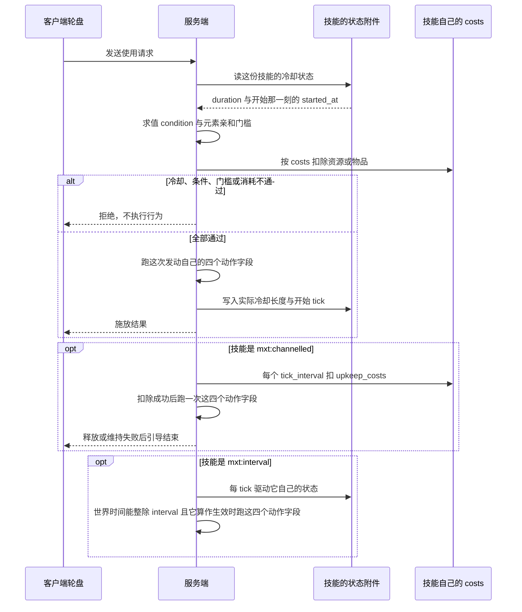

# ability（技能） {#ability}

## 文件位置

`data/<namespace>/mxt/ability/<path>.json`

一条技能永远只是一个 `mxt:ability` 条目，这里就是它唯一的定义处。它的身份是自己的注册表 id：`name` / `description` 省略时，默认键按这个 id 的命名空间与路径生成，路径后面不会再挂后缀。

宿主只写它的 id 或 `#标签`。法器（[artifact](./artifact.md)）的 `abilities`、功法与符箓的 `granted_abilities`、灵根与体质、命令、脚本，无一例外都用引用，不能把技能整个抄进宿主定义：**写在宿主里的内联技能不认**，那样会让宿主那份定义整个不可解析。

主动、被动、触发技能都在这一页。法器能力与技能是同一个概念：技能类型是一张共用的表，法器、功法、命令与脚本授予的是同一种技能。

## 通用字段

| 字段 | 类型 | 默认 | 说明 |
| --- | --- | --- | --- |
| `name` | Text Component | `ability.mxt.<命名空间>.<路径>` | 可选显示名。省略时用左列那个键。 |
| `description` | Text Component | `ability.mxt.<命名空间>.<路径>.description` | 可选描述。省略时用左列那个键；今天只被存储与读取，还没有界面画它。 |
| `type` | 技能类型 id | **必填** | 写在**顶层**（`{"type": "mxt:active", ...}`），不嵌套在 `ability` 对象里。取值见[技能类型](/datapack/types/other/ability)。 |
| `costs` | `Cost` 列表 | `[]` | 技能执行前扣除的消耗，整份数组**全有或全无**；写法见[共享数据类型 · `Cost`](../types/shared_data_types.md#cost)。 |
| `cast_time` | `NumberProvider` | `0` | 施法时间。大于 `0` 时按下只登记一个到点时刻，到那一 tick 才真正跑动作字段。 |
| `icon` | 图标引用 | 无 | 轮盘图标：**裸字符串**＝16×16 GUI 贴图，**对象**＝物品堆模板 `{"id": ...}`（可带 `count` / `components`）。两支按解析顺序区分（贴图那一支先试），物品必须写成对象形式，详见[共享数据类型 · 图标引用](../types/shared_data_types.md#图标引用)。 |
| `charges` | `{maximum, recharge_ticks}` | 无 | 充能池的声明，两个字段都是 `NumberProvider`、都必填：最多几次、每多少刻回一次。 |
| `condition` | `EntityCondition` | `mxt:always` | 技能可用条件。每个类型都读它，见下方[条件](#condition)。 |
| `element_affinity` | 灵气 id 或 `#标签` 的列表 | `[]` | 技能的元素亲和标记；非空时既是施放门槛（没有任何匹配灵根就不放行），也是这次施放伤害的 `element_modifier` 来源。 |
| `element_affinity_mode` | `average` / `max` | `average` | 多条灵根都匹配时 `element_modifier` 怎么算：`average` 取平均，`max` 取最好的那条。 |
| `hidden` | bool | `false` | 只在**法器的提示框**里跳过这条技能，其他场合照常生效、照常授予。 |

上表是**所有类型都读**的那部分。只被一部分类型读的键不在这里，写在[技能类型](/datapack/types/other/ability)那一页：`cooldown`（默认 `0`，只有会付款的类型读）、`damage_condition`（默认 `mxt:always`，只有 `mxt:triggered` 读）与四个动作字段（`entity_action` / `target_selector` / `target_condition` / `bi_entity_action`）。它们在 JSON 里照样写在 `type` 同级，只是没被列出来的键写了也不读。

技能的数值字段统一用 `NumberProvider`，可以写表达式。技能必须先通过条件和所有资源消耗，才执行行为。

### 条件 {#condition}

`condition` 每个类型都读，而且每拍都读：它既是生效门槛，也是这一拍跑不跑动作的开关。各类型在什么时机查它不一样，`mxt:interval` / `mxt:aura` 的脉冲只在它成立的拍跑，`mxt:modifier` 的属性只在它成立时贡献（每 tick 重算，不成立立即撤下）。

### `costs` 与 `cast_time` 的口径

`costs` 走的是同一套消耗计划：先整份校验、再整份扣除，中途有任何一项付不出就整份拒付，已写入的部分还原。`mxt:resource` 条目的 `amount` 在施法者上下文之外还带上**该数值自己的公式上下文**（资源族变量，如 `realm_rank`、`absorbed_aura`），见[公式变量](../types/formula_variables.md)。

`cast_time` 只在施放时读，按下那一刻只登记一个到点时刻，到那一 tick 才跑动作字段。物品承载的技能（不要求持有）写正值直接被拒，失败原因是 `CARRIED_NOT_INSTANT`；`mxt:composite` 的子技能写正值会让整条复合技能以 `INVALID_FORMULA` 拒掉。`mxt:composite` 自己这一项不读。

### 元素亲和

`element_affinity` 非空时是第一层门槛：没有任何匹配灵根就不放行，失败原因是 `ELEMENT_AFFINITY`。它同时是[伤害管线](/technical/damage)第一层的 `element_modifier` 来源，按匹配灵根的 `element_ability_modifier` 合并进这次施放打出的伤害，多条灵根都匹配时按 `element_affinity_mode` 取平均或取最好。所以伤害公式里**不要**再手写 `* element_modifier`。

### `hidden`

`hidden` 只在**法器的提示框**里被跳过：列这条法器授予的技能时跳过它，仅此一处。它**不参与轮盘那道筛选**：轮盘候选池读的是授予台账（按 id 排序），筛的是**按键型**，`hidden` 不在筛选条件里，所以它不会让轮盘少一格。想让一条按键技能不占轮盘，就别把它的 id 放进轮盘布局；非按键型本来就不会进池子。

### 对象字段的形状

这几个键里装的是**一个对象，而不是类型分派项**（同一个键下面的普通字段）：

| 字段 | 形状 | 说明 |
| --- | --- | --- |
| `charges` | `{maximum, recharge_ticks}` | 两个都必填（`NumberProvider`）：最多几次、每多少刻回一次。 |
| `modifiers[]` | `attribute` + 摊平的 `id` / `amount` / `operation`，外加可选 `value` | `value` 是公式覆盖项：写了它就用它求值，不写用 `amount`（每 tick 重算）。 |

`charges` 的剩余次数是状态（`mxt:charges.remaining`），定义上不写。**只有走完整施放的类型扣它**：施放时剩余不足 1 就以 `NO_CHARGES` 拒掉，施放成功后扣 1。`mxt:flight_control` 与 `mxt:storage` 两个按键技能不扣充能。它是唯一留在技能定义上的状态参数。

`modifiers` 的 `amount` 不是有限数**不在加载期报错**，属性服务在运行期跳过那一条。

```json
{
  "type": "mxt:triggered",
  "triggers": [{"type": "mxt:item_use"}],
  "costs": [
    {"id": "example:qi", "amount": "10 + level"}
  ],
  "cooldown": 100,
  "condition": {"type": "mxt:sneaking"},
  "entity_action": {"type": "mxt:spawn_particles", "particle": {"type": "minecraft:crit"}},
  "target_selector": {"type": "mxt:ray", "length": 6, "limit": 1},
  "target_condition": {"type": "mxt:not_owner"},
  "bi_entity_action": {"type": "mxt:damage", "amount": "6 + level"}
}
```

（这条技能自己带动作字段，见下方[四个动作字段](#action-fields-by-type)。）

## 状态存储 {#state-kinds-by-type}

一条技能能存哪些**状态种类**由它的 `type` 决定，数据包不声明这件事。定义上唯一能写的状态参数是 `charges`（充能池的 `maximum` 与 `recharge_ticks`），其余都在运行期产生。

状态住在技能自己的附件里，一个技能一份，跟着存档也同步给客户端。每条记录按两个维度寻址：**技能自己的 id** 加 **状态种类**。不同技能 id 互不影响，同一个技能在两个人身上也互不影响。一对地址只有一条记录，写入是替换。

内容用 `family` 与 `id` 给出这两个维度（`family` 是宿主所在的注册表，今天只有 `mxt:ability`）。内容能写的是六种状态种类，各自的声明字段与状态字段见[状态存储类型](/datapack/types/other/data-storage)。

**只有宿主声明过的种类才写得进**，撤销技能最后一个授予来源会清掉它名下的状态——只有冷却留下继续走（见[技能施放](/technical/ability)）。声明表、读写用的行为与条件、冷却与充能的口径，见[技能施放](/technical/ability)。哪些类型声明了哪些种类，见[技能类型](/datapack/types/other/ability)。

## 技能类型 {#ability-types}

顶层的 `type` 取自固有分派表 `mxt:ability_type`，内置十四种。法器、功法、灵根、体质、技能书、命令与脚本授予的都是同一种技能。

**每个类型自己读哪些字段、什么时候跑，见[技能类型](/datapack/types/other/ability)**：那里一个类型一节，另有一览、按类型的状态种类，以及四个动作字段的时机表。`cooldown` 与 `damage_condition` 也在那一页——它们写在 `type` 同级，但只有一部分类型读。

### 四个动作字段 {#action-fields-by-type}

`entity_action`、`target_selector`、`target_condition`、`bi_entity_action` 写在**技能顶层**，与 `type` 平级，默认分别是 `mxt:no_op` / `mxt:self` / `mxt:always` / `mxt:no_op`。它们**不是通用字段**：只有会跑动作的类型读，别的类型写了不报错也不生效。

同一条链里的顺序永远是：`entity_action`（先跑）→ `target_selector` 取目标 → 每个目标过 `target_condition` → 通过才跑 `bi_entity_action`。一个目标失败不影响别的目标，动作抛异常也只记一条日志、不打断其余目标。`target_selector` 自己的字段见[技能目标选择器类型](/datapack/types/other/ability-selector#ability-target-selector-type)。

**会跑这套字段的五个类型各自按什么时机跑、哪些类型根本不读，见[技能类型 · 四个动作字段](/datapack/types/other/ability#action-fields-by-type)。**

### 定向施放（`mxt:targeted`） {#targeted}

`mxt:targeted` 按下时走一次完整施放：自己的 `costs` / `cast_time` / `condition` / `cooldown` / `charges` / 元素亲和照常付一次、查一次，与 `mxt:active` 完全一样。它只读三个键：`target_selector`（**必填**，距离与形状写在这里）、`ability`（**必填**，每个目标身上跑的载荷技能，**只收具体 id、不收 `#标签`**）与 `cooldown`（默认 `0`，长度写进 `mxt:cooldown`）。字段表见[技能类型 · `mxt:targeted`](/datapack/types/other/ability)。

它**不读**自己顶层的 `entity_action` / `target_condition` / `bi_entity_action`。每个被 `target_selector` 选中的实体，先过**载荷技能自己的** `target_condition`（方向是施法者 → 目标），通过才跑**载荷的** `bi_entity_action`；**行为者始终是按下的人**，伤害与效果都记在他头上，与 `mxt:aura` 的逐目标脉冲同一条口径。载荷自己的 `costs` / `cast_time` / `cooldown` / `charges` / `condition` / 元素亲和一个都不读，它的 `entity_action` 与 `target_selector` 同样不读，所以它必须是**自己会跑四个动作字段的五个类型之一**。价格与冷却全算在这条 `mxt:targeted` 自己头上，一次施放只付一次。

**落空在付款之前判**，所以按到没人的地方不花钱：`target_selector` 一个实体都没选到、或者选到的全被载荷的 `target_condition` 挡掉＝`NO_TARGET`（没有符合条件的目标）；载荷类型根本没有"单目标那一半"＝`NOT_APPLICABLE`（指定的技能不能作用在目标身上）。写进 `mxt:composite` 的子技能时，这两个原因也在**预演**阶段就判掉，同样一分钱不花。`cast_time > 0` 时这一步在唱完的那一 tick 判，失败那一次会在动作栏报「施放失败：<原因>」。

**效果落在哪里**：载荷里**作用于目标**的行为（`mxt:damage_target` / `mxt:heal_target` / `mxt:apply_effect` 这类以实体为准的）不受影响；**要摆个东西出来**的行为（`mxt:spawn_lightning`、`mxt:explode`、`mxt:spawn_particles`、`mxt:spawn_effect_cloud`、`mxt:play_sound`、`mxt:block_action` 这些按"这次施放在哪儿"落点的）默认落在**发动地点**。轮盘、命令、脚本发动没有地点，于是落在每个目标自己的位置；**符箓与展示架发动有地点**（符箓 / 架子那里），于是全都落在符箓脚下。要让它们**一律落在目标自己的位置**，把这类行为包进 `mxt:target_action` 并写 `"use_target_position": true`：

```json
{"type": "mxt:target_action", "use_target_position": true,
 "action": {"type": "mxt:spawn_lightning", "visual_only": true, "color": 11962854}}
```

`mxt:target_action` 的默认值仍是沿用发动地点；想在**施法者**身上摆东西用 `mxt:actor_action`。

范围技能与射线技能是同一种类型写出来的两种，要换的不是类型，是 `target_selector`，而两者都必须写出自己的距离。

```json
{
  "type": "mxt:targeted",
  "target_selector": {"type": "mxt:area", "radius": 8, "limit": 5},
  "ability": "example:flame_mark",
  "costs": [{"id": "example:qi", "amount": 12}],
  "cooldown": 100
}
```

`example:flame_mark` 自己带 `target_condition` 与 `bi_entity_action`（它是这套施放里的载荷），按下那条 `mxt:targeted` 的人付钱、也被记成行为的来源。

### 飞行法器（`mxt:mount`） {#mount-render}

**写一条 `mxt:mount` 就是声明"这件法器是飞行法器"**：把它写进法器的 `abilities`，御器之术（`mxt:flight_control`）才会从主手、其次副手把它取出来当载具——飞多快、坐几个人、烧什么燃料、有什么行为，全由这一条自己回答（字段表见[技能类型 · `mxt:mount`](/datapack/types/other/ability#mxt-mount)）。这一节讲的是它顺带回答的另一半：**这个载具长什么样**。默认画的是**它承载的那件物品的物品模型**（展示框那套上下文：原始大小、没有位移的卡片），`render` 选**用哪套渲染器**画它，`display` 决定模型**相对载具原点怎么摆**。渲染只发生在客户端：专用服务端把 `render` 当一段普通数据解开，既不画也不判断这台机器有没有对应的渲染器。

`render` 是按 `type` 分派的字段，与技能自己的 `type` 是同一套写法：默认 `mxt:item`（画承载物品的物品模型），可以换成 `mxt:geckolib` 或内容模组注册的渲染器。**每一档的字段、`mxt:geckolib` 的三个资源 id 怎么写、以及七个姿态怎么判，见[载具渲染器类型](/datapack/types/other/mount-render)。**

**`display` 是可选字段**，不写就用该渲染器自己的默认姿势；三个向量与原版物品模型的 `display` **同名同义**（从物品模型里抄一段过来基本能直接用）：

| 字段 | 类型 | 默认 | 说明 |
| --- | --- | --- | --- |
| `translation` | 三个 double | `[0, 0, 0]` | 偏移，**单位是 1/16 格**（与原版 `display.translation` 一致，注意它和 `mxt:mount` 里其它以**格**为单位的数字不同），在载具原点之上叠加；载具原点就是碰撞箱底面 |
| `rotation` | 三个 double | 物品那一档 `[90, 0, -45]`、GeckoLib 那一档 `[0, 0, 0]` | **角度**，按原版那套 `rotationXYZ`（先 X、再 Y、再 Z）复合；物品那一档的默认值＝把展示框里竖着的卡片放平（X 90°）、把贴图里斜着的剑刃转到正前方（面内的 45° 折进 Z 分量）。GeckoLib 的模型是立着做的，所以它的默认不转 |
| `scale` | 三个 double | 物品那一档 `[2, 2, 2]`、GeckoLib 那一档 `[1, 1, 1]` | 倍数，`1` 就是资源包里画的原始大小；可以有负值（镜像），原版也允许 |

三个向量都必须是**有限数**，NaN／无穷在加载期被拒。**写出来的 `display` 对两档含义相同**，落位顺序也一样：先叠 `translation`，再俯仰（载具的俯仰在最外层，只跟视线走一半），然后才是 `rotation`／`scale`；载具自身的朝向在最外层，所以定义里**不需要管朝向**。唯一的差别是**物品那一档会自动把模型底面贴到碰撞箱底面**（这样换任何物品模型都落在同一个平面上），GeckoLib 那一档**不自动贴地**——模型在建模软件里就以载具原点为原点，要挪就写 `display.translation`。座位（脚底高度）不属于 `display`，那是 `mxt:mount` 自己的 `seat_offsets`。

用哪个实体飞由 `entity_type` 决定，字段与契约见[技能类型 · `mxt:mount`](/datapack/types/other/ability#mxt-mount)与[载具契约](../../java/interfaces/mount/vehicle.md)。

```json
{
  "type": "mxt:mount",
  "speed": 0.12,
  "render": {
    "type": "mxt:geckolib",
    "model": "example:vehicle/azure_sword",
    "texture": "example:textures/entity/vehicle/azure_sword.png",
    "animations": "example:vehicle/azure_sword",
    "states": { "idle": "hover", "moving": "fly", "ascending": "climb", "descending": "dive" },
    "transition_ticks": 5
  }
}
```

### 按键、命令与脚本

**按键型只有五个**：`mxt:active` / `mxt:channelled` / `mxt:targeted` / `mxt:storage` / `mxt:flight_control`。前三个按一下就走一次完整施放、自己付款；`mxt:flight_control` 与 `mxt:storage` 短一截，只查持有、冷却、条件与代价，**不写充能、也不跑动作字段**。

**轮盘池只收按键型**：候选池读授予台账、按 id 排序，再用按键型过滤。所以 `mxt:triggered` / `mxt:aura` / `mxt:interval` / `mxt:modifier` / `mxt:mount` / `mxt:upkeep` / `mxt:composite` / `mxt:word` / `mxt:empty` 都**不会进轮盘池**，`hidden` 也不是这道筛选的条件。轮盘按下时的分派是：按键型走激活，**其余回落成一次普通施放**——这一路只服务于**已保存的轮盘格子 / 布局**，布局落盘，里面可能点名一条不可按键的技能，所以服务端仍然受理。

**命令与 KubeJS 是另一条路**：`/mxt ability cast` 与 KubeJS 的施放入口对任何类型都直接施放，物品承载也走同一条，那几次照常过完整套闸门（条件、代价、`cast_time`、冷却、充能）。

技能行为由服务端处理，客户端轮盘只发送"选中了哪一类的哪个 id"，授予、条件、消耗与冷却全部由服务端判定。

一次技能发动的先后顺序：


```mermaid
sequenceDiagram
    participant C as 客户端轮盘
    participant S as 服务端
    participant H as 技能的状态附件
    participant R as 技能自己的 costs

    C->>S: 发送使用请求
    S->>H: 读这份技能的冷却状态
    H-->>S: duration 与开始那一刻的 started_at
    S->>S: 求值 condition 与元素亲和门槛
    S->>R: 按 costs 扣除资源或物品
    alt 冷却、条件、门槛或消耗不通过
        S-->>C: 拒绝，不执行行为
    else 全部通过
        S->>S: 跑这次发动自己的四个动作字段
        S->>H: 写入实际冷却长度与开始 tick
        S-->>C: 施放结果
    end
    opt 技能是 mxt:channelled
        S->>R: 每个 tick_interval 扣 upkeep_costs
        S->>S: 扣除成功后跑一次这四个动作字段
        S-->>C: 释放或维持失败后引导结束
    end
    opt 技能是 mxt:interval
        S->>H: 每 tick 驱动它自己的状态
        S->>S: 世界时间能整除 interval 且它算作生效时跑这四个动作字段
    end
```

顶层技能若要是可从上手栏释放的引导技，应把 `mxt:channelled` 作为 `mxt:composite` 的子技能：`mxt:active` 与 `mxt:channelled` 是互斥的单一 `type`，而复合技能的子技能才会成为活跃引导。`mxt:composite` 自己的 `costs` / `cooldown` / `charges` 都不生效，钱与冷却都记在**子技能自己的 id** 下。

```json
{
  "type": "mxt:composite",
  "abilities": ["example:meditate_channel"]
}
```

`example:iron_palm` 是一条带上动作字段的 `mxt:active` 技能：

```json
{
  "type": "mxt:active",
  "costs": [{"type": "mxt:resource", "resource": "mxt:spirit_power", "amount": 10}],
  "entity_action": {"type": "mxt:damage", "amount": "8 + level"}
}
```
