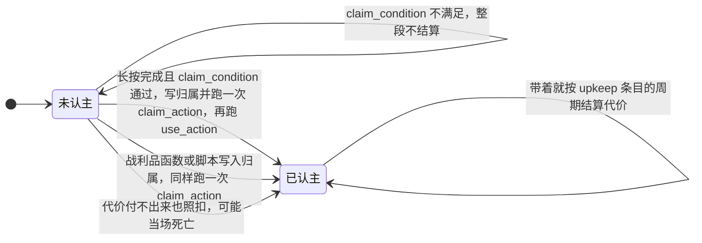

# artifact（法器） {#artifact}

文件位置：`data/<namespace>/mxt/artifact/<path>.json`

法器不是一种新物品，而是**已有物品的一套规则**：`items` 声明这份定义认领哪些物品（与四种绑定表、`spirit_herb` 完全同一套 `ItemMatcher`），匹配到的物品堆就是这件法器。它做什么由 `abilities` 逐条声明，每条按自己的 `type` 走固有分派。定义**没有**「器型」这类自由标签字段（旧的 `item_type` 已删除，老定义里写着它也只是被**静默忽略**）：**它自己的注册表 id 就是这件法器的名字**，要「把一族法器归到一起」就用物品标签（`items` 里的 `#标签`）或 id 的命名空间与路径来表达。

| 字段 | 类型 | 默认 | 说明 |
| --- | --- | --- | --- |
| `items` | `ItemMatcher` | **必填** | 这份定义认领的物品：物品 id、`#标签` 或二者的混合数组，至少要匹配一件。 |
| `spirit_capacity` | `Map<aura, NumberProvider>` | `{}` | 每种灵气的存储上限。键必须是**具体灵气**（不接受标签）；空表表示这件法器不存灵气。求值时非有限按 0、向下取整；温养加成 `× (1 + 0.5 × nourishment)` **由管线乘上，公式里不要再乘一遍**。 |
| `abilities` | `ArtifactAbility[]` | `[]` | 法器能力列表，按 `type` 分派，见下表。 |
| `curios_equipable` | bool | `false` | 这类法器是否允许放进 Curios 槽位。腰带槽在「武器与灵宝」模式下接收匹配 `weapon_binding` 的物品，或声明了 `true` 的法器；四个 `charm` 槽位**只**收声明 `true` 的法器（`curios:charm` 物品标签仍可放别的东西）。 |
| `require_owner` | bool | `false` | 是否**必须先认主**才能飞行与储物。`false`（默认）时未认主的法器谁都能用，一旦被认主就只认主人——认主是「绑定归属」而不是使用前提；`true` 时未认主一律拒绝（旧的严格语义）。不影响 `mxt:owned_by`（它问的就是「归属是不是你」）与授予能力。 |
| `claim_action` | ItemAction | `{"type": "mxt:consume_health", "amount": 4}` | 认主写归属时对持有者与物品执行的行为（原 `refine_action`）。**认主的代价就在这条行为里**：认主做的全部事情都归它一个字段管。**不写就是这个默认值**——每次认主扣 4 点生命（两格心）。**免费认主必须显式写 `{"type": "mxt:no_op"}`：省略字段不等于免费。** 可以写单条，也可以写**数组**（数组等于 `mxt:sequence` 简写，按顺序全跑一遍，与其它 `ItemAction` 字段是同一套简写）；"既付代价又有效果"就写成数组——`mxt:consume_health` 后面接别的物品行为。 |
| `claim_condition` | `EntityCondition` | 恒真 | 认主条件（原 `refine_condition`）。**只约束长按这条手势**：不满足则 `claim_action` 不跑。`mxt:set_artifact_owner` 战利品函数与脚本里的 `ArtifactService.refine` 仍无条件写归属。 |
| `pour_action` | ItemAction | `mxt:no_op` | 长按**注灵**时，每一个**真的收下了灵气**的刻各跑一次（不是整个手势只跑一次）。 |
| `use_action` | ItemAction | `mxt:no_op` | 这条长按手势**走完整段**之后跑一次。认主成功时跑，注灵结束时也跑；中途松手不跑。 |
| `hold_ticks` | NumberProvider | `20` | 长按的 use 周期长度（刻），求值后夹在 `0..72000`。**`0` 表示这份定义不接管长按**，右键照旧由物品自己处理。 |
| `element` | `HolderOrTag<element>[]` | `[]` | 这件法器**是什么元素**：条目是一个元素、`#` 标签是一组元素。这是「物品的元素」的第一顺位来源，完整口径见 [weapon_binding](./weapon_binding.md)。注意 `spirit_capacity` 里的灵气**不参与**这条读取：那说的是「能装什么」，不是「是什么」。 |
| `attachment_multiplier` | Double | `1.0` | 这件法器**作为护身物**值多少：携带（双手与 Curios 槽）期间，打在携带者身上的打击留下的元素附着乘上它——`0.5` 只留一半、`0` 一点也不留，于是那条元素反应永远不会被这一击触发。多件携带物**相乘**，不写就没有影响。这是「法宝抵消部分元素反应」的着力点：它压的是**攒的速度**，反应自身的效果不归它管。 |

`abilities` 的内置类型（固有注册表 `mxt:artifact_ability_type`，数据包不能新增类型）：

| `type` | 字段 | 作用 |
| --- | --- | --- |
| `mxt:empty` | 无 | 什么都不做的占位类型，也是 `mxt:artifact_ability_type` 的默认项；`type` 本身仍是必填字段，省略它这份文件加载不了。 |
| `mxt:passive` | `abilities`：能力 id、`#标签` 或二者的混合数组 | 持有／装备期间授予这些能力；属性修正在授予期间生效。引用的能力自身不得是主动类型。 |
| `mxt:active` | 同上 | 授予**可发动**的能力；主动能力会被技能热键栏与技能菜单自动收录。引用的能力自身必须是主动类型，写错由 `/mxt registries validate` 报出。 |
| `mxt:flight` | `speed`（必填 `NumberProvider`）、`costs`（`ResourceCost[]`，默认 `[]`） | 载人飞行：`speed` 是飞行载具速度，`costs` 是每 tick 的消耗。**一个定义最多一条。** |
| `mxt:storage` | `slots`（必填 `NumberProvider`） | 自带储物槽位。**一个定义最多一条。** |
| `mxt:upkeep` | `costs`（`ResourceCost[]`，默认 `[]`）、`interval`（`NumberProvider`，默认 `20`）、`on_fail`（ItemAction，默认 `mxt:no_op`）、`owner_only`（bool，默认 `true`） | **周期性代价**：带着它就按周期扣资源。见下。**一个定义最多一条。** |

`mxt:upkeep` 的细节：

- `costs` 是每 `interval` 刻结算一次的代价，**全部一起扣、全有或全无**（不半扣）。空列表什么都不扣。
- `interval` 是结算周期（刻），求值非法时回落到 `20`。时钟是**世界时间**：只有世界时间能被 `interval` 整除的刻才结算，不是"拿到手之后每 N 刻"。
- 结算范围是**主手、副手与所有已装备的 Curios 槽**（`ArtifactUpkeepService`，每个服务端 tick 检查一次）。
- `on_fail` 是付不出时对持有者与该物品堆执行的行为，例如 `{"type": "mxt:damage_item", "amount": 1}`。
- `owner_only` 为真（默认）时只有主人承担——未认主就等于没人付；为假时谁带着谁付。

以下**八个键不再被读取**：写了不会报错，也不会生效（`RecordCodecBuilder` 会忽略未声明的键）。其中四个已并入 `abilities`——`granted_abilities` 现在写成 `mxt:passive` / `mxt:active` 条目，`flight_speed` / `flight_costs` 写成 `mxt:flight`，`storage_slots` 写成 `mxt:storage`；另外三个改了名——`refine_action` → **`claim_action`**、`refine_condition` → **`claim_condition`**，而 **`refine_health_cost`** 与短暂存在过的 **`claim_cost`** 都并入了 `claim_action`（代价就是它的默认值）。**老包照旧名写不会加载失败，但代价会退回默认的 4 点血，认主效果与条件都会失效**，需要手工改名。

灵力与温养：

- 存量写在**共用组件** `mxt:spirit_storage`（按灵气记整单位，与灵石、符箓载体同一个形状），不是法器专属组件。
- 上限来自 `spirit_capacity` 里那一种灵气的声明值；没有声明过的灵气灌不进去（上限按 0）。
- `mxt:artifact_state` 组件现在只有归属（`owner_uuid` 与显示用的 `owner_name`）与 `nourishment`（温养度 `0..1`）。**归属以 `owner_uuid` 为准**（`mxt:owned_by`、飞行与储物都问它），`owner_name` 是认主那一刻记下的显示名，只用于提示框。老物品没有这个名字时，客户端会**问一次服务端**（`OwnerNameC2SPayload`，一次会话每个 id 只问一次）——服务端从在线玩家列表与持久化的名字缓存里回答，**不查会话服务**（那是网络请求），没见过这名玩家时就什么都不回、界面继续显示 UUID。每次真正收下灵气，温养度按**收下的量 ÷ 本次该灵气的有效上限**上涨并夹在 `0..1`，只升不降；有效上限 = `floor(声明上限 × (1 + 0.5 × nourishment))`，养满即 1.5 倍，两端都夹取。想读温养度，用通用的 `mxt:component` 条件读 `mxt:artifact_state` 的 `nourishment`。
- 归属由 `mxt:set_artifact_owner`（战利品函数）、**长按认主**（见下）或任何调用 `ArtifactService.refine` 的地方写入。**飞行与储物按 `require_owner` 判权**：`false`（默认）时未认主的谁都能用、认主后只认主人；`true` 时未认主一律拒绝。`mxt:owned_by` 与 `require_owner` 无关，它问的就是「归属是不是你」（未认主即 false）；授予能力只看是否持有／装备。

**长按**（右键按住不放，潜行时不算）：

| 持有者状态 | 长按会发生什么 |
| --- | --- |
| 没有主人 | **完成**整段长按才认主：先判 `claim_condition`，通过才写归属，跑一次 `claim_action`（默认扣 4 点生命、**不做任何预检**），最后跑 `use_action`。条件不满足就整段不结算，`claim_action` 不跑。中途松手也什么都不结算。 |
| 主人是自己 | 按住期间把**自己的灵气**灌进法器：`spirit_capacity` 里写了几种灵气就灌几种，每种每刻 1 点，1:1 从持有者对应灵气池扣，直到灌满或松手；温养度照常按收下的量上涨。每一个**真的收下了灵气**的刻跑一次 `pour_action`，手势走完跑一次 `use_action`。 |
| 主人是别人 | **这次右键不接管**：不播长按姿势，物品按自己的规则处理这次点击，只在动作栏说一句「此物已认主他人」。 |
| 主人是自己但已灌满 | 同上，不接管，提示「此物已充满灵气」。 |

- 长按时长由 `hold_ticks` 决定（默认 20 刻 = 1 秒）；`hold_ticks: 0` 等于关掉这份定义的长按（工具提示也不会再报长按提示）。
- 与物品自带的用途不冲突：食物、药水这类自带 `minecraft:consumable` 的物品若同时是法器，它自己的用途优先。
- 认主是**绑定归属**（写 `owner_uuid`），不是使用前提——要不要「必须先认主」仍然是 `require_owner` 说了算。
- **认主只有一个行为字段**：`claim_action` 既管代价也管效果——不写＝默认扣 4 点生命，`mxt:no_op`＝免费，想要"既付代价又有效果"就写成数组（先 `mxt:consume_health`，再接别的物品行为）。
- **代价不做任何预检**：长按只判 `claim_condition`，从不检查持有者付不付得起。生命不足也照扣，可能当场死亡。代价是用原版的秘法伤害扣的，因此抗性提升与保护附魔会照常减免；创造模式这类收不到伤害的持有者则是免费认主。
- 战利品函数与脚本写归属时，**同样会跑 `claim_action`（代价也在里面）**，但那两条路**不判** `claim_condition`。见 [战利品与判据](/datapack/loot-and-criteria)。
- 想让「带在身上」持续付代价，不要往认主流程里塞——认主只发生一次。用 `abilities` 里的 `mxt:upkeep`：它按世界时间每 `interval` 刻结算一次 `costs`，付不出来就跑 `on_fail`。
- **注灵期间的反馈**：动作栏按**按住期间累计**报「注入灵气 N 点」，一整段长按结束时报「本次共注入灵气 N 点」——原版按住不放会一个 use 周期接一个地重开，所以计数**不**在每个周期边界清零（旧行为每 `hold_ticks` 从 0 重数，看起来像灵气被清空重充）。某一门灵气付不出时报「自身灵气不足：灵气名」并**点名是哪一门**；法器在它声明的所有灵气上都已满时什么都不报。

一件法器只有"没主人"和"有主人"两种状态，长按是唯一会自己推动它的动作（另一条写归属的路是 `mxt:set_artifact_owner` 战利品函数与脚本）：



一个完整例子（两种灵气、被动＋主动＋飞行＋储物＋维持）：

```json
{
  "items": ["#mxt:artifact/sword", "minecraft:netherite_sword"],
  "spirit_capacity": {
    "mxt:qi": 500,
    "mxt:sword_intent": 50
  },
  "abilities": [
    { "type": "mxt:passive", "abilities": ["mxt:sword_body", "#mxt:artifact/sword_passives"] },
    { "type": "mxt:active", "abilities": "mxt:sword_rain" },
    { "type": "mxt:flight", "speed": 0.08, "costs": [{ "id": "mxt:qi", "amount": 1 }] },
    { "type": "mxt:storage", "slots": 9 },
    {
      "type": "mxt:upkeep",
      "costs": [{ "id": "mxt:qi", "amount": 2 }],
      "interval": 20,
      "on_fail": { "type": "mxt:damage_item", "amount": 1 },
      "owner_only": true
    }
  ],
  "curios_equipable": true,
  "hold_ticks": 30,
  "claim_action": [
    { "type": "mxt:consume_health", "amount": "4 + realm_rank" },
    { "type": "mxt:damage_item", "amount": 1 }
  ],
  "claim_condition": { "type": "mxt:has_ability", "ability": "mxt:sword_body" },
  "pour_action": { "type": "mxt:charge_artifact", "aura": "mxt:qi", "amount": 1 },
  "use_action": { "type": "mxt:consume_health", "amount": 1 }
}
```

代价与效果同写一个字段就够：`claim_action` 是数组时按顺序全跑，"先扣血、再给效果"写成下面这样。想比默认更贵，就改里面那条 `mxt:consume_health`：

```json
"claim_action": [
  { "type": "mxt:consume_health", "amount": "4 + realm_rank" },
  { "type": "mxt:damage_item", "amount": 1 }
]
```

不想要代价就明确写免费认主——**直接删掉 `claim_action` 不等于免费**，那会退回默认的 4 点生命：

```json
"claim_action": { "type": "mxt:no_op" }
```

**提示框**：物品提示框会按这份定义逐行报出你写下的东西——法器名、每种灵气的「存量 / 有效上限」（含温养加成，按百分比着色）、`abilities` 的每一条（**一个条目一行**：`mxt:passive`／`mxt:active` 每个被授予的能力各占一行，`mxt:flight` 把速度与每刻消耗写在同一行，`mxt:storage` 报「已用 / 总格数」，`mxt:upkeep` 报一行「维持 · 每 N 刻消耗 X、Y」（多项代价用可翻译的分隔符连起来）；`mxt:empty` 不占行），以及认主状态（**有主人时显示绿色 `✔ 已认主：主人名`**——名字在认主时写进物品，名字查不到的旧物品才退回 UUID；只有 `require_owner: true` 且还没认主时才显示红色 `✖ 未认主 · 需认主后才能飞行与储物`——不需要认主的法器未认主时不占行）。温养度大于 0 时另起一行；最后一行是长按提示（未认主且从 `claim_action` 里读到正数时报「长按：以 N 点生命认主」，读到 0 时报「长按：认主（无需代价）」；自己是主人且还装得下灵气时报「长按：注入自身灵气」；`hold_ticks: 0` 的定义两行都不报）；按住 F3+H 的高级提示还会多出定义 id，以及主人名显示出来时的那一行 UUID。`curios_equipable` **不在这里重复**：物品能进哪些 Curios 槽位由 Curios 自己的提示列出。

**还没做的部分**：飞行目前没有玩家入口（客户端不会发送飞行开关包），储物也还没有可以打开的界面——写下的 `mxt:flight` 与 `mxt:storage` 今天只到"服务端知道这件法器带这些能力"为止。
