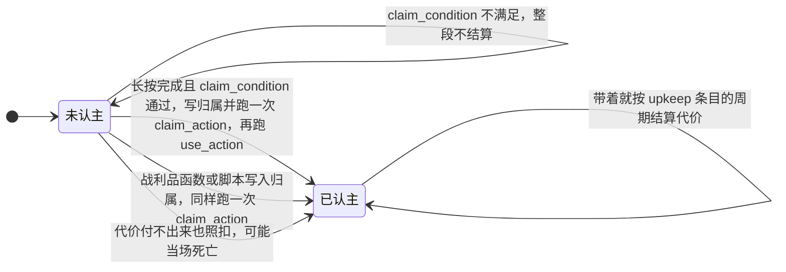

# artifact（法器） {#artifact}

文件位置：`data/<namespace>/mxt/artifact/<path>.json`

法器不是一种新物品，而是**已有物品的一套规则**：`items` 声明这份定义认领哪些物品（与四种绑定表、`spirit_herb` 完全同一套 `ItemMatcher`），匹配到的物品堆就是这件法器。它做什么由 `abilities` 逐条声明：**每条写一个 `mxt:ability` 注册表条目的 id，或一个技能标签**——技能本身永远只在 `data/<命名空间>/mxt/ability/` 里定义一处（不再有"写在法器里"的内联技能，见[技能 · 技能只定义一处](./ability.md#ability-single-definition)）。法器能力与技能是同一个概念，所以这里没有任何法器专属的技能类型。定义**没有**「器型」这类自由标签字段（旧的 `item_type` 已删除，老定义里写着它也只是被**静默忽略**）：**它自己的注册表 id 就是这件法器的名字**，要「把一族法器归到一起」就用物品标签（`items` 里的 `#标签`）或 id 的命名空间与路径来表达。

| 字段 | 类型 | 默认 | 说明 |
| --- | --- | --- | --- |
| `name` | Text Component | `artifact.mxt.<命名空间>.<路径>` | 可选显示名。省略时用左列的默认键。 |
| `description` | Text Component | `artifact.mxt.<命名空间>.<路径>.description` | 可选描述。省略时用左列的默认键；目前只被存储与读取，还没有界面绘制它。 |
| `items` | `ItemMatcher` | **必填** | 这份定义认领的物品：物品 id、`#标签` 或二者的混合数组，至少要匹配一件。 |
| `quality` | `Holder<quality>` | 无 | 被这份定义认领的物品**默认**是哪一档品质（见 [quality_chain](./quality_chain.md#resolution) 的解析顺序）。物品堆上写了 `mxt:item_quality` 覆盖组件时以组件为准；省略则这族物品没有默认档（要靠绑定表声明链条，或干脆没有品质）。 |
| `spirit_capacity` | `Map<aura, NumberProvider>` | `{}` | 每种灵气的存储上限。键必须是**具体灵气**（不接受标签）；空表表示这件法器不存灵气。求值时非有限按 0、向下取整；温养加成 `× (1 + 0.5 × nourishment)` **由管线乘上，公式里不要再乘一遍**。 |
| `abilities` | `HolderOrTag<ability>[]` | `[]` | 这件法器给持有者什么。**每条是一个 `mxt:ability` 注册表条目的 id，或一个技能标签 `#命名空间:路径`**（标签在授予时展开成它列出的每条技能）；单写一条或写成数组都行。一份定义可被多件法器共用，同一条技能也可以出现在技能书、命令、战利品里——**被动还是主动由技能自己的 `type` 决定**，法器不声明这件事。同名技能写两遍（直接写 + 经标签）会去重。见[技能 · 技能只定义一处](./ability.md#ability-single-definition)。 |
| `curios_equipable` | bool | `false` | 这类法器是否允许放进 Curios 槽位。腰带槽在「武器与灵宝」模式下接收匹配 `weapon_binding` 的物品，或声明了 `true` 的法器；四个 `charm` 槽位**只**收声明 `true` 的法器（`curios:charm` 物品标签仍可放别的东西）。 |
| `require_owner` | bool | `false` | 是否**必须先认主**才能飞行与储物。`false`（默认）时未认主的法器谁都能用，一旦被认主就只认主人——认主是「绑定归属」而不是使用前提；`true` 时未认主一律拒绝（旧的严格语义）。不影响 `mxt:owned_by`（它问的就是「归属是不是你」）与授予能力。 |
| `claim_action` | ItemAction | `{"type": "mxt:consume_health", "amount": 4}` | 认主写归属时对持有者与物品执行的行为（原 `refine_action`）。**认主的代价就在这条行为里**：认主做的全部事情都归它一个字段管。**不写就是这个默认值**——每次认主扣 4 点生命（两格心）。**免费认主必须显式写 `{"type": "mxt:no_op"}`：省略字段不等于免费。** 可以写单条，也可以写**数组**（数组等于 `mxt:sequence` 简写，按顺序全跑一遍，与其它 `ItemAction` 字段是同一套简写）；"既付代价又有效果"就写成数组——`mxt:consume_health` 后面接别的物品行为。 |
| `claim_condition` | `EntityCondition` | 恒真 | 认主条件（原 `refine_condition`）。**只约束长按这条手势**：不满足则 `claim_action` 不跑。`mxt:set_artifact_owner` 战利品函数与脚本里的 `ArtifactService.refine` 仍无条件写归属。 |
| `pour_action` | ItemAction | `mxt:no_op` | 长按**注灵**时，每一个**真的收下了灵气**的刻各跑一次（不是整个手势只跑一次）。 |
| `use_action` | ItemAction | `mxt:no_op` | 这条长按手势**走完整段**之后跑一次。认主成功时跑，注灵结束时也跑；中途松手不跑。 |
| `hold_ticks` | NumberProvider | `20` | 长按的 use 周期长度（刻），求值后夹在 `0..72000`。**`0` 表示这份定义不接管长按**，右键照旧由物品自己处理。 |
| `element` | `HolderOrTag<element>[]` | `[]` | 这件法器**是什么元素**：条目是一个元素、`#` 标签是一组元素。这是「物品的元素」的第一顺位来源，完整口径见 [weapon_binding](./weapon_binding.md)。注意 `spirit_capacity` 里的灵气**不参与**这条读取：那说的是「能装什么」，不是「是什么」。 |
| `attachment_multiplier` | Double | `1.0` | 这件法器**作为护身物**值多少：携带（双手与 Curios 槽）期间，打在携带者身上的打击留下的元素附着乘上它——`0.5` 只留一半、`0` 一点也不留，于是那条元素反应永远不会被这一击触发。多件携带物**相乘**，不写就没有影响。这是「法宝抵消部分元素反应」的着力点：它压的是**攒的速度**，反应自身的效果不归它管。 |

`abilities` 不再是"法器能力"这一套：里面每一条都是**普通技能**，`type` 取自所有技能共用的固有分派表 `mxt:ability_type`（内置十一种：`empty`、`active`、`triggered`、`modifier`、`aura`、`channelled`、`composite`、`word`、`flight`、`storage`、`upkeep`）。类型、字段与写法全在[技能 · 技能类型](./ability.md#ability-types)，这里只记法器侧最常用的几条：

```json
{
  "items": "minecraft:diamond_sword",
  "abilities": [
    "mxt_test:artifact_guard",
    "mxt_test:firebolt",
    "mxt_test:bound_flight",
    "#mxt_test:artifact_passive"
  ]
}
```

- 前两条是**各自的注册表条目**：`mxt_test:artifact_guard` 是 `mxt:modifier`（被动），`mxt_test:firebolt` 是 `mxt:active`（按一下）。被动还是主动由**技能自己的 `type`** 决定，法器定义不再声明"我授予的是被动还是主动"。
- 第三条 `mxt_test:bound_mount` 是一条 `mxt:mount`（**载具数据，不按键**），第四条是一个**技能标签**，在授予时展开成它列出的那些技能——一包多件法器共用同一组被动时，改标签比逐件改定义省事；同名技能写两遍（直接写 + 经标签）会去重。
- 这几条技能自己的字段（飞行速度与每 tick 费用、储物格数、维持周期）都在**技能自己那份文件**里：`mxt:mount` 取 `speed` / `seats` / `sit` / 几何与技能的 `costs`，`mxt:storage` 取 `slots`，`mxt:upkeep` 取 `interval` / `on_fail` / `owner_only` 并同样用技能的 `costs`。这些技能**需要一件承载它的物品**：被技能书之类没有物品的来源授予时语法合法，但使用时会被拒绝并报"没有承载物"。
- 除了定义里的 `abilities`，**一堆具体的物品**还能靠数据组件 `mxt:item_abilities`（`{"abilities": ["example:foo"]}`）自带技能：运行时读的是**定义声明的与组件写的并集**，所以同一份定义认领的两堆物品可以带不一样的技能。组件里只存**技能 id**、不收标签；专用生产者是物品行为 [`mxt:add_ability`](../types/action/item_action_types.md)（通用补丁 `mxt:merge_components` 仍然可用）。

**旧写法已经不能加载**：`mxt:passive` / `mxt:active` / `mxt:flight` / `mxt:storage` / `mxt:upkeep` 作为 `ArtifactAbility` 写在 `abilities` 里——那张固有分派表整张删除；**把技能整个内联写在 `abilities` 里**（`{ "key": "flight", "type": "mxt:flight", ... }`）——内联技能已取消，`abilities` 只收 id 与 `#标签`。照旧写法写的包会让**世界加载失败**（`abilities` 里一旦出现对象就不再是合法条目）。搬家只有一步：把那段内联对象原样剪成一个新文件 `data/<命名空间>/mxt/ability/<路径>.json`（**删掉 `key`，其余字段一字不改**），再在法器里写它的 id；老包里的 `mxt:passive` / `mxt:active` 条目直接换成它引用的技能 id 即可。

**`mxt:mount` 的 `display`（载具怎么画）。** 飞行载具画的是**它承载的那件物品的物品模型**（展示框那套上下文：原始大小、没有位移的卡片），`display` 决定它相对载具原点怎么摆。字段与原版物品模型的 `display` **同名同义**，从物品模型里抄一段过来基本能直接用：

| 字段 | 默认 | 说明 |
| --- | --- | --- |
| `translation` | `[0, 0, 0]` | 偏移，**单位是 1/16 格**（与原版一致；注意它和这份文件里其它以**格**为单位的数字不同），叠在载具原点之上，而载具原点就是碰撞箱底面 |
| `rotation` | `[90, 0, -45]` | **角度**，按原版那套 `rotationXYZ`（先 X、再 Y、再 Z）复合；默认＝把竖着的卡片放平（X 90°）并把贴图里斜着的剑刃转到正前方（面内的 45° 折进 Z） |
| `scale` | `[2, 2, 2]` | 倍数，`1` 就是资源包里画的原始大小；允许负值（镜像），原版也允许 |

三个向量都必须是**有限数**，NaN／无穷在加载期被拒。落位顺序：先把模型底面放到碰撞箱底面（自动，换任何模型都落在同一平面上），再叠 `translation`，然后才是 `rotation`／`scale`；载具自身的朝向与俯仰在最外层，所以定义里**不用管朝向**——它跟着驾驶者转。座位（脚底高度）不属于 `display`。

以下**九个键不再被读取**：写了不会报错，也不会生效（`RecordCodecBuilder` 会忽略未声明的键）。其中四个已并入 `abilities`——`granted_abilities` 现在直接写成技能 id（或技能标签），`flight_speed` / `flight_costs` 拆成一条 `mxt:mount` 技能（费用就是那条技能的 `costs`；载人飞行在 2026-09-25 又拆成了 `mxt:mount` + 功法授予的 `mxt:flight_control`，`mxt:flight` 现在会在加载期报"未知类型"），`storage_slots` 拆成一条 `mxt:storage` 技能；四个是认主相关的旧名——`refine_action` → **`claim_action`**、`refine_condition` → **`claim_condition`**，而 **`refine_health_cost`** 与短暂存在过的 **`claim_cost`** 都并入了 `claim_action`（代价就是它的默认值）；最后一个是已整个移除的 `item_type`（器型标签，没有替代字段——定义 id 与物品标签就是它的替代）。**老包照这些名字写不会加载失败，但会既不报错也不生效**，于是变成"认主默认扣 4 点血、没有认主效果、条件不再判"，需要手工搬过去。注意这与 `abilities` **里面**的旧写法不同：后者是会**加载失败**的（见上）。

灵力与温养：

- 存量写在**共用组件** `mxt:spirit_storage`（按灵气记数量，**数值是浮点数**，与灵石、符箓载体同一个形状），不是法器专属组件。
- 上限来自 `spirit_capacity` 里那一种灵气的声明值；没有声明过的灵气灌不进去（上限按 0）。
- 存的是小数而不是整单位：长按注灵仍然一 tick 送进**一个整单位**，而御器飞行的**每 tick 燃料就按这个精度扣**（`0.1` 就是每刻 0.1），所以一件充好的法器能被精确烧到空。（灵石与符箓沿用同一个组件，它们只按整单位读写。）
- `mxt:artifact_state` 组件现在只有归属（`owner_uuid` 与显示用的 `owner_name`）与 `nourishment`（温养度 `0..1`）。**归属以 `owner_uuid` 为准**（`mxt:owned_by`、飞行与储物都问它），`owner_name` 是认主那一刻记下的显示名，只用于提示框。老物品没有这个名字时，客户端会**问一次服务端**（`OwnerNameC2SPayload`，一次会话每个 id 只问一次）——服务端从在线玩家列表与持久化的名字缓存里回答，**不查会话服务**（那是网络请求），没见过这名玩家时就什么都不回、界面继续显示 UUID。每次真正收下灵气，温养度按**收下的量 ÷ 本次该灵气的有效上限**上涨并夹在 `0..1`，只升不降；有效上限 = `floor(声明上限 × (1 + 0.5 × nourishment))`，养满即 1.5 倍，两端都夹取。想读温养度，用通用的 `mxt:component` 条件读 `mxt:artifact_state` 的 `nourishment`。
- 归属由 `mxt:set_artifact_owner`（战利品函数）、**长按认主**（见下）或任何调用 `ArtifactService.refine` 的地方写入。**飞行与储物按 `require_owner` 判权**：`false`（默认）时未认主的谁都能用、认主后只认主人；`true` 时未认主一律拒绝。`mxt:owned_by` 与 `require_owner` 无关，它问的就是「归属是不是你」（未认主即 false）；授予能力只看是否持有／装备。

**长按**（右键按住不放，潜行时不算）：

| 持有者状态 | 长按会发生什么 |
| --- | --- |
| 没有主人 | **完成**整段长按才认主：先判 `claim_condition`，通过才写归属，跑一次 `claim_action`（默认扣 4 点生命、**不做任何预检**），最后跑 `use_action`。条件不满足就整段不结算，`claim_action` 不跑。中途松手也什么都不结算。 |
| 主人是自己 | 按住期间把**自己的灵气**灌进法器：`spirit_capacity` 里写了几种灵气就灌几种，每种每刻 1 点，1:1 从持有者对应灵气池扣，直到灌满或松手；温养度照常按收下的量上涨。每一个**真的收下了灵气**的刻跑一次 `pour_action`，手势走完跑一次 `use_action`。 |
| 主人是别人 | **这次右键不接管**：不播长按姿势，物品按自己的规则处理这次点击，只在动作栏说一句「此物已认主他人」。 |
| 主人是自己但已灌满 | 同上，不接管，提示「此物已充满灵气」。 |

- 长按时长由 `hold_ticks` 决定（默认 20 刻 = 1 秒）；`hold_ticks: 0` 等于关掉这份定义的长按（工具提示也不会再报长按提示）。
- 与物品自带的用途不冲突：食物、药水这类自带 `minecraft:consumable` 的物品若同时是法器，它自己的用途优先。
- 认主是**绑定归属**（写 `owner_uuid`），不是使用前提——要不要「必须先认主」仍然是 `require_owner` 说了算。
- **认主只有一个行为字段**：`claim_action` 既管代价也管效果——不写＝默认扣 4 点生命，`mxt:no_op`＝免费，想要"既付代价又有效果"就写成数组（先 `mxt:consume_health`，再接别的物品行为）。
- **代价不做任何预检**：长按只判 `claim_condition`，从不检查持有者付不付得起。生命不足也照扣，可能当场死亡。代价是用原版的秘法伤害扣的，因此抗性提升与保护附魔会照常减免；创造模式这类收不到伤害的持有者则是免费认主。
- 战利品函数与脚本写归属时，**同样会跑 `claim_action`（代价也在里面）**，但那两条路**不判** `claim_condition`。见 [战利品与判据](/datapack/loot-and-criteria)。
- 想让「带在身上」持续付代价，不要往认主流程里塞——认主只发生一次。用 `abilities` 里的 `mxt:upkeep`：它按世界时间每 `interval` 刻结算一次 `costs`，付不出来就跑 `on_fail`。
- **注灵期间的反馈**：动作栏按**按住期间累计**报「注入灵气 N 点」，一整段长按结束时报「本次共注入灵气 N 点」——原版按住不放会一个 use 周期接一个地重开，所以计数**不**在每个周期边界清零（旧行为每 `hold_ticks` 从 0 重数，看起来像灵气被清空重充）。某一门灵气付不出时报「自身灵气不足：灵气名」并**点名是哪一门**；法器在它声明的所有灵气上都已满时什么都不报。

一件法器只有"没主人"和"有主人"两种状态，长按是唯一会自己推动它的动作（另一条写归属的路是 `mxt:set_artifact_owner` 战利品函数与脚本）：



一个完整例子（两种灵气、被动＋主动＋飞行＋储物＋维持）：

```json
{
  "items": ["#mxt:artifact/sword", "minecraft:netherite_sword"],
  "spirit_capacity": {
    "mxt:qi": 500,
    "mxt:sword_intent": 50
  },
  "abilities": [
    "mxt:sword_body",
    "mxt:sword_rain",
    "mxt:sword_flight",
    "mxt:sword_storage",
    "mxt:sword_upkeep"
  ],
  "curios_equipable": true,
  "hold_ticks": 30,
  "claim_action": [
    { "type": "mxt:consume_health", "amount": "4 + realm_rank" },
    { "type": "mxt:damage_item", "amount": 1 }
  ],
  "claim_condition": { "type": "mxt:has_ability", "ability": "mxt:sword_body" },
  "pour_action": { "type": "mxt:charge_artifact", "aura": "mxt:qi", "amount": 1 },
  "use_action": { "type": "mxt:consume_health", "amount": 1 }
}
```

代价与效果同写一个字段就够：`claim_action` 是数组时按顺序全跑，"先扣血、再给效果"写成下面这样。想比默认更贵，就改里面那条 `mxt:consume_health`：

```json
"claim_action": [
  { "type": "mxt:consume_health", "amount": "4 + realm_rank" },
  { "type": "mxt:damage_item", "amount": 1 }
]
```

不想要代价就明确写免费认主——**直接删掉 `claim_action` 不等于免费**，那会退回默认的 4 点生命：

```json
"claim_action": { "type": "mxt:no_op" }
```

**提示框**：物品提示框会按这份定义逐行报出你写下的东西——法器名、每种灵气的「存量 / 有效上限」（含温养加成，按百分比着色）、`abilities` 的每一条（**一条一行**：先写技能自己的名字，需要按键的用青色、纯被动的用蓝色，`hidden: true` 的那条不占行；然后 `mxt:mount` 再把「速度 · N 座 · 站/坐」与每刻消耗写在同一行，`mxt:storage` 报「已用 / 总格数」，`mxt:upkeep` 报一行「维持 · 每 N 刻消耗 X、Y」（多项代价用可翻译的分隔符连起来）），以及认主状态（**有主人时显示绿色 `✔ 已认主：主人名`**——名字在认主时写进物品，名字查不到的旧物品才退回 UUID；只有 `require_owner: true` 且还没认主时才显示红色 `✖ 未认主 · 需认主后才能飞行与储物`——不需要认主的法器未认主时不占行）。温养度大于 0 时另起一行；最后一行是长按提示（未认主且从 `claim_action` 里读到正数时报「长按：以 N 点生命认主」，读到 0 时报「长按：认主（无需代价）」；自己是主人且还装得下灵气时报「长按：注入自身灵气」；`hold_ticks: 0` 的定义两行都不报）；按住 F3+H 的高级提示还会多出定义 id，以及主人名显示出来时的那一行 UUID。`curios_equipable` **不在这里重复**：物品能进哪些 Curios 槽位由 Curios 自己的提示列出。

**需要按键的技能（`Toggable`）。** 判据只有一句：**凡是要按键才发动的都算技能、都进轮盘**。技能类型凡是实现了 `Toggable` 接口的就是**需要按键才能发动**的：实现它就等于声明"把这一项放进轮盘"（设计见模组仓库 `research/40_能力与法器能力合并设计.md`）。今天有三个实现，都是普通技能类型、都不用新字段：`mxt:active`（原本就按一下施放）、`mxt:flight_control`（开关：开＝起剑、关＝落剑）与 `mxt:storage`（一次性：打开储物箱，没有状态）。约定：

- **一件法器可以给出好几条**：轮盘的条目身份就是**那条技能自己的注册表 id**（如 `mxt_test:bound_flight`），所以同一把剑可以既有飞行又有储物；一本书授予的主动技和一件法器给的开关在轮盘上是同一类格子，也共用一个 id 空间（同一份 `mxt:ability`）。布局校验问的是"这个 id 现在能不能解析出来"，编造的格子进不去。
- 它出现在**声明它的那张从盘**上（主手 / 副手 / Curios），也可以被玩家钉到主盘——两处都读"那件法器此刻在不在双手或 Curios 槽里"，什么也不存。
- **状态归实现自己管**，不是数据包字段：`mxt:flight_control` 读的是**驾驶者**那份飞行状态（记着飞的是哪条术、哪辆车），`mxt:storage` 没有状态（格子里就是"按一下打开"）。轮盘那一格只报告状态（开关底色绿＝开、灰＝关，一次性的是紫），按下去由**服务端**问一遍实现再决定做什么，所以请求本身不携带"开到哪一侧"。
- 接口还要求实现把失败原因说清楚：`Result(changed, failure, failedResource)`，`Failure` 的 15 个取值与 `AbilityService.Failure` **同名同义**（`NOT_OWNED` / `ALREADY_SET` / `UNAVAILABLE` / `NO_CARRIER` / `CANNOT_MOUNT` 是按压独有的五个，其余十个两边共有），付不出资源时 `failedResource` 带上是哪一门。轮盘按名字查 `actionbar.mxt.ability.failure.*` **一份表**，把原因报在动作栏与日志里——`UNAVAILABLE` 只剩兜底，条件不满足 / 灵根不符 / 次数用完这些原因不会再说成「现在用不了」。这一格叫什么用的是**技能自己的 `name`**，接口不再另给一个名字。
- 将来新增"需要按键"的技能，就是新增一个实现 `Toggable` 的 `mxt:ability_type` 条目，不用再动轮盘。

**还没做的部分**：精炼台仍未接入（`refine` 只有战利品函数、长按认主与脚本能用）。它背后那个配方类型 `mxt:refining` 已于 2026-09-25 **删除**（一个从未有过执行者的死配方，产物恒为空），所以别再去数据包里找它——法器的产出走蓝图锻造。飞行与储物都已有玩家入口：轮盘上那两格（`mxt:flight_control` 那一格由功法授予，`mxt:storage` 由法器授予）。
