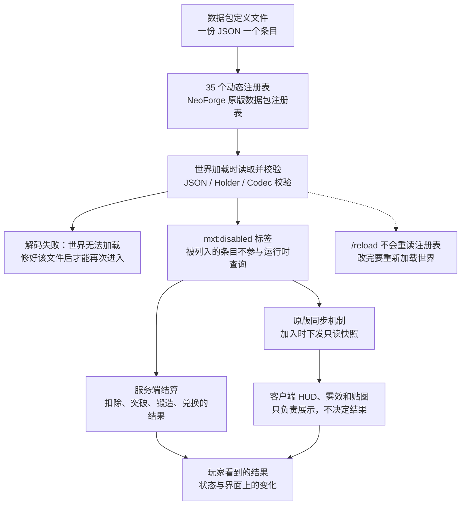

# 数据包开发总览

## 文件路径

```text
data/<namespace>/mxt/<registry>/<path>.json
```

例如 `data/example/mxt/ability/fireball.json` 的定义 ID 是 `example:fireball`。

**内容一多，请按类别把 JSON 分进子文件夹。** 一个注册表目录下平铺几十上百个文件时，"哪几个是同一套流派的被动"只能靠文件名猜；分好类之后路径本身就是索引：

```text
data/example/mxt/ability/sword/slash.json            → example:sword/slash
data/example/mxt/ability/sword/parry.json
data/example/mxt/ability/passive/body_tempering.json
data/example/mxt/artifact/sword/azure_flight_sword.json
data/example/mxt/artifact/charm/ward_jade_talisman.json
```

分类方式没有硬性规定，按用途（`passive/`、`active/`）、按流派（`sword/`、`alchemy/`）或按一次更新的批次都行。几条要注意：

- **目录就是 ID 的一部分**：`data/example/mxt/ability/sword/slash.json` 的 ID 是 `example:sword/slash`，**换目录等于换 ID**。别的定义、标签、存档（技能授予账本、冷却、轮盘格子的 id）存的全是这个 ID，所以分类要在写内容之前定好。
- 默认的 `name` / `description` 键也带这段路径（`<类别>.mxt.<命名空间>.<路径>`，路径里的 `/` 原样保留），分文件夹不会多出第二套翻译键规则。
- 标签有自己的一棵树（`tags/mxt/<注册表名>/...`），**不必**与定义目录逐层对应；按同一个分类习惯摆只是为了好找。`mxt:disabled` 标签里的值同样要写带目录的**完整 ID**。
- 层级只影响可读性，**不参与加载与校验**：`data/<命名空间>/mxt/` 下面第一层永远是注册表名（`ability/`、`artifact/`……），分类只能加在它下面；把所有文件塞进同一个注册表目录也照样能跑。

数据包加载使用 NeoForge 原生可写注册表，服务器加载后同步到客户端。数据包对象在加载后视为不可变对象；不要在运行时修改 Codec 返回的集合。

## 引用规则

- 固有注册表的单个引用使用 `Holder` Codec。
- 可选引用使用 `optionalFieldOf`。
- 列表和 Map 使用容错的 Holder/集合 Codec。
- 物品匹配使用 `ItemMatcher`，支持 ID、标签、通配符、正则和混合数组。
- 原版标签是唯一的标签系统；不要在 JSON 里重复定义 `tags` 字段。

## 禁用标签

每个动态注册表都支持固定的 `mxt:disabled` 标签（标签 ID 自带 `mxt` 命名空间，文件位置不随数据包命名空间变化）：

```text
data/mxt/tags/mxt/<registry>/disabled.json
```

被列入 `mxt:disabled` 的条目不会参与运行时查询。标签值顺序不作为玩法顺序；品质顺序由品质读取接口根据原版标签顺序处理。

元素同样吃这个标签：被停用的元素不再参与持有关系（`overcomes`/`adapted_to` 不再结算）、不再着色、不能被灵根绑定，也不参与任何元素匹配。注意这与灵根/体质的开关是两件事：`mxt:disabled` 是数据包对整个定义下的封条，所有内容方都看不见它；而每条**已持有的**灵根和体质可以被单独**关闭而仍然持有**（见 [spirit_root](/datapack/json/spirit_root)），那条路只影响被关的那一条，`mxt:has_spirit_root` / `mxt:has_physique` 照旧为真。

### 直通标签

模组还有一个标签写在**原版注册表**上，所以路径长得不一样——是 `tags/damage_type`，不是 `tags/mxt/...`：

```text
data/mxt/tags/damage_type/no_bonus.json
```

被列进 `mxt:no_bonus` 的伤害类型不参与伤害加成结算：不乘技能水平与亲和倍率、不乘体质倍率、不读 `overcomes`/`adapted_to` 关系，也不留元素附着。数值原样交给原版，而原版自己的减免（护甲、附魔、抗性、吸收、无敌帧）照旧生效。默认只收虚空伤害 `minecraft:out_of_world`；内容包可以在同一路径上追加（`replace: false`）或整体替换（`replace: true`）。详见[伤害系统](/technical/damage)。

## 数值字段

数值可以写成常量、表达式字符串或 NumberProvider 对象：

```json
{
  "damage": 8.0,
  "speed": "2 + level * 0.1",
  "amount": {"type": "mxt:constant", "value": 10}
}
```

表达式使用 exp4j。变量由内置变量表从 `FormulaContext` 携带的对象（施法者、目标、资源、随机源）中按需读取，`params` 可以覆盖或追加变量。加载阶段可判定的公式问题（空表达式、语法错误、`params` 非法等）是解码错误：加载器收集全部失败条目后一并列出并使加载失败。上下文无法提供的变量名只能在求值时发现——开发环境打印完整 ERROR 日志，生产环境每个不同消息打印一行 WARN，两者都继续按 0 处理。

## 行为与条件

行为统一称为 `action`，按目标分为 entity、item、block、bi-entity 等。需要多个步骤时使用 sequence/choice/if_else 等元行为。`condition` 用于限制技能、绑定物品、修炼、境界和配方。

## 注册表索引

| 分类 | 注册表 |
| --- | --- |
| 资源与修炼 | `resource`、`aura`、`element`、`element_reaction`、`realm_stage`、`spirit_root`、`physique`、`technique`、`skill_stage`、`cultivate_action` |
| 技能与规则 | `ability`、`curse`、`formation`、`tribulation`、`trigger`、`talisman` |
| 灵气与世界 | `aura_zone`、`block_aura`、`item_aura`、`secret_realm` |
| 物品与品质 | `item_binding`、`weapon_binding`、`pill_binding`、`technique_binding`、`tool_binding`、`blueprint_binding`、`artifact`、`quality`、`quality_chain` |
| 经济与内容 | `currency`、`spirit_herb`、`forging_method`、`forging_blueprint`、`creature_profile`、`contract_type` |

## 模块页面

- [resource：资源与资源条](/datapack/json/resource)
- [修炼、境界与灵根](/datapack/json/cultivate_action)
- [灵气环境与灵气物品](/datapack/json/aura)
- [Ability、Cost 与 Condition](/datapack/json/ability)
- [物品绑定、品质与经济](/datapack/json/item_binding)
- [阵法、锻造与炼丹](/datapack/json/formation)
- [其他注册表](/datapack/json/index)
- [数据包示例](/datapack/examples)

## 加载与覆盖

- 35 个动态注册表使用 NeoForge 原版数据包注册表加载；**世界加载时**读取并校验，并在客户端加入时通过原版同步机制提供只读快照。

把这条加载规则展开，从磁盘上的文件到玩家看到的结果就是下面这条路径。



- 文件冲突遵循 Minecraft 数据包优先级：高优先级数据包覆盖低优先级数据包的同一路径。
- 原版标签使用 `replace: false` 时，值按数据包合并顺序追加；除品质排序标签外，玩法不依赖标签值顺序。
- 数据包只读，定义中没有通用的 `schema_version`、`enabled` 或 `tags` 字段。
- 数据驱动定义的显示名称由标识符自动生成翻译键 `<类别>.<注册表命名空间>.<定义命名空间>.<路径>`。类别默认取注册表自己的 path；**注册表命名空间对 MiXianTu 自己的注册表恒为 `mxt`**（这些注册表的键都写作 `mxt:<路径>`），所以 `aura` 里的 `mxt:fire` 查 `aura.mxt.mxt.fire`，`resource` 里的 `example:qi` 查 `resource.mxt.example.qi`，`talisman` 里的 `mxt_test:flame_sigil` 查 `talisman.mxt.mxt_test.flame_sigil`。类别就是注册表自己的 path，没有例外表（`example:refined` 在 `mxt:quality` 里查 `quality.mxt.example.refined`）。路径里的 `/` **原样**进入键中，不会转成 `.`（`example:foo/bar` 得到的键是 `resource.mxt.example.foo/bar`），所以按类别分子文件夹不会多出第二套翻译键规则。JSON 不填写 `translation_key`，请在 `assets/<命名空间>/lang/zh_cn.json` 和 `en_us.json` 中提供对应翻译。
- 下面这 19 个注册表的定义还可以自带可选的 `name` 与 `description`（写法与其它组件字段相同：裸字符串当翻译键、对象当完整组件）：`resource`、`aura`、`realm_stage`、`element`、`spirit_root`、`physique`、`ability`、`curse`、`technique`、`skill_stage`、`cultivate_action`、`artifact`、`formation`、`tribulation`、`secret_realm`、`contract_type`、`talisman`、`quality`、`quality_chain`。写了就用你自己的文本，省略才用上一条的生成键——`description` 省略时是生成键再接 `.description`。这对字段的意义是数据包可以**翻译生成键、也可以自己写文本**（从而避开名字冲突）；**`description` 目前只被存储与读取，除 `quality`（品质描述那一行）以外还没有任何界面或提示框绘制它**。其余注册表仍然只有生成键。
- `realm_stage` 用整数写法声明 `minor_stages` 时，子阶段名同样带注册表命名空间：`realm_stage.mxt.<定义命名空间>.<路径>.minor_stage.<下标>`（下标从 `0` 起）。
- 每个数据包注册表的界面标题另有固定键 `mxt.registry.<注册表 path>`（如 `mxt.registry.aura`、`mxt.registry.quality`），由本模组自己的语言文件提供；数据包只需要为自己的定义提供上面那个键。
- 必填的单个 Holder 引用不存在时，整个数据包加载失败；可选 Holder 和容错列表引用按对应 Codec 处理。
- 这些注册表不保留旧快照，因此解码失败的定义会直接导致世界无法加载：修好该文件后才能再次进入。

## 加载、同步与调试

- 这些注册表属于原版数据包注册表，**在世界加载时读取**：JSON 解析、Holder 解析和 Codec 校验都在世界加载过程中完成。`/reload` 不会重新读取它们——`/reload` 只刷新配方、战利品表、进度、函数这些原版监听器，以及 KubeJS 的服务端脚本。修改数据表后需要重新加载世界（单机退回标题界面再进入，或重启服务器）。
- 动态注册表由原版同步机制在客户端加入时发送；客户端 HUD、雾效和贴图只负责展示，不决定扣除、突破、锻造或兑换结果。
- `/mxt aura query` 查询当前位置最终灵气；`/mxt aura vein` 查询灵石矿脉信息。
- `/mxt registries list` 列出这些动态注册表与各自的条目数量；`/mxt registries validate` 报出上一次构建发现的所有问题，并逐条指出问题来自哪个文件（修炼、技能与功法的引用链条，以及忘了写行为的触发器规则）——没有问题时报出注册表数量、条目总数与"校验通过"。世界加载完之后跑一次这条命令，可以确认数据包产出的注册表状态是能用的。
- `/mxt technique repair` 清理玩家数据里**已失效的功法引用**（引用的定义已被数据包删除或禁用时使用）；`dry-run` 只报告不改动；`/mxt technique drop <id>` 精确移除某一门功法。见下节。
- `/picker [<分类 id>]` 打开物品选择器，直接查看这些定义对应的物品：分类就是注册表 ID（如 `/picker mxt:aura`、`/picker mxt:artifact`、`/picker mxt:currency`），不写则列出全部已注册分类。需要 gamemaster 权限，且只在创造模式下可用；顶层 `/picker` 别名由服务端配置「命令别名 → /picker」开关，`/mxt picker` 始终可用。
- 测试模组数据位于 `src/test-mod/resources/data/mxt_test/mxt`，启动测试服务端可验证数据包闭环。
- 精确的当前完成度、字段消费者和测试覆盖**以代码为准**（模组仓库两份 README 的「模块完成情况」表是汇总）。

### 失效功法数据与修复

玩家已学会的功法以**引用**形式存在玩家数据里。当数据包**删除或禁用**某个 `technique` 后，存档里的旧引用就指向了一个不存在的定义。

**这种情况不会摧毁数据。** 玩家数据里的功法列表用 `CollectionCodecs.list` 解码，它逐元素进行、**跳过解码失败的条目并保留其余条目**，同时打出一条 WARN 日志：

```
[WARN] [AutoIgnoreListCodec]: Ignoring invalid list element: Failed to get element <namespace>:<path>
```

也就是说，失效引用**只损失它自己**：其他功法、其他字段都正常加载。看到这条 WARN 就说明确实存在失效引用；**看不到就说明不存在**，此时问题在别处，不要用修复命令去"治"它。

| 命令 | 作用 |
| --- | --- |
| `/mxt technique repair dry-run` | 报告有多少条失效引用，**不改动任何数据** |
| `/mxt technique repair` | 清理失效引用与重复项，并重建其带来的属性、能力与等级 |
| `/mxt technique drop <id>` | 按 id 精确移除一门功法（包括仍然有效的） |

清理后会调用 `CultivationGrantService.recalculate`，把失效功法曾提供的属性、能力和资源上限一并收回——否则玩家会保留一门已经不在身上的功法给的加成。

:::warning
修复命令只处理**引用失效**（指向已删除的定义）和**重复条目**。功法面板空白、功法书无反应若**没有**伴随 `Ignoring invalid list element` 警告，则不是本节的问题，需要另找原因。
:::

:::warning
Codec 是唯一的加载契约。本文中的默认值、字段范围和示例以当前源码为准；数据包写入未列出的字段不会自动生效，写入未知 `type` 会导致加载失败。
:::
