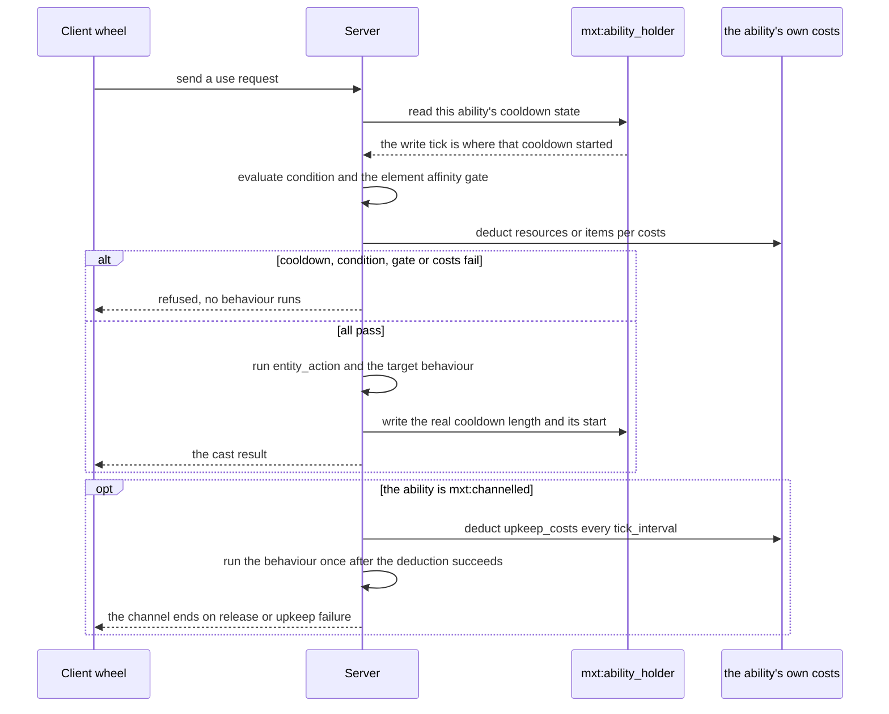

# Ability (ability)

An `ability` defines an active, passive or triggered ability, including its costs, cooldown, availability condition and the behaviour it executes.

## File Location

Ability files go in `data/<namespace>/mxt/ability/` within your datapack.

**Purpose**: Active, passive and triggered abilities. **An artifact ability and an ability are the same concept** : the ability type is one shared table, and an artifact, a technique, a command or a script can all grant the same kind of ability.

## Fields

| Field | Type | Default | Description |
|-------|------|---------|-------------|
| `name` | Text Component | `ability.mxt.<namespace>.<path>` | Optional display name. When omitted it is the default key in the previous column. |
| `description` | Text Component | `ability.mxt.<namespace>.<path>.description` | Optional description. When omitted it is the default key in the previous column; it is stored and read today, but nothing draws it yet. |
| `type` | `AbilityType` | **required** | The built-in ability type, written **at the top level** (`{"type": "mxt:active", ...}`) rather than nested inside an `ability` object. The possible values are under [Ability Types](#ability-types). |
| `costs` | `List<Cost>` | `[]` | Costs paid before the ability executes, all or nothing as one array. `mxt:item` and `mxt:js` entries need a player, so an ability carrying one can only be used by a player; see [Shared Data Types · `Cost`](../types/shared_data_types.md#cost). |
| `cast_time` | `NumberProvider` | `0` | Cast time. |
| `cooldown` | `NumberProvider` | `0` | Cooldown. **Every type supports it** (not just active abilities): each payment writes the real length and the starting tick into the `mxt:cooldown` state, so it does not have to be declared again in `components`. |
| `icon` | [Icon Reference](../types/shared_data_types.md#icon-reference) | none | Optional wheel icon for active abilities; it must define exactly one of `texture` (a 16x16 GUI texture) or `item`, because an icon with neither or both is rejected. |
| `components` | `List<DataStorage>` | `[]` | State kinds the ability declares: `mxt:cooldown`, `mxt:charges`, `mxt:toggle`, `mxt:timer`, `mxt:resource` and `mxt:target_lock`. A kind's class is the slot it fills, the declared fields carry its parameters, and the values live in this ability's own holder inside `mxt:ability_holder`, addressed by the ability's id. See [Data Storage Types](/en/datapack/types/other/ability-and-curse#data-storage-type). |
| `modifiers` | `List<AttributeEntry>` | `[]` | Passive vanilla attribute modifiers; an entry contains `attribute`, `id`, `amount` and `operation`, plus an optional `value` formula. |
| `damage_condition` | `DamageCondition` | `mxt:always_true` | Restriction on damage triggers. |
| `condition` | `EntityCondition` | `mxt:always_true` | Condition for the ability to be usable. For the passive types `mxt:modifier` and `mxt:aura` it is not a one-off gate: it is re-evaluated every tick, and the passive effect is dropped while it fails. |
| `entity_action` | `EntityAction` | `mxt:no_op` | Behaviour executed on the caster. |
| `target_selector` | `AbilityTargetSelector` | `mxt:self` | Which entities `bi_entity_action` applies to: `mxt:self` selects only the caster; `mxt:area` takes `radius` (required, capped at `128`) and `include_actor` (default `false`); `mxt:ray` is a cylinder along the look (`length` required, `radius` default `0.5`) and `mxt:cone` is a cone along the look (`length` and the half-angle `angle` are required), both also taking `include_actor`; all three area-like selectors accept `limit` (default `0`, meaning no cap) and `order` (`nearest` / `farthest` / `random`, default `nearest`) to keep only the nearest three; and `mxt:js` asks a server script. See [Ability Target Selector Types](/en/datapack/types/other/ability-and-curse#ability-target-selector-type) for the fields. |
| `target_condition` | `BiEntityCondition` | `mxt:always_true` | Target relation condition. |
| `bi_entity_action` | `BiEntityAction` | `mxt:no_op` | Behaviour executed on the caster and the target. |
| `element_affinity` | `HolderOrTag<element>[]` | `[]` | Element affinity markers of the ability. A non-empty list is both the **cast gate** — with no matching spirit root the ability is not allowed — and the source of `element_modifier`: layer one of the [damage pipeline](../../technical/damage.md) multiplies it straight into the damage this cast deals (the `element_ability_modifier` of the matching spirit roots, combined per `element_affinity_mode`), so a damage formula must **not** write `* element_modifier` by hand. |
| `element_affinity_mode` | `average` / `max` | `average` | How the `element_ability_modifier` of several matching spirit roots becomes the single `element_modifier` formula value: `average` takes the mean (the old behaviour) and `max` takes the best matching root. |
| `hidden` | bool | `false` | Stays out of the wheel and out of tooltips, but is still granted and still works: it is how an ability says "I only want the effect, I do not want a cell". |
| `item_action` | `ItemAction` | `mxt:no_op` | The behaviour run on **the item stack that carries this ability**, for an ability's own item cost or payoff. The `on_fail` of `mxt:upkeep` is the specialised spelling of the same thing (see that type). |

### Example

```json
{
  "type": "mxt:triggered",
  "triggers": [{"type": "mxt:item_use"}],
  "costs": [
    {"id": "example:qi", "amount": "10 + level"}
  ],
  "cooldown": 100,
  "condition": {"type": "mxt:sneaking"},
  "entity_action": {"type": "mxt:damage", "amount": "4 + level"}
}
```

Numeric fields of abilities uniformly use `NumberProvider`. An ability must pass its condition and all its costs before its behaviour is executed. The `amount` of a `mxt:resource` entry in `costs` is additionally evaluated with the spent value's own formula context (the resource family, so `realm_rank` and `absorbed_aura` are available there); see [Formula Variables](../types/formula_variables.md).

## Components and the Shared State Store

`components` is the list of **state kinds** a definition declares, dispatched by the built-in `mxt:data_storage_type` registry. A kind is itself the storable object: **its own class is the slot**, so one host holds at most one value per kind and nothing else has to name a slot. What is stored in the attachment is that object itself — declared fields and state fields are encoded together, and persistence dispatches on the value's own `type`, so the store never has to know any shape.

| `type` | Declared fields | State field |
|--------|-----------------|-------------|
| `mxt:empty` | none | none — it declares no state of its own |
| `mxt:cooldown` | `ticks` (**required**) | `duration`: the length the last use got; the tick it was written is when that cooldown started. **Rarely worth writing**: the `cooldown` field writes this state itself, and a declaration only makes sense when the declared length should differ from the field (a declared `ticks` wins over the field). |
| `mxt:charges` | `maximum`, `recharge_ticks` (**required**) | `remaining`: charges left; without it a value reads as full. The runtime refills them: once `recharge_ticks` have passed since the last write, one charge comes back in the holder's tick, at most one step at a time and nothing written while full. |
| `mxt:toggle` | `default` (default `false`) | `state`: the current flag |
| `mxt:timer` | `duration` (**required**) | `ends_at`: the tick the timer ends at |
| `mxt:resource` | `resource` (**required**) | `amount`: the amount kept for that resource |
| `mxt:target_lock` | `range` (**required**) | `target`: the locked entity's UUID, as a string |

Values are stored **with the attachment that owns them**: an ability's state lives in `mxt:ability_holder`, addressed by the holder's id plus the kind's class — the attachment is the host, so no host class has to be recorded, saved data keeps the id only, and the kind comes back from the value's own `type` dispatch. Two different ability ids never affect each other, and neither do two entities holding the same ability. The attachment records the tick of every write, which is where a reader gets "when this state started". What is written is the kind instance itself, encoded by its own `type` dispatch, so the store itself never learns anything about a family's shape.

**Revoking an ability's last grant source clears every piece of state it owned**, so a re-granted ability does not come back with the charges it had before. Content writes state with the `mxt:modify_storage` entity action (`family`, `id`, `value`), where `value` is a whole storage object such as `{"type":"mxt:charges","maximum":3,"recharge_ticks":100,"remaining":2}` — that `type` dispatch is what reads it; a kind the host never declared is refused with a warning. The runtime cursors register in the same table but belong to the runtime and are refused outright by `mxt:modify_storage`: abilities keep three of them (`mxt:cast_deadline`, `mxt:channel_pulse`, `mxt:aura_pulse`) and a tribulation two (`mxt:entry_began`, `mxt:idle_countdown`, which live in that attachment's own single slot rather than in this id-addressed store).

Reading state takes six entity conditions, addressed exactly like `mxt:modify_storage` (`family` = the datapack registry, `id` = the host) and likewise seeing only the kinds the host **declared**, so all six kinds can be asked about from content: `mxt:storage_toggle` (`expected`, default `true`, reads `state`, falling back to the declared `default` when nothing was ever written), `mxt:storage_timer` (`remaining` is a `{min?, max?}` window and `ended` reads `ends_at`; a timer with no `ends_at` is not running, so it reads as `0` left and `ended` true), `mxt:storage_resource` (`amount` is a window; without one it only asks whether anything was ever stored), `mxt:storage_target` (`locked` defaults to `true` and asks whether a target is locked, while `max_distance` additionally requires that UUID to still be findable in the actor's dimension and within range), `mxt:storage_charges` (`remaining` is a window over the charges left; never having spent one reads as full, namely the declared `maximum`), and `mxt:storage_cooldown` (`remaining` is a window and `ready` asks whether it is over; the length is the last real cooldown, falling back to the declared `ticks` for a write that carried no `duration`, and the start is the moment of the write — the runtime reads the same anchor; never having written one means not cooling down, so `0` left and `ready` true). `mxt:storage_cooldown` is the one that does **not** require the host to have declared the kind: the `cooldown` field alone is enough (the length is the value written, or `0` with no declaration), so an ability that only writes `cooldown` can still be read by the condition. Conditions are also evaluated on the client (item tooltips), where there is no server datapack registry and everything reads as false.

## Ability Types {#ability-types}

The top-level `type` belongs to the extensible built-in table `mxt:ability_type`, with twelve built-ins: `empty`, `active`, `triggered`, `modifier`, `aura`, `channelled`, `composite`, `word`, `mount`, `flight_control`, `storage` and `upkeep`. **Artifact abilities and abilities share this one table** — `mxt:storage`, `mxt:upkeep` and today's `mxt:mount` / `mxt:flight_control` used to be a table of their own, `mxt:artifact_ability_type` (deleted whole), and are now ordinary ability types that any source (an artifact, a technique, a command, a script) can grant.

Two of them change when behaviour is executed:

| Type | Exclusive Fields | Behaviour Execution Timing |
|------|------------------|----------------------------|
| `mxt:channelled` | `tick_interval` (default `1`), `upkeep_costs` (default `[]`) | Executes `entity_action` and the target behaviour once on activation, then once per `tick_interval` after the upkeep resources have been deducted successfully, until it is released or the upkeep fails. It is the only behaviour entry point of a sustained effect. |
| `mxt:composite` | `abilities` (**required**), `all_required` (default `true`) | Does not execute behaviour itself; with `all_required: false` only the first ability in the list is executed, while with `true` the costs of every ability are submitted in list order and then the behaviour of each child ability is executed in turn. |

Three types **need an item to carry them** (they are how an item-side ability such as an artifact's is written; granted by an ability book the syntax is legal but there is no item to work with, so using them is refused with "no carrier"):

| Type | Exclusive Fields | Meaning |
|------|------------------|---------|
| `mxt:mount` | `speed` (required `NumberProvider`), `seats` (default `1`, at most `4`), `sit` (default `false` = standing), `display` (how the mount is drawn; default = laid flat, blade forward, twice the authored size), `width` / `height` (default `0.35` / `0.12`), `step_height` (default `0`), `seat_offsets`, `mount_action` (`on_mount` / `on_dismount` / `tick`), `trail` (particles left behind) | **The mount (data)**: what an artifact becomes once a flying skill has taken it. It is **never activated**: it reads only its own fields, its top-level `costs` (the **fuel of every tick**: the carried artifact's own store is spent first and only the remainder falls to the driver; fractions are allowed) and its `condition` (re-read every tick; unmet means it lands). **Any other top-level field is a load error** (`cooldown` / `components` / `cast_time` / `entity_action` / `target_selector` / `target_condition` / `bi_entity_action` / `modifiers` / `damage_condition` / `element_affinity` / `element_affinity_mode` / `item_action`, each named in the message). Hitting a block or the ground ends the flight. `seats` counts **the driver too** - the driver must be a player, while any other seat is open to anyone, who boards by right-clicking the mount - and `sit` is one pose for the whole vehicle. The driver steers with the movement keys: jump climbs, the descend key (`X` by default, rebindable) sinks, sprint multiplies the horizontal speed by 1.5, and forward and backward **follow the look by default** (look up to climb, look down to dive; **Server Config → Flight → Fly Where You Look**, on by default, while off keeps all four directions level), with sneaking still dismounting as in vanilla. Movement is computed on the server alone. The three `mount_action` hooks **all run on the driver** (`on_mount` the moment the flight starts, `on_dismount` the moment it ends and before the seat is given up, `tick` every tick once the fuel is paid), while `trail` is emitted by **the mount itself** (`particle` (the **object form** `{"type": "minecraft:end_rod"}`; a bare id string is a load error, `Not a JSON object`) / `interval` / `count` / `speed` / `spread` / `offset_x` / `offset_y` / `offset_z` / `moving_only`, with spread and offset in blocks). |
| `mxt:flight_control` | `hand` (`main` / `off` / `either`, default `either` = main hand first), `speed_multiplier` (default `1`) | **The skill that flies (needs a key)**: a press looks for a mount declared by the main hand and then the off hand, takes that artifact **into the mount entity** and rides it; pressing again lands, and **landing is free**. A technique usually grants it (`granted_abilities`), and so can a spirit root, a physique, an ability book, a command or a script; **without it there is no cell on the wheel at all**. The one-off price of taking off is its own `costs` and its cooldown its own `cooldown`. |
| `mxt:storage` | `slots` (required `NumberProvider`) | The carrier's own container: the slot count is **rounded up to whole rows of nine** and cut at six rows (54 slots at most), and the contents live in the `mxt:artifact_storage` item component, reachable by the owner and the server alone. It needs a key too: the wheel cell opens the box and has no state. |
| `mxt:upkeep` | `interval` (default `20`), `on_fail` (default `mxt:no_op`), `owner_only` (default `true`) | **A periodic price**: while carried, this ability's `costs` are settled **all together** (all or nothing) every `interval` ticks. When they cannot be paid, `on_fail` runs on the holder and that stack. The clock is the **world's**: only ticks divisible by `interval` settle. It does **not** need a key and does not go on the wheel. |

The other six and how they relate to the behaviour fields:

| Type | Exclusive Fields | Meaning |
|------|------------------|---------|
| `mxt:active` | none | Castable from the wheel; **it has no `slot` field** (removed 2026-09-25): which cell a skill occupies is the **player's own twelve-cell layout** and was never part of the skill's definition. An old pack writing `"slot": "..."` is a **load error that names `slot`** (this is the "known key this type never reads" case, not silent ignoring) - delete the line. |
| `mxt:triggered` | `triggers` (default `[]`), `chance` (default `1`) | Runs its behaviour whenever one of its triggers fires, subject to `chance`. Every entry of `triggers` is a `trigger_type` entry: besides the built-in signals, `mxt:js` waits for a **custom** signal a server script publishes; see [`trigger_type`](/en/datapack/types/other/trigger-and-cost#trigger-type). |
| `mxt:modifier` | none | A passive ability: it never runs `entity_action`; its `modifiers` apply for as long as the ability is granted, and its `condition` is re-evaluated every tick so the modifiers disappear while the condition fails. |
| `mxt:aura` | `interval` (default `20`), `radius` (default `4`) | A periodic ability applied to the entities inside `radius` every `interval` ticks, re-evaluating `condition` on each round. |
| `mxt:word` | `effect` (**required**), `requires_operator` (default `true`), `amount` (default `0`) | A terminal payload: `effect` is a **code whitelist** with exactly two values, `self_heal` and `purge_self_curses` (`amount` only means anything for the first), and a datapack **cannot add a third** - word magic is not an arbitrary command string; for anything else use an ordinary ability type with an `entity_action` (such as `mxt:heal`). Target behaviour is never executed again. |
| `mxt:empty` | none | Does nothing, and is the registry's default entry. |

```json
{
  "type": "mxt:modifier",
  "condition": {"type": "mxt:sneaking"},
  "modifiers": [{"attribute": "minecraft:armor", "id": "example:guard", "amount": 2, "operation": "add_value"}]
}
```

```json
{
  "type": "mxt:channelled",
  "tick_interval": 20,
  "upkeep_costs": [{"id": "example:qi", "amount": 1}],
  "entity_action": {"type": "mxt:add_resource", "resource": "example:qi", "amount": 2}
}
```

```json
{
  "type": "mxt:composite",
  "abilities": ["example:meditate_channel"],
  "cooldown": 100
}
```

A top-level ability that should be a channelled ability released from the wheel must use `mxt:channelled` as a child ability of `mxt:composite`: `mxt:active` and `mxt:channelled` are mutually exclusive single `type`s, and only the child abilities of a composite ability become the active channel.

### An Ability Is Defined in One Place {#ability-single-definition}

An ability is always exactly one `mxt:ability` entry, and **`data/<namespace>/mxt/ability/<path>.json` is the only place it is defined**; its identity is its own registry id (when `name` / `description` are omitted the default keys follow the same four-segment rule above, with no suffix on the path any more). A host (an [artifact](./artifact.md)'s `abilities`, a talisman's or a technique's `granted_abilities`, and so on) writes only its **id** or a **`#tag`**, never a `key`, and never a copy of the ability: **the "ability written inline inside a host definition" shape is gone**, and an old definition written that way fails to parse as a whole.

Numeric fields of an ability all take a NumberProvider or expression. The type goes on the **top-level** `type` (not inside a nested `ability` object), behaviour goes in `entity_action` / `bi_entity_action`, and resources or items are declared through `costs`:

```json
{
  "type": "mxt:active",
  "costs": [{"type": "mxt:resource", "resource": "mxt:spirit_power", "amount": 10}],
  "entity_action": {"type": "mxt:damage", "amount": "8 + level"}
}
```

::: info Server-authoritative
Ability behaviour is handled on the server; the client wheel only sends which kind and which id was chosen (`WheelActionC2SPayload(kind, id)`), and the server decides the grant, the conditions, the costs and the cooldown.
:::

Expanding that rule into a timeline, one cast runs in this order.


