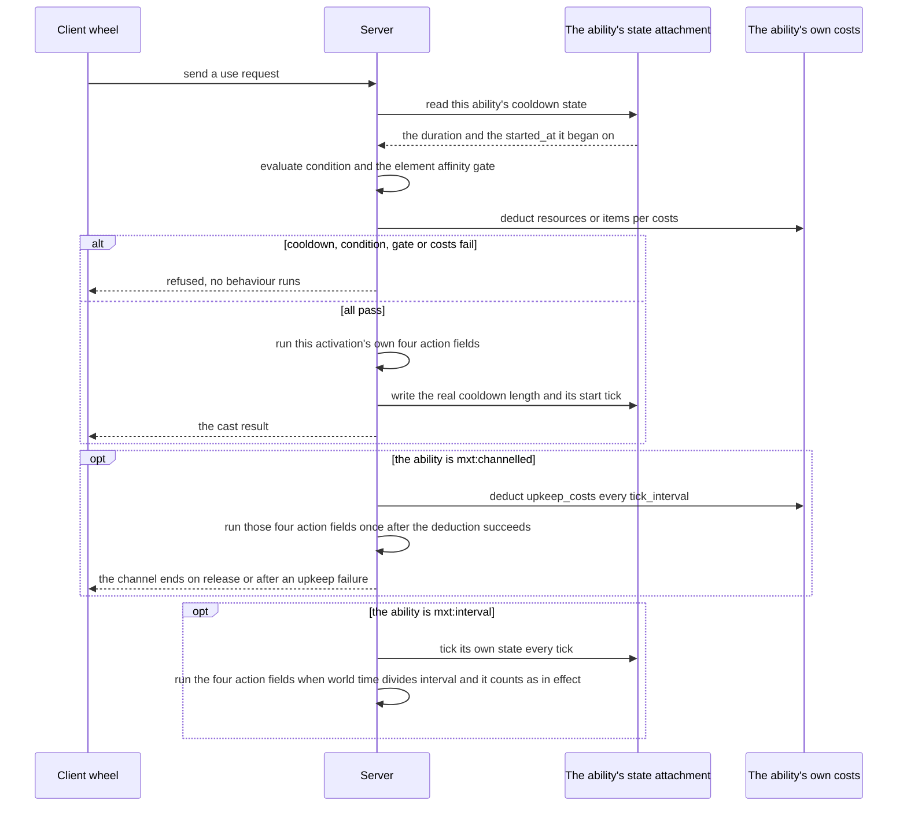

# Ability (ability) {#ability}

## File Location

`data/<namespace>/mxt/ability/<path>.json`

An ability is always exactly one `mxt:ability` entry, and this is the only place it is defined. Its identity is its own registry id: when `name` / `description` are omitted, the default keys are built from that id's namespace and path, with nothing appended after the path.

A host writes only its id or a `#tag`. An [artifact](./artifact.md)'s `abilities`, a technique's or a talisman's `granted_abilities`, spirit roots and physiques, commands and scripts all reference it, without exception, and none of them may copy an ability into the host definition: **an ability written inline inside a host is not recognised**, and it makes that whole host definition fail to parse.

Active, passive and triggered abilities all live on this page. An artifact ability and an ability are the same concept: the ability types are one shared table, and what an artifact, a technique, a command or a script grants is the same kind of ability.

## Common Fields

| Field | Type | Default | Description |
| --- | --- | --- | --- |
| `name` | Text Component | `ability.mxt.<namespace>.<path>` | Optional display name. When omitted it is the default key in the previous column. |
| `description` | Text Component | `ability.mxt.<namespace>.<path>.description` | Optional description. When omitted it is the default key in the previous column; today it is only stored and read, nothing draws it yet. |
| `type` | Ability type id | **required** | Written at the **top level** (`{"type": "mxt:active", ...}`), not nested inside an `ability` object. For the values see [Ability Types](/en/datapack/types/other/ability). |
| `costs` | `Cost` list | `[]` | Costs deducted before the ability executes, **all or nothing** as one array; see [Shared Data Types · `Cost`](../types/shared_data_types.md#cost). |
| `cast_time` | `NumberProvider` | `0` | Cast time. Above `0` a press only books a due tick, and the action fields actually run on that tick. |
| `icon` | Icon reference | none | The wheel icon: **a bare string** is a 16x16 GUI texture, **an object** is an item stack template `{"id": ...}` (optionally with `count` / `components`). The two branches are told apart by parse order (the texture branch is tried first), and an item has to be written in the object form; see [Shared Data Types · Icon Reference](../types/shared_data_types.md#icon-reference). |
| `charges` | `{maximum, recharge_ticks}` | none | The declaration of a charge pool; both fields are `NumberProvider`s and both are required: how many uses at most, and how many ticks one comes back after. |
| `condition` | `EntityCondition` | `mxt:always` | Whether the ability can be used. Every type reads it, see [Condition](#condition) below. |
| `element_affinity` | List of aura ids or `#tags` | `[]` | Element affinity markers of the ability; a non-empty list is both the cast gate (with no matching spirit root the cast is not allowed) and the source of `element_modifier` for the damage this cast deals. |
| `element_affinity_mode` | `average` / `max` | `average` | How `element_modifier` is computed when several spirit roots match: `average` takes the mean, `max` takes the best one. |
| `hidden` | bool | `false` | Skips this ability **in an artifact's tooltip** only; everywhere else it still works and is still granted. |

The table above is the part **every type reads**. Keys that only some types read are not here; they are documented on the [Ability Types](/en/datapack/types/other/ability) page: `cooldown` (default `0`, read only by the types that pay), `damage_condition` (default `mxt:always`, read only by `mxt:triggered`) and the four action fields (`entity_action` / `target_selector` / `target_condition` / `bi_entity_action`). In JSON they are still written beside `type`; a key that is listed nowhere is read by nobody even when it is written.

Numeric fields on abilities all use `NumberProvider`, so they take expressions. An ability has to pass its condition and pay all of its costs before its behaviour runs.

### Condition {#condition}

Every type reads `condition`, and reads it every beat: it is both the gate for counting as in effect and the switch for whether this beat runs the action fields. Types test it at different moments, though: a pulse of `mxt:interval` / `mxt:aura` only runs on a beat where it holds, and a `mxt:modifier` contributes its attributes only while it holds (recomputed every tick, withdrawn the moment it fails).

### How `costs` and `cast_time` Behave

`costs` go through the one shared cost plan: the whole array is validated first and then deducted as a whole; anything that cannot be paid refuses the whole array and rolls back what was already written. The `amount` of a `mxt:resource` entry is evaluated with the caster context plus **the spent value's own formula context** (the resource family's variables, such as `realm_rank` and `absorbed_aura`); see [Formula Variables](../types/formula_variables.md).

`cast_time` is read by the cast pipeline only: a press books nothing but a due tick, and the action fields run on that tick. A positive value on an item-carried ability (one that needs no grant) is refused outright, with the failure reason `CARRIED_NOT_INSTANT`; a positive value on a child of `mxt:composite` makes the whole composite refuse with `INVALID_FORMULA`. `mxt:composite` itself never reads this field.

### Element Affinity

A non-empty `element_affinity` is the first gate: with no matching spirit root the cast is not allowed, with the failure reason `ELEMENT_AFFINITY`. It is also the source of `element_modifier` in the first layer of the [damage pipeline](/en/technical/damage), combined into the damage this cast deals from the `element_ability_modifier` of the matching spirit roots — the mean or the best one, per `element_affinity_mode`. So a damage formula must **not** write `* element_modifier` by hand.

### `hidden`

`hidden` is skipped **in an artifact's tooltip** and nowhere else: listing the abilities an artifact grants skips it, and that is the only place. It **takes no part in the wheel's filter**: the wheel's candidate pool reads the grant ledger (sorted by id) and filters on **being pressable**, `hidden` is not one of those conditions, so it never costs the wheel a cell. To keep a pressable ability off the wheel, do not put its id in the wheel layout; a type that is not pressable never enters the pool in the first place.

### Keys That Hold One Object

A few keys hold **one object rather than a type-dispatched entry** (plain fields under one key):

| Field | Shape | Notes |
| --- | --- | --- |
| `charges` | `{maximum, recharge_ticks}` | Both required (`NumberProvider`): how many uses at most, and how many ticks one comes back after. |
| `modifiers[]` | `attribute` + a flattened `id` / `amount` / `operation`, plus an optional `value` | `value` is a formula override: when written the modifier is evaluated from it, otherwise from `amount` (recomputed every tick). |

The remaining count of `charges` is state (`mxt:charges.remaining`) and is not written in the definition. **Only a payment on the cast pipeline spends one**: validation refuses with `NO_CHARGES` while fewer than 1 remains, and one is taken once the payment is booked. A key going through the **shared gate** (`mxt:flight_control` / `mxt:storage`) spends no charge. It is the only state parameter left on an ability definition.

A `modifiers` `amount` that is not finite is **not a load error**: the attribute service skips that entry at runtime.

```json
{
  "type": "mxt:triggered",
  "triggers": [{"type": "mxt:item_use"}],
  "costs": [
    {"id": "example:qi", "amount": "10 + level"}
  ],
  "cooldown": 100,
  "condition": {"type": "mxt:sneaking"},
  "entity_action": {"type": "mxt:spawn_particles", "particle": {"type": "minecraft:crit"}},
  "target_selector": {"type": "mxt:ray", "length": 6, "limit": 1},
  "target_condition": {"type": "mxt:not_owner"},
  "bi_entity_action": {"type": "mxt:damage", "amount": "6 + level"}
}
```

(This ability carries its own action fields; see [The Four Action Fields](#action-fields-by-type) below.)

## State Storage {#state-kinds-by-type}

Which **state kinds** an ability can store is decided by its `type`; a datapack does not declare it. The only state parameter you can write in the definition is `charges` (the pool's `maximum` and `recharge_ticks`); everything else is produced at runtime.

State lives in the ability's own attachment, one per ability. It is saved with the world and synced to clients. Each record is addressed by **two dimensions**: the ability's own id plus the state kind. Two different ability ids never affect each other, and neither do two entities holding the same ability. One address holds exactly one record, and writing replaces it.

Content supplies those two dimensions as `family` and `id` (`family` is the registry the host lives in, which today means `mxt:ability`). Six state kinds are writable, and each one's declaration fields and state fields are on [Data Storage](/en/datapack/types/other/data-storage).

**Only a kind the host declared can be written**, and revoking an ability's last grant source clears the state under it - only the cooldown stays and keeps running (see [Ability Casting](/en/technical/ability)). The declaration table, the action and the conditions that write and read it, and how cooldown and charges behave are on [Ability Casting](/en/technical/ability). Which types declare which kinds is on [Ability Types](/en/datapack/types/other/ability).

## Ability Types {#ability-types}

The top-level `type` comes from the built-in dispatch table `mxt:ability_type`, with fourteen built-ins. An artifact, a technique, a spirit root, a physique, an ability book, a command and a script all grant the same kind of ability.

**Which fields each type reads and when it runs are on [Ability Types](/en/datapack/types/other/ability)**: one section per type, plus the overview, the state kinds per type and the timing table for the four action fields. `cooldown` and `damage_condition` are there too — they are written beside `type`, but only some types read them.

### The Four Action Fields {#action-fields-by-type}

`entity_action`, `target_selector`, `target_condition` and `bi_entity_action` are written at the **top level of the ability**, beside `type`, with the defaults `mxt:no_op` / `mxt:self` / `mxt:always` / `mxt:no_op`. They are **not common fields**: only the types that run actions read them, and written on any other type they neither error nor take effect.

The order within one chain is always: `entity_action` (runs first) → `target_selector` picks targets → every target is tested by `target_condition` → only a target that passes runs `bi_entity_action`. One target failing does not affect the others, and an action that throws only logs a line rather than stopping the remaining targets. The fields `target_selector` itself takes are on [Ability Target Selectors](/en/datapack/types/other/ability-selector).

**When each of the five types that run this set runs it, and which types read none of it, is on [Ability Types · The Four Action Fields](/en/datapack/types/other/ability#action-fields-by-type).**

### Targeted Casts (`mxt:targeted`) {#targeted}

A press of `mxt:targeted` runs one full cast: its own `costs` / `cast_time` / `condition` / `cooldown` / `charges` / element affinity are paid and tested once, exactly as `mxt:active` does. It reads only three keys: `target_selector` (**required**, the distance and the shape are written here), `ability` (**required**, the payload ability run on every target, **concrete ids only, never a `#tag`**) and `cooldown` (default `0`, the length written into `mxt:cooldown`). The field table is on [Ability Types · `mxt:targeted`](/en/datapack/types/other/ability).

It does **not read** its own top-level `entity_action` / `target_condition` / `bi_entity_action`. Every entity the `target_selector` picks is tested first by **the payload ability's own** `target_condition` (running caster → target), and only a target that passes runs **the payload's** `bi_entity_action`; **the actor is always whoever pressed**, so damage and effects are credited to them, the same rule as `mxt:aura`'s per-target pulse. The payload's own `costs` / `cast_time` / `cooldown` / `charges` / `condition` / element affinity are not read at all, and neither are its `entity_action` or its `target_selector`, so it has to be **one of the five types that run the four action fields**. The price and the cooldown are all charged to this `mxt:targeted` ability itself, once per cast.

**Landing on nobody is decided before anything is paid**, so a press that reaches no one costs nothing: a `target_selector` that picks no entity, or whose picks are all filtered out by the payload's `target_condition`, is `NO_TARGET` (no target matches); a payload type with no one-target half at all is `NOT_APPLICABLE` (the named ability cannot act on a target). Written as a child of `mxt:composite`, these two are decided during the **draft preview** as well, so nothing is paid there either. With `cast_time > 0` this step is decided on the tick the cast finishes, and a failed one reports "Cast failed: `<reason>`" on the action bar.

**Where the effects land**: an action in the payload that **acts on the target** (entity-facing ones such as `mxt:damage_target` / `mxt:heal_target` / `mxt:apply_effect`) is unaffected; an action that **places something** (ones that land by where this cast happens, such as `mxt:spawn_lightning`, `mxt:explode`, `mxt:spawn_particles`, `mxt:spawn_effect_cloud`, `mxt:play_sound`, `mxt:block_action`) lands at the **activation's own place** by default. A wheel press, a command or a script has no place, so those land at each target's own position; **a talisman or a display stand does have one** (the talisman, the stand), so they all land at the talisman's feet. To make them land **at the target's own position** in every case, wrap such actions in `mxt:target_action` with `"use_target_position": true`:

```json
{"type": "mxt:target_action", "use_target_position": true,
 "action": {"type": "mxt:spawn_lightning", "visual_only": true, "color": 11962854}}
```

The default of `mxt:target_action` still follows the activation's place; to place something on the **caster**, use `mxt:actor_action`.

An area skill and a raycast skill are one type written two ways: what changes is the `target_selector`, not the type, and both have to state their own distance.

```json
{
  "type": "mxt:targeted",
  "target_selector": {"type": "mxt:area", "radius": 8, "limit": 5},
  "ability": "example:flame_mark",
  "costs": [{"id": "example:qi", "amount": 12}],
  "cooldown": 100
}
```

`example:flame_mark` carries the `target_condition` and the `bi_entity_action` itself (it is the payload of this cast), and whoever presses the `mxt:targeted` ability pays and is recorded as the origin of the behaviour.

### Flying Mounts (`mxt:mount`) {#mount-render}

**Writing a `mxt:mount` is how an artifact declares itself a flying mount**: once it is in the artifact's `abilities`, the flying skill (`mxt:flight_control`) can take that artifact from either hand and fly it — how fast, how many seats, what fuel it burns and what it does are all answered by this one entry (field table on [Ability Types · `mxt:mount`](/en/datapack/types/other/ability#mxt-mount)). This section covers the other half it answers: **what the mount looks like**. By default it is drawn as the item model of the item it carries (the item frame context: the authored size, a card with no offset); `render` picks **which renderer** draws it, and `display` says how the model **sits relative to the mount's origin**. Drawing is client-side only: a dedicated server decodes `render` as ordinary data and neither draws anything nor asks whether this machine has the matching renderer.

`render` is a field dispatched on its own `type`, written the same way as the ability's own `type`: `mxt:item` by default (the item model of the carried item), or `mxt:geckolib`, or a renderer a content mod registered. **Every type's fields, how the three `mxt:geckolib` asset ids are written and how the seven poses are decided are on [Mount Renderer Types](/en/datapack/types/other/mount-render).**

**`display` is optional**; leave it out and the renderer uses its own default pose. Its three vectors have the same names and the same meaning as a vanilla item model's `display`, so a block copied from one usually works as is:

| Field | Type | Default | Description |
| --- | --- | --- | --- |
| `translation` | three doubles | `[0, 0, 0]` | An offset **in units of 1/16 block** (as in the vanilla `display.translation`, and note that every other number of a `mxt:mount` is in **blocks**), added on top of the mount's origin, which is the bottom face of its collision box |
| `rotation` | three doubles | `[90, 0, -45]` on the item track, `[0, 0, 0]` on the GeckoLib track | **Degrees**, composed the vanilla `rotationXYZ` way (X first, then Y, then Z); the item track's default lays the upright card flat (X 90°) and turns the diagonal blade in the sprite to face forwards (the in-plane 45° folded into Z). A GeckoLib model is authored standing up, so its default turns nothing |
| `scale` | three doubles | `[2, 2, 2]` on the item track, `[1, 1, 1]` on the GeckoLib track | A multiplier, where `1` is the size the resource pack draws; negative values mirror, which vanilla allows too |

All three vectors have to be **finite**; NaN and infinity are refused at load. **A written `display` means the same thing on both tracks**, and so does the order it is applied in: `translation` first, then pitch (the mount's pitch is outermost and only follows half the look direction), and only then `rotation` / `scale`; the mount's own facing is outermost, so a definition **never has to care about facing**. The one difference is that **the item track drops the model's bottom face onto the bottom face of the collision box** (so any item model lands on the same plane), while the GeckoLib track **does not** — such a model has the mount's origin as its own origin in the modelling tool, so write `display.translation` to move it. The seat (how high the feet stand) is not part of `display`; it is the mount's own `seat_offsets`.

Which entity flies it is decided by `entity_type`; the field and the contract are on [Ability Types · `mxt:mount`](/en/datapack/types/other/ability#mxt-mount) and [the mount contract](../../java/interfaces/mount/vehicle.md).

```json
{
  "type": "mxt:mount",
  "speed": 0.12,
  "render": {
    "type": "mxt:geckolib",
    "model": "example:vehicle/azure_sword",
    "texture": "example:textures/entity/vehicle/azure_sword.png",
    "animations": "example:vehicle/azure_sword",
    "states": { "idle": "hover", "moving": "fly", "ascending": "climb", "descending": "dive" },
    "transition_ticks": 5
  }
}
```

### Keys, Commands and Scripts

**Only five types are pressable**: `mxt:active` / `mxt:channelled` / `mxt:targeted` / `mxt:storage` / `mxt:flight_control`. The first three go through the full cast pipeline and pay for themselves; `mxt:flight_control` and `mxt:storage` first pass the **shared gate**, which tests in order granted → cooldown → condition → costs, and **writes no charge and runs no effect**.

**The wheel pool only takes pressable types**: the candidate pool reads the grant ledger, sorts by id and then filters on being pressable. So `mxt:triggered` / `mxt:aura` / `mxt:interval` / `mxt:modifier` / `mxt:mount` / `mxt:upkeep` / `mxt:composite` / `mxt:word` / `mxt:empty` all **never enter the wheel pool**, and `hidden` is not one of that filter's conditions either. The dispatch on a wheel press is: a pressable type goes to activation, and **everything else falls back to one ordinary cast** — a path that only serves **an already saved wheel cell / layout**, since a layout is written to disk and may name an ability that is not pressable, so the server still honours it.

**Commands and KubeJS are a different road**: `/mxt ability cast` and the KubeJS cast entry point cast any type directly, and an item-carried ability goes the same way; those runs go through the cast pipeline as usual (condition, costs, `cast_time`, cooldown, charges).

Ability behaviour is handled on the server; the client wheel only sends which kind and which id was chosen, and the grant, the conditions, the costs and the cooldown are all decided by the server.

The order one ability activation runs in:


```mermaid
sequenceDiagram
    participant C as Client wheel
    participant S as Server
    participant H as The ability's state attachment
    participant R as The ability's own costs

    C->>S: send a use request
    S->>H: read this ability's cooldown state
    H-->>S: the duration and the started_at it began on
    S->>S: evaluate condition and the element affinity gate
    S->>R: deduct resources or items per costs
    alt cooldown, condition, gate or costs fail
        S-->>C: refused, no behaviour runs
    else all pass
        S->>S: run this activation's own four action fields
        S->>H: write the real cooldown length and its start tick
        S-->>C: the cast result
    end
    opt the ability is mxt:channelled
        S->>R: deduct upkeep_costs every tick_interval
        S->>S: run those four action fields once after the deduction succeeds
        S-->>C: the channel ends on release or after an upkeep failure
    end
    opt the ability is mxt:interval
        S->>H: tick its own state every tick
        S->>S: run the four action fields when world time divides interval and it counts as in effect
    end
```

For a top-level ability to be a channelled ability you can release from the wheel, make `mxt:channelled` a child of `mxt:composite`: `mxt:active` and `mxt:channelled` are mutually exclusive single `type`s, and only a composite's children become the active channel. `mxt:composite`'s own `costs` / `cooldown` / `charges` all take no effect, and the money and the cooldown are booked under **the child's own id**.

```json
{
  "type": "mxt:composite",
  "abilities": ["example:meditate_channel"]
}
```

`example:iron_palm` is an `mxt:active` ability carrying its own action fields:

```json
{
  "type": "mxt:active",
  "costs": [{"type": "mxt:resource", "resource": "mxt:spirit_power", "amount": 10}],
  "entity_action": {"type": "mxt:damage", "amount": "8 + level"}
}
```
