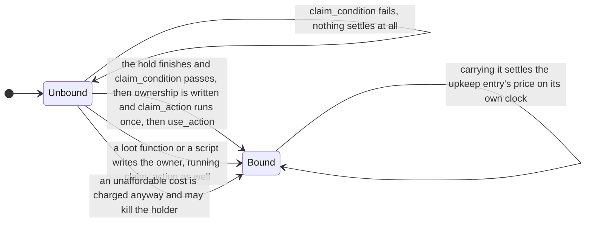

# Artifact (artifact)

## File Location

Artifact JSON files go in `data/<namespace>/mxt/artifact/` within your data pack.

The filename corresponds to its ID. For example, `data/example/mxt/artifact/bound_sword.json` has the ID `example:bound_sword`.

An artifact is not a new item: it is a set of rules for items that already exist. `items` declares which items this definition claims (the same `ItemMatcher` the four binding tables and `spirit_herb` use), and every matching stack is that artifact. What it does is declared entry by entry in `abilities`, each dispatched by its own `type`. There is no free-form "kind" field (the old `item_type` is gone, and an old definition still writing it is **silently ignored**): **the definition's own registry id is the artifact's name**, and a pack that wants one label over a family of artifacts says it with an item tag (a `#tag` in `items`) or the id's namespace and path.

| Field | Type | Default | Description |
|-------|------|---------|-------------|
| `name` | Text Component | `artifact.mxt.<namespace>.<path>` | Optional display name. When omitted it is the default key in the previous column. |
| `description` | Text Component | `artifact.mxt.<namespace>.<path>.description` | Optional description. When omitted it is the default key in the previous column; it is stored and read today, but nothing draws it yet. |
| `items` | `ItemMatcher` | **required** | The items this definition claims: an item id, a `#tag`, or a mixed array of both, matching at least one item. |
| `spirit_capacity` | `Map<aura, NumberProvider>` | `{}` | The storage ceiling of each aura. Keys must be **concrete auras** (tags are not accepted); an empty map means this artifact stores no aura. Values are floored, and a non-finite value reads as `0`; the nourishment bonus `× (1 + 0.5 × nourishment)` is **applied by the pipeline**, so a formula must not multiply it in again. |
| `abilities` | `ArtifactAbility[]` | `[]` | The artifact's ability entries, dispatched by `type`; see the table below. |
| `curios_equipable` | bool | `false` | Whether this artifact kind may go into Curios slots. Under the **Weapons and Artifacts** mode the belt slot accepts items matched by `weapon_binding`, or artifacts declaring `true` here; the four `charm` slots accept **only** artifacts declaring `true` (the `curios:charm` item tag still lets other items in). |
| `require_owner` | bool | `false` | Whether the artifact must be **bound to an owner first** before flight and storage will work. With `false` (the default) an unbound artifact works for anybody, and once it is bound it answers to its owner alone — binding is a way to claim an artifact, not a prerequisite; with `true` an unbound artifact is refused outright (the old strict reading). It does not affect `mxt:owned_by` (which asks whether the owner *is* the holder) or granted abilities. |
| `claim_action` | ItemAction | `{"type": "mxt:consume_health", "amount": 4}` | The action run on the holder and on the item when ownership is written (formerly `refine_action`). **What claiming costs lives in this very action**: everything a claim does goes through this one field. **Saying nothing means this default** — every claim charges four points of health (two hearts). **A free claim has to say `{"type": "mxt:no_op"}` explicitly: omitting the field is not free.** It takes a single action or an **array** (an array is the `mxt:sequence` shorthand written out: every entry runs, in order — the same shorthand every other `ItemAction` field accepts); a claim that both charges and does something is an array, with the `mxt:consume_health` entry followed by whatever other item actions belong there. |
| `claim_condition` | `EntityCondition` | always true | The claim condition (formerly `refine_condition`). It **only constrains the long press**: failing it means `claim_action` does not run. The `mxt:set_artifact_owner` loot function and `ArtifactService.refine` from a script still write ownership unconditionally. |
| `pour_action` | ItemAction | `mxt:no_op` | Run once per tick of a **pour** that really took aura in — not once per gesture. |
| `use_action` | ItemAction | `mxt:no_op` | Run once when this hold **runs all the way through**: on a successful claim, and at the end of a pour. Releasing early runs nothing. |
| `hold_ticks` | NumberProvider | `20` | How long the use cycle of the long press lasts, in ticks, clamped to `0..72000`. **`0` means this definition does not take the long press over at all**, so a right click stays the item's own business. |
| `element` | `HolderOrTag<element>[]` | `[]` | What this artifact **is made of**: an entry names one element and a `#tag` names a set of them. This is the first source of "the element of an item"; the full reading is on [weapon_binding](./weapon_binding.md). The auras in `spirit_capacity` deliberately do **not** take part — that field says what the stack can hold, not what it is. |
| `attachment_multiplier` | Double | `1.0` | What this artifact is worth as a ward: while it is carried (both hands and the Curios slots), every strike that leaves an element on the carrier leaves this fraction of it — `0.5` for half, `0` for none, which keeps that reaction from ever answering. Several carried items multiply, and the default is a no-op. This is the item-side answer to resisting an elemental reaction: it slows the **buildup**, and what the reaction itself does is not its business. |

The built-in types of `abilities` (the `mxt:artifact_ability_type` registry, which a data pack cannot add to):

| `type` | Fields | Effect |
|--------|--------|--------|
| `mxt:empty` | none | A do-nothing placeholder type, and the registry's default entry; `type` itself is still required, so omitting it fails to load. |
| `mxt:passive` | `abilities`: an ability id, a `#tag`, or a mixed array of both | Grants those abilities while the artifact is held or equipped; attribute modifiers apply while they are granted. The abilities referenced here must not be active abilities. |
| `mxt:active` | the same shape | Grants **castable** abilities; active abilities can be put on the wheel and cast from it. The abilities referenced here must be active abilities — a wrong reference is reported by `/mxt registries validate`. |
| `mxt:flight` | `speed` (required `NumberProvider`), `costs` (`Cost[]`, default `[]`), `display` (how the mount is drawn; default = laid flat, blade forward, twice the authored size) | Flight: `speed` is the mount's flying speed and `costs` is what is paid per tick by the carried owner (see [Shared Data Types · `Cost`](../types/shared_data_types.md#cost)). **At most one such entry per definition.** It is also an **artifact skill** (a `ToggableArtifactAbility`), so it appears as one cell on the wheel: press to take off, press again to land. |
| `mxt:storage` | `slots` (required `NumberProvider`) | Built-in storage slots, **at most one such entry per definition**. The slot count is **rounded up to whole rows of nine** (the screen is a standard chest) and cut at six rows, so **54 slots at most** - slots a screen cannot open should not exist, which keeps the capacity and the window the same number. The contents live in the `mxt:artifact_storage` item component and only the owner and the server can reach them. It is also an **artifact skill**: its wheel cell opens that box (titled after the artifact). |
| `mxt:upkeep` | `costs` (`Cost[]`, default `[]`), `interval` (`NumberProvider`, default `20`), `on_fail` (ItemAction, default `mxt:no_op`), `owner_only` (bool, default `true`) | **A periodic price**: carrying the artifact drains what `costs` names on a clock, paid by the carried owner (see [Shared Data Types · `Cost`](../types/shared_data_types.md#cost)). See below. **At most one such entry per definition.** |

`mxt:upkeep` in detail:

- `costs` is what is settled once every `interval` ticks, **all of it together and all or nothing** (never half). An empty list charges nothing.
- `interval` is the settlement period in ticks; a value that does not evaluate to something usable falls back to `20`. The clock is the **world's**: only ticks whose game time is divisible by `interval` settle — not "every N ticks after it was picked up".
- It looks at the **main hand, the off hand and every equipped Curios slot** (`ArtifactUpkeepService`, checked once per server tick).
- `on_fail` is what runs on the holder and on that item stack when the price cannot be paid, for example `{"type": "mxt:damage_item", "amount": 1}`.
- `owner_only` true (the default) means only the owner pays — an unclaimed artifact has nobody to charge; false means whoever carries it pays.

**`mxt:flight`'s `display` (how the mount is drawn).** The flying mount is drawn as **the item model of the item it carries** (the item frame context: the authored model at full size, with no offset), and `display` says how it sits relative to the mount's origin. The keys have the same names and the same meaning as a vanilla item model's `display`, so a block copied from one usually works as is:

| Field | Default | Meaning |
| --- | --- | --- |
| `translation` | `[0, 0, 0]` | An offset **in sixteenths of a block** (as in vanilla — note that every other number in this file is in blocks), added on top of the mount's origin, which is the bottom of its collision box |
| `rotation` | `[90, 0, -45]` | **Degrees**, composed the vanilla way (`rotationXYZ`: X first, then Y, then Z). The default lays the upright card flat (X 90°) and turns the diagonal blade in the sprite to point forwards (the in-plane 45° folded into Z) |
| `scale` | `[2, 2, 2]` | A multiplier, where `1` is the size the resource pack draws; negative values mirror, as in vanilla |

All three vectors have to be **finite**; NaN and infinity are refused when the definition loads. The order of placement: the model's underside is put on the bottom of the collision box first (automatically, so any model lands on the same plane), then `translation` is added, and only then `rotation` / `scale`. The mount's own yaw and pitch are applied outside all of it, so a definition never has to think about facing. The seat (how high the rider's feet stand) is not part of `display`.

These **eight keys are no longer read**: writing them neither fails nor does anything, because `RecordCodecBuilder` ignores every key it was not told about. Four of them have moved into `abilities` — `granted_abilities` is now written as `mxt:passive` / `mxt:active` entries, `flight_speed` and `flight_costs` as `mxt:flight`, and `storage_slots` as `mxt:storage`. Two were **renamed** — `refine_action` → **`claim_action`** and `refine_condition` → **`claim_condition`**; and both **`refine_health_cost`** and the short-lived **`claim_cost`** were merged into `claim_action`, whose default is the price. **An old pack writing the old names still loads, but the price falls back to the default four points of health and the claim's effects and condition stop working**, so it has to be renamed by hand.

Spirit power and nourishment:

- The amounts live in the **shared component** `mxt:spirit_storage` (whole units keyed by aura, the same shape spirit stones and talisman carriers use), not in an artifact-only component.
- The ceiling comes from the value `spirit_capacity` declares for that aura; an aura the definition does not declare cannot be poured in at all (its ceiling reads as `0`).
- The `mxt:artifact_state` component now holds only ownership (`owner_uuid`, plus `owner_name` for display) and `nourishment` (`0..1`). **Ownership is decided by `owner_uuid`** (`mxt:owned_by`, flight and storage all ask it); `owner_name` is the display name recorded at the moment the artifact was claimed and is only ever shown. A stack claimed before that field existed asks the server once (`OwnerNameC2SPayload`, one question per id per session), which answers from its online player list and its persisted name cache and **never asks the session service** (a web request); a player it has never seen is answered with nothing and the tooltip keeps showing the UUID. Every time aura is actually accepted, nourishment rises by **accepted ÷ the effective ceiling of that aura**, clamped to `0..1`, and only ever rises; the effective ceiling is `floor(declared × (1 + 0.5 × nourishment))`, so a fully fed artifact holds `1.5 ×` its declaration, and both ends are clamped. To read nourishment, use the generic `mxt:component` condition on `mxt:artifact_state`'s `nourishment`.
- Ownership is written by `mxt:set_artifact_owner` (a loot function), by the **long press** described below, or by anything that calls `ArtifactService.refine`. **Flight and storage are judged by `require_owner`**: with `false` (the default) an unbound artifact works for anybody and an owner-only artifact answers to its owner once bound; with `true` an unbound artifact is refused. `mxt:owned_by` is independent of `require_owner` — it asks whether the owner *is* the holder, so it is false while the artifact is unbound; granted abilities only look at whether the artifact is held or equipped.

**The long press** (hold right-click down; sneaking is never a hold):

| Holder state | What the long press does |
| --- | --- |
| No owner | The claim is settled only when the hold **runs all the way through**: `claim_condition` is asked first, and only if it passes is ownership written and `claim_action` run once (four points of health by default, with **no pre-check of any kind**), finishing with `use_action`. A condition that fails settles nothing at all and `claim_action` does not run. Releasing early settles nothing either. |
| You are the owner | While the button is held, **your own aura** is poured in: every aura `spirit_capacity` declares is fed one unit a tick, one for one out of your pool of that aura's resource, until the artifact is full or you let go; nourishment rises with what is accepted. Every tick that **really took aura in** runs `pour_action`, and the gesture finishing runs `use_action`. |
| Somebody else owns it | **The click is not taken over at all**: no hold pose, the item answers the click by its own rules, and the action bar says "This artifact already has an owner". |
| You own it and it is full | Same, not taken over, with "This artifact is already full". |

- The length of the gesture is `hold_ticks` (20 ticks = one second by default); `hold_ticks: 0` turns the long press off for that definition, and the tooltip stops advertising it.
- An item's own use is never taken away: food or a potion that is also an artifact keeps its own behaviour.
- Binding is a way to **claim ownership** (it writes `owner_uuid`), not a prerequisite — whether an owner is required at all is still `require_owner`.
- **A claim has a single action field**: `claim_action` carries both the price and the effect — saying nothing means the default four points of health, `mxt:no_op` means free, and a claim that both charges and does something writes an array (`mxt:consume_health` first, then whatever other item actions belong there).
- **The cost is never pre-checked**: the long press asks `claim_condition` and never asks whether the holder can afford the price. Too little health is charged anyway and may kill the holder on the spot. The price is dealt as vanilla magic damage, so resistance and protection enchantments reduce it as usual, while a holder that cannot be damaged at all (creative mode) claims for free.
- When a loot function or a script writes ownership, **`claim_action` (price included) runs there too**, but those two paths do **not** consult `claim_condition`. See [Loot and Criteria](/en/datapack/loot-and-criteria).
- To charge for merely **carrying** the artifact, do not put it in the claim flow — a claim happens once. Use the `mxt:upkeep` entry of `abilities`: it settles `costs` once every `interval` ticks on the world clock and runs `on_fail` when the price cannot be paid.
- **Feedback while pouring**: the action bar counts **across the whole time the button is held** ("poured N aura so far"), and a finished hold reports the total for that hold — the count is deliberately **not** reset at every use-cycle boundary, because vanilla starts a new cycle for as long as the button stays down (the old behaviour restarted from zero once per `hold_ticks`, which reads as the artifact having been emptied). When one aura cannot be paid, the line **names that aura** ("not enough of your own: *aura name*"); an artifact that is full for every aura it declares says nothing at all.

An artifact has exactly two states — unbound and bound — and the long press is the only action that moves it by itself (the other writer is the `mxt:set_artifact_owner` loot function, or a script):



A complete example (two auras, passive + active + flight + storage + upkeep):

```json
{
  "items": ["#mxt:artifact/sword", "minecraft:netherite_sword"],
  "spirit_capacity": {
    "mxt:qi": 500,
    "mxt:sword_intent": 50
  },
  "abilities": [
    { "type": "mxt:passive", "abilities": ["mxt:sword_body", "#mxt:artifact/sword_passives"] },
    { "type": "mxt:active", "abilities": "mxt:sword_rain" },
    { "type": "mxt:flight", "speed": 0.08, "costs": [{ "id": "mxt:qi", "amount": 1 }] },
    { "type": "mxt:storage", "slots": 9 },
    {
      "type": "mxt:upkeep",
      "costs": [{ "id": "mxt:qi", "amount": 2 }],
      "interval": 20,
      "on_fail": { "type": "mxt:damage_item", "amount": 1 },
      "owner_only": true
    }
  ],
  "curios_equipable": true,
  "hold_ticks": 30,
  "claim_action": [
    { "type": "mxt:consume_health", "amount": "4 + realm_rank" },
    { "type": "mxt:damage_item", "amount": 1 }
  ],
  "claim_condition": { "type": "mxt:has_ability", "ability": "mxt:sword_body" },
  "pour_action": { "type": "mxt:charge_artifact", "aura": "mxt:qi", "amount": 1 },
  "use_action": { "type": "mxt:consume_health", "amount": 1 }
}
```

Price and effect share one field: when `claim_action` is an array every entry runs in order, so "charge first, then do something" reads like this. A price higher than the default means editing the `mxt:consume_health` entry inside it:

```json
"claim_action": [
  { "type": "mxt:consume_health", "amount": "4 + realm_rank" },
  { "type": "mxt:damage_item", "amount": 1 }
]
```

A free claim has to say so — **leaving `claim_action` out is not free**, because the default of four points of health applies again:

```json
"claim_action": { "type": "mxt:no_op" }
```

**Tooltip**: the item tooltip reports the declaration line by line — the artifact's name, each aura as `stored / effective ceiling` (warmth included, coloured by percentage), every `abilities` entry (**one entry, one line**: `mxt:passive` and `mxt:active` give each granted ability its own line, `mxt:flight` puts the speed and the per-tick cost on one line, `mxt:storage` gives `used / total slots`, `mxt:upkeep` gives one line — "Upkeep · N resource units, M resource units every T ticks", with a translatable separator between the prices — and `mxt:empty` takes no line), and whether the artifact has an owner (a green `✔` line **naming the owner** when it has one — the name recorded at claim time, with the UUID only for a stack whose name could not be recovered — and a red `✖` line only when `require_owner: true` and it has none — an artifact that does not require an owner says nothing while it is unbound). One more line appears once nourishment is above `0`, the last line is the long-press hint (an unbound artifact offers "Hold: bind it for N health" when a positive number is read back out of `claim_action`, and "Hold: bind it (no cost)" when it reads as `0`; one you own and that still has room offers "Hold: pour your own aura in"; a definition with `hold_ticks: 0` says neither), and advanced tooltips (F3+H) add the definition id, plus the owner's UUID on its own line whenever the line above managed a name.

**Artifact skills (`ToggableArtifactAbility`).** The rule is one sentence: **everything a player has to press for counts as a skill and goes on the wheel**. Every entry of `abilities` that implements this interface is such a thing - implementing it is the whole of declaring "put this entry on the wheel" (the design is in `research/32_法器开关与轮盘接线设计.md`). There are two today, both built-in types and neither needing a new field: `mxt:flight` (a switch: on takes off, off lands) and `mxt:storage` (a one-shot: it opens the storage box and has no state). The rules:

- It appears on **the page whose equipment declares it** (main hand / off hand / Curios, after the abilities) and can also be pinned to the main wheel by the player - both read "is that artifact in a hand or a Curios slot right now", and neither stores anything.
- The wheel addresses it by the **artifact's id plus the capability's key** (written `ns:path/key`, such as `mxt_test:bound_sword/storage`), so **one artifact may declare several skills, one per key** - the same sword can fly and hold things; the same key twice is refused at load time.
- **Its state is not a data-pack field** - the implementation owns it (flight reads the player's flight state, the storage has none): the wheel cell only reports it (a switch is green while on and grey while off, a one-shot is violet), and pressing it makes the **server** ask the implementation and decide. So these cells appearing on the wheel is a natural consequence of writing `mxt:flight` / `mxt:storage`, with no extra field.
- The storage cell opens the **vanilla chest window** (menu and screen both reuse the vanilla container menu), and its slot count rounds up to whole rows of nine, at most 54.

**Not built yet**: the refining table is still missing (refining is reachable only from the loot function, the long press and scripts). Flight and storage both have a player-facing entry now: those two wheel cells (plus an `enabled`-carrying `FlightToggleC2SPayload` channel that the client does not currently use).
