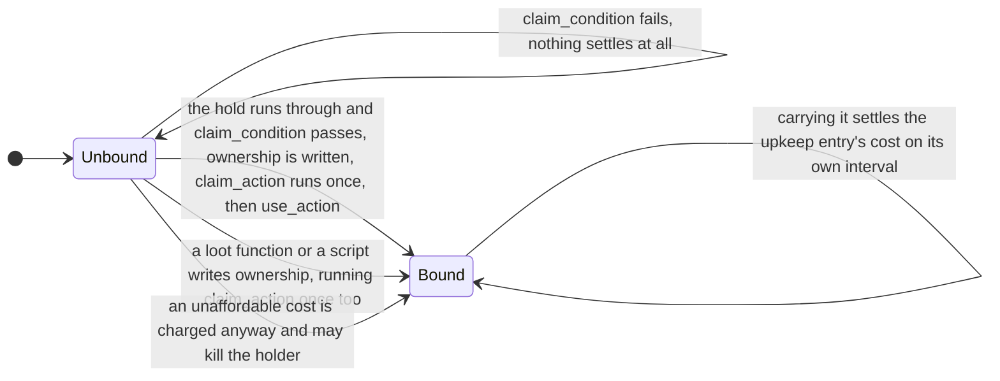

# Artifact (artifact) {#artifact}

File location: `data/<namespace>/mxt/artifact/<path>.json`

An artifact is not a new item but **a set of rules for items that already exist**: `items` declares which items this definition claims (the exact same `ItemMatcher` the six binding tables and `spirit_herb` use), and every matching stack is that artifact. What it does is declared entry by entry in `abilities`: **each entry writes the id of an `mxt:ability` registry entry, or an ability tag** — an ability itself is only ever defined in one place, under `data/<namespace>/mxt/ability/` (see [Ability · Ability Types](./ability.md#ability-types)). An artifact ability and an ability are the same concept, so no ability type exists just for artifacts. The definition has **no** free-form tag field such as "artifact kind": **its own registry id is the artifact's name**, and a pack that wants to group a family of artifacts together says so with an item tag (a `#tag` in `items`) or with the id's namespace and path. **It has no `quality` field**: an artifact is claimed **by item** (`items` is that same `ItemMatcher`), so the stack carries no component holding a definition identity and there is nothing on it to ask; this family's tier is written in the [default_quality](./default_quality.md) registry, as an entry claiming the item through `items`.

| Field | Type | Default | Description |
| --- | --- | --- | --- |
| `name` | Text Component | `artifact.mxt.<namespace>.<path>` | Optional display name. When omitted it uses the default key in the left column. |
| `description` | Text Component | `artifact.mxt.<namespace>.<path>.description` | Optional description. When omitted it uses the default key in the left column; it is stored and read today, but nothing draws it yet. |
| `items` | Item id, `#tag`, or a mixed array | **required** | The items this definition claims: an item id, a `#tag`, or a mixed array of both, matching at least one item — see [ItemMatcher](/en/datapack/types/shared_data_types#itemmatcher). |
| `priority` | Int | `0` | Order between several definitions of the same kind matching one item: the higher number wins (see [ItemMatcher](/en/datapack/types/shared_data_types#itemmatcher)); equal values fall back to registry order. It also orders this artifact's hold gesture inside the hold pool (technique reading and pouring are both `0`); two definitions sharing a `priority` are reported as a load-time problem too. |
| `spirit_capacity` | Map from aura id to a number | `{}` | The storage ceiling of each aura. Keys must be **concrete auras** (tags are not accepted); an empty map means this artifact stores no aura. Values are floored, and a non-finite value reads as 0; the nourishment bonus `× (1 + 0.5 × nourishment)` is **applied by the pipeline, so do not multiply it in again in a formula**. |
| `abilities` | Ability id list, entries may be `#tags` | `[]` | What this artifact gives its holder. **Each entry is the id of an `mxt:ability` registry entry, or an ability tag `#namespace:path`** (a tag expands into every ability it lists when granted, in registry order); a single entry on its own and an array both work. One definition can be shared by several artifacts, and the same ability can also appear in an ability book, in a command or in loot — **whether it is passive or active is decided by the ability's own `type`**, which the artifact does not declare. The same ability written twice (once directly, once through a tag) is de-duplicated. See [Ability · Ability Types](./ability.md#ability-types). |
| `curios_equipable` | bool | `false` | Whether this artifact may go into Curios slots. Under the **Weapons and Artifacts** mode the belt slot takes items matched by `weapon_binding`, or artifacts declaring `true` here; the four `charm` slots take **only** artifacts declaring `true` (the `curios:charm` item tag can still hold other things). |
| `require_owner` | bool | `false` | Whether it **must be bound to an owner first** for flight and storage to work. With `false` (the default) an unbound artifact works for anybody, and once bound it answers to its owner alone — binding is claiming ownership, not a prerequisite for use; with `true` an unbound artifact is refused outright. It does not affect `mxt:owned_by` (which asks whether the owner is you) or granted abilities. |
| `claim_action` | ItemAction | `{"type": "mxt:consume_health", "amount": 4}` | The action run on the holder and on the item when ownership is written. **What claiming costs lives in this one action**: everything a claim does is handled by this field. **Saying nothing means this default** — every claim charges 4 points of health (two hearts). **A free claim has to write `{"type": "mxt:no_op"}` explicitly: omitting the field is not free.** It takes a single action, or an **array** (an array is the `mxt:sequence` shorthand written out: every entry runs in order, the same shorthand every other `ItemAction` field accepts); "pay a price and do something" is an array — `mxt:consume_health` followed by whatever other item actions belong there. |
| `claim_condition` | `EntityCondition` | always true | The claim condition. It **only constrains the long press**: while it fails, `claim_action` does not run. The `mxt:set_artifact_owner` loot function and a script writing ownership still write it unconditionally. |
| `pour_action` | ItemAction | `mxt:no_op` | Run once on every tick of a **pour** that really took aura in, not once per whole gesture. |
| `use_action` | ItemAction | `mxt:no_op` | Run once after this hold **runs all the way through**: on a successful claim, and at the end of a pour. Letting go early runs nothing. |
| `hold_ticks` | NumberProvider | `20` | The length of the long press's use cycle, in ticks, clamped to `0..72000` after evaluation. **`0` means this definition does not take the long press over**, and a right click stays the item's own business. It is evaluated at declaration level (no holder) with an empty context, so do not lean on the holder in a formula; the holder side evaluates it once more at runtime. |
| `element` | Element id list, entries may be `#tags` | `[]` | What element this artifact **is**: an entry is one element, a `#tag` is a set of them. This is one of the first-priority sources of the element of an item; the full reading is in [weapon_binding](./weapon_binding.md). The auras in `spirit_capacity` deliberately **do not take part** in this read: that field says what the stack can hold, not what it is. |
| `attachment_multiplier` | Double | `1.0` | What this artifact is worth **as a ward**: while it is carried (both hands and the Curios slots), a strike landing on the carrier keeps this fraction of the element attachment it would leave — `0.5` keeps only half, `0` keeps none at all, so that elemental reaction is never triggered by that hit. Several artifacts **multiply**, and unwritten there is no effect. This is where a treasure cancels part of an elemental reaction: it presses on the **buildup rate**, and the reaction's own effect is not its business. **Only artifacts have this field** (`item_binding` / `weapon_binding` do not offer it), so an ordinary weapon or item never turns into a ward by accident. |

Every entry in `abilities` is an **ordinary ability**, and its `type` comes from `mxt:ability_type`, the one built-in dispatch table every ability shares (fourteen built-ins: `empty`, `active`, `triggered`, `modifier`, `aura`, `interval`, `channelled`, `targeted`, `composite`, `word`, `mount`, `flight_control`, `storage`, `upkeep`). The types, their fields and how to write them are all in [Ability · Ability Types](./ability.md#ability-types).

An entry in `abilities` **can only be an id or a `#tag`**. Writing an object there — that is, inlining the ability in this file — is not a legal entry and makes the **world load fail**.

```json
{
  "items": "minecraft:diamond_sword",
  "abilities": [
    "mxt_test:artifact_guard",
    "mxt_test:firebolt",
    "mxt_test:bound_mount",
    "#mxt_test:artifact_passive"
  ]
}
```

- The first two are **registry entries in their own right**: `mxt_test:artifact_guard` is a `mxt:modifier` (passive) and `mxt_test:firebolt` is a `mxt:active` (one press). Whether an ability is passive or active is decided by **its own `type`**; an artifact definition does not declare which of the two it grants.
- The third, `mxt_test:bound_mount`, is a `mxt:mount` (**it declares the artifact a flying mount, and it is never pressed**), and the fourth is an **ability tag** that expands into the abilities it lists when granted — when several artifacts in one pack share the same group of passives, editing the tag beats editing every definition; the same ability written twice (once directly, once through a tag) is de-duplicated.
- The fields these abilities own (flight speed and per-tick cost, storage slot count, upkeep period) all live **in the ability's own file**: `mxt:mount` takes `speed` / `seats` / `sit` / the geometry plus the ability's `costs`, `mxt:storage` takes `slots`, and `mxt:upkeep` takes `interval` / `on_fail` / `owner_only` and likewise uses the ability's `costs`. These abilities **need an item to carry them**: granted by a source with no item, such as an ability book, the syntax is legal but using them is refused with "no carrier".
- Besides the definition's own `abilities`, **one particular pile of items** can carry abilities through the `mxt:item_abilities` data component (`{"abilities": ["example:foo"]}`): what the runtime reads is the **union of what the definition declares and what the component writes**, so two piles claimed by the same definition can carry different abilities. The component stores **ability ids only** and takes no tags; its dedicated producer is the item action [`mxt:add_ability`](../types/action/item_action_types.md) (the generic `mxt:merge_components` patch still works).

**A `mxt:mount` is how the artifact declares itself a flying mount, and it also answers how that mount is drawn.** By default the mount is drawn as the item model of the item it carries (the item frame context: the authored size, a card with no offset); `render` switches that to `mxt:geckolib` or to a renderer a content mod registered. `display` is optional — leave it out and the renderer uses its own default pose. The fields, the defaults and the seven poses are on [Mount Renderer Types](/en/datapack/types/other/mount-render). The seat (how high the feet stand) is not part of `display`; it is the mount's own `seat_offsets`.

## Aura and Nourishment

- The amounts live in the **shared component** `mxt:spirit_storage` (keyed by aura, with **fractional values**, the same shape spirit stones and talisman carriers use), not in an artifact-only component.
- The ceiling comes from that aura's declared value in `spirit_capacity`; an aura the definition never declares cannot be poured in at all (its ceiling reads as 0).
- Fractions are stored rather than whole units: a hold still pours **one whole unit** a tick, while flying the treasure burns its **per-tick fuel at that precision** (`0.1` means 0.1 a tick), so a charged artifact can be burned exactly to empty. (Spirit stones and talismans share the same component but only ever read and write whole units.)
- The `mxt:artifact_state` component holds only ownership (`owner_uuid`, plus `owner_name` for display) and `nourishment` (`0..1`). **Ownership is decided by `owner_uuid`** (`mxt:owned_by`, flight and storage all ask it); `owner_name` is the display name recorded at the moment of claiming and is used by the tooltip only. When a stack does not carry that name, the client **asks the server once** (once per id per session) — the server answers from its online player list and its persisted name cache and **does not ask the session service** (that is a web request); a player it has never seen gets no answer at all and the UI keeps showing the UUID. Every time aura is really accepted, nourishment rises by **accepted ÷ the effective ceiling of that aura this time**, clamped to `0..1`, and only ever rises; the effective ceiling is `floor(declared ceiling × (1 + 0.5 × nourishment))`, so a fully fed one is 1.5×, clamped at both ends. To read nourishment, use the generic `mxt:component` condition on `mxt:artifact_state`'s `nourishment`.
- Ownership is written by `mxt:set_artifact_owner` (a loot function), by **claiming with a long press** (below), or by any script that writes ownership. **Flight and storage are judged by `require_owner`**: with `false` (the default) an unbound one works for anybody and a bound one answers to its owner alone; with `true` an unbound one is refused outright. `mxt:owned_by` has nothing to do with `require_owner` — it asks whether the owner is you, so it is false while unbound; granted abilities only look at whether the artifact is held or equipped.

## The Long Press {#hold}

Hold right-click down; it does not count while sneaking.

| Holder state | What the long press does |
| --- | --- |
| No owner | The claim only settles when the hold **runs all the way through**: `claim_condition` is tested first, ownership is written only if it passes, `claim_action` runs once (4 points of health by default, with **no pre-check of any kind**), and `use_action` runs last. A condition that fails settles nothing at all and `claim_action` does not run. Letting go early settles nothing either. |
| You are the owner | While the button is held, **your own aura** is poured into the artifact: every aura `spirit_capacity` declares is fed 1 point a tick, taken 1:1 from the holder's pool of that aura, until the artifact is full or the button is let go; nourishment rises with what is accepted as usual. Every tick that **really took aura in** runs `pour_action` once, and a gesture that runs through runs `use_action`. |
| Somebody else owns it | **This right click is not taken over**: no hold pose, the item handles the click by its own rules, and the action bar says "This artifact already has an owner". |
| You own it but it is full | Same, not taken over, with "This artifact is already full". |

- The length of the hold is `hold_ticks` (20 ticks = one second by default); `hold_ticks: 0` turns the long press off for this definition (the tooltip stops advertising it too).
- It does not fight the item's own use: food or a potion that carries its own `minecraft:consumable` and is also an artifact keeps its own use first.
- Claiming is **writing ownership** (`owner_uuid`), not a prerequisite for use — whether an owner is required at all is still said by `require_owner`.
- **The cost gets no pre-check at all**: the long press only tests `claim_condition` and never checks whether the holder can afford it. Too little health is charged anyway and may kill the holder on the spot. The cost is dealt as vanilla magic damage, so resistance and protection enchantments reduce it as usual; a holder that takes no damage, such as one in creative mode, claims for free.
- When a loot function or a script writes ownership, it **runs `claim_action` too (the cost is inside it)**, but those two paths do **not** test `claim_condition`. See [Loot and Criteria](/en/datapack/loot-and-criteria).
- To charge for merely carrying the artifact, do not stuff it into the claim flow — a claim happens once. Use `mxt:upkeep` in `abilities`: it settles `costs` once every `interval` ticks on the world clock and runs `on_fail` when they cannot be paid.
- **Feedback while pouring**: the action bar reports the **running total for as long as the button is held** ("Pouring aura in: N"), and a finished hold reports the total for that hold ("Poured N aura in this hold") — vanilla starts one use cycle after another while the button stays down, so the count is **not** reset at each cycle boundary. When one aura cannot be paid it says "Not enough `<aura name>` of your own" and **names which one**; an artifact that is full in every aura it declares says nothing at all.

An artifact has exactly two states, unowned and owned:


```mermaid
stateDiagram-v2
    direction LR
    state "Unbound" as Unowned
    state "Bound" as Owned
    [*] --> Unowned
    Unowned --> Owned: the hold runs through and claim_condition passes, ownership is written, claim_action runs once, then use_action
    Unowned --> Owned: a loot function or a script writes ownership, running claim_action once too
    Unowned --> Unowned: the hold is let go early, nothing settles
    Unowned --> Unowned: claim_condition fails, nothing settles at all
    Unowned --> Owned: an unaffordable cost is charged anyway and may kill the holder
    Owned --> Owned: the owner holds it, pouring their own aura in while the button is down
    Owned --> Owned: every tick that really took aura in runs pour_action once
    Owned --> Owned: a hold that runs through runs use_action once
    Owned --> Owned: already full, or owned by somebody else, so this right click is not taken over
    Owned --> Owned: carrying it settles the upkeep entry's cost on its own interval
```

A complete example (two auras, passive + active + flight + storage + upkeep):

```json
{
  "items": ["#mxt:artifact/sword", "minecraft:netherite_sword"],
  "spirit_capacity": {
    "mxt:qi": 500,
    "mxt:sword_intent": 50
  },
  "abilities": [
    "mxt:sword_body",
    "mxt:sword_rain",
    "mxt:sword_flight",
    "mxt:sword_storage",
    "mxt:sword_upkeep"
  ],
  "curios_equipable": true,
  "hold_ticks": 30,
  "claim_action": [
    { "type": "mxt:consume_health", "amount": "4 + realm_rank" },
    { "type": "mxt:damage_item", "amount": 1 }
  ],
  "claim_condition": { "type": "mxt:has_ability", "ability": "mxt:sword_body" },
  "pour_action": { "type": "mxt:charge_artifact", "aura": "mxt:qi", "amount": 1 },
  "use_action": { "type": "mxt:consume_health", "amount": 1 }
}
```

Cost and effect fit in one field: when `claim_action` is an array every entry runs in order. A price higher than the default means editing that `mxt:consume_health` entry inside it:

```json
"claim_action": [
  { "type": "mxt:consume_health", "amount": "4 + realm_rank" },
  { "type": "mxt:damage_item", "amount": 1 }
]
```

To have no cost, write a free claim explicitly — **deleting `claim_action` is not free**, that falls back to the default 4 points of health:

```json
"claim_action": { "type": "mxt:no_op" }
```

## Tooltip {#tooltip}

The item tooltip reports what you wrote, line by line: the artifact's name; each aura as "stored / effective ceiling" (nourishment bonus included, coloured by percentage); every entry of `abilities` (**one entry, one line**: the ability's own name first, cyan while it needs a key and blue while it is purely passive, and an entry with `hidden: true` takes no line; `mxt:mount` then puts "speed · N seat(s) · standing/sitting" and its per-tick cost on that same line, `mxt:storage` reports "used / total slots", and `mxt:upkeep` reports one line "upkeep · every N ticks it costs X, Y", with several costs joined by a translatable separator); and the ownership state — **with an owner it shows a green `✔ Bound to <owner name>`** (the name is written into the item when it is claimed, and the UUID is the fallback only when the item does not carry it), and only with `require_owner: true` and no owner yet does it show a red `✖ Unbound · bind it before flight and storage`, while an artifact that does not need an owner takes no line while it is unbound. Nourishment above 0 gets a line of its own.

The last line is the long-press hint: unowned and a positive number read out of `claim_action` gives "Hold: bind it for N health", zero gives "Hold: bind it (no cost)"; when you are the owner and there is still room it gives "Hold: pour your own aura in"; a definition with `hold_ticks: 0` gives neither line. Holding F3+H for the advanced tooltip adds the definition id, and the UUID line whenever the owner name is shown. `curios_equipable` is **not repeated here**: which Curios slots an item fits is listed by Curios' own tooltip.

## Abilities That Need a Key {#toggable}

The test is one sentence: **whatever only fires on a key press counts as an ability and goes on the wheel**. Five types need a key: `mxt:active` (a press casts it), `mxt:channelled` (a press enters the channel and pays for itself), `mxt:targeted` (a targeted cast: a press runs one full cast, uses `target_selector` to mark out a set of targets and runs the payload ability's single-target half on each, see [Targeted Casts](./ability.md#targeted)), `mxt:flight_control` (a switch: on takes off, off lands) and `mxt:storage` (a one-shot: it opens the storage box and has no state).

- **One artifact can give several**: a wheel entry's identity is **that ability's own registry id** (such as `mxt_test:bound_flight`), so the same sword can fly and hold things at once; an active ability granted by a book and a switch given by an artifact are the same kind of cell on the wheel and share one id space (the same `mxt:ability`). Layout validation asks whether that id resolves right now, so an invented cell cannot get in.
- It appears on **the page that declares it** (main hand / off hand / Curios) and can also be pinned to the main wheel by the player — both read whether that artifact is in a hand or a Curios slot at this moment, and neither stores anything. **Whether it can be pinned again depends on the pool**: the pool on the right of the editor takes the **learned abilities** (granted by a technique / spirit root / physique / realm) and the **abilities the artifacts in the Curios slots declare**; an ability declared only by a **main-hand or off-hand item** (the storage a held artifact gives, for one) is not in the pool and lives only on the main-hand item / off-hand item pages — a hand is a thing you swap at any moment. **Cells already pinned to the main wheel are unaffected**: resolving the main wheel goes through the pool that counts whoever granted it, and the server still honours it.
- **State is the ability's own business**, not a data-pack field: `mxt:flight_control` reads the **driver's** flight state (which remembers which art is flying and which vehicle it rides), and `mxt:storage` has no state (its cell is simply "press to open"). The wheel cell only reports the state (a switch is green while on and grey while off, a one-shot is violet), and pressing it makes the **server** decide again before doing anything, so the request itself carries no "which side to switch to".
- Failure reasons are reported clearly: a resource that cannot be paid **names which one**. The wheel looks each name up in **one table**, `actionbar.mxt.ability.failure.*`, and reports it on the action bar and in the log — `UNAVAILABLE` is only the fallback, so reasons such as a condition not met, a spirit root that does not match or charges used up are not all lumped into "cannot be used now". Six are unique to a press — `NOT_OWNED` / `ALREADY_SET` / `UNAVAILABLE` / `NO_CARRIER` / `NO_VEHICLE` / `CANNOT_MOUNT` — and the other twelve are shared with an ordinary cast. What the cell is called is **the ability's own `name`**.

The refining table is still not wired up (ownership can only be written by a loot function, by claiming with a long press, or by a script). A data pack has no refining recipe type, and artifacts are produced through blueprint forging. Flight and storage both have a player-facing entry already: those two wheel cells (`mxt:flight_control` is granted by a technique, `mxt:storage` by the artifact).
