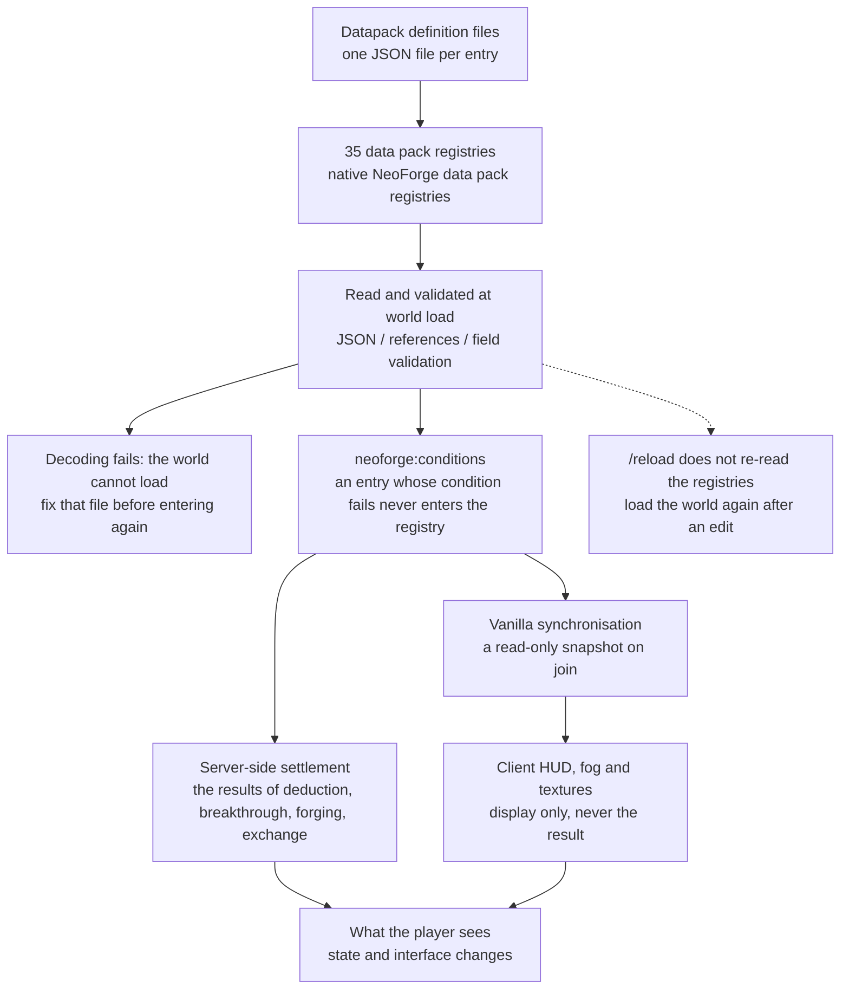

# Datapack Development Overview

## File Location

```text
data/<namespace>/mxt/<registry>/<path>.json
```

For example, the definition in `data/example/mxt/ability/fireball.json` has the ID `example:fireball`.

**Once there is a lot of content, sort the JSON into subdirectories by category.** With dozens or hundreds of files sitting flat in one registry directory, "which of these are the passives of the same school" can only be guessed from the filenames; once they are sorted, the path is the index:

```text
data/example/mxt/ability/sword/slash.json            → example:sword/slash
data/example/mxt/ability/sword/parry.json
data/example/mxt/ability/passive/body_tempering.json
data/example/mxt/artifact/sword/azure_flight_sword.json
data/example/mxt/artifact/charm/ward_jade_talisman.json
```

There is no hard rule for how to categorise: by purpose (`passive/`, `active/`), by school (`sword/`, `alchemy/`) or by the batch an update added are all fine. A few things to keep in mind:

- **The directories are part of the ID**: `data/example/mxt/ability/sword/slash.json` has the ID `example:sword/slash`, so **moving a file to another directory changes its ID**. Other definitions, tags and saved data (the ability grant ledger, cooldowns, the ids in wheel cells) all store that ID, so settle the categories before writing content.
- The default `name` / `description` keys carry that path too (`<category>.mxt.<namespace>.<path>`, with the `/` in the path kept as written), so folders do not introduce a second set of translation-key rules.
- Tags have a tree of their own (`tags/mxt/<registry>/...`) and do **not** have to mirror the definition directories level for level; keeping the same habit there only makes them easier to find. The values in a tag still have to be the **full ID including the directories**.
- The levels only affect readability and take **no part in loading or validation**: the first level under `data/<namespace>/mxt/` is always the registry name (`ability/`, `artifact/`, …), and categories can only go below it; cramming every file into one registry directory works just as well.

Data packs load through the native NeoForge writable registry, and the server syncs it to the client after loading. A definition decodes read-only: do not modify the collections you get out of one at runtime.

## Reference Rules

- A single entry is referenced by the entry's own id; a field that accepts either an entry or a tag also takes `#tag`.
- An optional reference may be omitted entirely, in which case the default in the field table applies. Most list and map references are tolerant: a bad entry is dropped with an `Ignoring invalid list element` warning and the rest still apply. **Cost arrays do not follow that rule**: one entry of an array such as `costs` that cannot be decoded fails the whole definition at load.
- Item matching uses `ItemMatcher`, which supports ids, tags, wildcards, regular expressions and mixed arrays; the three forms and seven entry types are on [`ItemMatcher`](/en/datapack/types/shared_data_types#itemmatcher).
- When several definitions match the same item, selection goes by the `priority` each one declares, **highest first** (the field defaults to `0`; ten tables accept it: `artifact`, the `item`/`weapon`/`pill`/`tool`/`blueprint`/`technique` bindings, `spirit_herb`, `item_aura` and `currency`). Only two definitions with the **same** `priority` fall back to registry order, so which one wins is written into the pack itself and has nothing to do with file names (the same direction as `priority` on `aura_zone` and `element_reaction`). **Which kind of matcher entry matched is irrelevant**: a definition that matches is ranked by the number it declares, and naming an item does not move it up.
- The vanilla tags are the only tag system; do not define a `tags` field inside JSON.

## Disabling a Definition

**Disabling a definition is load-time work**: the NeoForge resource condition goes into the definition file itself, and an entry whose condition does not hold **never enters the registry**, so no service ever reads it. Every data pack registry uses the same set of conditions:

```json
{
  "neoforge:conditions": [
    { "type": "neoforge:never" }
  ]
}
```

The available conditions all live in the `neoforge:` namespace: `never` / `always` (no fields), `mod_loaded` (`modid`), `registered` (`registry`, defaulting to `minecraft:item`, plus `value`), `and` / `or` (`values`), `not` (`value`) and `feature_flags_enabled` (`flags`). A condition can be written in the file of **any** registry entry, and every data pack registry treats them the same way. When the condition holds, `neoforge:conditions` is stripped before the file is handed to the definition decoder, so the normal fields are read as usual. **A tag-based condition such as `tag_empty` cannot be used here**: tags are not bound yet at that layer of decoding and it throws outright; tag checks belong to recipes and loot tables, which load later.

**A condition that does not hold is not a load error**: the loader treats the entry as skipped and leaves only a DEBUG line, `Skipping loading registry entry … as its conditions were not met`, and the world loads as usual. So when "the file is right there but the game does not have it", that DEBUG line is the only clue — the default log level does not show it.

The price is that "gone" means gone: an entry whose condition fails is **the same as a definition that was never written**, and a reference pointing at it fails to decode along with it, so there is no middle state where the definition stays around but does not take effect. For a file you can copy outright, see [Datapack Examples](/en/datapack/examples).

> Spirit roots and physiques have a separate **toggle** (the `disabled_spirit_roots` / `disabled_physiques` in the `spirit_identity` attachment): switching one off means "still held, but inert". Operate it with the scripts `MxtSpiritRoots.setEnabled` / `MxtPhysiques.setEnabled`, or with the administrator commands `/mxt spirit_root enable|disable` and `/mxt physique enable|disable`; the mod ships no player-facing screen for it. It governs whether the body should use that one entry, which is a different question from taking the definition out of the data pack. Quality order is declared by a `quality_chain` itself (the chain's `tiers` array) and does not depend on tag order.

### The Pass-Through Tag

The mod also ships one tag that sits on a **vanilla registry**, so its path looks different — `tags/damage_type`, not `tags/mxt/...`:

```text
data/mxt/tags/damage_type/no_bonus.json
```

A damage type listed in `mxt:no_bonus` takes no part in damage bonus settlement: no skill-stage or affinity multiplier, no physique multiplier, no `overcomes`/`adapted_to` relation read, and no element buildup either. The number is handed to vanilla as it arrived, and vanilla's own mitigation (armour, enchantments, resistance, absorption, invulnerability frames) still applies. By default it holds two: the void damage `minecraft:out_of_world`, and `mxt:lifespan`, which the mod uses for a lifespan running out; a content pack can append at the same path (`replace: false`) or replace it outright (`replace: true`). See [The damage system](/en/technical/damage).

## Numeric Fields

A number can be written as a constant, an expression string or a number provider object:

```json
{
  "damage": 8.0,
  "speed": "2 + level * 0.1",
  "amount": {"type": "mxt:constant", "value": 10}
}
```

Expressions use exp4j. Variables are read on demand by the built-in variable table out of the objects the evaluation context carries (caster, target, resources, random source), and `params` can override or add variables. A formula problem that can be decided at load time (an empty expression, a syntax error, an invalid `params` and so on) is a decode error: the loader collects every failing entry and lists them together before failing the load. A variable name the context cannot provide is only found at evaluation — a development environment prints the full ERROR log, production prints one WARN line per distinct message, and both carry on with `0`. For the full fields and value ranges, see [Number Provider Types](/en/datapack/types/number_provider_types).

## Actions and Conditions

Behaviours are uniformly called `action` and are split by target into entity, item, block, bi-entity and so on. When several steps are needed, use meta actions such as sequence/choice/if_else. A `condition` restricts abilities, bound items, cultivation, realms and recipes. An array of actions or conditions is a shorthand meaning "run all of them in order".

## Registry Index

| Category | Registries |
| --- | --- |
| Resources and cultivation | `resource`, `aura`, `element`, `element_reaction`, `realm_stage`, `spirit_root`, `physique`, `technique`, `skill_stage`, `cultivate_action` |
| Abilities and rules | `ability`, `curse`, `formation`, `tribulation`, `trigger`, `talisman` |
| Aura and world | `aura_zone`, `block_aura`, `item_aura`, `secret_realm` |
| Items and quality | `item_binding`, `weapon_binding`, `pill_binding`, `technique_binding`, `tool_binding`, `blueprint_binding`, `artifact`, `quality`, `quality_chain` |
| Economy and content | `currency`, `spirit_herb`, `forging_method`, `forging_blueprint`, `creature_profile`, `contract_type` |

## Module Pages

- [resource: Resources and Resource Bars](/en/datapack/json/resource)
- [Cultivation, Realms and Spirit Roots](/en/datapack/json/cultivate_action)
- [Aura Environment and Aura Items](/en/datapack/json/aura)
- [Ability, Cost and Condition](/en/datapack/json/ability)
- [Item Bindings, Quality and Economy](/en/datapack/json/item_binding)
- [Formations, Forging and Alchemy](/en/datapack/json/formation)
- [Other Registries](/en/datapack/json/index)
- [Datapack Examples](/en/datapack/examples)

## Loading and Overriding

The 35 data pack registries load through the native NeoForge data pack registry system; they are read and validated **while the world loads**, and a read-only snapshot is provided to the client on join through the vanilla synchronisation mechanism. From a file on disk to what the player sees is the path below.



- File conflicts follow Minecraft data pack priority: a higher priority data pack overrides the same path from a lower priority data pack.
- When a vanilla tag uses `replace: false`, values are appended in data pack merge order; apart from quality ordering tags, gameplay does not depend on tag value order.
- Data packs are read-only, and a definition has no generic `schema_version`, `enabled` or `tags` field; "should this one enter the registry right now" is answered at load time by `neoforge:conditions`.
- The display name of a data-driven definition generates its translation key automatically from the identifier: `<category>.<registry namespace>.<namespace>.<path>`. The category defaults to the registry's own path, and the **registry namespace is always `mxt` for MiXianTu's own registries** (their keys are all written `mxt:<path>`), so `mxt:fire` in `aura` reads `aura.mxt.mxt.fire`, `example:qi` in `resource` reads `resource.mxt.example.qi`, and `mxt_test:flame_sigil` in `talisman` reads `talisman.mxt.mxt_test.flame_sigil`. The category is the registry's own path with no exception table (`example:refined` in `mxt:quality` reads `quality.mxt.example.refined`). A `/` in the path goes into the key **as written** and is not turned into `.` (`example:foo/bar` produces `resource.mxt.example.foo/bar`), so sorting into subdirectories by category does not introduce a second set of translation-key rules. JSON has no `translation_key` field; supply the matching translation in `assets/<namespace>/lang/zh_cn.json` and `en_us.json`.
- The definitions of these 19 registries may also carry an optional `name` and `description` (written like any other component field: a bare string is a translation key, an object is a full component): `resource`, `aura`, `realm_stage`, `element`, `spirit_root`, `physique`, `ability`, `curse`, `technique`, `skill_stage`, `cultivate_action`, `artifact`, `formation`, `tribulation`, `secret_realm`, `contract_type`, `talisman`, `quality`, `quality_chain`. Writing one uses your own text; omitting one falls back to the generated key above — an omitted `description` is the generated key plus `.description`. The point of the pair is that a pack can **translate the generated key or write its own text** (and so avoid a name clash); **`description` is only stored and read, and nothing draws it in a screen or tooltip except `quality` (the line describing the quality)**. Every other registry has the generated key only.
- A `realm_stage` that declares its `minor_stages` as an integer names the sub-stages with the registry namespace too: `realm_stage.mxt.<namespace>.<path>.minor_stage.<index>` (the index starts at `0`).
- Each data pack registry's screen title has its own fixed key, `mxt.registry.<registry path>` (such as `mxt.registry.aura` and `mxt.registry.quality`), supplied by this mod's own language files; a data pack only has to provide the key above for its own definitions.
- When a required single entry reference does not exist, the whole data pack load fails; optional references and tolerant list references are handled by their own rules.
- These registries keep no old snapshot, so a definition that fails to decode stops the world from loading outright: fix that file before entering again.

One operational way to put the rule: **an old and a new definition of the same id never coexist**. The copy in the higher priority pack replaces the copy in the lower priority pack outright, without merging fields.

## Loading, Syncing and Debugging

- These registries are vanilla data pack registries and are **read while the world loads**: JSON parsing, entry resolution and field validation all happen during world load, and `neoforge:conditions` is decided at that point too, so an entry whose condition fails is not even decoded. `/reload` does not re-read them — it only refreshes vanilla reload listeners such as recipes, loot tables, advancements and functions, plus the KubeJS server scripts. After changing data tables you have to load the world again (in single player, leave to the title screen and enter again, or restart the server).
- The dynamic registries are sent by the vanilla synchronisation mechanism when the client joins; the client HUD, fog and textures only display, and never decide the result of deduction, breakthrough, forging or exchange.
- `/mxt aura query` queries the final aura at the current position; `/mxt aura vein` queries spirit stone vein information.
- `/mxt registries list` lists these dynamic registries and their entry counts; `/mxt registries validate` reports every problem the last build found, naming the file each one comes from (the reference chains of cultivation, abilities and techniques, and any trigger rule that forgot its action) — with no problems it reports the number of registries, the total entry count and that validation passed. Run it once after the world has loaded to confirm that the registry state the data pack produced is usable.
- `/mxt technique repair` cleans up **stale technique references** in player data (for when a referenced definition was deleted by the data pack or blocked by `neoforge:conditions`); `dry-run` only reports and changes nothing; `/mxt technique drop <id>` removes one technique precisely. See the next section.
- `/picker [<category id>]` opens the item picker to look straight at the items behind these definitions: a category is a registry ID (`/picker mxt:aura`, `/picker mxt:artifact`, `/picker mxt:currency`), and with none written it lists every registered category. It needs gamemaster permission and only works in creative mode; the top-level `/picker` alias is switched on by the server config "command alias → /picker", while `/mxt picker` is always available.
- The test mod data lives in `src/test-mod/resources/data/mxt_test/mxt`; start the test server to verify the whole data pack loop.

### Repairing Stale Technique References

A technique a player has learned lives in player data as a **reference**. After a data pack **deletes** a `technique`, or blocks it from the registry with `neoforge:conditions`, that saved reference points at a definition that no longer exists.

**This does not destroy data.** The technique list in player data decodes element by element, **skipping the entries that fail to decode and keeping the rest**, and logs one WARN line:

```
[WARN]: Ignoring invalid list element: Failed to get element <namespace>:<path>
```

In other words, **a stale reference only loses itself**: other techniques and other fields load normally. Seeing that WARN proves stale references do exist; **not seeing it means there are none**, so the problem is elsewhere and the repair command is not the way to "cure" it.

| Command | Effect |
| --- | --- |
| `/mxt technique repair dry-run` | Reports how many stale references there are and **changes no data at all** |
| `/mxt technique repair` | Cleans up stale references and duplicates, then rebuilds the attributes, abilities and levels they came with |
| `/mxt technique drop <id>` | Removes one technique by id, precisely (including one that is still valid) |

The cleanup also takes back the attributes, abilities and resource maxima that a stale technique used to grant — otherwise a player would keep the bonuses of a technique they no longer carry.

:::warning
The repair commands only handle **stale references** (pointing at a definition that no longer exists) and **duplicate entries**. A blank technique screen or a technique manual that does nothing is **not** this section's problem unless it comes with an `Ignoring invalid list element` warning, and needs to be tracked down elsewhere.
:::

:::warning
Definition decoding is the only loading contract. The defaults, field ranges and examples in this page follow the current source; a field a data pack writes that is not listed here does not come into effect by itself, and an unknown `type` fails the load.
:::
