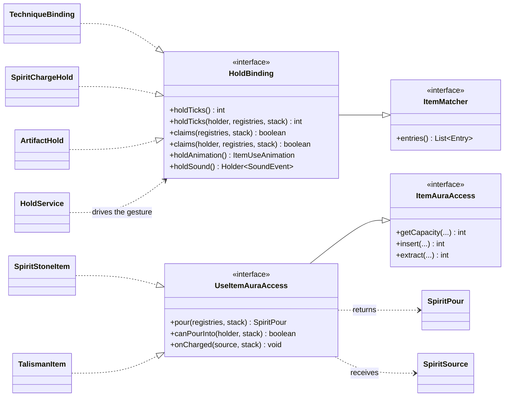

# Interfaces

These are the interfaces a Java addon implements or consumes directly. They are the seams between the framework and your content: aura exchange, item charge, tooltips, costs and the client wheel.

`AuraAccess`, `ItemAuraAccess`, `UseItemAuraAccess` and `WheelMenuEntry` live in **`com.iafenvoy.mxt.api`**: that package holds nothing but interfaces and a package note, and the implementations stay in their own modules. `TooltipAppender` is a NeoForge extension point, `Cost` lives in `data/cost`, and **`Toggable` stays in `data/ability` — it is not part of the public API** (it is the shape the mod itself registers "a skill that needs a key" with, implemented by the three ability types `mxt:active` / `mxt:flight_control` / `mxt:storage`; its predecessor `ToggableArtifactAbility` has been deleted).

## Overview

| Interface | Purpose |
|-----------|---------|
| `AuraAccess` | The aura access interface implemented by block entities such as display stands and containers. |
| `ItemAuraAccess` | The storage interface implemented by chargeable items. |
| `UseItemAuraAccess` | The interface that lets an item be poured into by holding it down; extends `ItemAuraAccess`. |
| `TooltipAppender` | The NeoForge tooltip extension point each item module registers its own appender through. |
| `Cost` | The abstraction for what an ability, a formation or another action consumes. |
| `WheelMenuEntry` | A pure client-side entry rendered by the shared wheel. |
| `Contractable` | The eligibility interface a creature implements to be contractable at all. |
| `ContractOperations` | What a bound creature does on its own: recall, follow, combat, and the orders it takes (follow / wander / stay / recall). |
| `CaptureListener` | Told when something captures or releases the creature; never a gate. |
## `AuraAccess`

The **aura access** interface implemented by block entities such as display stands and containers: it exchanges whole units of one aura at a time (`insert`/`extract` handle one aura per call and return the amount that could **not** be moved; `simulate=true` only simulates and changes no state), and the capacity comes from `getCapacity(entity)`.

The parameter is a `Holder<Aura>` rather than a `resource`: a `resource` is only a numeric system (bounds, an icon, the bars), and it does not know what its own number is for; the `aura` is the identity of *which aura* it is, and it references a `resource` as the unit it is measured in (`Aura.resource()` = "which number do I count in"). So every field, parameter and storage key that means "which aura" uses a `Holder<Aura>` — the access interfaces, item and block stores, the environmental aura pools and `item_aura.type` all do. Conversely, a pure counter has no aura identity and therefore **cannot** be stored in an item (it can enter a player's pool, because pools are keyed by value). For the semantic boundary see `research/audit/resource-cultivation-split.md` §7.3/§7.4.

| Member | Description |
|--------|-------------|
| `Object2IntMap<Holder<Aura>> getCapacity(@Nullable LivingEntity entity)` | Returns the data-driven capacity for each aura this target can accept. |
| `int getCapacity(@Nullable LivingEntity entity, Holder<Aura> aura)` | The capacity of one aura; a convenience default that reads the map above. |
| `int insert(@Nullable LivingEntity entity, Holder<Aura> aura, int amount, boolean simulate)` | Attempts to move one aura in; the return value is the part of `amount` that could not be moved. |
| `int extract(@Nullable LivingEntity entity, Holder<Aura> aura, int amount, boolean simulate)` | Attempts to move one aura out; the return value is the part of `amount` that could not be moved. |
| `static int requireNonNegative(int amount)` | Rejects a negative amount with an `IllegalArgumentException`. |

## `ItemAuraAccess`

The **storage** interface implemented by chargeable items, which answers only three things: which auras it can take (`getCapacity`), how much went in (`insert`) and how much came out (`extract`). Beyond the aura, the in/out operations and the simulate parameter, the capacity is computed dynamically from the item through `getCapacity(LivingEntity, ItemStack)`, so a capacity must never be hard-coded in Java. Which aura is stored and how much of it is recorded on the item itself by the `mxt:spirit_storage` component (a table of "aura → stored amount" with **fractional values**, keyed by `Holder<Aura>`, shared by spirit stones, talisman carriers and artifacts, while this interface itself exchanges **whole units**), which is why `SpiritStoneItem` treats its definition only as the source of the capacity and does not re-read an existing store as another aura when a datapack changes `item_aura.type`. A missing component reads as "full" for a spirit stone and as "empty" for a talisman, and that answer is **given by the item**, not by the component — the component is only data.

Storage is asked **from anywhere**: a display stand reading and writing a talisman, the hotbar reading an item and an `item_aura` definition describing an item all use this interface. So an item that only implements it is **stored into**, and is not "poured into by holding right-click" — that gesture is something an item separately opts into, see below.

| Member | Description |
|--------|-------------|
| `Object2IntMap<Holder<Aura>> getCapacity(@Nullable LivingEntity entity, ItemStack stack)` | Returns the current data-driven capacity of this stack, including every item in the stack. |
| `int getCapacity(@Nullable LivingEntity entity, ItemStack stack, Holder<Aura> aura)` | The capacity of one aura in this stack; a convenience default that reads the map above. |
| `int insert(@Nullable LivingEntity entity, ItemStack stack, Holder<Aura> aura, int amount, boolean simulate)` | Attempts to add one aura to this stack; the return value is the part of `amount` that could not be moved. |
| `int extract(@Nullable LivingEntity entity, ItemStack stack, Holder<Aura> aura, int amount, boolean simulate)` | Attempts to extract one aura from this stack; the return value is the part of `amount` that could not be moved. |

## `UseItemAuraAccess`

The interface that lets an item be **poured into by holding right-click**, and it extends `ItemAuraAccess`: `HoldBinding`/`HoldService` own the gesture and the pose, and `SpiritChargeService` takes aura out of the holder's own pool every tick and writes it through `insert`. Implementing it **does not** mean describing your own shape — the spirit stone implements it and leaves `pour` empty, so it falls back to the shared reading of the `item_aura` definition. What it expresses is "this item can be held down and poured into", not "this item is special". A store that does not implement it (a generic item that only holds things, for instance) is never armed into the gesture. `HoldBinding` also offers a pair of **entity-aware** default overloads (`claims(LivingEntity, Provider, ItemStack)` and `holdTicks(LivingEntity, Provider, ItemStack)`) — a declaration that does not care who is holding the item never implements them; the [artifact](/en/datapack/json/artifact) is what uses them to leave a click alone when somebody else owns it.

It is split into two interfaces because "storage" and "being poured into" are not the same thing: storage can be asked anywhere, while being poured into happens only when somebody performs the gesture on the stack in their own hand. The three default methods correspond to the three moments of the gesture:

- **`pour(Provider registries, ItemStack stack)`** (before the gesture starts, and every tick after) — what this container **is**: a `SpiritPour` split by aura (how much of each aura is stored, and its limit, **in the order a pour should fill them**), with the numbers given for the whole stack and no longer multiplied by the stack. The default returns empty, meaning "I have nothing of my own to say", which falls back to the shared reading of the `item_aura` definition (the route the spirit stone takes). Only an item whose capacity depends on **what is written on this stack** (a talisman carrier) overrides it. Both sides ask it (the client sizes the gesture by it), so an implementation may only read the `Provider` it is handed and must answer the same for the same stack. Rates and costs are **not** here — they belong to the gesture (the definition route uses the two speeds in opposite directions, a self-describing store uses 1 unit/tick at 1:1).
- **`canPourInto(@Nullable LivingEntity holder, ItemStack stack)`** (every tick, **before the aura is paid**) — whether this tick is worth pouring. The gesture's order is "take the aura, then `insert`, then `onCharged`", so any case where "inserting it would be pointless" would waste aura for nothing; this method lets the item refuse before the payment. The default is `true` (a container that only takes has nothing to object to), and only items that **fire themselves when they are filled** override it — a talisman overrides it as `TalismanService.canFireFrom`, that is, "is this holder's cooldown window still open". Note that this is **not** the "should it fire automatically" question: that is decided by the carrier's own mode (the `mode` of the `mxt:talisman` component, where `fire` fires as soon as it is full and `store` only accumulates), which is a different thing from the pouring gate.
- **`onCharged(SpiritSource source, ItemStack stack)`** (after one **real** move) — "I was filled", and the item itself decides whether that means full and whether to act. The default does nothing.

**The writer is responsible for reporting**: whoever writes aura into a store (a held pour, an `AuraAccess` block entity, and so on) calls `onCharged(SpiritSource, ItemStack)` **after the real write** (`simulate` does not count), and the item decides for itself "is this full" and what follows from it (a talisman fires here and consumes one carrier item). It is the writer that reports rather than the item judging inside its own `add` because only the writer knows **where this thing is and who paid**: a talisman on a display stand was filled by somebody standing elsewhere (or by a spirit burst). `SpiritSource(level, position, actor, consumedByHand)` carries the position and the actor together — the actor pays, is recorded and answers for abilities; the position is the place of this activation, entering formulas as `block_x`/`block_y`/`block_z` and handed to position-type behaviours as the **origin** (see [The Reverse Direction: Pouring](../datapack/json/item_aura.md#the-reverse-direction-pouring)). And precisely because reporting is opt-in: a writer that meets an item implementing storage only has nothing to report in the first place.

The family fits together like this: storage is "can I be stored into", while being poured into and being held down are gestures an item opts into on top of it, and an implementation only picks the layer it needs:

## `TooltipAppender`

The item modules register their tooltips with the NeoForge `TooltipAppender`. Each module uses its own appender, so the resource, currency, quality and aura storage displays stay uncoupled from one another.

## `Cost`

The abstraction for what an ability, a formation or another action consumes. It provides player-facing check and consume methods, and a new cost type must be dispatched through the built-in registry rather than by writing a Java class name into JSON.

| Member | Description |
|--------|-------------|
| `boolean check(Player player)` | Returns whether the player can pay this cost. |
| `void consume(Player player)` | Consumes the cost from the player. |
| `MapCodec<? extends Cost> codec()` | The codec of the concrete cost type. |
| `Codec<Cost> TYPED_CODEC` | The type-dispatched codec read from the `type` field. |
| `Codec<Cost> CODEC` | The codec used by data files; it also accepts the legacy resource shorthand `{ "id": ..., "amount": ... }` next to a typed cost. |
| `Codec<List<Cost>> LIST_CODEC` | A list of costs, used by the fields that accept several costs at once. |

Register a new cost type through `MxtRegistries.COST_TYPE`, as shown in [Registries and Data Tables](./registries.md).

## `WheelMenuEntry`

The pure client-side wheel entry interface.

| Member | Description |
|--------|-------------|
| `WheelEntryKind kind()` | `ABILITY` or `AURA`: the tooltip's first line, the editor pool it appears in, and which side of the server dispatch triggers it. |
| `Identifier id()` | The definition's id. |
| `Component title()` | The name drawn in the middle of the wheel. |
| `Optional<IconReference> icon()` | An optional icon, either an item or a texture, drawn inside the sector. |
| `int accentColor()` | The strip along the bottom of the cell in the editor. |
| `List<Component> tooltip(Player player)` | Kind, name and the numbers the definition carries, rebuilt on demand. |
| `long cooldownTicks(Player player)` | The ticks of cooldown left, `0` meaning ready - read from the tick the cooldown ends on, which is what the synced attachment stores. |
| `boolean usable(Player player)` | Whether using the entry would do anything; it dims the sector and notes "On cooldown 4.3s" in the middle, but never stops the trigger being sent. |
| `void onSelected(WheelSelection selection)` | Called once the entry is used, with the wheel still open; the `WheelSelection` carries the cell's number and the source it was read from. |

Where an entry sits is not its business: `WheelMenuProvider` (implemented by `WheelContent`) answers what one source contributes - it takes the player and a `WheelSource` (main wheel / main hand / off hand / artifacts / contract beast), and its answer **may be longer than one page**, which `WheelMenuContent` turns into pages of twelve cells. Artifact abilities are abilities, so a **skill that needs a key** (`Toggable` - a switch or a one-shot such as flight and storage) goes on the wheel like any other ability, under its own **registry holder** (`Holder<Ability>`, with no reference layer in between), whose id is that ability's own registry id, so one artifact may give several. The two hotbar entry interfaces were deleted with the hotbars - see [Wheel Entries](./wheel.md) for a complete implementation example.

## `Contractable` / `ContractOperations` / `CaptureListener`

Three **creature-side** interfaces, implemented by a content mod's own entity class. The framework looks them up in exactly one place, `runtime/creature/Contracts`, which the contract scroll, the Beast Taming Bell, the Spirit Beast Bag, the command and both event bridges all go through.

**Whether a creature can be contracted is a code fact**: the target must implement `Contractable`, and no data pack can grant that eligibility, so vanilla creatures can never be contracted. It is also a vanilla `OwnableEntity`, so **who owns it is answered by the vanilla owner logic** (`getOwner()` resolves the `EntityReference` through the level, and `getRootOwner()` comes for free). Its own members are `setContractOwner(owner)` (called by the framework when a contract is signed, and the creature writes the owner **wherever its own class keeps owners**), `acceptsContract(context)` (whether it signs a given contract type; by default it reads **that contract type's own entity type tag**, `#<namespace>:contract/<path>`, where a tag that is absent or written empty places no restriction - see [contract_type](/en/datapack/json/contract_type)), `onContractBound` (called once the owner is written) and the two separate endings `onContractReleased` / `onContractDeath`.

**There is no second copy of the owner**: the framework stores none, and the `mxt:contract` attachment has no such field - `getOwnerReference()` and `setContractOwner` are the creature's own implementation. A tamed animal uses the pair `TamableAnimal` already has; anything else keeps an `EntityReference<LivingEntity>` of its own (and saves and syncs it alongside its other data). The framework has exactly one reading point, `Contracts.ownerOf` / `Contracts.owner`, and it always asks the creature. **Releasing a contract clears the contract record only**: whether the owner is forgotten as well is the creature's own call inside `onContractReleased`, because ending a contract and forgetting who tamed you are not the same act.

`ContractOperations` is "what this spirit beast does on its own once bound": `recall` (the owner rang the bell, and landing the latch is handed to the creature), `follow` (every tick, with the owner online and in the same level) and `onDealtDamage` (after damage this creature dealt is resolved). **Every default is the code the framework used to hardcode** - teleport to the owner; past 32 blocks teleport, past 4 blocks pathfind - so a creature that implements the interface and overrides nothing behaves exactly as before. **Not implementing it means not wanting that behaviour**: the creature can still be bound, but the framework will not follow, recall or report combat for it, and `follow_action` and `combat_action` therefore never run.

**Orders are the third group of methods, added on 2026-09-25**, shaped the same way as the rest of "who does it": `behaviors()` answers **which orders this beast takes** (the framework's four by default - follow, wander, stay, recall; both sides have to answer it, because the bell reads it to fill the wheel page), `onBehaviorSelected(context, behavior)` is the **input end** (the owner gave an order; returning `false` refuses it and leaves the order in force alone) and `tick(context, behavior)` is the per-tick drive (the default dispatches to `follow` / `wander` / `stay` and ignores anything else). The two new defaults are `wander` (past 32 blocks it is brought over first, so a strolling beast is never left behind for good; otherwise, once every couple of seconds and only when it has nothing to walk to, it picks a new spot 3-8 blocks around its owner - **the framework adds no goal**, so a creature's own stroll keeps working) and `stay` (stop the path and drop the quarry: stopping rather than freezing).

**An order is a class, not an enum**: `ContractBehavior` (`id` + `momentary` + `name()`, with `equals` reading the id) plus `ContractBehaviors` as the holder, so a content mod adds one with `new` and `register(...)` - "hold fire", "go home" - **without touching the framework's list**. `momentary` separates the orders that stay in force from the ones that happen once (a recall's latch and cooldown belong to the framework, so it goes through `ContractService.requestRecall` and writes no state). The order in force has **exactly one copy**, on the `mxt:contract` attachment (an id; an old save, or an id that no longer resolves, reads as follow). The single input entry point is `runtime/creature/ContractBehaviorService`: bound -> owner -> the interface is implemented -> **the order is on that creature's `behaviors()` list** -> `onBehaviorSelected` -> written (a lasting order) or run once (a momentary one).

**The bell is only a pointer**: right-clicking a creature writes "beast UUID + display name + the orders it answered with" into the item component `mxt:contract_bell`, and right-clicking with nothing in front opens the wheel on the "contract beast" page. That page reads the snapshot on the bell, so **no creature has to be resolved on the client** - and before an order takes effect the server re-reads the bell, the creature's record, the owner and the order itself.

`CaptureListener` is the **notice** that a creature was captured or released (its predecessor `Capturable` and its gate are gone): capturing is **not an eligibility** - any creature may be captured, and **how a capture works is decided by the item doing it** (what it may hold, whether it needs a contract, what it costs - the Spirit Beast Bag's own rule is "your own contracted beast, one at a time"). So there are only two optional hooks, `onCaptured(captor)` (after it is taken, before the entity leaves the world) and `onReleased(captor)` (after it is back in a level), both doing nothing by default. **A creature that does not implement it can still be captured** - it simply hears nothing; `captor` is empty when no player did it.

The contract **record** is not part of these interfaces: there is exactly one, on the creature's `mxt:contract` attachment (contract type, signing time, recall latch, current order), read by every other module. Fields, price, per-owner limit and recall cooldown are in [contract_type](/en/datapack/json/contract_type), and the player-facing entry point is the [command](/en/player-guide/commands/contract).

