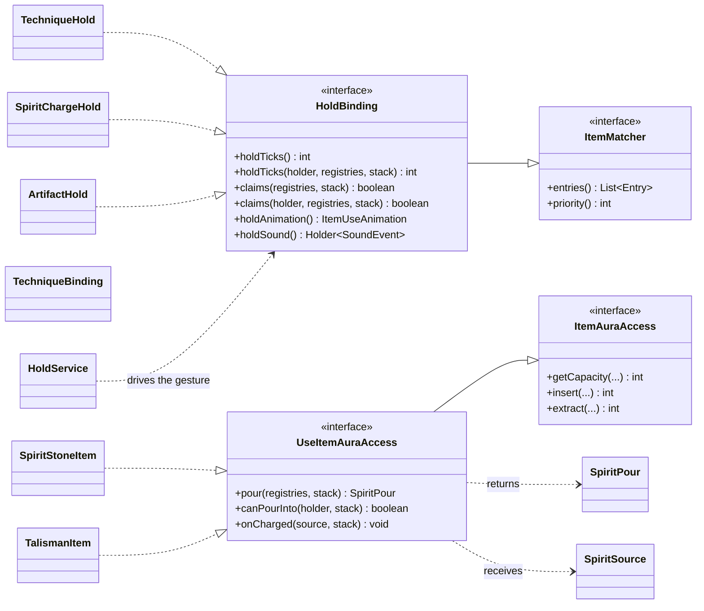

# UseItemAuraAccess

The interface that lets an item be **poured into by holding right-click**, and it extends [ItemAuraAccess](./item-aura-access.md): `HoldBinding` / `HoldService` own the gesture and the pose, and `SpiritChargeService` takes aura out of the holder's own pool every tick and writes it through `insert`. Implementing it **does not** mean describing your own shape - the spirit stone implements it and leaves `pour` empty, so it falls back to the shared reading of the `item_aura` definition. What it expresses is "this item can be held down and poured into", not "this item is special". A store that does not implement it (a generic item that only holds things) is never armed into the gesture.

It is split from storage because "storage" and "being poured into" are not the same thing: storage can be asked anywhere, while being poured into happens only when somebody performs the gesture on the stack in their own hand. The three default methods are the three moments of that gesture:

- **`pour(Provider registries, ItemStack stack)`** (before the gesture starts, and every tick after) - what this container **is**: a `SpiritPour` split by aura (how much of each is stored, and its limit, **in the order a pour should fill them**), with the numbers given for the whole stack and no longer multiplied by it. The default returns empty, meaning "I have nothing of my own to say", which falls back to the shared reading of the `item_aura` definition (the route the spirit stone takes). Only an item whose capacity depends on **what is written on this stack** (a talisman carrier) overrides it. Both sides ask it (the client sizes the gesture by it), so an implementation may only read the `Provider` it is handed and must answer the same for the same stack. Rates and costs are **not** here - they belong to the gesture (the definition route uses the two speeds in opposite directions, a self-describing store uses 1 unit/tick at 1:1).
- **`canPourInto(@Nullable LivingEntity holder, ItemStack stack)`** (every tick, **before the aura is paid**) - whether this tick is worth pouring. The gesture's order is "take the aura, then `insert`, then `onCharged`", so any case where inserting would be pointless would waste aura for nothing; this method lets the item refuse before the payment. The default is `true` (a container that only takes has nothing to object to), and only items that **fire themselves when they are filled** override it - a talisman overrides it as `TalismanService.canFireFrom`, that is, "is this holder's cooldown window still open". This is **not** the "should it fire automatically" question: that is decided by the carrier's own mode (the `mode` of the `mxt:talisman` component, where `fire` fires as soon as it is full and `store` only accumulates), which is a different thing from the pouring gate.
- **`onCharged(SpiritSource source, ItemStack stack)`** (after one **real** move) - "I was filled", and the item itself decides whether that means full and whether to act. The default does nothing.

**The writer is responsible for reporting**: whoever writes aura into a store (a held pour, an `AuraAccess` block entity, and so on) calls `onCharged(SpiritSource, ItemStack)` **after the real write** (`simulate` does not count), and the item decides for itself "is this full" and what follows (a talisman fires here and spends either one carrier item or the wear its inscription declares). It is the writer that reports rather than the item judging inside its own `add` because only the writer knows **where this thing is and who paid**: a talisman on a display stand was filled by somebody standing elsewhere (or by a spirit burst). `SpiritSource(level, position, actor, consumedByHand)` carries the position and the actor together - the actor pays, is recorded and answers for abilities; the position is the place of this activation, entering formulas as `block_x` / `block_y` / `block_z` and handed to position-type behaviours as the **origin**; `consumedByHand` says whether this was a spend from a hand (a store sitting on a display stand or in a machine answers `false`). And precisely because reporting is opt-in: a writer that meets an item implementing storage only has nothing to report in the first place.

`HoldBinding` also offers a pair of **entity-aware** default overloads (`claims(LivingEntity, Provider, ItemStack)` and `holdTicks(LivingEntity, Provider, ItemStack)`) - a declaration that does not care who is holding the item never implements them; the [artifact](/en/datapack/json/artifact) is what uses them to leave a click alone when somebody else owns it.

The family fits together like this: storage is "can I be stored into", while being poured into and being held down are gestures an item opts into on top of it, and an implementation only picks the layer it needs.

