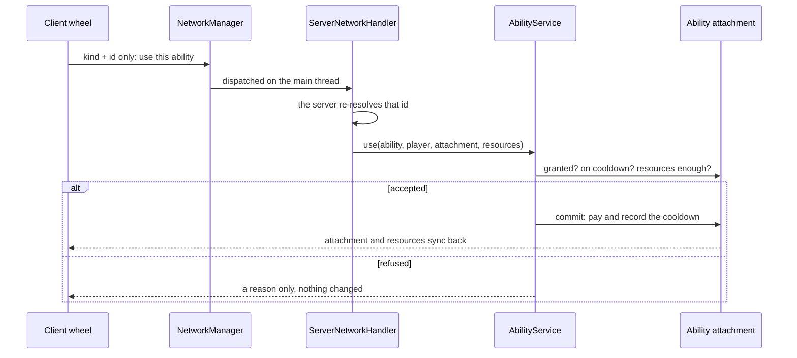

# Network Protocol and Server Authority

The client sends intentions only; the server re-resolves the IDs, re-checks the attachments and the conditions, and then settles. The main C2S payloads are:

| Payload | Purpose |
|---------|---------|
| `WheelActionC2SPayload` | One wheel entry was picked: `(source, kind, id)` - which source, which kind, which id (resolved by the client from the cell it stood on at that moment). Abilities and spirit power **share this one channel**; the server first re-reads that source (the saved layout for the main wheel, the current grants for a derived one), drops the whole request when the source does not hold the entry, and only then dispatches on `kind` (`AbilityService.use` for an ability, `SpiritBurstService.fireOnce` for an aura). **The cell number never travels here** - it is only stored. |
| `BackSlotSwapC2SPayload` | Swapping the main hand and the back slot. |
| `ForgingActionC2SPayload` | Forging start, strike, finish and cancel. |
| `ChequeActionC2SPayload` | Depositing into and withdrawing from a cheque table. |
| `StationTradeC2SPayload` | Settling a trade station. |
| `PlayerTradeActionC2SPayload` | Changing the requesting side's own state in an open one-to-one trade. |
| `CultivationToggleC2SPayload` | Requesting a toggle of the cultivation mode. |
| `FlightToggleC2SPayload` | Requesting a toggle of one flight state; the server still validates that the requested id (the payload's own field is still called `archetype`) is an `mxt:artifact` entry. |
| `WheelLayoutC2SPayload` | Sending the **complete twelve-cell main-wheel layout** back to the server when the wheel editor closes; the server validates every id before storing it on the player. The pages behind it have no packet, because they are not stored. |
| `WheelSelectionC2SPayload` | The chosen cell changed (`Optional<Integer>`, the **cell number**, empty meaning nothing is chosen); cells are numbered straight through the wheel and pages come and go with the gear, so what is stored is a place. The server only range-checks it - it resolves nothing and warns about nothing, since "this place holds nothing right now" is a legitimate state (the client falls back to the last cell holding anything). |
| `OwnerNameC2SPayload` | Asking what an owner UUID is called (the id alone). The server answers from its online player list and its persisted name cache, and **never asks the session service** — that is a web request, and the handler runs on the main thread. |

Take `WheelActionC2SPayload` as the example: one round trip looks like this — the client reports which kind and which id, and the server resolves it into a definition itself and decides whether it may be used:

The server synchronises the dynamic registries, the resource/aura state it needs (`AuraStateS2CPayload`) and the attachments to the client, and pushes `ItemPickerS2CPayload` (opening the item picker, carrying only the title and the category ids, never items) and `OwnerNameS2CPayload` (answering the request above: the name when the server knows it, nothing when it has never seen that player — the client remembers that answer too, so a session asks once and the tooltip can read the name on the next frame) when it needs to. Never treat a value that came from the client as a trusted result; a payload should carry IDs, choices and action intentions only. **The wheel editor itself is not on this path**: it is opened by the client command `/wheel` (or the `key.mxt.wheel_configuration` key, unbound by default), and the server neither takes part nor has a payload for opening it - what the editor saves travels on the two rows above, which have nothing to do with opening it.

**An S2C payload's type is registered on both sides, but its handler only on the client.** The server is the side that encodes it, so it has to know the codec; it never handles one, and a handler such as `ClientNetworkHandler` touches client-only classes like `Screen`. A dedicated server's class loader refuses to load those at all, so merely constructing the handler while registering is enough to make the server crash during mod loading with `NoClassDefFoundError: net/minecraft/client/gui/screens/Screen`. `NetworkManager` therefore branches on `FMLEnvironment.getDist()`: the client registers with the `playToClient` overload that takes a handler, and the server uses the one that does not, registering the type alone.

**The one exception is the item picker.** It borrows the vanilla `ServerboundSetCreativeModeSlotPacket`, so the item contents really do come from the client and travel through no mod payload at all. That channel is guarded by the server's own capability switch: the packet is stopped at the **decode layer** by `GameProtocols.HAS_INFINITE_MATERIALS` (if the server does not consider the player to be in creative mode, the whole packet is dropped without a disconnect), and `handleSetCreativeModeSlot` checks `hasInfiniteMaterials()` a second time and validates the item's features and its stack limit. Do **not** imitate it when adding a mod payload — anything that cannot get the same gate must go through "the client reports IDs only, the server resolves them itself". See [Client Screens](./screens.md) for the full analysis.
