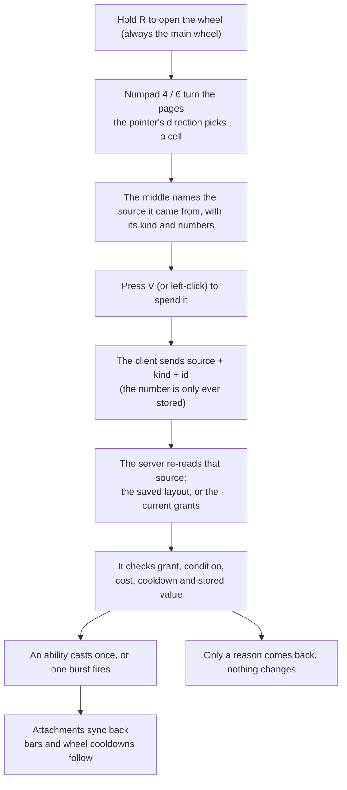

# Wheel, Resource Bars and Aura HUD

Abilities and spirit power share one **twelve-sector wheel**: hold the wheel key (`R` by default), the **direction** the pointer is in picks the sector, that sector turns gold and grows a little, and **its name is written in the middle of the wheel**. **Choosing and using are two keys**: `R` only chooses, and the use key (`V` by default) casts or fires - while the wheel is up it spends the sector the pointer is on (the wheel stays open, so several sectors can be spent in one hold), and while the wheel is down it spends the one selected last; a left click is the same as `V`. This replaced the two hotbars the ability and spirit power entries used to have.

## Keybinds

| Keybind ID | Default | Name in the language file | Action |
|---|---|---|---|
| `key.mxt.cultivate` | `C` | Toggle Cultivation Mode | Starts or stops cultivating. |
| `key.mxt.information_panel` | `Z` | Open Character Information | Opens the character information panel when no other screen is open. |
| `key.mxt.technique_panel` | unbound | Open Technique Panel | Opens the technique panel when no other screen is open. It is also reachable from a button in the character information panel, which is why it ships without a default key. |
| `key.mxt.swap_back` | unbound | Swap Main Hand with Back Weapon Slot | Swaps the main hand stack with the first `back_weapon` Curios slot. |
| `key.mxt.hud_layout` | right `Shift` | Edit HUD Layout | Opens the drag editor for movable HUD elements when no other screen is open. |
| `key.mxt.wheel` | `R` | Wheel Menu | Holds up the twelve-sector wheel; the sector the pointer points at is the one you **select**. Letting go (or pressing it again in toggle mode) only closes the wheel - it triggers nothing. **Opening always returns to the main wheel (the first page).** |
| `key.mxt.wheel_use` | `V` | Use Wheel Selection | **Spends** the current selection: the cell the pointer is on while the wheel is up (the wheel stays open), or, while it is down, **the cell the number you chose stands for right now** (a number past the pages that exist falls back to the last cell holding anything). The same as a left click. |
| `key.mxt.wheel_previous` / `key.mxt.wheel_next` | numpad `4` / `6` | Wheel: Previous / Next Page | Turns the wheel's pages, wrapping at both ends; works with the wheel up or down, and every turn names the page it landed on in the action bar. |
| `key.mxt.wheel_configuration` | unbound | Open Wheel Configuration | Opens the wheel editor when no other screen is open (the same as the `/wheel` client command); it is not a combat action, which is why it ships without a default key. It edits the main wheel only. |
| `key.mxt.wheel_slot.1` … `.12` | all unbound | Wheel Slots 1-12 (their own "MiXianTu: Wheel Slots" category) | One key per cell; `Slot 1` is the one straight up, counting clockwise (the list stays in numeric order). Pressing one **selects that cell of the current page and spends it right away**, exactly like pointing at it and pressing `V`; the cell also becomes the current selection (the wheel grid on the left turns gold and the number is remembered across sessions), so `V` afterwards spends the same one again. A cell with nothing in it does nothing at all. |

Every keybind lives in the `MiXianTu` category (`key.category.mxt.general`) - except the twelve "Wheel Slots" keys, which have a **category of their own**, "MiXianTu: Wheel Slots" (`key.category.mxt.wheel_slot`); all of them can be changed in the vanilla controls settings. The unbound-by-default keys are "Open Technique Panel", "Swap Main Hand with Back Weapon Slot", "Open Wheel Configuration" and **all twelve wheel-slot keys**. The old "Show Ability Hotbar" (`LAlt`) and "Fire Spirit Power" (`V`) keys were deleted along with those hotbars - `V` is now the new "Use Wheel Selection", which spends whatever the wheel has selected rather than firing spirit power directly. See [Curios Slots](./curios-slots.md) for the slot rules the swap keybind follows.

## HUD Layout Editor

The keybind above (right `Shift` by default) opens a screen of its own: every movable HUD element the framework knows about is drawn with a translucent rectangle and its name. **Drag with the left button**, or **nudge with the arrow keys** one pixel at a time (`Shift` moves ten), and `Escape` drops the element currently in hand; the Done button in the bottom right closes the screen. A position is written to the client config as it moves, so leaving halfway through loses nothing.

**What can be dragged today is the two columns of resource bars, plus the wheel's grid** - the stacks either side of the centre of the screen, each column moving as one piece, and the twelve wheel cells, which start against the left edge of the window halfway down. Which column a resource appears in is declared by the data pack (`anchor` in `resource.bars`), but **where the columns sit is the player's own setting**: pull them apart to clear another mod's HUD, or move the right column towards the middle to watch a target's resources. The target and boss overlays are pinned to the entity under the crosshair and do not move, and the editor deliberately does not blur its background - the elements being placed would be blurred with it.

Positions are stored as a **ratio of the window** (Client Settings → HUD Layout → Element Positions, in `config/mxt/mxt-hud.json`, keyed `resource_bars.left` / `resource_bars.right` / `wheel.selection`), so a layout survives a change of resolution or GUI scale. An element is always kept inside the window: shrinking the window pins it to the edge without rewriting what is stored, and growing it back returns the element to where it was. The mod's config files all live under `config/mxt/`: `mxt-client.json`, `mxt-server.json` and `mxt-hud.json`.

A column that has never been dragged keeps its default place: the **midpoint of its bottom edge is the anchor**, the left column's anchor sits left of the centre of the screen and the right one's to the right of it (`20` pixels plus half a column away from the centre), and the anchor's height is 47 pixels up from the bottom - which is exactly where those two columns used to be. As bars come and go the column grows upward and its bottom edge stays put, and the default follows the window. **In a save with no resource bars both columns still draw as empty boxes**, so you can place them first and have them ready when there is something to show.

::: info

The layout editor belongs to the framework the mod draws its own HUD elements with; the two resource-bar columns and the wheel's grid are what is wired into it so far. If you cannot find something, type `/hud` in chat: it lists every movable element with its layout key, position, size and whether it currently has anything to draw, and `/hud <layout key> reset` puts one back in its default place, **deleting the saved value** so it is still there after a restart. See the [client screens page](../java/screens.md) for how a module plugs an element in.

:::

## Wheel Menu

The wheel is the **only** way an ability or a spirit power is triggered, and it is a **main wheel plus pages read from what you carry**, all strung together by one continuous cell numbering:

- **The main wheel** is the twelve cells you arrange yourself (numbers `0..11`); **opening with `R` always returns to it**.
- **The pages behind it** are ones you neither arrange nor need to: **main hand**, **off hand**, **artifacts**. Their contents are the active abilities those three places grant you **right now**, numbered from `12` on. Swap the sword in your hand or take an artifact off and those pages are gone on the spot; equip one and its abilities are back.
- **A page holds twelve cells.** When one place grants more than that, **another page is opened** (fifteen abilities is two pages: three cells on the second and nine empty ones) - nothing is dropped.
- Turn the pages with numpad **left `4` / right `6`** (`key.mxt.wheel_previous` / `key.mxt.wheel_next`, rebindable); it **wraps around**, and every turn names the page on the action bar ("Wheel 2/3: Main hand"). **Turning works with the wheel up or down**: with it down, it moves the twelve slot keys to that page; with it up, it just turns the page. With another screen open it does nothing.
- Because pages come and go with your gear, **the numbers behind them shift** - the same number can point at another ability once you swap items. That is deliberate: **a number is a place ("which cell"), not an identity**, and it is never rewritten because your gear changed.
- **Spending an ability casts it once** (only `mxt:active` abilities appear on the wheel); **spending a spirit power fires one burst**. Costs, cooldowns, cast times, conditions and effects are **all decided by the server** - the client only reports which entry of which source was spent, and the server checks that the source really holds it.
- **A cell on cooldown is drawn dark**, and the middle of the wheel says "On cooldown 4.3s" - the seconds left, always with one decimal. Whether a trigger is honoured is still the server's decision; the screen never makes it for the server.
- **What a cell draws**: the entry's icon; **an entry with no icon draws the start of its name instead** (the whole name is always in the middle of the wheel), so a wheel full of icon-less entries has no blank cells. A name never runs into the cell next to it.
- **Two keys, two jobs**: `R` only selects (**letting go triggers nothing**) and `V` does the using. While the wheel is up, `V` spends the pointed cell and leaves the wheel standing, so you can move on and press it again; while the wheel is down, `V` spends **the cell the number you chose stands for right now**. A left click is the same as `V`.
- **Putting an item away does not lose your choice**: when the number addresses a cell that no longer exists (its page is gone, or that page holds fewer skills than it did), `V` falls back to **the last cell that holds anything** - and **the number itself is not changed**, so picking the sword back up finds the same skill again. **This only covers cells that do not exist**: pointing at an empty cell of the main wheel and pressing `V` still does nothing (that cell is there, it is just empty), while the empty part of a page read from your gear has no cells at all - aiming there leaves what you had chosen alone.
- **A line above the ring names the page** ("Wheel 2/3: Main hand", with the two switch keys named at the end, using whatever keys you bound): the ring looks the same whichever page it shows, so that line is how you know where you are.
- **The "Wheel Grid" sits against the left edge of the screen, halfway down**: **always four columns, as many rows as its cells need**, growing downward - it is a view of **the whole wheel**, main wheel and the pages behind it together, and **only the main wheel draws empty cells** (those twelve frames are the layout you arranged) while a page read from your gear draws only the skills it really has (three skills are three cells, with no run of empty frames after them). Each cell holds an icon or the start of the name, a strip along the bottom saying which kind, and darkens while it is on cooldown; **the cell the chosen number stands for right now is outlined in gold** (an armed but empty cell is not: nothing would happen) and an empty cell is just an empty frame, so you can see what `V` would spend and what the rest of the wheel holds at a glance. It writes nothing above itself: it is a block to read, and the ring is what says which page is up. Like every other HUD element it can be dragged or hidden in the HUD layout editor (right `Shift` by default), and it grows on its own as pages appear; if you placed the old single cell in an earlier version, `/hud wheel.selection reset` or the editor's reset puts it back at the new default.
- **The number you chose is remembered**: the next time you log in it comes back as it was, with the gold frame on whatever cell it stands for then. A number whose cell holds nothing at that moment neither errors nor clears the number.
- "Open With" makes the wheel press-to-toggle, in which case the second press of `R` only closes it and still triggers nothing.
- Typing a `v` in chat does **not** trigger anything - `V` only works while no other screen is open, or with the wheel itself open.
- **A key that could do nothing answers on the action bar**: `R` with **the whole wheel empty** says "Nothing is on the wheel yet", and `V` before anything has been selected reminds you to hold the wheel key and point at a cell (naming the key you actually bound). **`V` on a cell with nothing in it** says nothing at all - that cell is already an empty frame in the "Wheel Grid" and the wheel does not close. **A refusal from the server does say why**: when the ability pipeline will not cast it (roots do not match its element, not enough of a resource, still on cooldown, conditions unmet, ...) the action bar says "Cast failed: reason" and names the resource that ran short; an entry that source no longer holds says "That entry is no longer on the wheel"; a burst that does not go off says "The burst did not go off". With another screen open (chat, inventory, ...) the keys say nothing: you are typing or looking through your bag, not asking the wheel for something.
- While the wheel is open you also **stop walking** (vanilla releases the movement keys for any screen); once you let go you keep moving without pressing anything again.
- Number keys `1`–`9` are no longer intercepted by the mod: the vanilla hotbar works as it always did.

**What sits on the wheel is the player's own choice.** Type `/wheel` in chat, or press "Open Wheel Configuration" (`key.mxt.wheel_configuration`, unbound by default), to open the **wheel editor** - both are pure client actions and send nothing to the server:

- The top row is two pools of entries: **six columns of spirit power on the left, six columns of abilities on the right**, each scrolling on its own. Hovering a cell shows its tooltip - kind, name, and costs / cooldown / cast time / element, or per-burst amount / stored value / element.
- The bottom row is **twelve shared cells**, which are the **main wheel's** twelve cells (**`1` is straight up, counting clockwise**). Left-click an entry in a pool to pick it up, then click a cell to put it there; click a cell with nothing picked to clear it. A filled cell has a coloured strip along its bottom edge saying which kind it holds (spirit power blue, ability gold). Cells work alike: an icon if there is one, otherwise the start of the name, and **whatever does not fit is in the hover tooltip**.
- **Only the main wheel is edited here**: the pages behind it depend on what you carry, and what the editor would show is not what a fight would show, so it neither previews nor changes them (the header line says "Hand and artifact wheels are automatic").
- **A fresh save starts with an empty wheel**: nothing is filled in for you, so put entries on it in `/wheel` first. With **the whole wheel empty**, `R` does not open the wheel (there is nothing to choose), and the "Wheel Grid" on the left is four empty frames (one page's three rows).
- `Escape` **saves and closes** - there is no cancel, because nothing on that screen happens by accident.
- A saved cell whose entry has gone away (a revoked grant, a deleted definition, a spirit power you can no longer pay for) shows a red `?` and a tooltip that names what is missing. It is **never swapped for something else**: cells do not drift, and clicking the cell clears it.

The entry contract is `WheelMenuEntry` (`kind` / `id` / `title` / `icon` / `tooltip` / `cooldown` / `usable` / `onSelected`), implemented once for abilities and once for spirit powers; see the [Java wheel page](../java/wheel.md) for how to plug something in.

## Resource Bars and Aura HUD

Resource bars and the aura concentration bar are driven by server-synced state; the client only draws them. The server syncs the aura at your position every **Server Config → Aura → Sync Period** ticks (5 by default), and fog and particles never decide aura values in reverse.

| Client setting | Effect |
|---|---|
| **Client Settings → Resource Bars → Show Names** | Shows the name next to each resource bar. |
| **Client Settings → Resource Bars → Icon Layout** | Draws the icons on "Two Sides" (default) or in the "Center". |

Bars are labelled by their context, for example Stored aura, Sensed concentration, and environmental or actual concentration of a resource. A bar can also be drawn for a target or a boss. To inspect raw values instead, use `/mxt resourcebar` and `/mxt aura query` — see [Commands](./commands.md).

## Character Information Panel

`Z` opens the **Character Information** panel (`screen.mxt.information_panel`) when no other screen is open.

| Group | Entries |
|---|---|
| Basic Information | Health, food, experience level, dimension. |
| Cultivation Information | Realm (or Mortal), cultivation progress, whether you are currently cultivating, the breakthrough state, spirit roots, physiques and techniques. |

The breakthrough line reports whether the required progress is reached and whether its conditions are met. The client setting **Client Settings → Information Panel → Refresh Interval** (20 by default) controls how often the panel refreshes.

## Technique Panel

The **Techniques** panel (`screen.mxt.technique_panel`) lists every technique you have learned, one row each, and scrolls when the list is longer than the panel. Open it with its own keybind — unbound by default — or with the **Techniques** button in the character information panel.

| Row part | Shows |
|---|---|
| Icon | The technique's icon, inside a slot frame. A technique that defines no `icon` leaves the frame empty. |
| Level | The name of the level you stand on, plus your rank in that chain, as `Level <name> (<rank>/<total>)`. A level whose data pack defines no display name falls back to the rank number. |
| Mastery | Your mastery against what the next level asks for, as `<current> / <required>`, or `Mastered` at the top of a chain. |
| Progress bar | How far along that requirement you are, tinted with the mastery resource's particle colour. |

Hovering a row shows the technique's full name, the level's ID and the technique's `grade` as `Grade: <value>`. A grade is free-form text, so it is shown exactly as the data pack wrote it unless the language file defines `mxt.technique_grade.<grade>`, which is how a pack translates its own grades. A technique that defines no mastery chain is listed with `Level -` and no progress; a technique with a chain but no `mastery_resource` shows `No mastery`.

Two things decide what the bar measures, and the client setting **Client Settings → Techniques → Progress Display** switches between them:

- **Total Mastery** (the default) measures your stored value against the next level's requirement, so the bar spans the whole climb and the numbers match the `mastery` field of [`skill_stage`](../datapack/json/skill_stage.md).
- **Within Level** subtracts what the current level already asked for, so every level starts from an empty bar.

The panel is a view over synchronized state — learned techniques, their levels and their mastery values all reach the client already — so it never asks the server for anything and refreshes on the same interval as the character information panel.

## Spirit Crafting Table

The Spirit Crafting Table (`mxt:spirit_crafting_table`) reuses the vanilla crafting layout but only accepts `spirit_shaped` and `spirit_shapeless` recipes. Items placed in the grid stay in the menu, and aura is only accepted when a matching recipe is present; it is deducted when the result is taken out of the output slot. JEI lists the spirit recipes together with their aura cost, and Jade shows how much aura the table currently holds.

## Display Stand

A Display Stand (`mxt:oak_display_stand` and the five other wood variants) holds a single item:

- Using an item on an empty stand places one of that item on the stand.
- Using the stand again returns the displayed item, which drops above the centre of the block. Breaking the stand also drops it.
- If the displayed item implements the aura access interface, Jade shows the item and its spirit power percentage, and the stand tries to charge a displayed spirit stone whenever it receives spirit power.

See [Items and Blocks](./items.md) for the full block list.

## /display Command

`/display [player] [slot]` shows an equipped item in chat as a hoverable item link.

| Usage | Result |
|---|---|
| `/display` | Broadcasts your main hand item to the whole server. |
| `/display <slot>` | Broadcasts your item in that slot. Available slots: `mainhand`, `offhand`, `head`, `chest`, `legs`, `feet`. |
| `/display <player>` | Sends your main hand item to that player only. |
| `/display <player> <slot>` | Sends your item in that slot to that player only. |

The command requires a player and no operator permission. It reads vanilla equipment slots, so Curios slots are not accepted. See [Commands](./commands.md) for the rest of the command surface.
