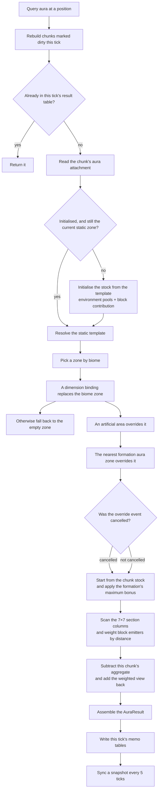
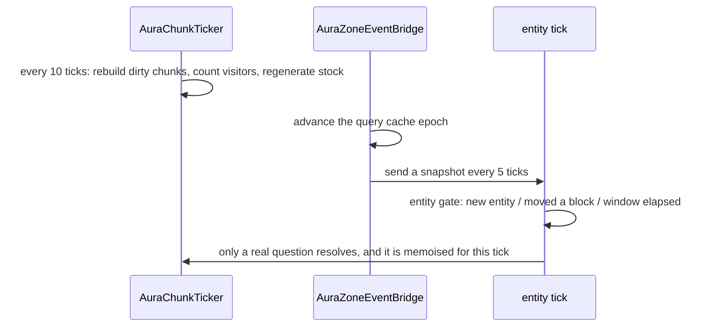

# Aura Calculation

This page is about how "how much aura is at this position" is computed. For the fields themselves see [aura](../datapack/json/aura.md) and [aura_zone](../datapack/json/aura_zone.md).

## Where the code lives

| Class | Responsibility |
| --- | --- |
| `runtime.world.AuraService` | The one query entry point: zone resolution, stock, weighted block contributions, consumption, queries. |
| `runtime.world.AuraQueryCache` | Per-tick memo: results, static zone, pools, biome, availability… |
| `runtime.world.AuraChunkTicker` | Periodic work: rebuilding dirty chunks, visitor counts, stock regeneration. |
| `runtime.world.AuraZoneEventBridge` | The entity-tick query gate, zone enter/leave events, snapshots to clients. |
| `attachment.AuraChunkAttachment` | The chunk stock: authoritative, persisted, consumable, regenerating. |
| `runtime.world.BlockAuraService` | Block emitters: scans chunks, builds the per-section aggregates. |
| `runtime.world.BlockAuraSectionCache` | One sub-chunk's aggregate value and source positions. |
| `runtime.world.AuraWorldAttachment` | Artificial aura areas (persistent, rectangular). |
| `runtime.world.AuraClientState` | The interpolated client snapshot. |
| `runtime.cultivation.AuraDistributionService` | Splitting one chunk's stock between the players in it. |
| `runtime.aura.AuraLookup` | Definition lookups: value → aura, and enumerating all of them. |

## Two things to keep apart

- **`mxt:aura` is an identity, not a number**: an `Aura` only says *which* aura it is (which `resource` it is measured in, which element it belongs to, its burst amount…).
- **The answer for a position is an `AuraResult`**: a table of `aura → AuraPool(amount, maximum, regenPerTick, supplied)`, plus rules, a source and a `SourceKind`. Which auras are in the table is exactly "what this place is made of".

`supplied` records how much of that amount comes from the block emitters underfoot, because a consumer allowed to spend the ground it stands on (a formation drawing the environment) has to subtract its own share or it would count the same aura twice.

## The resolution flow



A few easy misreadings:

- **Zone resolution replaces, it never adds.** A biome zone wins if one matches, otherwise a dimension binding; neither means the empty zone. An artificial area overrides both, and a formation aura zone overrides that — exactly one template survives.
- **Within one layer `priority` decides**, and a tie goes to the **lower** registry id; the empty zone has `Integer.MIN_VALUE`, so it always loses.
- **A formation is picked as the nearest one that can give an aura zone**, not the highest priority one: otherwise an inner ward would hide the aura zone of the array it stands in.
- **The override event can veto** the formation step; when cancelled the previously resolved template stays.
- **The stock is only re-initialised when it is empty or its template changed.** The stock is a state that has already been consumed from, so it cannot be recomputed from scratch on every query.
- **A query writes state**: initialising an uninitialised chunk is itself a query at the chunk's midpoint.

## How the environmental stock is computed

The template decides what the **environment** here can give (block emitters aside):

```java
double initial = Math.max(0.0D, (value.amount() + noise(pos)) / 10.0D - 5.0D);
double fluctuation = factor(zone, gameTime);
new AuraPool(initial * fluctuation, value.max().resolve(initial), value.regenPerTick());
```

- `amount` first goes through a `/10 - 5` shift and scale (`amount` defaults to `0`, so an undeclared aura is simply zero), then a 2D value noise is added.
- **Fluctuation only scales `amount`**: `maximum` resolves `max` from the **unscaled** `initial` (with the default `InitialMultiplier(1)` the ceiling is the local initial value).
- Cycles: a day cycle of `24000` ticks and a moon cycle of `192000`, `1 + amplitude * sin(...)` floored at 0; `static` or disabled reads `1.0`.
- `AuraPool` requires finite, non-negative values with `maximum` allowed to be `+∞`, and clamps `amount` to `maximum` whenever the maximum is finite — so regeneration never crosses the ceiling while an unlimited pool has no ceiling at all.

## Block emitters: 7×7 section columns

Block contributions are gathered per **sub-chunk** by `applyBlockDistance`: horizontally `dx, dz ∈ [-3, 3]` (7×7 columns), vertically every section the chunk attachment has recorded.

| Distance from the query point | What is used | Distance |
| --- | --- | --- |
| Within 3×3×3 sections | each entry of `sources()`, at its **real block position** | block centre to query point |
| Further away | the section's **aggregate value**, at the **section centre** | section centre to query point |

The weight is `1 / max(1, d²)` in both cases (the `max` keeps a zero distance from producing infinity). Every term is then multiplied by an availability factor:

```java
double available = Math.clamp((shared.amount() - environmental) / aggregate.amount(), 0.0D, 1.0D);
return available / Math.max(1, visitors);
```

That is "how much of the shared stock has already been consumed", scaled, and then split between **visitors** — one patch of block aura cannot be taken in full by every player asking for it. Finally the current chunk's stock is rewritten as "subtract this chunk's aggregate, add the weighted view back" for amount, maximum and regeneration alike, and `supplied` records the weighted amount that was added.

Unloaded chunks are skipped outright: **aura reads low at chunk borders**, which is a deliberate trade (no terrain generation to answer a query).

## How large is the approximation error

The only approximation is collapsing emitters beyond 3×3×3 onto the section centre. The repository's error study (`research/15_子区块灵气缓存误差研究.md`) quantifies it for a **single block with contribution 1**:


*The x axis is the player's distance from the section centre in blocks (log), the y axis is the aura value (log). The dashed line is the P95 of the true value, the dotted line is what the cache reads after collapsing to the centre.*


*The absolute error of the same model. Summary: at 1 block from the centre the mean error is 1.310 and the P95 is 3.229; at 4 blocks 0.0513 / 0.0694; at 8 blocks 0.0182 / 0.0438; at 16 blocks 0.00205 / 0.00657. Keeping the P95 error within `0.01` would need a per-block range of 15 blocks, and within `0.001` about 28 blocks.*

Three things to keep in mind while reading them:

1. **They model a single block**, not a terrain full of them; a block's contribution scales linearly, so a contribution of `s` scales the thresholds too.
2. **The study uses a `1/r²` falloff while the runtime uses `1/max(1, d²)`**, so treat the figures as an order of magnitude rather than an acceptance test (the study says so itself).
3. **Near the source the worst case is far above the mean**: when the player stands next to the source block while the source got collapsed to a distant section centre, the error can exceed the P95. The code's exact region is 3×3×3 sections (about a 16 block radius), which sits right at the 15 blocks the study suggests.

## The order inside one tick



- **Block changes**: break/place events mark the chunk dirty at a low priority and the next periodic `flushDirty` rebuilds it — but **every query flushes first**, so a block placed this tick is visible immediately.
- **Regeneration**: every 10 ticks (**Server Config → Aura → Block Aura Period**) loaded chunks run `amount + regenPerTick * elapsed ticks`, clamped by the ceiling.
- **Rescan**: each chunk re-scans its block emitters every `200 + rand(400)` ticks, so correctness does not depend on block events alone.
- **Per-tick memoisation**: results, static zone, pools, biome and availability are memoised per "position + this tick", and the epoch is advanced by `AuraZoneEventBridge` at the **end** of a tick — so stock changes inside one tick do not affect an answer already computed, and **a formation activated this tick is only visible next tick**.
- **The entity gate**: entity ticks no longer query unconditionally; only a new entity, a changed block position, a changed dimension or an elapsed window resolves. The window is **Server Config → Aura → Entity Aura Period** (10 ticks by default, 1–1200; set it to 1 to query every entity every tick). The price is that a stationary entity's zone enter/leave events can be delayed by that many ticks.

## Performance: where the 140 µs of one query goes

`research/17_灵气解析性能与记忆化.md` measured an uncached query in stages (test pack, 5 aura zones):

| Stage | Cost |
| --- | --- |
| `biome` (`getBiome` + id lookup, **57 calls per query**) | ≈ 23 µs |
| `static` (registry zone selection) | ≈ 6 µs |
| `pools` (environment stock) | ≈ 0.5 µs |
| `sources` (block source availability) | ≈ 7 µs |
| total | ≈ 140 µs |

The conclusion is counter-intuitive: **the bottleneck is `getBiome`, not the registry scan** — every one of the 7×7 block sources asks for its biome first. Memoisation took a repeated query from 155.6 µs to 5.8 µs (about 27×), and the few microseconds of registry selection are simply not a problem in a pack with a handful of zones — which is why **`aura_zone` has no index**; that only becomes worth doing at a hundred zones, as an "biome/dimension → candidate zones" table.

The memo tables are keyed by position, or by position plus definition, hold at most 16384 entries each and are replaced wholesale when they overflow (the worst case is a recompute); **a stale value is never returned**.

## What the client sees is a snapshot

The client does not run the same computation and does not sync the attachments: the server computes once per player every 5 ticks (**Server Config → Aura → Sync Period**) and sends a "source + actual + environment" payload, which `AuraClientState` keeps as a target snapshot and interpolates with a time constant of about 0.25 s (non-finite values are sanitised away).

Who uses it:

- **Fog**: `client_render` on the zone sets the fog colour and the far distance, with a strength of "environment concentration / the sum of the zone's aura values".
- **Resource bars and the HUD**: `client_hud` on the zone draws the concentration bar.
- **Formula contexts**: `mxt:actual_concentration` / `mxt:environment_concentration` read the snapshot on a client and a live query on the server — the same name, two different sources.
- **Particles** are sent by the server directly, not through the snapshot.

Note that "actual" includes the stock and the block contributions while the environment value (`getSensedAura`) recomputes the template alone; both are called concentration, so do not conflate them.

## Configuration and datapack surface

| Setting | Default | Effect |
| --- | --- | --- |
| **Server Config → Aura → Block Aura Period** | 10 | Period in ticks for rebuilding the block cache and regenerating the stock. |
| **Server Config → Aura → Entity Aura Period** | 10 | Window in ticks before a stationary entity re-resolves. |
| **Server Config → Aura → Sync Period** | 5 | Interval in ticks between snapshots sent to clients. |
| **Server Config → Aura → Timing Stats** | off | Prints query stage timings to the log every 10 seconds; diagnostics only. |
| **Server Config → Formations → Draw Environment** | off | Whether formations may spend the environment aura at their controller. |

Four registries take part, and they do not play the same role:

| Registry | How it takes part in a position's aura |
| --- | --- |
| `aura_zone` | **The main one**: template, environment stock, ceiling, regeneration, fluctuation, noise, priority, client presentation. |
| `block_aura` | Block emitters: matching blocks contribute `amount/max/regen` per aura. |
| `mxt:aura` | Identity only: which resource it is measured in, which element it belongs to (which drives the client's environment colour and element conditions). |
| `item_aura` | **Does not take part**: it writes aura into the holder's own resource pool. |

The repository ships a single `block_aura` entry (the spirit stone block, `amount 50 / max 50 / regen 0.1`) and **no `aura_zone` file at all** — so out of the box every position resolves to the empty zone (`source = mxt:empty`, `SourceKind.CHUNK`) plus block emitters. Seeing environmental aura means writing your own `aura_zone`.

## Costs and limits

- **Unloaded chunks do not count**: a query window containing unloaded chunks simply skips them, so chunk borders, other dimensions and unloaded formations all read low. The search is 7×7 columns and it **never generates terrain to answer**.
- **A per-tick staleness window**: stock changes inside one tick (a formation just activated, a block changed but not yet flushed) only reach a query on the next tick; the period settings above are the size of that window.
- **Splitting between visitors is bookkeeping**: a "visitor" is recorded for each player's 7×7×7 sections without checking whether they can actually see the section, and the table is rebuilt every 10 ticks. It guarantees that one patch of terrain aura is not taken in full by every player, but it is not a visibility test.
- **`SourceKind.CHUNK` is easy to misread**: it means "no biome, dimension or area template matched", not "came from the chunk stock".
- **Hot and slow spots**: `getBiome` is the single largest cost; rescanning block emitters walks a whole column (loaded chunks × world height); the cache-clearing commands rebuild every loaded chunk in a radius synchronously and will hitch; block matching re-resolves the `block_aura` tags on every block event.
- **Diagnostics are incomplete**: the memo tables count hits and misses, but the pipeline's result table counts hits only — its miss rate cannot be read off the log.

## See also

- [aura](../datapack/json/aura.md) / [aura_zone](../datapack/json/aura_zone.md) / [block_aura](../datapack/json/block_aura.md) / [item_aura](../datapack/json/item_aura.md) — what every field means.
- [Build the Aura Environment](../tutorial/aura-environment.md) — putting the pieces together into a working pack.
- [Java API](../java/api.md) — `AuraService`, `AuraLookup` and the scripted entry points.
- [Foe Identification](./identification.md) and [Damage System](./damage.md) — the other two source-level walkthroughs.
