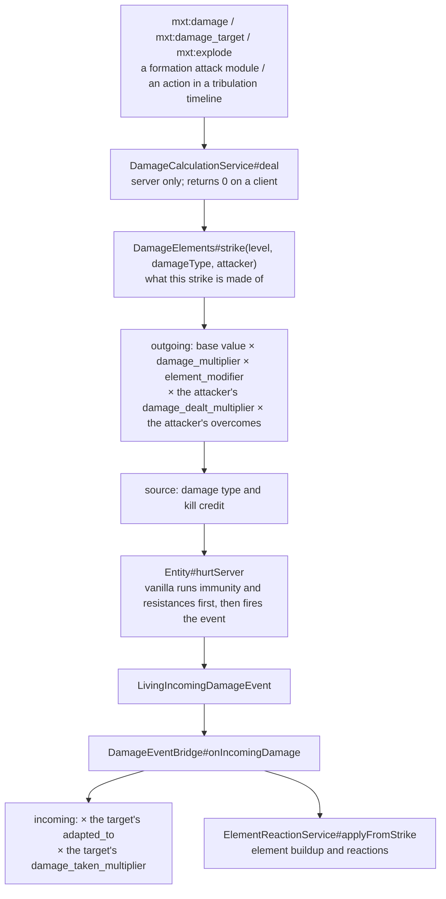

# Damage System

This page covers the whole thread in one place: **how to write it in a datapack** (declaring a hit's damage type and element, and which dealing paths are folded into the pipeline) and **why** it is built the way it is in the code.

## Where the code lives

| Class | Responsibility |
| --- | --- |
| `runtime.damage.DamageCalculationService` | The one public exit: computes both layers, builds the damage source, applies the hit. |
| `runtime.damage.DamageElements` | The reverse index behind "what is this strike made of": damage type → the elements that claim it. |
| `runtime.damage.DamageEventBridge` | Where the reduction layer is attached, on `LivingIncomingDamageEvent`. |
| `runtime.element.ElementReactionService` | Element buildup and reactions, also fed by that same event. |

The package prefix is `com.iafenvoy.mxt`; every file is under `src/main/java/com/iafenvoy/mxt/`.

## The timeline of one strike



Layer one has exactly one entry point, `deal`, so no path this mod deals damage through can miss it. Layer two has exactly one entry point, the event, so every hit that reaches an entity — a vanilla fall, another mod's sword, our own fireball — passes through the same reduction.

## Why it has to be two layers

Both layers read the same answer to "what is this strike made of", but they compute it next to two different entities. That is forced by the data, not a matter of taste:

- **Shaping needs information only the dealing side has**: which ability is being cast, what mastery multiplier this casting carries, what the attacker's spirit roots are, and who the target is. The defender-side event sees a `DamageSource` and a number, and cannot reconstruct any of that.
- **Reduction needs information only the receiving side has**: the target's own adaptation relations, and **every** hit that arrives — including vanilla's and other mods', which never go through `deal` at all. Putting it at the dealing side would make it apply to our own attacks only.

The cost is that the two must not overlap: `DamageEventBridge` therefore lives on an event that fires exactly once per damage sequence, and no dealing path applies reduction on its own.

## Layer one: shaping

```java
public static double outgoing(@Nullable Entity attacker, Entity target, double amount,
                              @Nullable FormulaContext context, Set<Holder<Element>> elements) {
    if (!Double.isFinite(amount) || amount <= 0.0D) return 0.0D;
    double result = amount * masteryMultiplier(context) * elementMultiplier(context)
            * physiqueMultiplier(attacker, true) * overcomeMultiplier(elements, target);
    return Double.isFinite(result) && result > 0.0D ? result : 0.0D;
}
```

The order of operations is fixed: **the base value from the pack or a formula → × `damage_multiplier` → × `element_modifier` → × the attacker's `damage_dealt_multiplier` → × the attacker's `overcomes`**. The target's `adapted_to` and `damage_taken_multiplier` only enter afterwards, in layer two.

- **`damage_multiplier` belongs to the casting.** `AbilityService#withAbilityScaling` writes it into the formula context, and its value comes from `SkillStageService#damageMultiplier`: it walks the holder's learned techniques, keeps the ones whose current stage actually unlocks this ability, and takes the **largest** multiplier among them — several techniques do not stack their multipliers, because only one strike is being dealt. A `skill_stage` defaults `damage_multiplier` to `1.0`, and a negative or non-finite value is rejected while loading.
- **`element_modifier` is the spirit-root half, and it belongs to the casting as well.** The same `withAbilityScaling` folds "the `element_ability_modifier` of the matching roots" into one value through `element_affinity_mode` (average or best) and writes it into the context, and `elementMultiplier(context)` multiplies it straight in. It is **not only** a variable for formulas to read — whether content writes `"damage": 12` or `"damage": "12 * element_modifier"`, the latter now multiplies twice, so **do not write it by hand again**. When the ability carries no `element_affinity`, or the damage does not come from a casting (a formation tick, a curse, a vanilla attack), the context has no such value and it reads `1.0`; a root that writes this multiplier as `0` means "this element of mine deals nothing", and this layer still multiplies by `0` (the same reading the casting gate uses).
- **`damage_dealt_multiplier` / `damage_taken_multiplier` belong to the person.** They come from active `physique` definitions: layer one reads the attacker's "dealt" multiplier and layer two reads the target's "taken" one, and several active physiques **multiply** (each one is an independent source). They are evaluated in the **holder's own** formula context rather than the other side's — how much this body takes cannot depend on who is asking. A literal number is validated as finite and non-negative while loading, and a negative or non-finite value produced by a formula counts as "no contribution" (the same rule, for the same class of formula, as passive attributes); `0` is legal and means immunity, or that nothing can be dealt.
- **The element factor belongs to both sides.** `overcomeMultiplier` runs a **double loop over the attacking and defending element sets, multiplying every pair**, and each pair goes through `Element#overcomeMultiplier`, which multiplies every matching relation in that element's `overcomes`. An empty set on either side (no spirit roots, no elements), or a target that is not a `LivingEntity`, reads as `1.0` — "there is no relation to apply".
- **Backlash and self-damage therefore have no element edge at all.** When `mxt:damage` lands on the caster themself the attacker is `null` (`DamageAction#attacker` returns `null` as soon as `caster == entity`), the element set is empty, no relation is read and the "dealt" multiplier has nothing to be read from either (there is no attacker) — but `damage_multiplier` and `element_modifier` still apply: the stronger the technique and the better the root fits, the heavier the backlash, because that is the worth of the casting, not a property of the strike.
- **Nothing is clamped.** Anything non-finite or ≤ 0 counts as "no damage"; otherwise the number is returned as computed. Numeric discipline is the pack's job (a multiplier must be finite and non-negative, but `0.0` is legal and means "no damage").

## Layer two: reduction

```java
public static double incoming(LivingEntity target, Set<Holder<Element>> attacking, double amount) {
    if (!Double.isFinite(amount) || amount <= 0.0D) return 0.0D;
    double result = amount * adaptationMultiplier(target, attacking) * physiqueMultiplier(target, false);
    return Double.isFinite(result) && result > 0.0D ? result : 0.0D;
}
```

- **Only the target's `adapted_to` is read.** `adaptationMultiplier` also multiplies pair by pair, but takes only the defending side's relations. Being overcome is the attacker's advantage, not a second bonus for the defender, so `overcomes` does not take part in this layer.
- **The target's own `damage_taken_multiplier` is read here too**, and `physiqueMultiplier` looks only at the physique definitions rather than at who is attacking: a layer of physical reduction, a layer of attribute resistance or a one-off "unyielding body" all sit on the same table and behave the same whoever deals the hit. It likewise has no special case between `1.0` and `0.0` — `0.0` is immunity.
- **It runs once.** `LivingIncomingDamageEvent` fires exactly once per damage sequence, whoever dealt the hit — that is what keeps this layer from being applied twice.
- **This layer never cancels.** Refusing a hit belongs to the protection and invulnerability rules (`FormationProtection`, vanilla resistances); a relation only changes what the hit is worth. The listener therefore starts with "if it is already cancelled, do nothing": a cancelled sequence applies nothing, so rewriting its amount would only rewrite a number nobody reads.
- **A hit dropped by the invulnerability timer still goes through this layer.** Vanilla discards a repeated small hit *after* the event fires, so "no health lost" does not mean "nothing was computed" — the reduced amount goes nowhere, but the element has already been built up on the target (next section).
- **Clients are skipped outright** (`target.level().isClientSide()`), so a client never treats a server-only registry as authoritative.

## What this strike is made of

An element is **read only from the damage type**, and that is the foundation of the whole design: layer two is handed nothing but a `DamageSource`, so if the element could not be looked up from `typeHolder()`, there would be no way to reduce by it.

`DamageElements` keeps a reverse index: `Map<damage-type registry instance, Map<Holder<DamageType>, List<Holder<Element>>>>`.

- **Claims** come from an element's `damage_types` field, either a concrete type or a tag (a tag expands to every matching type in the registry). When several elements claim one type, **all of them are kept** and every claim multiplies — the same rule several spirit roots already follow — and a warning is logged, because that is usually a pack mistake.
- **The index lives as long as the registry instance.** A datapack reload replaces that instance, which rebuilds the index; a few instances are cached and the cache is rebuilt wholesale once it overflows. Elements disabled by the `mxt:disabled` tag are skipped while it is built, so disabling an element takes a reload to show up in the reverse index.
- **Fallback order**: a claimed damage type uses its claimants; an unclaimed one falls back to the **attacker's spirit-root elements**; with no attacker either (a fall, a cactus, unattributed environmental damage) the set is empty, both layers read `1.0`, and the `mxt:element` condition returns `false`. That is how "a strike nobody can classify has no element" is implemented — rather than inventing a default element.
- **`resolveType` turns a declaration into a type.** `mxt:damage` / `mxt:damage_target` use a declared `damage_type` verbatim; with only `element` they take the first type that element claims; with both they check that the element **really** claims that type — a mismatch logs one line per distinct complaint but **never fails the load**.
- **Why the check cannot happen at load time**: datapack registries load in parallel, so a cross-registry value is not necessarily bound yet, and the same pack would pass or fail depending on which page finished first. So the check runs on first use instead, reports each distinct complaint once, and lets the run continue.
- **With no server, the answer is an empty set rather than an exception**: a client-side script asking what a hit is made of must not be able to bring the client down.

## Sources and credit

`DamageCalculationService#source` is the only place a damage source is built; call sites do not each decide attribution:

- A declared `damage_type` → `new DamageSource(type, attacker)`, so the kill counts as the attacker's.
- No declared type → vanilla's `playerAttack` / `mobAttack`, or `generic` when there is no attacker.

Keeping this here rather than at every call site makes "who this hit belongs to" and "what this hit is worth" come from one place. One consequence is easy to forget: vanilla only scales `playerAttack` / `mobAttack` damage by difficulty when the **victim is a player**, so a source that must not vary with difficulty has to declare its own `damage_type`.

**The return value of `deal` is "the amount handed to the target", not "the health actually lost".** When `hurtServer` returns `false` — invulnerability ticks, immunity, a cancelled event — `deal` still returns `shaped`. A caller that wants to know whether the hit landed should look at the `hurtServer` result or the events, not at this number.

## The paths that were folded in

| Entry point | How it reaches layer one | Credit |
| --- | --- | --- |
| `mxt:damage` (entity action) | `DamageAction#execute` → `deal` | The caster, unless they are the target; self-damage has none |
| `mxt:damage_target` (bi-entity action) | `DamageTargetBiEntityAction#execute` → `deal(ctx.actor(), …)` | The actor |
| `mxt:explode` (entity action) | A `ShapedCalculator` wraps vanilla's explosion calculator; only `getEntityDamageAmount` goes through `outgoing` | The caster, as the explosion's cause |
| A formation `attack` module | `FormationActionRunner#attack` → `deal` | Decided by `attribute_to_owner` (default `true`) |
| Actions inside a tribulation timeline | The timeline runs the same `mxt:damage`-style actions | Whatever the action itself says |

**Deliberately outside layer one**: `mxt:spawn_lightning` (vanilla computes the bolt's damage, and `cause` only decides attribution) and the block form of `mxt:explode` — neither goes through `deal` at all. A projectile spawned by `mxt:spawn_projectile` records the caster as its owner but still leaves its impact damage to vanilla (an arrow's power is not datapack-driven). All of them still pass through layer two, so as long as an element claims those damage types (lightning, explosion, lava, fall…), their element is still computed; the projectile case additionally still has the attacker, so its element is read either way.

**Why the explosion wraps a calculator**: vanilla computes a separate damage number per entity, and the only place to intervene is `ExplosionDamageCalculator#getEntityDamageAmount`. So `mxt:explode` wraps the vanilla calculator and overrides that one method — block destruction and "should this entity be damaged" are forwarded unchanged. Without it, a caster's explosion would be the one hit in the mod that ignores their mastery and their spirit roots.

## Declaring a hit in the datapack

`mxt:damage` and `mxt:damage_target` each take two optional fields that declare what the hit *is*:

| Field | Type | Default | Description |
| --- | --- | --- | --- |
| `damage_type` | `Holder<damage_type>` | none | The damage type of this hit. With it the source is built from it; without it an attributed hit uses the vanilla player/mob attack source (`generic` when `mxt:damage` has no attribution). |
| `element` | `HolderOrTag<element>[]` | `[]` | The element declaration of this hit. Writing only `element` makes the damage type the first type that element claims; when it is written together with `damage_type`, the **first strike that actually uses them** checks that the element really claims that type and logs one line per distinct mismatch. |

The element is still **only read from the damage type**, so `element` is not a second source of truth: it writes the author's intent into the definition and lets the runtime check it, so a declared element whose type nobody claims is reported the first time it is used rather than quietly computing a wrong number in combat. That check deliberately cannot live at load time — the value behind a declared element is not necessarily bound yet while another datapack registry page is decoded, so the same pack would pass or fail depending on which page finished first. The reduction layer is the reason the element has to be readable from a damage type at all: it receives nothing but a `DamageSource`.

> Without a declared `damage_type`, attributed damage uses vanilla's `playerAttack` / `mobAttack` source: kill credit goes to the attacker, and vanilla scales that damage by difficulty **only when the victim is a player**. Write a `damage_type` when you want a source whose damage does not move with the difficulty.

Three things that are not part of this pipeline, worth saying out loud:

- **The damage type → element mapping is declared entirely by data packs.** `element.damage_types` is the only place that says a type means an element, and the mod hard-codes no mapping at all. A claim wins; the attacker's spirit roots are the fallback when nobody claims the type.
- **Artifacts (`item_archetype`) contribute no attack or defence numbers of their own** — they reach combat through the abilities they grant and the attributes they carry.
- **Damage the framework never shaped still passes layer two**: adaptation is a property of the entity rather than of this mod's attacks.

::: tip Trying it in game
The test module ships `/mxt_test damage`, which drives both layers against throwaway entities with known element edges and reports whether the amounts it measured are the ones it expected.
:::

## Element buildup and reactions

In the same event, the element set used for reduction is handed straight to `ElementReactionService#applyFromStrike`: it builds up each element on the target by that element's own `damage_attachment`, then tries to fire an element reaction (reactions have their own chain limit so they cannot cascade forever). **The source is read once and used twice** so that "the element used to reduce" and "the element used to accumulate" cannot be two different answers.

This lives here for the same reason the reduction does: a lava bath and another mod's fire spell build up fire on a body exactly like our own fireball.

## Costs and limits

- **Every hit computes.** The reverse index is cached (built once per datapack reload), but `Elements#of` reads the spirit-root registry and builds a set every call, and both multipliers are O(n×m) double loops with no memoisation. Hits are far rarer than ticks, so this is an accepted trade-off; a caller asking the same question repeatedly inside one settlement has to hold on to the answer itself.
- **The first build is synchronous**: the first strike of a session walks the whole element registry once inside a lock and freezes the result; everything after that is a lookup.
- **Pack mistakes only log.** A declaration that disagrees with its type, several elements claiming one type, a tag-only element declaration that cannot name a type — each reports once and the run continues. Check the log after editing elements; do not expect a failed start.
- **No floor on reduction and no ceiling on multiplication**: several elements being overcome multiply repeatedly. Capping or flooring is the pack's job.
- **Ordering on `LivingIncomingDamageEvent` is undefined**: this mod declares no priority, so another mod that edits `amount` on the same event has no guaranteed order relative to this layer.

## See also

- [element](../datapack/json/element.md) — every field of `overcomes` / `adapted_to` / `damage_types` / `attachment_*`, and how a damage type gets claimed.
- [skill_stage](../datapack/json/skill_stage.md) — how `damage_multiplier` is chosen.
- [Formula Variables](../datapack/types/formula_variables.md) — reading `damage_multiplier` inside a definition's own formulas.
- [Entity Actions](../datapack/types/action/entity_action_types.md) and [Bi-entity Actions](../datapack/types/action/bientity_action_types.md) — the full field tables of `mxt:damage` and `mxt:damage_target`.
- [Java API](../java/api.md) — `DamageCalculationService` and its method signatures.
