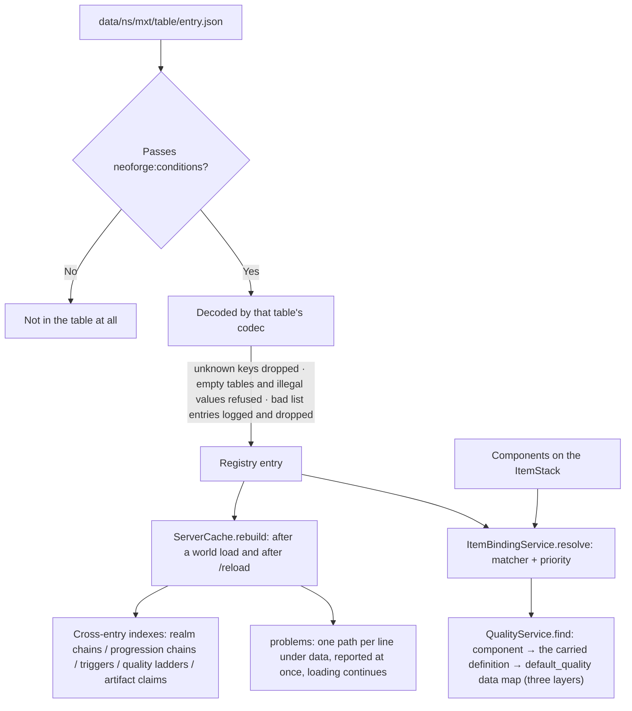

# Data Loading

This page follows **one JSON file from disk to the object a settlement reads**: when it is read, where the answer is kept afterwards, at which step "which declaration applies to this stack" is decided, and when a reload throws the old answers away.

## Where the code lives

| Class | Responsibility |
| --- | --- |
| `registry.MxtResourceKeys` | The `ResourceKey` of every table, kept apart from the registry instances and the registration events so codecs and runtime services can read registry identity without depending on a registration class. |
| `registry.MxtDatapackRegistries` | Registration and the single reading entry point for the 31 datapack registries; the 9 data maps are registered by `registry.MxtDataMaps` (7 item-keyed and 2 block-keyed) and are **not registries**. It holds **no snapshot**, because reloading and client synchronisation belong to the vanilla registry system. |
| `registry.MxtRegistries` | The `DeferredRegister`s of the built-in registries: the `type` dispatch layer (actions, conditions, costs, ability types, …). |
| `registry.MxtDataComponents` | Registration of the item data components; each one declares a persistent codec and a network codec. |
| `runtime.ServerCache` | The one rebuild point after a world load or `/reload`: cross-entry indexes plus the validation report. |
| `runtime.item.ItemBindingService` | Resolving the binding tables and data maps: one `ResolvedBindings` snapshot per operation. |
| `runtime.item.QualityService` | The single quality resolution order (three layers), and the gate on whether an item may be used. |
| `util.matcher.ItemMatcher` | "Which declaration applies to this stack" — shared by both layers. |

The package prefix is `com.iafenvoy.mxt`, and the files sit under `src/main/java/com/iafenvoy/mxt/`.

## Two layers: content and bindings

The registries are split by **the question they answer**, and the two layers are written and read differently; the nine data maps are **not registries** and are listed below as a group of their own.

| Layer | Tables | What they answer |
| --- | --- | --- |
| Content | `artifact`, `spirit_herb` | "What this item **is**". The definition itself is that thing (its registry id is its name), and it claims a set of items as its carriers. |
| Content | `resource`, `aura`, `realm_stage`, `element`, `spirit_root`, `physique`, `ability`, `technique`, `quality`, `formation`, `talisman`, `pill` and the rest | Other definitions refer to them by id; they claim no items. |
| Binding | `pill_binding`, `technique_binding` | "What this **already existing** item also counts as here." |
| Data map | `item_aura`, `currency`, `item_binding`, `weapon_binding`, `tool_binding`, `blueprint_binding`, `block_aura`, `heat_source` | "What value **this one** entry carries". **Not a registry**: the key is an item ID, a block ID or a tag of either, the value is inline data, and it has no id, no name and cannot be referenced by another definition. |

The two binding tables share one shape: `items` is a matcher, `priority` decides who wins, and the rest are the rules the entry adds. The data maps are a different shape: item-keyed ones live under `data/mxt/data_maps/item/` and block-keyed ones under `data/mxt/data_maps/block/`, the first namespace is the table's own `mxt` rather than the content pack's, the keys of `values` are the item, the block or a tag of either, and `priority` sits inside the value (`block_aura` is the exception and adds up - see below). Neither shape **ever defines the item itself**: the physical item was registered by vanilla, a mod or KubeJS, and bindings and data maps only attach rules to it - an `ItemStack` **never stores a logical item definition**, only components.

The difference between the content and binding layers is not "does it read an item" (the two content tables claim items through the same matcher), it is **whether it defines a thing or a rule**: an `artifact` says "these items are artifacts and here is what they do", while a `weapon_binding` says "when this item swings, run this behaviour too". So one item may be claimed by an `artifact`, carry a `weapon_binding` and pick up an `item_binding` after-use behaviour at the same time.

What the binding layer and the data maps each add:

| Table | The rule it adds | When it runs |
| --- | --- | --- |
| `item_binding` | Actions after finishing an item, conditions, what the item is made of | `LivingEntityUseItemEvent.Finish` |
| `weapon_binding` | Attack / use / per-tick actions, plus `attributes` written into the stack's `ATTRIBUTE_MODIFIERS` | On attack, on use, refreshed every tick |
| `pill_binding` | Which pill this item family is, plus its own use cap and cooldown | On a dose (gate and count) |
| `technique_binding` | Which technique the item teaches, and how long, in what pose and behind which conditions it is read | When a technique is read |
| `tool_binding` | Which forging methods the tool unlocks | Forging |
| `blueprint_binding` | Which forging blueprints the item provides | Forging |

## The journey of one JSON file

**Registration.** Datapack registries are registered on the `NewRegistry` event, and the save codec and the sync codec handed in are the same object, so a definition writes its codec once. A reference from one definition to another uses the **Holder codec** (`X.CODEC`, a `RegistryFixedCodec`), and the holder it decodes **does not consult the registry**.

**Files and decoding.** Files live at `data/<namespace>/mxt/<registry path>/<entry path>.json`, and the entry id is the namespace plus the path. The nine data maps do not go that way: item-keyed ones always live under `data/mxt/data_maps/item/` and block-keyed ones under `data/mxt/data_maps/block/`, they have no entry id, and a value hangs directly on the item, the block or a tag of either. Decoding is the table's own codec's job, and four outcomes are worth telling apart:

- **Unknown keys are dropped silently**: `RecordCodecBuilder` does not know a field nobody wrote, so a file still carrying an old field loads fine and that key simply stops working. Nothing will report a renamed field for you.
- **Empty tables, empty lists and illegal values are refused**: those go through `.validate(...)` and fail the load.
- **Collections are tolerant**: a collection codec such as `CollectionCodecs` logs `Ignoring invalid list element` for a bad entry and drops it, and the rest still arrive.
- **An entry stopped by `neoforge:conditions` is never in the table**: the runtime therefore needs no "is this one disabled" check, and a holder it reads can always be used.

**Reading.** The server uses the `MxtDatapackRegistries.holder(key, id)` group (it reads the running server's registries and throws when there is none); the client must use the overloads taking a `Provider` / `RegistryAccess` and leave the ones without an accessor alone on the render thread.

## When loading is finished

**A registry instance may still be the same object after a reload** - the comment in `ServerCache` is written for exactly that case, a reloaded pack that keeps its instances - so a cache keyed by the registry instance cannot be expected to notice a reload, and something has to invalidate it explicitly.

`ServerCache.onDatapackLoaded` (on `TagsUpdatedEvent.ServerDataLoad`) is that one rebuild point. It first invalidates the four instance-keyed caches (`DamageElements`, `ElementReactionService`, `FormulaNames`, `ChainCache`) and then rebuilds the cross-entry indexes: realm chains, progression chains, trigger rules indexed by signal, quality ladders, and the artifact item claim table.

**Cross-entry problems can only be found here**, because one definition cannot see the other entries:

- Chains have to be straight lines: a `next_realm` / `next_level` / quality `next` pointing at an entry that does not exist, written as the successor in two places (a fork), forming a cycle, or never reaching an entry (realm and quality chains have cross-chain checks of their own on top).
- Two `artifact` definitions claiming the same item **on the same `priority`** leave the winner to registry order, which is a real ambiguity and gets reported.
- A `quality` tier declaring `upgrade_costs` / `upgrade_condition` without a `next`: that upgrade data will never be read.
- A `trigger` with no action (the default is `mxt:no_op`) is readable by design, but is almost always a forgotten field.
- A technique entering a progression level while not configuring every level it must walk through afterwards.

Every problem carries a path like `data/<namespace>/mxt/<table>/<entry>`, they are collected and logged in one go, and **loading is not aborted**: a problematic entry is simply not indexed while the definitions around it keep working. Problems a single entry has with itself (an illegal value, an empty list) were already refused while decoding and never reach this step.

**Attachments are outside the reload.** Entity, chunk and level attachments are decoded once, at **world load**; `/reload` does not decode them again. So "the body holds a holder the current pack no longer provides" is a normal state: to ask whether it still exists, look the id up in the registry rather than treating the holder in hand as proof.

## How components and bindings resolve

Within one operation, "which declarations apply to this stack" is resolved once: `ItemBindingService.resolve(access, stack)` produces a `ResolvedBindings` snapshot (four `Optional`s: item, weapon, pill, technique) that the later steps share. **An empty stack resolves to four empties** - a wildcard matcher would otherwise claim a thing that does not exist.

**There is one matching rule** (`ItemMatcher`): **any one** of a declaration's entries matching is a match, and when several match, the one with the **highest** `priority` wins. A tie is settled one of two ways: a registry definition falls back to registry order, while a data map gives it to whichever value was processed later (writing order within one file, data-pack load order across files); `block_aura` and `default_quality` are the exceptions, the first because block aura is additive by nature - its two values **add up** - and the second because it has no `priority` field at all and simply gives the tie to the later value. The two binding tables, the two item-claiming content tables and the nine data maps all settle precedence the same way.

**A component overrides a declaration**, in three places:

| Component | Overrides | How |
| --- | --- | --- |
| `mxt:quality` | everything | It is the first layer of quality resolution: if it is there, it decides. |
| `mxt:pill` | the matched `pill_binding` and the `pill` it names | the `pill` written on the component names a definition first, then the five effect keys are laid over it field by field; the use cap and cooldown are not part of this and still follow the matched binding only. |
| `mxt:technique` | the matched `technique_binding` | With it, the declaration is **no longer picked by the matcher**: the one whose `technique` equals it is named, and when there is none, `TechniqueBinding.defaults(...)` is used. |
| `mxt:technique_reading` | the declaration picked above | One more field-by-field overlay for the reading parameters. |

The remaining components (`mxt:spirit_storage`, `mxt:artifact_state`, `mxt:curse_container`, `mxt:contract_bell`, …) only carry state and take no part in "which declaration applies".

**Quality has exactly one resolution order** (`QualityService.find`), and it has **three layers**:

1. the `mxt:quality` component on the stack - **exactly one component in the whole mod holds a tier**, and `/quality set`, a successful upgrade, **a Forge Table settlement** and **a talisman inscription** all write it; it is looked up in the registry by id, and an id the current pack does not provide leaves this layer without an answer;
2. the tier **the definition the stack itself carries** declares (the optional `quality` field) - a definition type implements `QualityProvider` and registers its carrier component, with `QualityService.carry` as the only registration entry point; a carrier answers from the stack alone, and a reference the current pack does not provide leaves this layer without an answer too. The nine definitions declaring it are `technique` / `alchemy_furnace` / `alchemy_wall_material` / `spirit_root` / `physique` / `pill` / `formation` / `secret_realm` / `contract_type`;
3. the `default_quality` data map (`stack.getData(MxtDataMaps.DEFAULT_QUALITY)`) - what answers when the stack has no definition to ask: a bare creative or `/give` item, and the by-item definitions `artifact` / `spirit_herb`.

`artifact` and `spirit_herb` deliberately have no `quality`: `ItemMatcher` claims them by item, so the stack carries no component naming a definition identity. Neither does `talisman`: its carrier holds a list of bill ids and there is no single definition to ask, so a drawing recipe writes the component and only a drawing that writes none falls through to layer 3. Each module plugs its own logic in as well: forging follows the blueprint's `quality_by_extra_steps` curve and a drawing follows completion's `grades[].quality`, and both write the settled tier into layer 1's component. `mxt:forging_result` only keeps the forging record (blueprint id and step counts) and **never a tier**, which is why `/quality clear` clears a forge or inscription tier along with the component and falls back to layer 2 and then layer 3.

`hasOverride(stack)` asks whether the component is there, which is a different question from whether a tier resolves: an item backed by the definition it carries or by the data map still shows a tier while carrying no component.

**"May it be used" is a separate gate with two steps of its own** (`QualityService.check`): first whether every `conditions` entry of the resolved bindings passes (otherwise `BINDING_CONDITIONS`), then whether the tier resolved here passes its own `condition` (otherwise `QUALITY_CONDITIONS`). The four call sites of binding resolution - finish using an item, attack, use, every tick - all pass this gate before running a behaviour.

## Why it is split this way

- **The binding layer does not define items because the items are not ours.** A player's sword is a vanilla item, another mod's item or one KubeJS created, and all this mod can do is attach rules to it. Giving every item a "logical definition" stored on the stack would give it two identities at once, and after a pack change the one on an old stack would still be the old answer.
- **Both layers share one matcher because "which one applies" is one question.** The content layer asks which artifact definition owns these items, the binding layer asks which weapon declaration owns this item, and the algorithm is the same; two implementations would drift into two priority semantics sooner or later.
- **`priority` is written by the pack rather than assigned per entry type**, so the pack decides whether a general rule or a specifically named one comes first instead of the framework guessing that "the more specific one should win" - and guessing wrong costs a silent override the player never sees.
- **The merge direction is "component over declaration"**: a component is a fact about this very stack (it was forged, it carries this inscription, it teaches this technique), while a declaration is "items of this kind usually behave like this". The former is more specific, so it is applied last.
- **Cross-entry validation happens after loading** because one definition's codec cannot see the other entries; doing it while decoding would make load order part of the semantics.
- **Cache invalidation cannot rely on the registry instance**, for the reason above: the instance may stay while the contents have changed.

The costs live here too: resolving a stack scans the relevant binding tables and data maps (`ItemMatcher.Entry#itemLevel()` is the line drawn for that - entries whose match depends on the item alone may be cached per item, while ones reading stack data have to be asked about every stack); cross-entry mistakes are only reported after a world load or `/reload`, and only in the log; an entry stopped by `neoforge:conditions` does not exist at runtime at all, and the client and the server each interpret their own copy of the pack.

## See also

- [Datapack Overview](/en/datapack/overview), [Registry Overview](/en/datapack/json/index), [Item Matcher](/en/datapack/types/other/item-matcher)
- [Registries and Codecs](/en/java/registries), [Public API](/en/java/api) (the `MxtDatapackRegistries` overloads and the cache rules)
- [Interfaces · NamedDefinition](/en/java/interfaces/definition/named-definition) (the `name` / `description` a definition carries)
