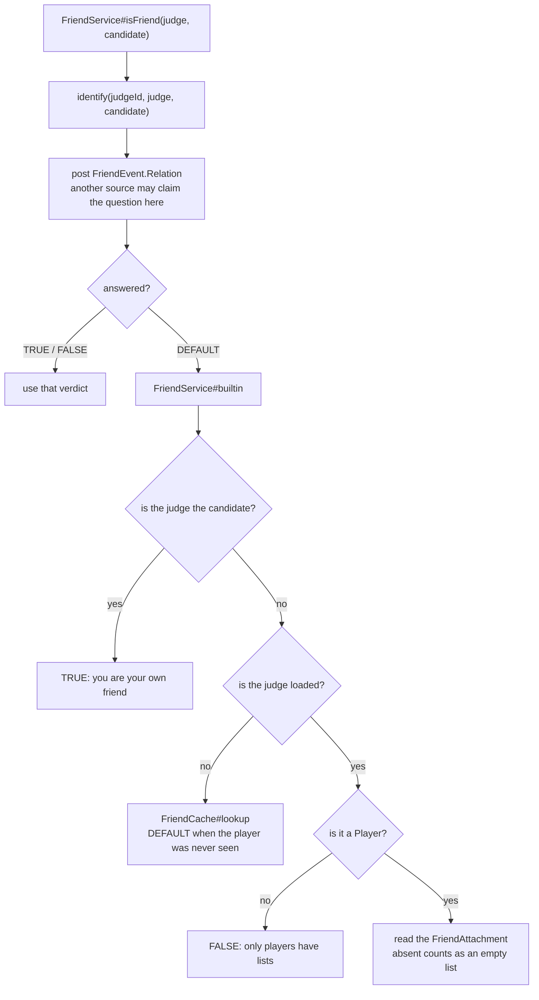
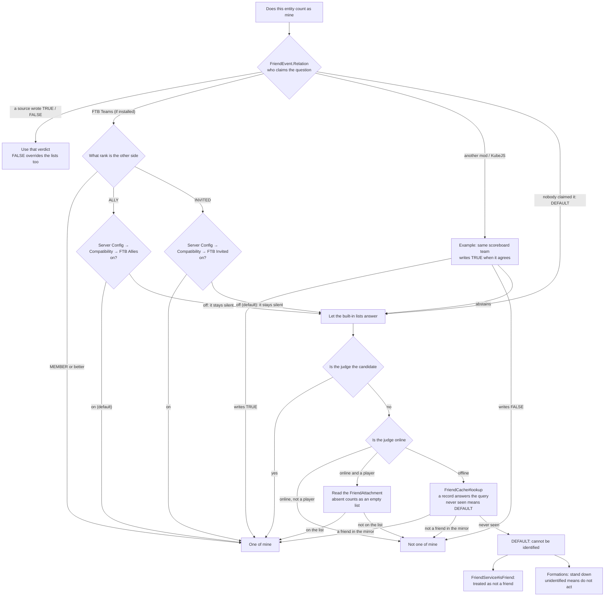

# Foe Identification

This page covers the whole thread in one place: **how to use the lists and the commands, and how to write it in a datapack**, plus **why** it is built the way it is in the code.

## Where the code lives

| Class | Responsibility |
| --- | --- |
| `runtime.friend.FriendService` | The one place to ask: the event gets the first word, the lists answer if it abstains. |
| `runtime.friend.FriendCache` | The in-memory mirror that answers for an offline player. |
| `runtime.friend.FriendSessionBridge` | The session boundaries: clear the session list and refresh the mirror at login, refresh at logout. |
| `attachment.FriendAttachment` | The lists themselves, an attachment on the player entity. |
| `event.FriendEvent.Relation` | The extension point that lets another source claim the question. |
| `compat.ftb.FtbTeamsRelation` | With FTB Teams installed, feeds team members and allies into that same event. |

## The timeline of one verdict



Three decisions deserve their own note:

- **The judge is "an id plus an optional entity", not an entity.** A player's entity is gone once they log out, and "the owner logged off while the formation is still standing" is exactly when the question matters most — so the asking interface has to work from an id alone. `FriendService#identify(UUID, Entity, Entity)` is that shape.
- **The attachment is read with `getExistingData`, never created.** An entity that has never used the friend system does not get a list just because somebody asked about it.
- **Nothing is memoised.** Every call posts an event, and a listener is free to consult the world, so a caller asking about the same pair repeatedly inside one tick has to hold on to the answer. That is the price of leaving "whose rules" to an extension point.

## The lists

The lists live on `MxtAttachments.FRIEND`, held by `FriendAttachment` as two tables, `permanent` and `temporary`. Two details bite:

- **Both tables are in the Codec** (under exactly those field names), which is why a death and respawn does not lose the session list. What ends a "current session" is the **login** event, not logout — a logout hook can be missed by a crash or a killed process, a login cannot. The consequence: while a player is offline, last session's temporary friends still count, until they next log in.
- **One player appears in one table only.** When a hand-edited save names the same id in both, `permanent` wins while loading and the `temporary` copy is dropped. The writing side keeps the same rule: `permanent add` **promotes** a temporary friend (removing it from the session list), `add` refuses a permanent friend outright, and `remove` answers "that one is permanent" instead of pretending it removed something.

An entry is a `NameAndId` (id plus name): **every match is made on the id, the name is display and command completion only**, so renaming never breaks a match and two players with the same name are two people. The lists have no size cap.

The judgement is **directional**: A counting B as a friend and B counting A are two separate things, and a caller that needs "both ways" asks twice.

## Maintaining the lists with commands

The only difference between the two lists is **whether they are still there at the next login**.

| List | How it is added | Lifetime |
| --- | --- | --- |
| Temporary | `/friend add <player>` | Also written to the save, but **cleared when that player logs in**, so a relog or a server restart ends it |
| Permanent | `/friend permanent add <player>` | Written to the save and kept |

| Command | Effect |
| --- | --- |
| `/friend` (= `/mxt friend`) | Prints help; every line can be clicked into the chat box. |
| `/friend list` | Lists both lists with counts and names; a name can be clicked to fill in the removal command. |
| `/friend add <player>` | Adds a temporary friend. |
| `/friend remove <player>` | Removes a temporary friend; a permanent one is refused with a pointer to the command below. |
| `/friend permanent add <player>` | Adds a permanent friend; a temporary one is promoted. |
| `/friend permanent remove <player>` | Removes a permanent friend. |

The top-level `/friend` alias is controlled by **Server Config → Command Aliases → /friend** and is on by default; `/mxt friend` is always complete. The clickable commands in the help and list output pick their root from the current setting, so the suggestion still runs after the alias is turned off.

**A click fills the chat box rather than running the command** (`ClickEvent.SuggestCommand`): a friend has to be typed by name and the help cannot know it, so a click puts the command and a trailing space into the input box with the cursor where the name belongs. Completion for `/friend remove` only offers names that **can actually be removed right now**, so it never suggests an option that is guaranteed to be refused.

`<player>` resolves through the vanilla profile cache rather than the online player list, so **an offline player can be added and removed too**; it also means selector syntax (`@a`, …) is legal, and the command insists on resolving exactly one player.

## Session boundaries and the offline mirror

`FriendCache` is a pure in-memory mirror (player id → set of friend ids). Its only reason to exist is that the lists hang off the entity, and an entity is unreachable the moment its player logs out.

| Moment | What happens |
| --- | --- |
| `PlayerLoggedInEvent` | `clearTemporary()` first, **then** refresh the mirror (the other order would describe the session that just ended) |
| `PlayerLoggedOutEvent` | Refresh the mirror — the last moment the lists can still be read off the entity |

The point of this design is that there are only **two refresh points**. While the owner is online the live attachment is read and a stale mirror is harmless; and by the time the mirror starts being used (after logout) the logout refresh has just filled it in. So **any future code that writes friend data never has to know `FriendCache` exists.**

Two deliberate choices:

- **"Has no friends" and "never seen this player" are different answers.** A player with no attachment is still recorded, as an empty set; only an id the mirror has never held returns `DEFAULT` ("nobody can answer").
- **Clearing the session list happens at login, not logout.** A logout hook can be missed, a login cannot; the price is that the data sits in the save while the player is offline, until their next login.

## The relation event

The verdict of `FriendEvent.Relation` is a vanilla `TriState`:

| Value | Meaning |
| --- | --- |
| `DEFAULT` | No opinion; hand it to the built-in lists. This is the initial value. |
| `TRUE` | Treat it as one of mine. |
| `FALSE` | Not this one, **even if the lists say otherwise**. |

The write is a plain overwrite, so the last writer wins and `EventPriority` is how you order them. Two rules for extenders are written into the class: **write `TRUE` only when your own rules say the pair is friendly**, and leave `DEFAULT` otherwise; writing `FALSE` declares the pair hostile and overrides every other source, the player's own list included.

`FriendService#builtin` exists so a listener can express "the lists, plus my own additions": it does not post the event again, so it cannot recurse. Conversely, **do not call `identify` inside a listener** — that posts a second event from inside itself.

## How the three states are consumed

This is the easiest thing to get wrong: the same three-state answer is read two different ways.

| Caller | What `DEFAULT` (nobody recognises it) means |
| --- | --- |
| `FriendService#isFriend` (the `mxt:friend` condition, KubeJS conditions) | **Not a friend** |
| Formations (which test the `TriState` directly) | **Stand down**: if it cannot be identified, do not act |

The formation reading is deliberate: an array with `spare_friends` that hits whatever it cannot identify may hit its own side at any moment. A new consumer has to choose a reading explicitly rather than inherit one.

## Team sources: FTB Teams

With FTB Teams installed, team members and allies are fed into the same judgement through the `Relation` event (a soft dependency; without FTB Teams that code never loads). It **only ever writes `TRUE`**: FTB knows who is on your team and who is an ally, but not who a player typed into their own list, so writing `FALSE` would override the list instead of merging with it.

The baseline copies FTB Chunks' own reading, then the two outsider tiers are configurable:

| Team rank | Default |
| --- | --- |
| `MEMBER` or better (a full member) | Always friendly, no switch |
| `ALLY` (the in-team ally rank) | Friendly, controlled by **Server Config → Compatibility → FTB Allies** (on) |
| `INVITED` | Not friendly, controlled by **Server Config → Compatibility → FTB Invited** (off) |

Two details: it reads the manager's in-memory team data (indexed by id), so it **can answer for an offline player**, and that is also why it needs no cache and no subscription to team-change events. And do **not** use `TeamRank#isAllyOrBetter()` as the predicate — it is `power >= ALLY`, while `INVITED` has a higher number, and a `free_to_join` team reports *any* stranger as `INVITED`; using it turns everyone into an ally. That is exactly why `INVITED` defaults to off.

Putting the judgement order from the earlier sections together with the switches above, one verdict runs end to end like this:



## Using it from a datapack

| Condition | Type | Meaning |
| --- | --- | --- |
| `mxt:friend` | Bi-entity condition | The `actor` counts the `target` as its own |
| `mxt:formation_ally` | Entity condition | The entity is a friend of **any** owner of the **current formation** (ownership is a set of UUIDs, and any one of them recognising it counts); outside a formation, or when the formation recorded no owner, it is always `false`. An owner who is merely offline is not that case — the judgement still asks every one of them by id. |

`mxt:friend` goes wherever a bi-entity condition slot exists, most typically a skill's `target_condition`:

```json
"target_condition": { "type": "mxt:not", "condition": { "type": "mxt:friend" } }
```

`mxt:formation_ally` goes into a formation's per-entity actions (those condition slots are entity conditions, with no second entity to pair against, so the formation supplies the owner's half — asking **every owner on the list** in turn). One array hurting enemies and healing friends:

```json
"entity_tick_action": {
  "type": "mxt:if_else",
  "condition": { "type": "mxt:formation_ally" },
  "if_action": { "type": "mxt:heal", "amount": 1 },
  "else_action": { "type": "mxt:damage", "amount": 2 }
}
```

There is also a more convenient entry point for formations: a definition with a top-level `spare_friends: true` has friends skipped by the runtime, see [formation](../datapack/json/formation.md). Neither condition is affected by server settings — those only decide whether the top-level switch does anything.

## Extending it with your own verdict

Another mod can claim the question for its own rules by writing a verdict on `FriendEvent.Relation`:

```java
@SubscribeEvent
public static void onRelation(FriendEvent.Relation event) {
    if (!(event.candidate() instanceof Player candidate)) return;
    // The judge may be offline, so go by id; take the entity only when it exists.
    Player judge = event.judge().filter(Player.class::isInstance).map(Player.class::cast).orElse(null);
    if (judge == null) return;
    // Same scoreboard team counts as one of mine; otherwise abstain and let the lists answer.
    Team team = judge.getTeam();
    if (team != null && team.isAlliedTo(candidate.getTeam())) event.setResult(TriState.TRUE);
}

public static boolean mayHarm(Entity attacker, Entity victim) {
    return !FriendService.isFriend(attacker, victim);
}
```

A listener only has to write a result when it **has an opinion**. Doing nothing (staying `DEFAULT`) means "go by the lists", not "no".

The scripted side is `MxtEvents.friendRelation`: `getJudgeId()` is always present, `getJudge()` returns `null` when the judge is offline (`hasJudge()` lets you check first), and `getCandidate()` / `getResult()` are there too, with `setFriend(true|false)` to claim the question and `abstain()` to hand it back. Because friend queries are far more frequent than lifecycle events, **that forwarding is skipped entirely when no script is listening**, so no wrapper object is built per query.

## Who asks the question

| Site | The question | Consequence of `DEFAULT` |
| --- | --- | --- |
| `FormationRelations#affects` | Does the array's per-entity work apply to this entity? | Stand down (do not act) |
| `FormationRelations#canDismantle` | May a friend take the array down (server setting, off by default)? | Refused |
| `FormationProtection#exempt` | The ward's exemption list (the ownership list first, then friends) | Not exempt |
| `FormationProtection#foreignClaimRefuses` | Raising a ward on someone else's claim: does the landowner accept them? | Refused |
| `FormationActionRunner#targets` (`target: allies`) | Does this entity get the buff? | It does not |
| `FormationAllyEntityCondition` (`mxt:formation_ally`) | The datapack-condition version of the same question | False |
| `mxt:friend` (bi-entity condition) | Does the actor count the target as its own? | False (see above) |
| `/friend` and its subcommands | Reading and writing the lists | — |

Worth keeping apart: **the vanilla-team conditions do not come through here.** `mxt:team` (both the bi-entity and the entity form) and `mxt:relation` read vanilla's `Entity#isAlliedTo` / `getTeam()`, have nothing to do with the friend lists, and cannot be affected by the `Relation` event. On that note, the repository also contains a `SameTeamCondition` class implementing the same semantics that is **never registered**; what actually works is the inline predicate registered under `same_team`. The registered name is the one to rely on.

## Costs and limits

- **The lists are never synced to the client**, so client-side code cannot see them and any display has to go over the network layer. That is also why the attachment is registered through the server-only factory (no sync, plus death copy).
- **The mirror is never cleared.** `FriendCache` has no server-stop hook, so its static table keeps entries until the same id logs in again. For an id this process has seen but this save has not, `lookup` returns a stale `TRUE` / `FALSE` instead of `DEFAULT`.
- **The offline window**, as described above: last session's temporary friends still count while the player is offline. That is a deliberate side effect.
- **Listener order is undefined.** FTB Teams and KubeJS are both plain listeners, and `FtbTeamsRelation#judge` does not check whether the question was already claimed, so when a script writes `FALSE` while FTB considers the candidate a teammate, which one wins depends on registration order. Declare an `EventPriority` when the outcome has to be certain.
- **Only players can be the judge.** A non-player entity has no list to read (an online one answers `FALSE` outright); a spirit beast or a puppet can only count as "one of mine" through an event source.
- **No memoisation and no cap**: see above. The lists can grow without bound and every judgement posts an event.

## Testing and troubleshooting

The server-side audit covers: both lists surviving the Codec (a death does not lose temporary friends), the real login event clearing the temporary list without touching the permanent one, a hand-edited save naming one player on both lists resolving to the permanent entry, the `add`/`remove` state machine, event override and the `DEFAULT` fallback, asking by id alone returning both "you are your own friend" and "nobody can answer", the mirror being filled at login / refreshed at logout / not following changes made mid-session, a non-player judge, the FTB Teams source staying silent when FTB Teams is absent with each rank switch reading its own setting, each of the four `/mxt friend` writing commands landing on the right list, both datapack conditions decoding by id, an array that declares `spare_friends` only skipping its owner and friends (and hitting its owner when it does not declare it), the setting being turned off restoring unconditional behaviour, and — with an owner that cannot be resolved — **identifiable entities still being judged while an array nobody can identify stands down entirely**.

The usual false alarm is "my temporary friend did not stick": check first that the question was not asked after a **relog or a server restart**, which is exactly when it is designed to be gone (a respawn is not). Note also that both lists match on UUID, and the name is display only, so renaming a player never breaks a match.

## See also

- [Bi-entity Conditions](../datapack/types/condition/bientity_condition_types.md) — the fields of `mxt:friend` / `mxt:team` / `mxt:relation`.
- [formation](../datapack/json/formation.md) — how `spare_friends` and `target: allies` are written.
- [Java API](../java/api.md) — the signatures of `FriendService` and `FriendEvent`.
- [Damage System](./damage.md) — the pipeline friendly-fire filtering eventually feeds into.
