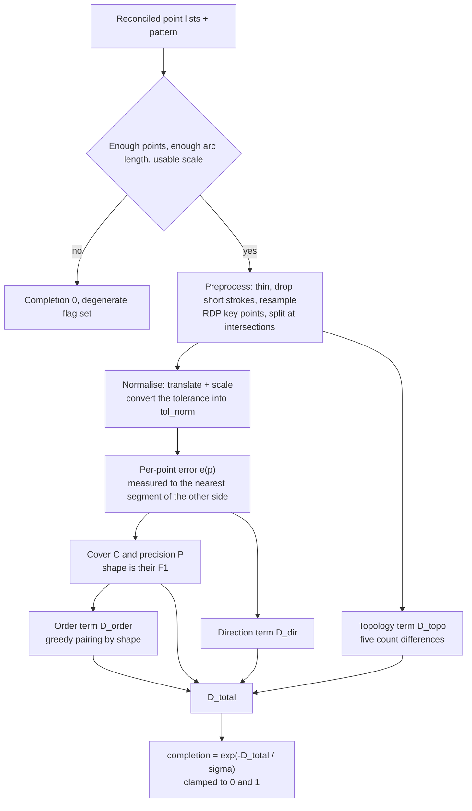

# Talisman Scoring

The chain at the talisman workstation is: the station shows a pattern → the player traces it → the server scores the **reconciled** point lists into a completion (`0~1`) → the completion decides both success and grade, and is fed to the settlement formulas as the variable `percentage`.

How the fields are written is in [talisman_drawing](/en/datapack/json/talisman_drawing); this page is about how that number **is computed**.

## Where the code lives

| Class | Job |
| --- | --- |
| `runtime.talisman.TalismanDrawingScorer` | The scoring itself: preprocessing, normalisation, every formula, the completion. A pure function that only reads the recipe and the point lists. |
| `runtime.talisman.TalismanWorkstationService` | Sessions and settlement: the per-stroke reports and refusals, charging the pigment, the point-by-point reconciliation on submit, grade selection, injecting the completion as `percentage`. |

## What one scoring pass takes in and gives back

| Input | Description |
| --- | --- |
| The pattern | The recipe's `pattern.strokes`, normalised coordinates in `[0,1]²` |
| `pattern.tolerance` | The scoring tolerance, `0.06` by default, measured as a **fraction of the canvas height**: `tol_px = tolerance × 210`, which is `12.6px` by default |
| `judgement` | `sigma` (`1.0`), `direction_weight` / `topology_weight` / `order_weight` (`0.25` each), `stroke_count_strict` (`false`), `min_stroke_length` (`0.02`), `preview` (`true`) |
| The canvas | A code constant, fixed at `90 × 210`; there is no field in the recipe that states a size |
| The resample step and the RDP threshold factor | Code constants `2.0` (pixels) and `0.5` (× the tolerance), **not recipe fields** |
| The player's strokes | Point lists in canvas bitmap coordinates (`x` from 0 to 90, `y` from 0 to 210), normalised before scoring |

`preview` is only read by the client screen: with `false` the client does not compute a local preview score. The scorer never reads it.

The output is a completion between `0` and `1`, plus the cover / precision / shape / direction / topology / order components, the total distance, the player's simplified key point count, whether anything is closed and whether the input was degenerate — those last ones are for the probes and for debugging, and the client only takes the completion.

## The algorithm, step 0 to step 7



### Step 0 — Degenerate input

Fewer than 2 points left on either side (checked once before and once after thinning), a total player arc length below `min_stroke_length × 210` (`4.2px` by default) after thinning, an RMS radius below `1e-6` on either side, or a total distance that comes out non-finite all return a completion of exactly `0` with the degenerate flag set. Nothing is thrown and nothing is logged — "submitted before finishing" is ordinary input.

### Step 1 — Preprocessing (the same pass on both sides, in pixel space)

1. **Thinning**: drop any point closer than 1px to the previously kept one (the duplicate points mouse events produce).
2. **Dropping short strokes**: only **the player's** whole strokes go, the ones whose arc length is below `min_stroke_length × 210`; the pattern side keeps everything.
3. **Resampling**: each stroke is resampled evenly by arc length to `clamp(round(length / 2), 16, 256)` points. How densely a client reports and how fast somebody draws do not change the score.
4. **Key points**: Ramer-Douglas-Peucker, threshold `0.5 × tol_px` (`6.3px` by default); when the first and last simplified points of one stroke are closer than `2 × tol_px` (`25.2px` by default) that stroke counts as **closed**.
5. **Intersection splitting**: every pair of segments is intersected, after an AABB prefilter; each intersection cuts both segments in two and is counted. An intersection landing exactly on an endpoint reuses that endpoint's node, which is what makes two strokes really connect.
6. **Three representations**: the dense resampled point list (distances and direction), the point cloud (cover and precision), and the simplified key point graph (the topology counts).

### Step 2 — Normalisation: translate and scale, never rotate

Each side moves its point cloud's centroid to the origin and then divides by its own RMS radius (the root-mean-square distance of every point to the centroid), so both sides end up at size 1. The tolerance converts along with it into `tol_norm = tol_px / rms_ref`, and the per-point errors below are measured in that unit-scale frame.

No angle is searched and no principal direction is aligned: every difference in orientation lands on the distances and the direction term in steps 3 and 4.

### Step 3 — Per-point error

`d'` is the distance to the other side's **nearest segment** (not to its nearest sampled point, or how fast a stroke was drawn would change the score), measured in normalised coordinates:

```text
e(p) = min(1, (d' / tol_norm)²)
```

The error saturates at `1` beyond the tolerance. The square is what pulls "drawn along the line" apart from "drawn along the edge of the tolerance": with the default parameters `tol_norm` is about `0.2`, and a deviation of 2px / 5px / 12.6px comes out as `0.032 / 0.079 / 0.2`, scored `0.03 / 0.16 / 1.0`.

Before the nearest segment is looked up, the bounding box gets a first say: if the box is already far enough away the point scores a full error without scanning a single segment.

### Step 4 — Cover, precision and shape, then direction and topology

```text
cover      C = 1 − mean(e over the pattern's points)
precision  P = 1 − mean(e over the player's points)
shape      shape = 2·C·P / (C + P)      (0 when C + P = 0)
D_shape = 1 − shape

direction  D_dir: the tangent at a pattern point against the direction of the nearest
                  segment of the player's strokes, the angle folded into [0, π/2] and
                  divided by π/2, averaged with the weight (1 − e(p));
                  the weight sum being 0 scores 1
topology   D_topo: five count differences, each softened, then weighted and summed
```

The five topology terms:

| Term | Slack | Weight |
| --- | --- | --- |
| Stroke count | 0 | 0.15 |
| Endpoint count | 1 | 0.25 |
| Intersection count | 1 | 0.25 |
| Closed region count | 1 | 0.25 |
| Total length | 5% | 0.10 |

A count term is `max(0, |a − b| − slack) / max(max(a, b), 1)`; the total length term uses the larger of the two lengths as its divisor instead (with a floor of `1`). The closed region count comes from Euler's formula: `edges − nodes + components + 1`.

The intersection count and the closed region count each carry a slack of `1`: with a `12.6px` tolerance, whether a hand-drawn line really crosses another or stops a few pixels short is a coin flip, and treating that as a structural difference punishes the same trace twice — where the lines are has already been judged by the shape term.

### Step 5 — Stroke order

Nothing is paired by index: every pair of (pattern stroke, player stroke) gets its own `pair(i, j) = 2·C(i, j)·P(i, j) / (C(i, j) + P(i, j))`, with both directions measured inside that pair only; the highest-scoring pair is then taken greedily, both of its strokes drop out, and the next best of what is left is taken, until nothing can be paired.

```text
pairing: every (pattern stroke, player stroke) pair gets an F1, taken greedily, each stroke used once
same stroke count: D_order = 1 − mean(pair over the pairs taken)
different counts:  D_order = 1 − mean(pair over the pairs taken) × min(n, m) / max(n, m)
stroke_count_strict true and the counts differ: D_order = 1 outright
```

Pairing by shape is because **stroke order is not on the screen**: the workstation draws no order at all unless the recipe itself sets `pattern.show_order`, so the same strokes drawn in another sequence are the same talisman to the player and must not cost score. A stroke count that does not match still scales the whole term down the way it always did (a missing stroke, an extra one, or one stroke split in two by lifting the brush) — that layer is still information about how many strokes there were.

### Step 6 — Total distance and completion

```text
D_total = (1 − shape) + direction_weight × D_dir + topology_weight × D_topo + order_weight × D_order
completion = clamp(exp(−D_total / sigma), 0, 1)
```

With the default parameters `D_total` is at worst `1 + 0.25 + 0.25 + 0.25 = 1.75`, so the completion floor is about `0.17` and never reaches 0.

### Step 7 — Output

The completion, the grade it falls into (grade selection is in [talisman_drawing](/en/datapack/json/talisman_drawing)), and the components above, the total distance, the player's simplified key point count, whether anything is closed and whether the input was degenerate.

## Why these terms

- **Shape is an F1 rather than an arithmetic mean**. A scribble has high cover and low precision: on the example pattern cover is about `0.85` and precision about `0.10`, which an arithmetic mean still scores `0.48` while the F1 gives `0.18` — the F1 is more sensitive to the two directions being out of balance, and tracing accurately is barely affected either way.
- **The direction term is weighted by `1 − e`**. A point that is far away has no meaningful "direction", and comparing it only adds noise; a point already at the tolerance carries weight 0 and drops out.
- **Translation and scale are not judged; rotation is penalised**. Talismans have a right way up, and a rotated one is not the same talisman; the few degrees of hand shake are absorbed by the tolerance, and tightening that is what `tolerance` is for.
- **The tolerance is a fraction of the canvas height**. Both `tol_px` and the pattern's RMS radius are measured in canvas pixels, and normalisation scales them together, so the `tol_norm` that comes out does not depend on the canvas's own pixel size — only on how much of the canvas the pattern fills: on `90 × 210` a canvas-filling pattern has an `rms_ref` of about `63`, giving a `tol_norm` of about `0.2`.
- **The order term pairs by shape, not by index, and still searches no globally optimal permutation**. Stroke order is not on the screen (unless the recipe sets `pattern.show_order`), so pairing by index would deduct score for something the player cannot see. Greedy pairing is enough: the gain of a globally optimal permutation is confined to shapes dense in intersections and closed regions, which is not worth the implementation cost.

## Measured numbers

The numbers below were **measured by the probe legs on a dedicated server** (not by hand), on the `90 × 210` bitmap canvas, with the parameters used when `judgement` is left out entirely: `tolerance 0.06`, `sigma 1.0`, all three weights at `0.25`, `min_stroke_length 0.02`. A "hand" trace is a synthetic careful one: 2px wobble, a 3px bow and 8px of overshoot past both ends; a "rough hand" trace is 5px wobble, a 6px bow and 16px of overshoot.

| Drawing | Completion |
| --- | --- |
| A perfect retrace | `0.999` |
| A perfect retrace with 2px jitter | `0.961` |
| A careful hand trace | `0.933` |
| A careful hand trace, strokes in another order | `0.933` |
| A careful hand trace, brush lifted mid-stroke | `0.857` |
| A rough hand trace | `0.815` |
| The same shape drawn elsewhere | `0.998` |
| The same shape drawn twice as large | `0.998` |
| The same shape drawn at half size | `0.934` |
| Rotated 15° as a whole | `0.545` |
| Rotated 90° as a whole | `0.239` |
| One stroke missing | `0.818` |
| One stroke too many | `0.677` |
| Scribbled all over (a zigzag across the canvas) | `0.398` |

The careful-hand-trace row and the row that draws it in another order are identical component by component: the order term pairs by shape, so the sequence no longer enters the score.

Two known deviations, recorded here for now:

- **Half size scores `0.934` where twice the size scores `0.998`**, and "size is not judged" should have put them in the same band. The reason is that the preprocessing thresholds (the RDP threshold, the closed-stroke test, the thinning step) are all in **absolute pixels**, so on a half-size drawing they take up a larger share: shape drops to `0.968` and the order term rises to `0.069`, while at double size both sit at about `0`. Fixing it means changing the design — either finding key points and testing for closure after normalisation, or letting those thresholds scale with the size of the drawing.
- **Rotating 90° scores `0.239`, not 0**. With the default weights `D_total` is at worst `1.75` and the completion floor is about `0.17` anyway, so "nearly 0" is not reachable with these parameters.

These numbers are **initial values**: the parameters were derived geometrically and calibration has not been done, so the table will move with it.

## Tuning it as an author

| What you want | What to turn |
| --- | --- |
| Everything harder or looser | `judgement.sigma` is the master knob, scaling the penalties of all four terms at once. At `sigma = 1.0` a `D_total` of `1` maps to `0.37`, between the 15° row (`0.545`) and the 90° row (`0.239`) in the table. |
| Tightening only "how accurately it is drawn" | `pattern.tolerance`: it is the divisor of the per-point error as well as the basis of the RDP threshold (`0.5 ×`) and the closed-stroke test (`2 ×`). Lower it and only a line traced right on top counts. |
| Moving the weight of one term | `direction_weight` / `topology_weight` / `order_weight` (`0.25` each by default): direction covers "traced along another line", topology covers "broken strokes, extra endpoints and intersections, extra regions, wrong length", order covers "which drawn stroke corresponds to which pattern stroke". Setting all three to `0` leaves shape alone, which is allowed but logs a warning at load time. |
| Failing outright when the stroke count is wrong | `judgement.stroke_count_strict: true`: a stroke count that does not match the pattern puts the order term at its maximum. |
| Making a hand twitch not count | `judgement.min_stroke_length`, again a fraction of the canvas height. |
| The grade thresholds | Write `result.grades[].min_completion` against the measured distribution above. To make "drawn crooked all over" a low grade, put the lowest threshold around the 15° row (`0.545`) or above it; to let a shaky hand through, keep it below the jitter row. The lowest threshold is the pass line. |

Two things not to touch: the resample step and the RDP threshold factor are code constants, not fields. Writing a same-named key into `judgement` (or any unknown key) is **silently ignored** — no error and no effect — so "I changed it and nothing happened" is worth checking there first.

## Server authority and reconciliation

- **Pigment is charged by the length the server measures itself**: every stroke is reported to the server, and the server measures the length from the raw point list it received (before any preprocessing). Lengths and amounts a client reports are never read.
- **The timing check**: if the gap between two strokes (including "the drawing opened → the first stroke") is under the minimum stroke interval, that stroke is **refused**; the verdict uses the game tick at which the server received the packet and never a timestamp from the client. More refused strokes than allowed → the session is failed and the materials are gone. Only "too fast" and "not enough pigment" count as refusals; "the brush is no longer on the cursor" is a physical fact, is not counted, and does not fail the session on its own.
- **Point-by-point reconciliation on submit**: the whole drawing and the per-stroke record have to agree stroke by stroke and point by point — an extra stroke, a missing one, a moved coordinate or a changed order all count as a mismatch → the drawing fails, the materials are not returned, and one warning is logged. Without that step a client could draw anything it liked offline and submit it as the settlement.
- **Caps**: a stroke over the point cap is refused on its own; a submission over the accumulated point cap or the stroke cap is refused whole with a warning.
- **The completion is always recomputed by the server**; the copy the client computes is for the preview only, is never sent back and is never trusted.

What this stops and what it does not, stated plainly: it stops "hundreds of strokes dumped in at once" (the timing check) and "drawn offline and handed in" or "a packet with an extra stroke" (the reconciliation); it does **not** stop a script that traces automatically at the same pace — such a script draws exactly as well as a person, and on the data it is indistinguishable from a person tracing carefully. This is **not** a guarantee.

## Server config

| Entry | Default | What it governs |
| --- | --- | --- |
| **Server Config → Talisman → Minimum Stroke Interval** | `300` (ms) | The least time between two strokes, and between "the drawing opened" and the first stroke; `0` disables it. |
| **Server Config → Talisman → Rejected Strokes Allowed** | `3` | More refused strokes than this in one drawing fails the session. |
| **Server Config → Talisman → Points Per Stroke** | `512` | A stroke reported with more points than this is refused. |
| **Server Config → Talisman → Points Per Drawing** | `4096` | The accumulated point cap of one submission. |
| **Server Config → Talisman → Strokes Per Drawing** | `64` | The stroke cap of one submission. |
| **Server Config → Talisman → Brush Capacity** | `4000` | How much pigment one brush holds, in pixels of arc length. |
| **Server Config → Talisman → Pigment Per Portion** | `1000` | How much pigment one portion feeds into a brush. |
| **Server Config → Talisman → Pigment Rate** | `1.0` | Pigment charged per pixel of arc length. |
| **Server Config → Talisman → Pigment Per Stroke Floor** | `1` | The least one stroke costs, so a tap is never free. |
| **Server Config → Talisman → Pigment Per Stroke Cap** | `0` | The most one stroke may cost; `0` means no cap. |

All ten are described in full under [Server Configuration](/en/player-guide/config).

## Costs and limits

- **Scoring is a pure function and runs afresh every time**: the pattern side is **not cached** and is preprocessed on every call. One settlement scores once and the client preview is rate-limited, so it holds for now; a cache would have to be keyed by recipe id plus registry instance and invalidated when the data pack reloads.
- **The cost** is "pattern points × player segments", with at most 256 points per stroke after resampling, so the order is within `10⁵`.
- **The preprocessing thresholds are absolute pixels**: they do not scale with the drawing, so the same gentle curve can count as closed at half size and not at double size — how strict the test is moves with the size of the drawing.
- **Leaving rotation alone is deliberate**: rotating the whole drawing costs real score, and that is not a bug waiting to be fixed; `tolerance` only absorbs the few degrees of a shaky hand.

## See also

- [talisman_drawing](/en/datapack/json/talisman_drawing): every key of `pattern` / `judgement` / `result`, its default and its load-time validation.
- [The talisman definition](/en/datapack/json/talisman): the product itself, its capacity, its durability and how it fires; [Define a Talisman](/en/tutorial/inscribe-a-talisman) for the whole road from definition to pouring and firing.
- [Server Configuration](/en/player-guide/config): every entry above spelled out, the use cooldown included.
