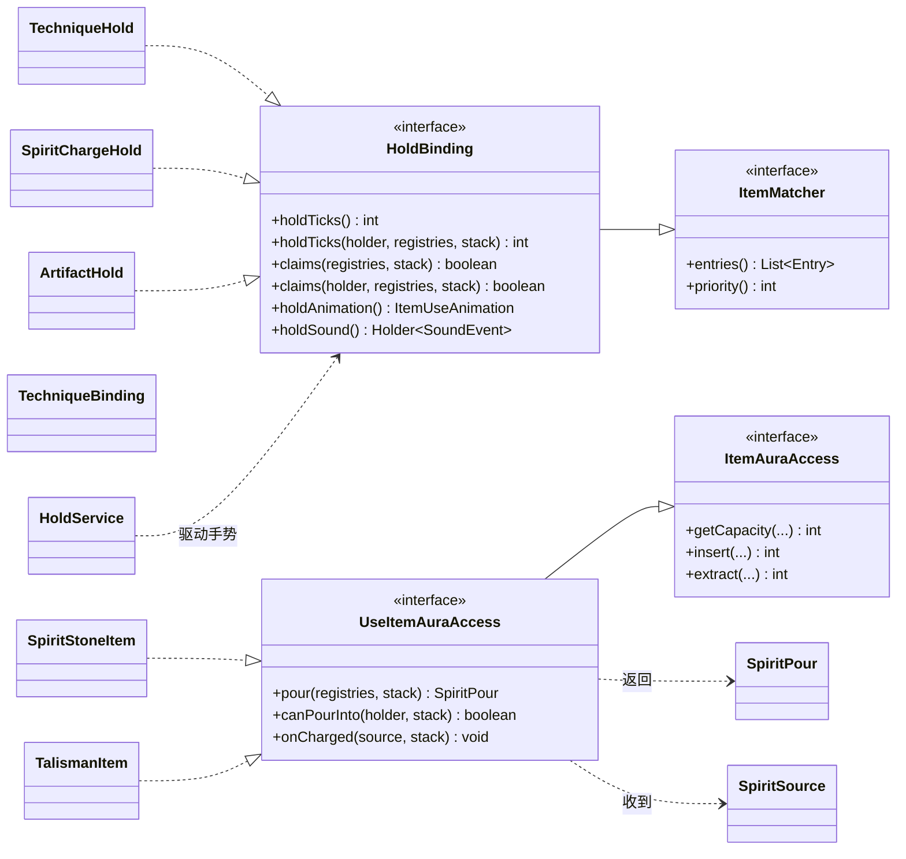

# UseItemAuraAccess

让物品**按住右键灌注灵气**的接口，继承 [ItemAuraAccess](./item-aura-access.md)：`HoldBinding` / `HoldService` 负责手势与姿势，`SpiritChargeService` 每 tick 从持有者自己的灵气池取出并写进 `insert`。实现它**不代表**要自己描述形状——灵石就实现了它却把 `pour` 留空，于是走 `item_aura` 定义那条共享读法。它表达的是"这个物品可以被按住灌"，不是"这个物品是特殊的"；不实现它的存储（只用来存东西的通用物品）永远不会被武装成手势。

拆成两个接口是因为"存储"与"被灌"不是一回事：存储能被问在任何地方，被灌只发生在一个人对着自己手里那一堆做手势的时候。三个默认方法对应手势的三个时刻：

- **`pour(Provider registries, ItemStack stack)`**（手势开始前、之后每 tick）——这个容器**是什么**：按灵气分列的 `SpiritPour`（每种灵气已存多少、上限多少，**顺序即灌注顺序**），数值按整堆给出、不再乘堆叠。默认返回空 = "我没什么特别的"，于是回落到 `item_aura` 定义那条共享读法（灵石走这条）。只有容量取决于**这一堆上写了什么**的物品（符箓载体）才覆写它。两侧都会问（客户端靠它算手势长度），所以实现只能读传进来的 `Provider`，且同一个 stack 必须答得一样。速率与代价**不在**这里，那是手势的（定义路线按两个速度反向使用，自述存储按 1 单位/tick、1:1）。
- **`canPourInto(@Nullable LivingEntity holder, ItemStack stack)`**（每 tick，**付灵气之前**）——这一 tick 值不值得灌。手势的顺序是"先扣灵气、再 `insert`、最后 `onCharged`"，所以只要有"插进去也没意义"的情况就会白花灵气；这个方法让物品在付钱前否掉。默认 `true`（只进不出的容器没有二话可说），只有**会因被灌满而自焚发动**的物品覆写它——符箓覆写成 `TalismanService.canFireFrom`，即"这个持有者的冷却窗口还开着吗"。它**不是**"要不要自动发动"那条：那由载体自己的模式决定（`mxt:talisman` 组件的 `mode`，`fire` 灌满即发动、`store` 只积累），跟灌注闸门是两回事。
- **`onCharged(SpiritSource source, ItemStack stack)`**（一次**真实**移动之后）——"我被灌了"，由物品自己决定是不是满了、要不要动手。默认什么都不做。

**写入者负责汇报**：任何往存储里写入灵气的一方（长按灌注、`AuraAccess` 方块实体等）在**真实写入之后**调用 `onCharged(SpiritSource, ItemStack)`（`simulate` 不算），由物品自己判断"这是不是满了"以及随之而来的行为（符箓在这里发动，并消耗一件本体或按铭刻的耐久扣除）。之所以由写入者汇报而不是让物品在自己的 `add` 里判断，是因为只有写入者知道**这东西在哪、谁付的账**：展示架上的一张符，是被站在别处的人（或一枚灵爆）填满的。`SpiritSource(level, position, actor, consumedByHand)` 同时带着位置与行为者——行为者出账、被记录并为能力作答；位置是这次激发的地点，既以 `block_x` / `block_y` / `block_z` 进公式，也作为**原点**交给位置类行为；`consumedByHand` 说明这次是不是"手上的消耗"（展示架、机器等摆着的存储为 `false`）。也正因为汇报是"选择加入"的：写入方遇到只实现存储的物品时，本就没有什么可汇报的。

`HoldBinding` 另外提供一对**带持有者**的默认重载（`claims(LivingEntity, Provider, ItemStack)` 与 `holdTicks(LivingEntity, Provider, ItemStack)`）——不关心是谁拿着的声明不用实现它们；[法器](/datapack/json/artifact)就是靠这一对做到"归别人就不接管这次右键"。

这一族接口连起来是这样：存取是"能不能被存"，被灌与长按是额外选择加入的手势，实现者只挑自己那一层。

