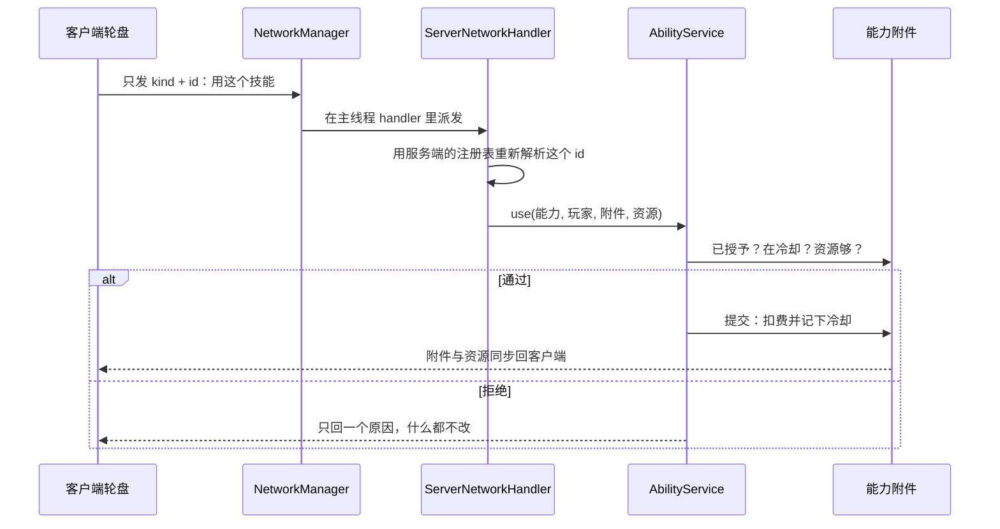

# 网络协议与服务端权威

客户端只发送意图，服务端重新解析 ID、检查附件和条件后结算。主要 C2S payload 包括：

| Payload | 用途 |
| --- | --- |
| `WheelActionC2SPayload` | 轮盘选中一项：`(source, kind, id)`——**哪个来源**、哪一类、哪个 id（按下那一刻由客户端从**当时那一格**解析出来）。技能与灵气**共用这一条通道**，服务端先按 `source` 把那个来源重读一遍（主盘读存档布局、从盘读现在的技能授予账），这一项不在那里就整个请求作废，然后才按 `kind` 分派（技能走 `AbilityService.use`，灵气走 `SpiritBurstService.fireOnce`）。**格子编号不走这条路**：它只用于存储。 |
| `BackSlotSwapC2SPayload` | 交换主手和背部槽位。 |
| `ForgingActionC2SPayload` | 锻造开始、敲击、完成和取消。 |
| `ChequeActionC2SPayload` | 支票桌存入/取出。 |
| `StationTradeC2SPayload` | 交易站结算。 |
| `PlayerTradeActionC2SPayload` | 已打开的一对一交易里改变请求方自己的状态。 |
| `CultivationToggleC2SPayload` | 请求切换修炼模式。 |
| `FlightToggleC2SPayload` | 请求开关一种飞行状态；服务端仍会校验请求里那个 ID（payload 自己的字段名仍是 `archetype`）是不是一件法器的 `mxt:artifact` 条目。 |
| `WheelLayoutC2SPayload` | 轮盘配置界面关闭时把**完整的 12 格主盘布局**送回服务端；服务端逐格校验 id 后写进玩家附件。从盘没有对应的包，因为它们不存。 |
| `WheelSelectionC2SPayload` | 换了选中的格子（`Optional<Integer>` = **格子编号**，空 = 没选）：格子按整张轮盘连续编号、页会随装备来去，所以存的只是一个位置；服务端只做范围检查，不解析也不记 warning——"这个位置上现在什么都没有"是合法状态（客户端那边会自动落到最后一个有东西的格子）。 |
| `OwnerNameC2SPayload` | 问某个归属 UUID 叫什么名字（只带 id）。服务端只查在线玩家列表与持久化的名字缓存，**不查会话服务**——那是网络请求，而处理器跑在主线程上。 |

以 `WheelActionC2SPayload` 为例，一次请求往返是这样的——客户端只报"哪一类的哪个 id"，服务端自己把它解析成定义、再自己判断该不该放：

服务端向客户端同步动态注册表、资源/灵气必要状态（`AuraStateS2CPayload`）和附件，并按需下发 `ItemPickerS2CPayload`（打开物品选择器，只带标题和分类 id，不带物品）与 `OwnerNameS2CPayload`（回答上一条：知道就回名字，没见过这名玩家就什么都不回——客户端把这个答案也记下来，于是一次会话只问一次，工具提示下一帧就能读到名字）。不要把客户端传入的数值当作可信结果；payload 只应传 ID、选择和操作意图。**轮盘配置界面本身不在这条路上**：它是客户端命令 `/wheel`（或那个默认未绑定的按键 `key.mxt.wheel_configuration`）自己打开的，服务端既不参与，也没有为"打开界面"设 payload（它保存布局与选中项用的是上表那两条，与打开界面无关）。

**S2C payload 的类型两端都要登记，但 handler 只在客户端登记。** 服务端是编码方，所以它必须知道这些 payload 的 codec；可它永远不会处理它们，而 `ClientNetworkHandler` 这类处理器会碰到 `Screen` 等客户端专属类——专用服务器的类加载器拒绝加载这些类，只要在注册时**构造**一次处理器，服务器就会在 mod 加载阶段崩掉（`NoClassDefFoundError: net/minecraft/client/gui/screens/Screen`）。`NetworkManager` 因此按 `FMLEnvironment.getDist()` 分两支：客户端用带 handler 的 `playToClient`，服务端用不带 handler 的那个重载，只登记类型。

**唯一的例外是物品选择器**，它借用原版的 `ServerboundSetCreativeModeSlotPacket`，所以物品内容确实由客户端给出，也不经过任何 mod payload。这条通道由服务端自己的能力开关把守：包在**解码层**被 `GameProtocols.HAS_INFINITE_MATERIALS` 拦下（服务端认为玩家不是创造模式就整包丢弃，不断线），`handleSetCreativeModeSlot` 再查一次 `hasInfiniteMaterials()` 并校验物品特性与堆叠上限。新增 mod payload 时**不要模仿它**——拿不到同等门禁的内容一律要走"客户端只报 id、服务端自己解析"。详见[客户端界面](/java/screens)。
