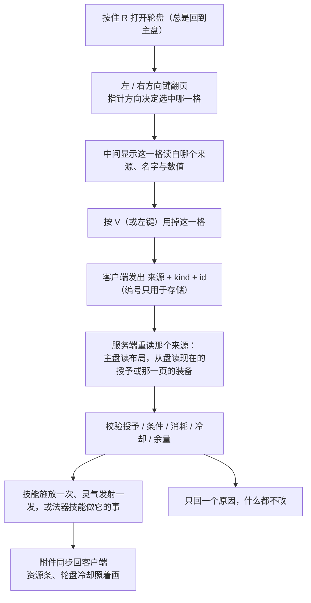

# 轮盘、资源条与灵气 HUD

技能与灵气共用一个 **12 扇轮盘**：按住「轮盘选择」（默认 `R`），屏幕中央出现轮盘，**指针朝哪个方向就选中哪一扇**，那一扇会变金色并向外扩一点，**它的名字写在轮盘正中间**。**选择与使用是两个键**：`R` 只管选，按「轮盘使用」（默认 `V`）才施放或发射——轮盘开着时用掉指针当前那一扇（轮盘不关，可以接着换一扇再按），轮盘关着时用掉上一次选中的那一扇；鼠标左键等同于 `V`。它替换掉了原来"技能栏 + 灵力栏两条快捷栏"的做法。

## 按键

| 按键 id | 默认 | 语言文件里的名字 | 作用 |
|---|---|---|---|
| `key.mxt.cultivate` | `C` | 切换修炼模式 | 开始或停止修炼。 |
| `key.mxt.information_panel` | `Z` | 打开人物信息面板 | 没有其他界面打开时，打开人物信息面板。 |
| `key.mxt.technique_panel` | 未绑定 | 打开功法面板 | 没有其他界面打开时，打开功法面板；人物信息面板里也有按钮可以进，所以默认不占键位。 |
| `key.mxt.swap_back` | 未绑定 | 交换主手与背部武器槽位 | 把主手物品与第一个 `back_weapon` 饰品槽互换。 |
| `key.mxt.hud_layout` | 右 `Shift` | 编辑 HUD 布局 | 没有其他界面打开时，打开可拖动 HUD 元素的布局编辑器。 |
| `key.mxt.wheel` | `R` | 轮盘选择 | 按住显示 12 扇轮盘，指针朝哪一扇就**选中**哪一扇；松开（或切换模式下再按一次）只关闭轮盘，不触发。**打开永远回到主盘（第一页）**。 |
| `key.mxt.wheel_use` | `V` | 轮盘使用 | **用掉**当前选中的那一格：轮盘开着时是光标指针那一格（轮盘不关；指针在空格子上就没有目标、也不提示），关着时是**你上次选的那个编号此刻代表的那一格**（编号指向不存在的格子时落到最后一个有东西的格子）；等同于鼠标左键。 |
| `key.mxt.wheel_previous` / `key.mxt.wheel_next` | 键盘左 / 右方向键 | 轮盘向左 / 向右翻页 | 在轮盘的各页之间翻，默认两头环绕（关掉客户端配置「轮盘选择 → 循环翻页」就停在两端）；轮盘开着关着都能用，每翻一次动作栏报一句页号。 |
| `key.mxt.wheel_configuration` | 未绑定 | 打开轮盘配置 | 没有其他界面打开时，打开轮盘配置界面（等同于客户端命令 `/wheel`）；不是战斗动作，所以默认不占键位。只编辑主盘。 |
| `key.mxt.wheel_slot.1` … `.12` | 全部未绑定 | 轮盘槽位 1–12（单独的「觅仙途：轮盘槽位」分类） | 12 个格子各一把键，`槽位 1` 是正上方那一格、顺时针数（列表按编号顺序排）。按下 = **在当前页上选中该格并立刻用掉**，等同于"把指针指过去再按 `V`"；那一格同时成为当前选中（左侧轮盘格立刻变金框，编号并跟着存档记下来），之后再按 `V` 还能再放一次。空格子按下什么都不发生、也不提示。 |

按键都在 `MiXianTu`（`key.category.mxt.general`）分类下——只有那一组 12 把「轮盘槽位」在**自己的分类**「觅仙途：轮盘槽位」（`key.category.mxt.wheel_slot`）里；都可以在原版按键设置里改。默认不绑定的是「打开功法面板」「交换主手与背部武器槽位」「打开轮盘配置」，以及**全部 12 把轮盘槽位键**。原来的「显示技能栏」（`LAlt`）与「发射灵力」（`V`）随那两条快捷栏一起删除了——`V` 现在被新的「轮盘使用」占用，含义是"用掉轮盘当前选中的那一扇"，不再直接发灵力。交换按键遵循的槽位规则见 [Curios 槽位](./curios-slots.md)。

## 轮盘

轮盘是技能、灵气与**法器技能**唯一的触发入口，由**主盘 + 从盘**组成，格子用一套连续编号串起来：

- **主盘**就是你自己摆的那 12 格（编号 `0..11`）；**每次按 `R` 打开都回到它**。
- **从盘**不能摆也不需要摆：**主手物品**、**副手物品**、**法器**，内容是这三处装备**此刻**给你的主动技能，**加上它们作为法器声明的技能**（飞行与储物），格子从 `12` 起接着排下去。换掉手里的剑、把法器摘下来，那几页当场就没了；装上去，技能与法器技能就都回来。
- **一页 12 格**。某一处装备给的条目超过 12 个时**会自动再开一页**（15 个就是两页：第 2 页 3 格 + 9 个空格），没有条目会被丢掉。
- 用键盘的**左 / 右方向键**（`key.mxt.wheel_previous` / `key.mxt.wheel_next`，可改绑）翻页，**默认转一圈会绕回来**（关掉客户端配置「轮盘选择 → 循环翻页」就停在两端、不会跳），每切一次动作栏报一句「轮盘 2/3：主手物品」。**翻页轮盘开着关着都行**：关着翻是为了让 12 把槽位键换到那一页上；开着翻是为了翻页看。有别的界面开着时不生效。**轮盘开着时鼠标滚轮也能翻页**（向上＝上一页、向下＝下一页），与两把翻页键完全等价、同样报那一句；不想用就关掉客户端配置「轮盘选择 → 滚轮翻页」（**默认开**），关着轮盘时滚轮不参与。
- 因为页跟着装备来去，**后面的编号会前后移动**——同一个编号在装备换掉之后可能指向另一个技能。这是有意的：**编号只是一个"第几格"的位置**，不会因为你换了装备而改写。
- **用掉一个技能 = 施放一次**（`mxt:active` 的主动技能才会出现在轮盘上）；**用掉一个灵气 = 发射一发灵力射线**；**用掉一个法器技能 = 那件法器做它该做的事**（飞行开关翻到反面：开＝起剑、关＝落剑；储物则打开它自己的箱子）。消耗、冷却、施法时间、条件与效果**全部由服务端判定**，客户端只报告"用掉了哪个来源的哪一项"；服务端还会核对"这一项确实来自那个来源"。开关是开是关也由服务端说了算：你按一下，它读一遍现在的状态再决定，所以画面上的状态与实际一定一致。
- **冷却中的格子会变暗**，轮盘中间写「冷却中 4.3s」（剩余秒数，永远一位小数）。是否真的能触发仍由服务端决定——界面不会替服务端做决定。
- **格子里画什么**：画条目的图标；**条目没有图标就画名字的开头几个字**（完整名字始终在轮盘正中间），所以一格全是没图标的条目也不会出现空白格子。文字不会压到隔壁格子。
- **两个键分工**：`R` 只选择（**松开不会触发**），`V` 才使用。轮盘开着时按 `V` 用掉指针那一格且**轮盘不关**，可以连着换格子按；轮盘关着时按 `V` 用掉**你上次选的那个编号此刻代表的那一格**；鼠标左键与 `V` 等价。
- **物品拿走了也不会丢选择**：如果那个编号指向的格子已经不存在了（那一页没了，或者那一页的技能变少了），按 `V` 会自动落到**最后一个有东西的格子**上；**编号本身不改**，所以剑拿回来时同一个编号又指向同一个技能。**这条只管"不存在"**：指针指着主盘的空格子按 `V` 仍然什么都不做（那种格子还在、只是空着），而且**空格子不会把你的选择清掉**——选择留在上一次真正选中的那一格；从盘页面上空着的那半圈根本没有格子，把指针放到那里同样什么都不改变。**只有整张轮盘一格内容都没有时**才是"没有目标"。
- 轮盘环的**上方有一行页号**（「轮盘 2/3：主手物品」，末尾带两把切换键的实际绑定，键名跟着你的改键走）：环本身画哪一页都长一个样，靠这一行才知道自己站在哪。
- **屏幕左侧、竖直居中有一块「轮盘格」**：**永远是 4 列，行数随内容的格子数往下长**，画的是**整张轮盘的一览**——主盘和从盘的格子都在里面，但**只有主盘画空格子**（那 12 个空框是你自己摆的布局），从盘只画它真正有的技能（3 个技能就是 3 格，不会补一串空框）。格子里是图标或名字开头、底边一条色条（**技能金 / 灵气蓝 / 法器技能：开关开=绿、关=灰，一次性的是紫**）、不可用时压暗，**编号此刻代表的那一格是金色边框**，而**轮盘永远有一个选中的格子**，所以金框一定落在有内容的那一格上（整张轮盘一格都没有时轮盘根本不开、也就没有金框）、空格子只有空框。它显示的就是"现在按 `V` 会放什么"，也能一眼看到所有格里还放了什么；**块的上方不写任何字**——它是拿来看的，翻到哪一页由轮盘自己说。它和别的 HUD 元素一样，可以在 HUD 布局编辑器（默认右 `Shift`）里拖动或隐藏，尺寸会自己跟着页数长；如果你在旧版本里摆过原来那一格，用 `/hud wheel.selection reset` 或编辑器里的复位就能回到新的默认位置。
- **选中的编号会跟着你保存下来**：下次登录时它原样回来，金框画在那个编号此刻代表的那一格上；那个位置上什么都没有也不会报错，更不会把编号清掉。**一次都没选过也不要紧**：轮盘不会停在"没有选中"上——**打开时**会把**第一个有内容的格子**写进选中项（金框一开始就画在那里），编号本身没有指向任何格子时也按第一条有内容的格子算。
- 客户端配置「轮盘选择 → 打开方式 / 滚轮翻页 / 循环翻页」控制这三件事：**打开方式**可以让轮盘变成**按一下开、再按一下关**（这时第二次按 `R` 只是关闭，仍然不会触发）；**滚轮翻页**控制轮盘开着时的滚轮翻页（**默认开**）；**循环翻页**决定翻到最后一页再翻是否绕回第一页（**默认开**；关掉时两把翻页键与滚轮都停在两端）。
- 在聊天栏里打 `v` **不会**触发技能——只有没有任何界面打开（或轮盘正开着）时 `V` 才生效。
- **按了没生效会有一句动作栏提示**：**整张轮盘一格有内容的都没有**时按 `R`（或按 `V`）会说「轮盘上还没有任何条目」——这也是"没有目标"的**唯一**一种情况，因为轮盘只要有一格内容就永远有一个选中的格子。**指针指着的那一格是空的**时按 `V` 什么都不说——那一格在「轮盘格」上本来就是空框，轮盘也不会关，你的选择还留在原处。**服务端拒绝时会说明原因**：技能管线不肯施放（灵根与元素不符 / 某门资源不足 / 还在冷却 / 条件不满足……）时动作栏报「施放失败：<原因>」并点名缺的那门资源，这一项已经不在那个来源上时报「轮盘上的这一项已经失效了」，灵气发不出去时报「灵气没能发射出去」，法器技能按不动时报「使用失败：<原因>」（这件法器不在身上 / 不认你 / 状态已经是这样 / 现在用不了）。有别的界面开着（聊天栏、物品栏……）时按键都不提示：那时你在打字或翻背包，不是在用轮盘。
- 轮盘开着的时候**角色会停下**（原版任何界面都会松开移动键），松开按键后照常走动，不用重新按方向键。
- 数字键 `1`–`9` 不再被本模组拦截，原版快捷栏一切照旧。

**法器技能。** 有一类能力**必须按键才发动**，它们和其它条目一样落在轮盘上——今天有两件，都跟着法器走：

- **飞行开关**：手里或法器槽里带着那件会飞的法器时，对应那一页就多出一格「飞行」，**按 `V` 起剑，再按一次落剑**，不需要另设快捷键；格子**底色绿＝开着、灰＝关着**，tooltip 写「状态：已开启 / 已关闭」。
- **储物**：法器声明了储物格数时，那一页会多出一格「储物」，**按 `V` 打开这件法器自己的箱子**（窗口标题是法器名，标准箱子界面：一行九格、最多六行）；关掉窗口什么都不留下，所以那一格是**紫色**的、没有状态行。

格子里写的是**能力名**（「飞行」「储物」）而不是法器的图标：同一件法器可能两样都有，画同一个图标就分不出谁是谁；**是哪件法器**在 tooltip 里写着。这两个格子也能被你**钉到主盘**上：配置界面右边那一池里就有它们，钉上去之后只要那件法器还在**双手或法器槽**里就一直好用（放进背包不算"在身上"）；要认主的法器（`require_owner`）在认主之前那一格会画暗。储物窗口开着时，**法器一旦离开你身上（丢掉、被拿走）窗口会自己关掉**，免得往一个不在手里的东西上写东西。

**轮盘上放什么由玩家自己定。** 聊天栏打 `/wheel`，或按「打开轮盘配置」（`key.mxt.wheel_configuration`，默认未绑定）打开**轮盘配置界面**（两者都是纯客户端的，不发往服务端）：

- 上一排是两个可选项池——**左边 6 列是能发射的灵气，右边 6 列是已学会的主动技能与身上法器声明的技能**，各自滚动；悬停任一格显示它的 tooltip（类型 + 名字 + 消耗 / 冷却 / 施法时间 / 元素，或每次发射量 / 当前值 / 元素，或法器技能的状态与是哪件法器）。
- 下一排是**共用的 12 格**，就是**主盘**的 12 格（**`1` 在正上方，顺时针**）。左键点池里一个条目选中它，再点某一格放进去；不选中条目直接点格子则清空该格。已填格子的底边颜色标明类型（灵气蓝、技能金、法器技能按开 / 关取绿 / 灰、一次性取紫）。格子和环上的扇区一样：有图标画图标，没有就画名字开头，**放不下的部分在悬停 tooltip 里**。
- **只有主盘在这里编辑**：从盘的内容由随身装备决定，站在界面里看的和在战斗里看的不是同一份，所以界面不预览它们（标题栏那一行写着「从盘（主手 / 副手 / 法器）自动生成」）。
- **新存档的轮盘是空的**：不会替你预填任何东西，得先在 `/wheel` 里把条目点进 12 格。**整张轮盘一格有内容的都没有**时按 `R` 不会打开轮盘（没东西可选），左边那块「轮盘格」这时是 4 个空框（一页三行）。
- `Esc` **保存并关闭**（这个界面没有"取消"：上面没有任何一步不是你有意点的）。
- 保存过的条目如果后来失效了（授予被撤销、定义被删、灵气不再满足条件），格子会显示一个红色的 `?`、tooltip 写明"已失效"，**它不会自己换成别的东西**——格子位置不会悄悄漂移，想清掉就点一下那个格子。

条目契约是 `WheelMenuEntry`（`kind` / `id` / `title` / `icon` / `tooltip` / `cooldown` / `usable` / `onSelected`），技能、灵气与法器技能各一个实现；Java 侧怎么接见 [客户端轮盘](../java/wheel.md)。

## HUD 布局编辑器

按上面那条按键（默认右 `Shift`）打开一个独立的布局界面：框架登记的每个可移动 HUD 元素都会画出半透明矩形与名字，**左键拖动**，或用**方向键**一次挪 1 像素（按住 `Shift` 为 10 像素），`Esc` 放弃当前选中的元素；右下角的完成按钮关掉界面。位置会立刻写进客户端配置，所以拖到一半退出也不会丢。

**现在可以拖的是资源条的左右两列、以及轮盘的「轮盘格」那一块**——屏幕中心两侧那两条竖排的条，每列是一个整体；轮盘格默认贴在屏幕左边、竖直居中。资源本身显示在左列还是右列由数据包声明（`resource.bars` 的 `anchor`），但**列摆在哪里是玩家自己的设置**：把两列拖开可以避开别的模组的 HUD，或者把右列挪到中间看目标身上的资源。目标与 Boss 的覆盖条钉在准心所指的实体上，不参与拖动。编辑器里背景**不做模糊**（否则要摆的元素自己也糊了）。

元素的位置按**窗口比例**保存（`config/mxt/mxt-hud.json` 里的「HUD 布局 → 元素位置」，键是 `resource_bars.left` / `resource_bars.right` / `wheel.selection`），换分辨率或改 GUI 缩放后布局不会跑偏；元素始终被夹在窗口内，缩窗口时贴边但不改写存档，窗口还原后回到原处。模组的配置文件统一放在 `config/mxt/` 下：`mxt-client.json`（客户端设置）、`mxt-server.json`（服务端设置）、`mxt-hud.json`（HUD 布局）。

没拖过的列按默认位置摆放：**整列以「下边缘中点」为锚点**，左列中点在中线左侧、右列在中线右侧（离中线 `20 + 半列宽` 像素），锚点高度是屏幕底部向上 47 像素——也就是原来那两列所在的位置。列里的条变多变少时从下边缘往上长，下边缘不动；窗口变化时默认位置跟着走。**没有资源条的存档里，两列仍然会画出空框**，这样你能先摆好位置，等有内容时直接用。

::: info

布局编辑器是给模组自己画 HUD 元素的框架用的，目前接进来的是资源条两列与轮盘格。查不到东西时可以在聊天栏打 `/hud`：它会列出每个可拖动元素的布局键、位置、尺寸和当前有没有内容；`/hud <布局键> reset` 把某个元素放回默认位置，并**删掉已保存的那一项**（所以重启后它仍在默认位置）。框架的扩展方式见 [客户端界面](../java/screens.md)。

:::

## 资源条与灵气 HUD

资源条和灵气浓度条由服务端同步状态驱动，客户端只负责绘制。服务端按服务端配置里的「灵气 → 同步周期」（默认每 5 tick）同步当前位置灵气，雾效和粒子不会反向决定灵气数值。

| 客户端设置 | 作用 |
|---|---|
| 客户端设置 → 资源条 → 显示名称 | 在每条资源条旁显示资源名。 |
| 客户端设置 → 资源条 → 图标布局 | 图标画在资源条「两侧」（默认）还是「中间」。 |

## 灵气工作台

灵气工作台复用原版工作台布局，但只接受 `spirit_shaped` 和 `spirit_shapeless`。输入物品会保留在界面中；只有存在匹配配方时才接收配方声明的灵气，并在取出结果时扣除。

## 展示架

展示架可以放入或取出单个物品，物品会在方块中心上方掉落。若物品实现灵力访问接口，Jade 显示物品和灵力百分比。架上的物品靠**灵力射线**（轮盘里选中的、`burst_amount` 大于 0 的灵气）灌注：射线命中展示架即可，瞄准架子上显示的那件物品也算命中（方块本身的高度到 1.4375，显示的物品浮在 1.65，射线按"格子＋上面一格"来判定）。灌满时物品自己决定做什么——符箓会就地发动并以展示架的位置作为激发地点。

## Curios 槽位

本模组提供 `back_weapon` 和 `belt_item` 槽位。背部和腰部槽位受服务端配置「饰品栏 → 背部槽位 / 腰部槽位」控制，快捷键可交换主手和背部第一个槽位物品。

## `/display`

`/display [player] [slot]` 在聊天中展示指定槽位物品。省略玩家时向全服广播，省略槽位时使用主手；指定玩家时只向该玩家发送私聊式提示。
