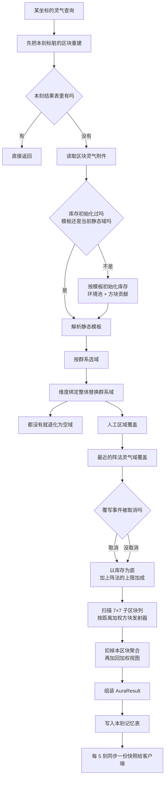
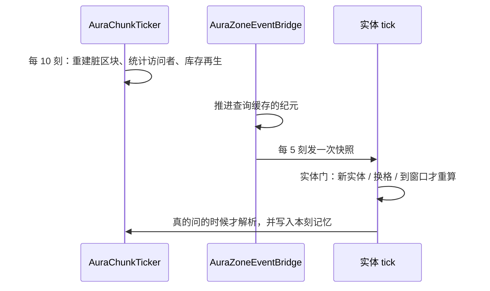

# 灵气计算

这一页讲的是「某个坐标的灵气是多少」在代码里是怎么算出来的。字段怎么填见[aura（灵气）](/datapack/json/aura)与 [aura_zone（灵气区域）](/datapack/json/aura_zone)。

## 代码位置

| 类 | 职责 |
| --- | --- |
| `runtime.world.AuraService` | 唯一的查询入口：选域、算存量、加权方块贡献、消耗与查询。 |
| `runtime.world.AuraQueryCache` | 单游戏刻记忆：结果、静态域、存量、群系、可用度… |
| `runtime.world.AuraChunkTicker` | 周期工作：脏区块重建、访问者统计、库存再生。 |
| `runtime.world.AuraZoneEventBridge` | 实体 tick 的查询门、区域进出事件、给客户端发快照。 |
| `attachment.AuraChunkAttachment` | 区块库存：权威、持久、可消耗、会再生。 |
| `runtime.world.BlockAuraService` | 方块发射器：扫描区块、生成子区块聚合。 |
| `runtime.world.BlockAuraSectionCache` | 一个子区块的聚合值与来源坐标。 |
| `runtime.world.AuraWorldAttachment` | 人工灵气区域（永久，按矩形）。 |
| `runtime.world.AuraClientState` | 客户端插值快照。 |
| `runtime.cultivation.AuraDistributionService` | 同一区块内多个玩家的分配。 |
| `runtime.aura.AuraLookup` | 定义查找：值 → 灵气、全量枚举。 |

## 先分清两件事

- **`mxt:aura` 是身份，不是数量**：一个 `Aura` 只声明「我是哪种灵气」（它计量哪个 `resource`、属于哪个元素、爆发量多少…）。
- **一个坐标的答案是 `AuraResult`**：它是一张 `灵气 → AuraPool(amount, maximum, regenPerTick, supplied)` 的表，外加规则、来源与 `SourceKind`。表里有哪几种灵气，就是「这里由哪些灵气构成」。

`supplied` 单独记「这份量里有多少是脚下的方块发射器给的」，因为允许花掉脚下地形的消费者（例如抽取环境的阵法）必须先扣掉自己这一份，否则会重复计账。

## 解析流程



几个容易读错的地方：

- **选域是整体替换，不是叠加**。群系域命中就用它，否则看维度绑定；两者都没有就是空域。人工区域覆盖前两者，阵法灵气域再覆盖人工区域——最终只有一个模板生效。
- **同层靠 `priority` 决胜**，平手时取注册表 ID **升序较小**的那个；空域的优先级是 `Integer.MIN_VALUE`，所以永远垫底。
- **阵法取「最近的那个能给出灵气域的」**，不是取优先级最高的：否则内层护罩会把它所处阵法的灵气域挡掉。
- **覆写事件可以否决**：阵法那一步解析完会发一个事件，被取消就不生效（仍然保留前面选出的模板）。
- **只有在库存为空或模板变了时才重新初始化**：模板换了要重算，否则沿用库存——库存是「已经被消耗过」的状态，不能每次查询都推倒重来。
- **查询自己会写状态**：`AuraChunkTicker` 给未初始化的区块做初始化时，走的就是一次「区块中点」的查询。

## 环境的存量怎么算

模板决定这一处**环境**能给多少（不含方块发射器）：

```java
double initial = Math.max(0.0D, (value.amount() + noise(pos)) / 10.0D - 5.0D);
double fluctuation = factor(zone, gameTime);
new AuraPool(initial * fluctuation, value.max().resolve(initial), value.regenPerTick());
```

- `amount` 先做一次 `/10 - 5` 的平移与缩放（`amount` 默认 `0`，所以没有声明的地方就是 0），再加二维 value noise。
- **波动只缩放 `amount`**：`maximum` 用的是**未缩放**的 `initial` 去解析 `max`（默认 `InitialMultiplier(1)`，即上限就是该处的初始值）。
- 波动周期：日循环 `24000` 刻、月循环 `192000` 刻，`1 + amplitude * sin(...)`，下限 0；`static` 或不启用就是 1.0。
- `AuraPool` 的约束是「有限且非负，`maximum` 允许 `+∞`」；`amount` 只要 `maximum` 有限就会被钳到 `maximum`，所以再生不会越过上限，而上限为无穷的池没有上界。

## 方块发射器：7×7 子区块列

方块贡献由 `applyBlockDistance` 按**子区块**遍历：水平 `dx, dz ∈ [-3, 3]`（7×7 列），竖直方向遍历该区块附件里已记录的每个子区块。

| 距查询点 | 用什么 | 距离 |
| --- | --- | --- |
| 3×3×3 子区块以内 | 遍历 `sources()` 里的**真实方块坐标**，逐个加权 | 方块中心到查询点 |
| 更远 | 用该子区块的**聚合值**，位置取**子区块中心** | 子区块中心到查询点 |

权重统一是 `1 / max(1, d²)`（避免零距离产生无穷值）。每一项再乘一个可用度：

```java
double available = Math.clamp((shared.amount() - environmental) / aggregate.amount(), 0.0D, 1.0D);
return available / Math.max(1, visitors);
```

也就是「共享库存里已经消耗掉多少」按比例折算，再按**访问者数**平分——同一份方块灵气被 N 个玩家索取时不能每人拿满。最后把当前区块的库存改成「扣掉本区块聚合、加上加权视图」，方案数、上限和再生都这么处理，`supplied` 记的就是加进来的那份加权 `amount`。

未加载的区块直接跳过：**边界处的灵气会凭空低一截**，这是刻意的取舍（不为查询生成地形）。

## 近似误差有多大

唯一近似是「3×3×3 以外的发射器塌缩到子区块中心」。仓库里的误差研究（`research/15_子区块灵气缓存误差研究.md`）在**单方块、贡献为 1** 的模型下量化了它：


*横轴是玩家到子区块中心的距离（格，对数），纵轴是灵气值（对数）。虚线是真实值的 P95，点线是被塌缩到中心后的缓存值。*


*同一模型下的绝对误差。摘要：距中心 1 格时平均误差 1.310 / P95 3.229；4 格 0.0513 / 0.0694；8 格 0.0182 / 0.0438；16 格 0.00205 / 0.00657。想让 P95 误差 ≤ `0.01` 需要把逐方块范围放到 15 格，≤ `0.001` 要放到 28 格。*

读这两张图时注意三件事：

1. **它是「一个方块」的模型**，不是整片地形；方块贡献是线性缩放的，贡献为 `s` 时把阈值一起乘 `s`。
2. **研究用的衰减是 `1/r²`，运行时是 `1/max(1, d²)`**，所以它只能当量级参考，不能当验收数据（研究本身也标注了这一点）。
3. **近距离最坏值远大于均值**：玩家贴着源方块、而源被塌缩到远处的子区块中心时，误差可以比 P95 还大。代码的精确区是 3×3×3 子区块（约 16 格半径），正好落在研究建议的 15 格附近。

## 一 tick 里的顺序



- **方块变更**：破坏/放置事件在较低优先级登记脏区块，下一个周期的 `flushDirty` 重建；而查询**每次开头都先 `flushDirty`**，所以本 tick 放的方块立刻可见。
- **再生**：每 10 刻（服务端配置「灵气 → 方块灵气周期」）对已加载区块执行 `amount + regenPerTick * 经过刻数`，并被上限钳住。
- **重扫**：每个区块每 `200 + rand(400)` 刻重扫一次方块发射器，避免只依赖方块事件。
- **同刻记忆**：结果、静态域、存量、群系、可用度都按「位置 + 本刻」记忆，纪元由 `AuraZoneEventBridge` 在一个 tick 的**最后**推进——所以同一个 tick 内的库存变化不影响已经算出的答案，**新激活的阵法要下一 tick 才看得到**。
- **实体门**：实体 tick 不再无条件查询，只有「新实体 / 换了方块坐标 / 换了维度 / 距上次重算已到窗口」才解析。窗口由服务端配置「灵气 → 实体灵气周期」控制（默认 10 刻，1–1200；设为 1 就是每个实体每 tick 都算）。代价是静止实体的区域进出事件最多延迟这么多刻。

## 性能：一次查询的 140 µs 花在哪

`research/17_灵气解析性能与记忆化.md` 用分阶段计时量过一次未命中查询（测试包，5 个灵气区域）：

| 阶段 | 开销 |
| --- | --- |
| `biome`（`getBiome` + 取 ID，**每次查询 57 次**） | ≈ 23 µs |
| `static`（注册表选域） | ≈ 6 µs |
| `pools`（环境存量） | ≈ 0.5 µs |
| `sources`（方块来源可用度） | ≈ 7 µs |
| 合计 | ≈ 140 µs |

结论有点反直觉：**瓶颈是 `getBiome`，不是注册表扫描**——7×7 里的每个方块来源都要先问一次群系。加记忆化后重复查询从 155.6 µs 降到 5.8 µs（约 27 倍）；注册表选域那几微秒在少量区域的包里根本不是问题，所以**没有给 `aura_zone` 建索引**——数据包堆到上百个区域时才值得做「群系/维度 → 候选域」的查表。

记忆表按位置或「位置 + 定义」索引，每张上限 16384 条，超限直接换新表（最坏只是重算）；**不会读到过期数据**。

## 客户端看到的是快照

客户端跑的不是同一套计算，也没有同步附件：服务端每 5 刻（服务端配置「灵气 → 同步周期」）对每个玩家算一次，发一个「来源 + 实际值 + 环境值」的包，客户端 `AuraClientState` 保存目标快照并按约 0.25 秒的时间常数插值（非有限值一律清洗掉）。

用到它的地方：

- **雾**：按区域定义的 `client_render` 改雾色与远端距离，强度乘以「环境浓度 / 该区域灵气值之和」。
- **资源条与 HUD**：按区域定义的 `client_hud` 绘制浓度条。
- **公式上下文**：`mxt:actual_concentration` / `mxt:environment_concentration` 在客户端读快照，在服务端读实时查询——同一个变量名，两边来源不同。
- **粒子**由服务端直接发，不经过快照。

注意「实际值」含库存与方块贡献，「环境值」（`getSensedAura`）只按模板重算环境，两者都叫浓度，别混。

## 配置与数据包

| 配置 | 默认 | 作用 |
| --- | --- | --- |
| 服务端配置「灵气 → 方块灵气周期」 | 10 | 方块缓存重建与库存再生的周期（刻）。 |
| 服务端配置「灵气 → 实体灵气周期」 | 10 | 静止实体重算的窗口（刻）。 |
| 服务端配置「灵气 → 同步周期」 | 5 | 向客户端发快照的间隔（刻）。 |
| 服务端配置「灵气 → 耗时统计」 | 关 | 每 10 秒输出一次解析耗时，仅诊断。 |
| 服务端配置「阵法 → 抽取环境灵气」 | 关 | 阵法是否可以花掉控制器位置的环境灵气。 |

参与计算的四个注册表，分工并不一样：

| 注册表 | 参与「坐标灵气」的方式 |
| --- | --- |
| `aura_zone` | **主角**：模板、环境存量、上限、再生、波动、噪声、选域优先级、客户端表现。 |
| `block_aura` | 方块发射器：匹配的方块为每种灵气贡献 `amount/max/regen`。 |
| `mxt:aura` | 只提供身份：计量哪个资源、属于哪个元素（影响客户端环境色与元素条件）。 |
| `item_aura` | **不参与**坐标灵气：它是把灵气写进持有者自己的资源池。 |

仓库内置的 `block_aura` 只有灵石块（`amount 50 / max 50 / regen 0.1`），并且**当前没有任何 `aura_zone` 文件**——所以开箱即用时每个坐标都会落到空域（`source = mxt:empty`，`SourceKind.CHUNK`），再叠上方块发射器。要看到环境灵气，得自己写 `aura_zone`。

## 代价与限制

- **未加载区块不计**：查询窗口里有未加载的区块就直接跳过，所以区块边界、跨维度、未加载区域的阵法都会让读数偏低。搜索范围是 7×7 列，**不会为了查数生成地形**。
- **同刻陈旧窗口**：一个 tick 内的库存变化（新激活的阵法、刚变化但还没 flush 的方块）要到下一 tick 才反映到查询里；跨越这个窗口的唯一开关是上面那几个周期配置。
- **访问者平分是记账近似**：所谓「访问者」是每个玩家的 7×7×7 子区块都记一次，不检查他真能不能看到那个子区块；这份统计每 10 刻清零重算。它保证「一份地形灵气不会被 N 个玩家各拿满」，但它不是视野判定。
- **`SourceKind.CHUNK` 这个名字容易误读**：它表示「没有群系/维度/区域模板」，不是「来自区块库存」。
- **热与慢**：`getBiome` 是单项最大开销；方块发射器重扫是整列扫描（已加载区块 × 世界高度）；清除缓存类命令会同步重建半径内的所有已加载区块，会卡一下；方块匹配每次都重新解析 `block_aura` 的标签。
- **诊断看不全**：记忆表的命中/未命中都有计数，只有整条管线的结果表只有命中数——从日志判断不出它的漏检率。

## 相关阅读

- [aura（灵气）](/datapack/json/aura) / [aura_zone（灵气区域）](/datapack/json/aura_zone) / [block_aura（方块灵气）](/datapack/json/block_aura) / [item_aura（物品灵气）](/datapack/json/item_aura)：每个字段的含义。
- [灵气](/kubejs/api/values) 与 [Java API](/java/api)：`AuraService`、`AuraLookup` 与脚本侧入口。
- [敌我识别系统](/technical/identification)、[伤害系统](/technical/damage)：另外两个子系统的源码说明。
