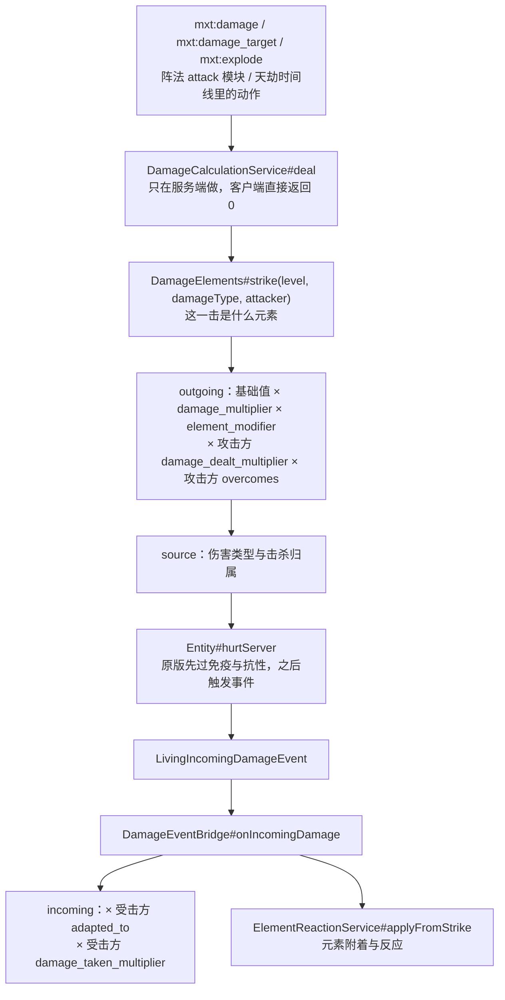

# 伤害系统

这一页把伤害这条线一次讲完：**数据包里怎么写**（声明这一击的伤害类型与元素、哪条路径会被收拢进来）以及它在代码里**为什么**是这个样子。

## 代码位置

| 类 | 职责 |
| --- | --- |
| `runtime.damage.DamageCalculationService` | 唯一的公共出口：算两层、构造伤害来源、落伤害。 |
| `runtime.damage.DamageElements` | 「这一击是什么元素」的反查表：伤害类型 → 认领它的元素。 |
| `runtime.damage.DamageEventBridge` | 第二层的挂载点，挂在 `LivingIncomingDamageEvent` 上。 |
| `runtime.element.ElementReactionService` | 元素附着与反应，也由这个事件顺手喂。 |

包前缀 `com.iafenvoy.mxt`，文件都在 `src/main/java/com/iafenvoy/mxt/` 下。

## 一次打击的时序



第一层的入口只有 `deal` 一个，所以「模组自己发出的伤害」不会漏掉某条路径；第二层只有事件一个入口，所以「打在这个实体上的伤害」不管是原版的摔落、别的模组的剑，还是自己的火球，都走同一段减免。

## 为什么必须分成两层

两层读的是同一份「这一击是什么」，但算在两个不同的实体旁边，这是被数据逼出来的，不是风格选择：

- **出力需要的信息只有发伤害的地方有**：正在施放哪个能力、这次施放的技能水平倍率是多少、攻击者的灵根是什么、目标是谁。受击侧的事件只看得到一个 `DamageSource` 和一个数字，构造不出这些。
- **减免需要的信息只有受击的地方有**：受击者自己的适应关系，以及**所有**打过来的伤害——包括原版的与别的模组的，它们根本不会经过 `deal`。写在发伤害处就等于只对自己的攻击生效。

代价是两处不能互相重复：`DamageEventBridge` 因此挂在「每次伤害序列只触发一次」的事件上，任何发伤害的路径都不再自己做减免。

## 第一层：出力

```java
public static double outgoing(@Nullable Entity attacker, Entity target, double amount,
                              @Nullable FormulaContext context, Set<Holder<Element>> elements) {
    if (!Double.isFinite(amount) || amount <= 0.0D) return 0.0D;
    double result = amount * masteryMultiplier(context) * elementMultiplier(context)
            * physiqueMultiplier(attacker, true) * overcomeMultiplier(elements, target);
    return Double.isFinite(result) && result > 0.0D ? result : 0.0D;
}
```

运算顺序是固定的：**数据包/公式给的基础值 → × `damage_multiplier` → × `element_modifier` → × 攻击方的 `damage_dealt_multiplier` → × 攻击方的 `overcomes`**。往后才是受击方的 `adapted_to` 与 `damage_taken_multiplier`（在第二层）。

- **`damage_multiplier` 属于「这次施放」**，由 `AbilityService#withAbilityScaling` 写进公式上下文，值来自 `SkillStageService#damageMultiplier`：它遍历持有者已学的功法，挑出「当前所处水平确实授予了这个能力」的那些，取其中**最大的**倍率——几个功法各给一份倍率不会相乘，因为打出去的只有一击。`skill_stage` 的 `damage_multiplier` 默认 `1.0`，负数或非有限值在加载期就被拒。
- **`element_modifier` 是灵根的那一半，也属于「这次施放」**：同一个 `withAbilityScaling` 把「匹配灵根的 `element_ability_modifier`」按 `element_affinity_mode`（平均或取最好）算成一个值写进上下文，`elementMultiplier(context)` 直接乘进去。它**不只是**给公式看的变量——内容是写 `"damage": 12` 还是 `"damage": "12 * element_modifier"`，现在后者会乘两次，所以**不要再手写**。能力不带 `element_affinity` 或伤害不是由施放产生（阵法 tick、诅咒、原版攻击）时上下文里没有这个值，读作 `1.0`；灵根把这个倍率写成 `0` 表示「我这门元素打不出东西」，这一层照样乘 `0`（与施放门槛同一套读法）。
- **`damage_dealt_multiplier` / `damage_taken_multiplier` 属于「这个人」**：它们来自在效 `physique` 定义，第一层读加害者的「打出」倍率、第二层读受击者的「受到」倍率，多条生效体质**相乘**（每一条都是一个独立来源）。求值用的是**持有者自己的**公式上下文，不是对方的——「这个身体挨多少」不能取决于谁在问。写死的数字在加载期校验有限非负，公式算出的负数或非有限值按不贡献处理（与被动属性同一类公式同一条规则）；`0` 合法，等于免疫或打不动。
- **元素倍率属于「双方」**。`overcomeMultiplier` 对攻击方元素集合与防御方元素集合做**双重循环逐对相乘**，每一对由 `Element#overcomeMultiplier` 把该元素 `overcomes` 里所有匹配关系相乘。任一集合为空（无灵根、无元素）或目标不是 `LivingEntity` 时是 `1.0`，也就是「没有关系可算」。
- **反噬与自伤因此自然地没有元素边**：`mxt:damage` 打在施法者自己身上时，加害者是 `null`（`DamageAction#attacker` 里 `caster == entity` 就返回 `null`），元素集合为空，克制不参与，「打出」倍率也无从谈起（没有加害者）；但 `damage_multiplier` 与 `element_modifier` 照样生效——功法越强、灵根越合，反噬越重，那是这次施放的价值，不是某一击的属性。
- **没有 clamp、没有上下限**：非有限值或 ≤ 0 一律当作「没有伤害」，除此之外原样返回。数值纪律交给数据包（倍率必须有限非负，但 `0.0` 合法，等于免伤/无效）。

## 第二层：减免

```java
public static double incoming(LivingEntity target, Set<Holder<Element>> attacking, double amount) {
    if (!Double.isFinite(amount) || amount <= 0.0D) return 0.0D;
    double result = amount * adaptationMultiplier(target, attacking) * physiqueMultiplier(target, false);
    return Double.isFinite(result) && result > 0.0D ? result : 0.0D;
}
```

- **只读受击方的 `adapted_to`**：`adaptationMultiplier` 同样是逐对相乘，但只取防御方那一侧的关系。「被克制」是攻击方的优势，不是受击侧的第二次加成，所以 `overcomes` 在这一层不再参与。
- **受击方自己的 `damage_taken_multiplier` 也在这里**，而 `physiqueMultiplier` 只看体质定义、不看攻击者是谁：一层物理减伤、一层属性抗性、一次「霸体」都写在同一张表上，谁打过来都一样。它同样在 `1.0` 与 `0.0` 之间没有特例——`0.0` 就是免疫。
- **只触发一次**：`LivingIncomingDamageEvent` 在一次伤害序列里只发一次，无论这一击是谁发出来的，这就是第二层不会被重复计算的原因。
- **本层从不取消事件**：拒绝一次伤害属于保护与无敌规则的事（`FormationProtection`、原版抗性），关系只改变这一击值多少。因此监听器里第一件事是「已取消就什么都不做」——被取消的序列不会应用任何东西，改它的数字只是改一个没人读的值。
- **被无敌帧挡掉的一击也会走完这一层**：原版把重复的小伤害丢掉发生在事件之后，所以「没掉血」不代表「没算过」——减免写回去的数字没人读，但元素的附着已经落在身上了（见下一节）。
- 客户端直接跳过：`target.level().isClientSide()` 时返回，避免在客户端把服务端才有的注册表当权威。

## 这一击是什么元素

元素**只从伤害类型读出**，这是整套设计的地基：第二层手里只有一个 `DamageSource`，如果元素不能从 `typeHolder()` 反查回来，减免就无从下手。

`DamageElements` 维护的是一张反查表：`Map<伤害类型注册表实例, Map<Holder<DamageType>, List<Holder<Element>>>>`。

- **认领**来自元素的 `damage_types` 字段，可以直接写类型，也可以写标签（标签会展开成注册表里所有匹配的类型）。一个类型被多个元素认领时**全部保留**，并且每个认领都参与相乘——和多个灵根的行为一致——同时打一条日志，因为那多半是数据包写重了。
- **表的生命期跟着注册表实例走**：数据包重载会换掉注册表实例，表随之重建；缓存最多保留若干份，超出后整体重建。构建时会跳过被 `mxt:disabled` 标签禁用的元素，所以禁用元素要等一次重载才在反查表里生效。
- **回落顺序**：伤害类型有人认领就用认领者；没人认领就回落到**攻击者的灵根元素**；连攻击者都没有（摔落、仙人掌、无归属的环境伤害）就是空集，两层都按 `1.0` 结算，`mxt:element` 条件返回 `false`。这就是「无法判定的打击没有属性」的实现方式，而不是给一个默认元素。
- **`resolveType` 负责把声明翻译成类型**：`mxt:damage` / `mxt:damage_target` 写了 `damage_type` 就原样用，写了 `element` 就取该元素认领的第一个类型，两个都写时会核对元素**确实**认领了这个类型——不一致时各报一次日志，但**不使加载失败**。
- **核对为什么不能在加载期做**：数据包注册表是并行加载的，跨注册表的值那时候未必绑定，同一个包会随加载顺序时对时错。所以第一次真的用上这个声明时才核对，报错只提醒一次（同一句抱怨只打一行），运行继续。
- **没有服务器时返回空集而不是抛异常**：客户端脚本问一句「这伤害是什么元素」不该把客户端带崩。

## 来源与归属

`DamageCalculationService#source` 是唯一构造伤害来源的地方，调用方不各自决定归属：

- 声明了 `damage_type` → `new DamageSource(type, attacker)`，击杀算在 attacker 头上。
- 没声明 → 原版的 `playerAttack` / `mobAttack`，没有加害者时 `generic`。

放在这里而不是各调用点，是为了让「这一击归谁」和「这一击值多少」出自同一个地方；顺带一个容易忘的后果：原版只在**受击者是玩家**时按难度缩放 `playerAttack` / `mobAttack` 这类来源，想要不随难度变化的固定来源就得写 `damage_type`。

**`deal` 的返回值是「交给目标的数值」，不是「实际掉的血」**：`hurtServer` 因为无敌帧、免疫或事件取消返回 `false` 时，`deal` 仍然返回 `shaped`。调用方要判「打中没有」得看 `hurtServer` 的结果或后续事件，不要看这个返回值。

## 被收拢进来的入口

| 入口 | 走第一层的方式 | 归属 |
| --- | --- | --- |
| `mxt:damage`（实体行为） | `DamageAction#execute` → `deal` | 施法者不是目标时才有；自伤无归属 |
| `mxt:damage_target`（双实体行为） | `DamageTargetBiEntityAction#execute` → `deal(ctx.actor(), …)` | 施加者 |
| `mxt:explode`（实体行为） | 用 `ShapedCalculator` 包住原版爆炸计算器，只有 `getEntityDamageAmount` 走 `outgoing` | 施法者作为爆炸起因 |
| 阵法 `attack` 模块 | `FormationActionRunner#attack` → `deal` | 由 `attribute_to_owner` 决定（默认 `true`） |
| 天劫时间线里的动作 | 时间线条目执行的就是上面的 `mxt:damage` 一类动作 | 看动作本身 |

**故意不走第一层的**：`mxt:spawn_lightning`（闪电的伤害量由原版算，写 `cause` 只决定归属）与方块版 `mxt:explode`——这两种根本没经过 `deal`。`mxt:spawn_projectile` 生成的投掷物虽然把施法者记为 owner，命中的伤害量仍由原版算（箭的威力不读数据包）。它们仍然走第二层，所以只要元素认领了那些伤害类型（闪电、爆炸、岩浆、摔落……），属性照样算得出来；投掷物那一类的优势是攻击者还在，元素适应也照样能读。

**爆炸为什么要套一层计算器**：原版爆炸会给每个实体算一个自己的伤害数字，唯一能插手的地方就是 `ExplosionDamageCalculator#getEntityDamageAmount`。所以 `mxt:explode` 把原版计算器包起来，只改写这一个方法——方块破坏、要不要伤害某个实体都照原样转交。不这么做的话，施法者的爆炸就会是全模组唯一无视他技能水平与灵根的一击。

## 在数据包里声明这一击

`mxt:damage` 与 `mxt:damage_target` 各有两个可选字段，用来声明「这一击是什么」：

| 字段 | 类型 | 默认 | 说明 |
| --- | --- | --- | --- |
| `damage_type` | `Holder<damage_type>` | 无 | 这一击的伤害类型。有它就按它构造来源；没它就按原版玩家/生物攻击来源（`mxt:damage` 没有归属时是 `generic`）。 |
| `element` | `HolderOrTag<element>[]` | `[]` | 这一击的元素声明。只写 `element` 时伤害类型取该元素认领的第一个类型；与 `damage_type` 同写时，**首次真的用上**这一击时核对元素确实认领了它，不一致会各报一次日志。 |

元素仍然**只从伤害类型读出**，所以 `element` 不是第二个真相，而是把作者意图写进定义、并让运行时替你核对——写了 `element` 却忘了让那个元素认领对应伤害类型，会在第一次用上时报一行日志，而不是在战斗中悄悄算错一个数。这个检查**不能**放在加载期：跨注册表的值那时未必已绑定，同一个包会随并行加载顺序时对时错。第二层减免只拿得到一个 `DamageSource`，元素必须能从伤害类型读回来，原因就在这里。

> 没有声明 `damage_type` 时，带归属的伤害使用原版的 `playerAttack` / `mobAttack` 来源：击杀会计到加害者头上，而原版只在**受击者是玩家**时按难度缩放这类来源的伤害。想要一个不随难度变化的固定来源，就自己在定义里写 `damage_type`。

不属于这套的东西也值得点一句：

- **伤害类型 → 元素的映射完全由数据包声明**：`element.damage_types` 是唯一说「这个类型是哪种元素」的地方，模组不硬编码任何映射。认领优先，没人认领才回落到攻击者灵根。
- **法器（`item_archetype`）不提供任何攻防数值**：它们通过授予的能力与携带的属性参与战斗。
- **框架没有塑形过的伤害照样过第二层**：适应是实体自己的属性，不是这套攻击的属性。

::: tip 在游戏里试
测试模组带了 `/mxt_test damage`：它用带已知元素关系的临时实体把两层都跑一遍，并报告量到的数值是不是它预期的那个。
:::

## 元素附着与反应

同一个事件里，减免用的那份元素集合紧接着被交给 `ElementReactionService#applyFromStrike`：按每个元素自己的 `damage_attachment` 往目标身上累积，然后尝试触发元素反应（反应自己有一条链式上限，防止互相引爆）。**读一次来源、用两次**，是为了让「减免用的元素」和「附着用的元素」不可能是两个答案。

放在这里同样是为了覆盖面：一次岩浆浴和别的模组的火球，和自己家的火球一样会给目标叠上火。

## 代价与限制

- **每次命中都要算**：反查表有缓存（一次数据包重载构建一次），但 `Elements#of` 每次都要读灵根并建集合，两个倍率是 O(n×m) 的双重循环且不做记忆化。命中频率远低于 tick 频率，所以这是可接受的取舍；要在同一次结算里反复问同一个问题，调用方得自己收着答案。
- **首次构建是同步的**：第一击会触发一次全量遍历元素注册表并把结果冻结成不可变结构，之后都是读。
- **数据包错误只报日志**：声明与类型不符、多个元素认领同一类型、只写标签元素导致无法确定类型——都只提醒一次然后继续跑。所以改完元素后要去看日志，别指望启动失败。
- **减伤没有下限、倍增没有上限**：多个元素都被克制就乘多次，一次性拉满或打空都是数据包的事。
- **`LivingIncomingDamageEvent` 上的顺序未定义**：本模组没有声明优先级，别的模组同样在这个事件上改 `amount` 时，先后顺序不确定。

## 相关阅读

- [element（元素）](/datapack/json/element)：`overcomes` / `adapted_to` / `damage_types` / `attachment_*` 的每个字段，以及伤害类型怎么被认领。
- [skill_stage（技能水平）](/datapack/json/skill_stage)：`damage_multiplier` 的取值规则。
- [公式变量](/datapack/types/formula_variables)：`damage_multiplier` 在定义自己的公式里怎么读。
- [实体行为](/datapack/types/action/entity_action_types)与[双实体行为](/datapack/types/action/bientity_action_types)：`mxt:damage`、`mxt:damage_target` 的完整字段表。
- [Java API](/java/api)：`DamageCalculationService` 与方法签名。
