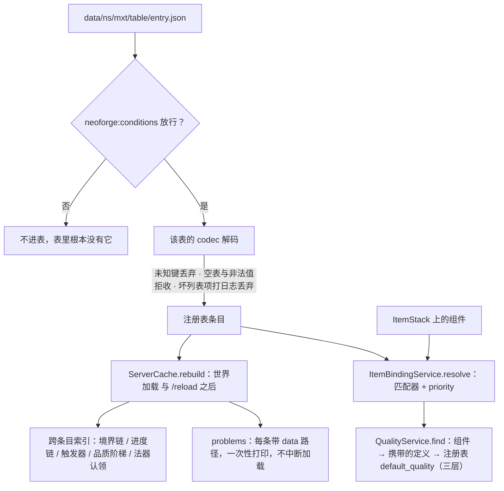

# 数据加载

这一页讲**一份 JSON 变成一次结算里那个对象**的整条线：什么时候读、读出来之后存在哪、"哪条声明适用于这一堆物品"在哪一步决定、下一次重载什么时候把旧答案作废。

## 代码位置

| 类 | 职责 |
| --- | --- |
| `registry.MxtResourceKeys` | 每张表的 `ResourceKey`，与注册表实例、注册事件分开，好让 codec 与运行时服务不必依赖注册类。 |
| `registry.MxtDatapackRegistries` | 40 张数据包注册表的登记与统一读取入口，其中九张按 `items`（物品键）或 `blocks`（方块键）认领条目。**不持有任何快照**，重载与同步都交给原版注册表系统。 |
| `registry.MxtRegistries` | 固有注册表的 `DeferredRegister`：`type` 那一层的分派（行为、条件、消耗、技能类型……）。 |
| `registry.MxtDataComponents` | 物品数据组件的登记：每个组件同时声明持久化 codec 与网络 codec。 |
| `runtime.ServerCache` | 世界加载与 `/reload` 之后的唯一重建点：跨条目索引 + 校验报告。 |
| `runtime.item.ItemBindingService` | 绑定表的解析：一次操作一份 `ResolvedBindings` 快照。 |
| `runtime.item.QualityService` | 品质的唯一解析顺序（三层），以及"这件物品能不能用"的闸门。 |
| `util.matcher.ItemMatcher` | "哪条声明适用于这一堆"，两层共用。 |

包前缀 `com.iafenvoy.mxt`，文件都在 `src/main/java/com/iafenvoy/mxt/` 下。

## 两层：内容层与绑定层

注册表按**它回答什么问题**分成两层；另有九张按条目认领物品与方块的注册表，它们不定义东西，只给已经存在的物品、方块接上规则或值，也列在下面。

| 层 | 表 | 回答什么 |
| --- | --- | --- |
| 内容层 | `artifact`、`spirit_herb` | "这件物品**是**什么"。定义自己就是那个东西（注册表 id 就是它的名字），并认领一批物品当自己的载体。 |
| 内容层 | `resource`、`aura`、`realm_stage`、`element`、`spirit_root`、`physique`、`ability`、`technique`、`quality`、`formation`、`talisman`、`pill` 等其余各表 | 别的定义按 id 引用它们；它们不认领物品。 |
| 绑定层 | `item_binding`、`weapon_binding`、`tool_binding`、`blueprint_binding`、`pill_binding`、`technique_binding` | "这件**已经有**的物品，在本模组里还算什么"，以及要往上接哪些规则。 |
| 绑定层 | `item_aura`、`currency`、`default_quality`（物品键）、`block_aura`、`heat_source`（方块键） | "**这一个**条目带什么值"：物品或方块自己带着的那份值。 |

绑定层这些表写法一致：一份文件一条定义，文件在 `data/<命名空间>/mxt/<表>/<条目>.json`，条目用 `items`（物品键）或 `blocks`（方块键）认领物品与方块，`priority` 决定多条同时命中时谁赢——数值大者胜，同分回落注册表顺序（`block_aura` 没有这个字段：多条命中同一个方块时全部生效、相加）。它们都**从不定义物品本身**：物理物品由原版、模组或 KubeJS 注册，绑定层只往上接规则——`ItemStack` 里**从来不存一份逻辑物品定义**，只存组件。

内容层与绑定层的区别不是"读不读物品"（内容层那两张表也按匹配器认领物品），而是**定义的是东西还是规则**：`artifact` 说"这几件物品是法器、它有这些能力"，`weapon_binding` 说"这件物品挥出去时多跑一段行为"。所以同一个物品可以同时被一个 `artifact` 认领、被一个 `weapon_binding` 接上武器规则、再被一个 `item_binding` 接上一段使用后行为。

绑定层各张表加的是什么：

| 表 | 加上的规则 | 什么时候跑 |
| --- | --- | --- |
| `item_binding` | 用完一件物品后的行为数组、条件、物品的构成元素 | `LivingEntityUseItemEvent.Finish` |
| `weapon_binding` | 攻击 / 右键 / 每 tick 的行为、`attributes`（写进堆的 `ATTRIBUTE_MODIFIERS`） | 攻击、右键、每 tick 刷新 |
| `pill_binding` | 这一族物品是哪一份丹药，以及它自己的服用次数上限与冷却 | 服丹时（闸门与计次） |
| `technique_binding` | 这件物品教哪门功法，以及读它的时长、姿势与门槛 | 读功法 |
| `tool_binding` | 这件工具解锁哪些锻打方式 | 锻造 |
| `blueprint_binding` | 这件图纸提供哪些锻造蓝图 | 锻造 |

## 一份 JSON 的旅程

**登记。** 数据包注册表在 `NewRegistry` 事件上登记，存档 codec 与同步 codec 传的是同一个对象，所以每个定义只写一份 codec。定义里引用另一条定义时用的是 **Holder codec**（`X.CODEC`，`RegistryFixedCodec`），它解出来的 holder **不看注册表**。

**文件与解码。** 文件在 `data/<命名空间>/mxt/<注册表路径>/<条目路径>.json`，条目 id 就是命名空间加路径——上面那九张按条目认领物品与方块的注册表也走同一条路，一条定义一个文件、每个条目有自己的 id。解码由该表自己的 codec 负责，四种结果要分清：

- **未知键静默丢弃**：`RecordCodecBuilder` 不认识没写的字段，一份写着旧字段的文件照常加载，只是那个键不再生效。改字段名时不会有人替你报错。
- **空表、空列表、非法值拒收**：这一类走 `.validate(...)`，加载报错。
- **集合容错**：`CollectionCodecs` 这类集合 codec 会把坏条目打一条 `Ignoring invalid list element` 后丢掉，剩下的照常进来。
- **`neoforge:conditions` 挡掉的条目根本不进表**：所以运行时不需要"这一条是不是被停用了"这层判断，读到 holder 就能直接动用。

**读。** 服务端用 `MxtDatapackRegistries.holder(key, id)` 这一组（内部读当前服务端的注册表，没有服务端会抛）；客户端必须用带 `Provider` / `RegistryAccess` 的重载，别在渲染线程碰那组不带访问器的。

## 什么时候算加载完

**注册表实例在重载后可能还是同一个对象**——`ServerCache` 的注释正是按"重载后的包可能保留实例"写的——所以按注册表实例开键的缓存不能指望自己发现重载，必须有人显式作废。

`ServerCache.onDatapackLoaded`（`TagsUpdatedEvent.ServerDataLoad`）就是那个唯一的重建点：它先把四个实例键缓存 `invalidate()`（`DamageElements`、`ElementReactionService`、`FormulaNames`、`ChainCache`），再重建跨条目索引——境界链、进度链、按信号索引的触发器、品质阶梯、法器的物品认领表。

**跨条目的问题只能在这一步发现**，因为一条定义看不到别的条目：

- 链只认直线：被两处写成后继（分叉）、成环、接不到入口都会让走进它的那条链整条不进索引（境界链与品质链另有各自的跨链检查）——分叉也一样，没人按注册表顺序替你在两个入口之间挑一个。**指向不存在的条目不在这条里**：`next_realm` / `next_level` / 品质的 `next` 都是注册表引用，指到一个当前包没有的条目会让**整个数据包加载失败**，世界直接拒绝加载，走不到运行期。
- 两件 `artifact` 在**同一个 `priority`** 上认领同一个物品时，靠注册表顺序决定，这是一个真实的歧义，报出来。
- `quality` 的一档写了 `upgrade_costs` / `upgrade_condition` 却没有 `next`——这份升级数据永远不会被读到。
- `trigger` 没写 action（默认是 `mxt:no_op`）——照设计读得通，但几乎一定是漏了字段。
- 一门功法进了一个进度等级、却配不全它后面必须走的每一级。

每条问题都带 `data/<命名空间>/mxt/<表>/<条目>` 这样的路径，收集齐了一次性打日志，**不中断加载**：有问题的条目不进索引，它周围的定义照常可用。单条目自己的问题（字段值非法、空表）在解码期就拒了，不会留到这一步。

**附件不在重载范围内。** 实体、区块与世界的附件只在**世界加载**时解码一次，`/reload` 不重解。所以"身体里存着一份当前包已经不提供的 holder"是正常状态：要问"现在还在不在"就按 id 回查注册表，别拿手里那枚 holder 当它还存在的证据。

## 组件与绑定的解析

一次操作里"这一堆适用哪些声明"只解析一次：`ItemBindingService.resolve(access, stack)` 给出一个 `ResolvedBindings` 快照（物品 / 武器 / 丹药 / 功法四份 `Optional`），后面几步共用它。**空堆直接返回四份空**——通配匹配器否则会认领一件不存在的东西。

**匹配规则只有一套**（`ItemMatcher`）：声明的条目**任意一条命中**就算命中；多条同时命中时，`priority` **最大**的那条胜，**同分回落注册表顺序**。`block_aura` 是例外：它根本没有 `priority` 字段，命中同一个方块的多条定义**全部生效、相加**。除此之外，绑定层两张表、内容层两张认领表与那九张按条目认领的注册表，判先后用的是同一套语义。

**组件压过声明**，三处合并各管一段：

| 组件 | 压过谁 | 怎么压 |
| --- | --- | --- |
| `mxt:quality` | 一切 | 品质解析的第一层，它在，就它说了算。 |
| `mxt:pill` | 匹配到的 `pill_binding` 与它指名的 `pill` | 组件里写下的 `pill` 先指名一份定义，五个效果键再按字段盖上去；次数与冷却不在这张表里，仍只认匹配到的绑定。 |
| `mxt:technique` | 匹配到的 `technique_binding` | 有它时**不再按匹配器挑声明**，而是点名 `technique` 等于它的那一条；一条都没有就用 `TechniqueBinding.defaults(...)`。 |
| `mxt:technique_reading` | 上一步挑出的声明 | 再按字段覆盖一层阅读参数。 |

其余组件（`mxt:spirit_storage`、`mxt:artifact_state`、`mxt:curse_container`、`mxt:contract_bell`…）只装状态，不参与"哪条声明适用"。

**品质的解析顺序只有一处**（`QualityService.find`），而且是**三层**：

1. 堆上的 `mxt:quality` 组件——**全模组只有这一个组件装档位**，`/quality set`、升级成功、**锻造台结算**与**画符铭刻**都写它；按 id 回查注册表，当前包没有这一条时这一层答空；
2. **这一堆携带的定义**自己声明的档（可选字段 `quality`）——定义类型实现 `QualityProvider`、再登记它的载体组件，`QualityService.carry` 是唯一的登记入口，载体只凭这一堆就答得出，取出的引用在当前包没有对应条目时这一层同样答空。声明它的九个定义是 `technique` / `alchemy_furnace` / `alchemy_wall_material` / `spirit_root` / `physique` / `pill` / `formation` / `secret_realm` / `contract_type`；
3. 注册表 `mxt:default_quality`——堆上没有定义可问时的答案：裸的创造 / `/give` 物品，以及按物品认领的 `artifact` / `spirit_herb`。

`artifact` 与 `spirit_herb` 没有 `quality` 是有意的：它们靠 `ItemMatcher` 按物品认领，堆上没有装定义身份的组件。`talisman` 也没有：它的载体装的是一列符的 id，没有单份定义可问，档由画符配方写组件、写不上才兜底到第 3 层。模块自己的定档逻辑另外接：锻造按蓝图 `quality_by_extra_steps` 曲线、画符按完成度 `grades[].quality`，都是定完把档写进第 1 层那个组件。`mxt:forging_result` 只记锻造记录（蓝图 id 与步数），**不含档位**；所以 `/quality clear` 会把锻造/铭刻写的那一档一起清掉，退回第 2 层、再退回第 3 层。

`hasOverride(stack)` 问的是"组件在不在"，与"解析出没解析出档位"是两个问题：一件靠携带的定义或这张注册表兜底的物品也照样显示品质（组件不在）。

**"能不能用"是另一道闸门，它自己两步**（`QualityService.check`）：先看这次解析出的绑定里所有 `conditions` 是否全过（不过报 `BINDING_CONDITIONS`），再看这次解析出的档位自己的 `condition`（不过报 `QUALITY_CONDITIONS`）。绑定解析的四个调用点是"用完一件 / 攻击 / 右键 / 每 tick"，四者都先过这道闸门再跑行为。

## 为什么这么分

- **绑定层不定义物品，是因为物品不是本模组的。** 玩家的剑是原版物品、别的模组的物品或 KubeJS 造的物品，本模组能做的只有往上接规则。如果给每件物品造一份"逻辑定义"存进堆里，那这件物品就同时有了两个身份，改包之后旧堆上的那份还会是旧答案。
- **两层共用匹配器，是因为"哪条适用"是同一个问题。** 内容层要问"这几件物品归哪个法器定义"，绑定层要问"这件物品归哪条武器声明"，答案的算法一样；分成两套迟早会漂移出两种优先级语义。
- **`priority` 写在数据包里而不按条目类型分档**，是为了让"通用规则 + 特地点名"这种组合由包自己决定谁先，而不是由框架猜"更具体的那条应该赢"——猜错的代价是玩家看不见的静默覆盖。
- **组件与声明的合并方向是"组件覆盖声明"**：组件是这一堆自己的事实（它被锻造过、它铭刻了哪条符、它读的是哪门功法），声明是"这类物品通常怎样"。前者更具体，所以后写。
- **跨条目校验放在加载之后**，是因为单条定义的 codec 看不到别的条目；放在解码期就只能靠条目之间互相回调，那会让加载顺序变成语义的一部分。
- **缓存的作废不能靠注册表实例**，理由是上面那句：实例可能不变，内容已经换了。

代价也在这里：解析一次要扫一遍相关绑定表与按物品认领的注册表（`ItemMatcher.Entry#itemLevel()` 就是给这件事划的界——只由物品本身决定命中的条目能按物品开缓存，读堆上组件的必须每堆问一次）；跨条目的错误要等到世界加载或 `/reload` 之后才报，而且只报在日志里；被 `neoforge:conditions` 挡掉的条目在运行时完全不存在，客户端与服务端各自解释自己的那份包。

## 相关阅读

- [数据包开发总览](/datapack/overview)、[动态注册表](/datapack/json/index)、[物品匹配器](/datapack/types/other/item-matcher)
- [注册表与 Codec](/java/registries)、[公开 API](/java/api)（`MxtDatapackRegistries` 的重载与缓存规则）
- [接口 · NamedDefinition](/java/interfaces/definition/named-definition)（定义自带的 `name` / `description`）
