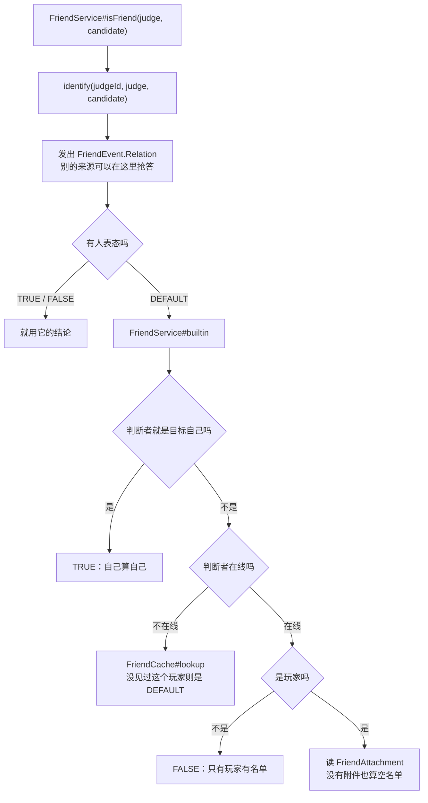
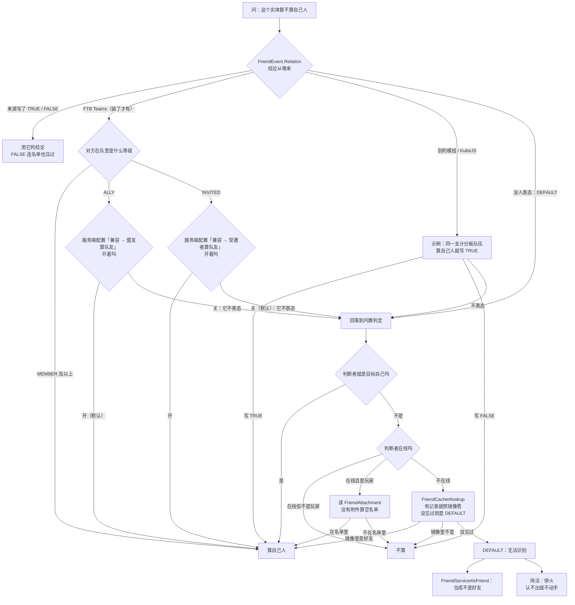

# 敌我识别系统

这一页把敌我识别（代码里叫 friend）这条线一次讲完：**名单与命令怎么用、数据包里怎么写**，以及它在代码里**为什么**是这个样子。

## 代码位置

| 类 | 职责 |
| --- | --- |
| `runtime.friend.FriendService` | 唯一的提问入口：先问事件，没人表态再问名单。 |
| `runtime.friend.FriendCache` | 离线玩家的内存镜像：玩家不在线时替他回答。 |
| `runtime.friend.FriendSessionBridge` | 会话边界：登录清空临时名单并刷新镜像，登出刷新镜像。 |
| `attachment.FriendAttachment` | 名单本身，挂在玩家实体上的附件。 |
| `event.FriendEvent.Relation` | 让别的来源抢答的扩展点。 |
| `compat.ftb.FtbTeamsRelation` | 装了 FTB Teams 时，把队伍成员与盟友接进同一个事件。 |

## 一次判断的时序



三个决定值得单独说：

- **`judge` 是「id + 可选实体」，不是实体**。玩家离线之后实体就没了，而「阵主下线、阵法还立着」正是最需要判断的时候，所以提问接口必须能只凭 id 提问。`FriendService#identify(UUID, Entity, Entity)` 就是这个形状。
- **读附件用 `getExistingData`，不创建**。一个从没用过好友系统的实体不会因为被问了一句就凭空挂上名单。
- **不记忆化**。每次调用都会 post 一次事件，而监听器有权去查世界，所以同一个 tick 内反复问同一对实体的调用方要自己收着答案。这是把「谁的规则」留给扩展点的代价。

## 名单

名单存在 `MxtAttachments.FRIEND` 上，由 `FriendAttachment` 持有两张表：`permanent` 与 `temporary`。两处细节容易踩：

- **两张表都进 Codec**（字段名就是 `permanent` / `temporary`），所以死亡重生不会丢临时名单；而结束一次「本次登录」的是**登录事件**，不是登出——下线钩子会被崩溃和被杀进程漏掉，登录不会。结果是：玩家离线期间，他上一局的临时好友仍然算好友，直到他下次登录才被清掉。
- **同一玩家只会出现在一张表里**：手改存档把同一个 id 写进两张时，读档时 `permanent` 优先，`temporary` 的副本被丢掉。写入侧也维持这条：`permanent add` 对临时好友是**升级**（移出临时表），`add` 遇到永久好友直接拒绝，`remove` 遇到永久好友返回「它是永久的」而不是假装删掉。

条目是 `NameAndId`（id + 名字）：**匹配一律按 id，名字只用于显示与命令补全**，所以改名不会让判断失败，同名不同号是两个人。表没有条数上限。

判断是**有方向**的：A 把 B 当好友，和 B 把 A 当好友是两件事，需要「互相都算」的调用方自己问两次。

## 用命令维护名单

两条名单的区别只有一条：**下一次登录时还在不在**。

| 名单 | 添加方式 | 生命周期 |
| --- | --- | --- |
| 临时 | `/friend add <玩家>` | 存档里也有一份，但**玩家登录时被清空**，因此重登、重启后失效 |
| 永久 | `/friend permanent add <玩家>` | 写进存档并保留 |

| 命令 | 作用 |
| --- | --- |
| `/friend`（= `/mxt friend`） | 输出帮助，每一行可点击填入聊天栏。 |
| `/friend list` | 列出两条名单，人数与名字；名字可点击填入移除指令。 |
| `/friend add <玩家>` | 添加临时好友。 |
| `/friend remove <玩家>` | 移除临时好友；对永久好友会拒绝并提示改用下面那条。 |
| `/friend permanent add <玩家>` | 添加永久好友；临时好友会被升级。 |
| `/friend permanent remove <玩家>` | 移除永久好友。 |

顶层 `/friend` 别名受服务端配置「命令别名 → /friend」控制，默认开启；`/mxt friend` 始终完整。帮助与列表里的可点击指令会按当前配置选择根节点，所以关掉别名之后给出的建议仍然能执行。

**点击行为是「填入聊天栏」而不是「直接执行」**（`ClickEvent.SuggestCommand`）：好友要靠玩家输入名字，帮助无法预知，所以点一下只是把指令连同结尾的空格放进输入框，光标停在名字该在的位置。`/friend remove` 的补全只列出**当前真的能移除的名字**，不会给出一个点了必然被拒绝的选项。

`<玩家>` 走的是原版档案缓存，不是在线玩家列表，因此**对方离线也能添加和移除**；这也意味着选择器语法（`@a` 等）是合法的，命令会要求恰好解析出一个玩家。

## 会话边界与离线镜像

`FriendCache` 是一份纯内存镜像（玩家 id → 好友 id 集合），存在的唯一理由是：名单挂在实体上，玩家一离线就读不到了。

| 时机 | 做什么 |
| --- | --- |
| `PlayerLoggedInEvent` | 先 `clearTemporary()`，**再**刷新镜像（顺序反了镜像就描述的是上一局） |
| `PlayerLoggedOutEvent` | 刷新镜像——这是名单还能从实体上读到的最晚时刻 |

这个设计的要点是**刷新点只有两个**：玩家在线期间读的是实体上的实时名单，镜像陈旧无害；而它开始被使用的时刻（下线之后）之前，登出那次刷新刚好补上。于是**以后新增任何写名单的路径都不需要知道 `FriendCache` 存在**。

两个刻意的选择：

- **「没有好友」和「没见过这个人」必须是两个答案**：没有附件的玩家也会被写进镜像（空集合），只有镜像里根本没有这个 id 时才返回 `DEFAULT`（「没人能回答」）。
- **清空临时名单放在登录而不是登出**：登出钩子会漏，登录不会；代价是离线期间那份数据仍然躺在存档里，直到下次登录。

## 判断事件

`FriendEvent.Relation` 的结论是一个原版 `TriState`，语义如下：

| 取值 | 含义 |
| --- | --- |
| `DEFAULT` | 没意见，交给内置名单。事件的初始值。 |
| `TRUE` | 算自己人。 |
| `FALSE` | 不算，**即使名单里写着算**。 |

写入是直接覆盖的，所以最后一个写入者生效，用 `EventPriority` 排序。两条给扩展者的规则写在类注释里：**只在「按我自己的规则算自己人」时写 `TRUE`**，其余情况保持 `DEFAULT`；写 `FALSE` 是在声明这两人是敌对的，它会压过包括玩家自己名单在内的所有来源。

`FriendService#builtin` 存在的意义是让监听器能表达「名单 + 我自己的补充」：它不会再次 post 事件，所以不会递归。反过来，**监听器里不要调 `identify`**，那会在自己内部再发一次事件。

## 三态怎么被消费

这是最容易出错的地方：同一份三态答案，两类调用方的读法不同。

| 调用方 | `DEFAULT`（没人认得出）被当成 |
| --- | --- |
| `FriendService#isFriend`（`mxt:friend` 条件、KubeJS 条件） | **不是好友** |
| 阵法（`identify` 直接判三态） | **停火**：认不出来就不动手 |

阵法这么写是有意的：`spare_friends` 的阵法如果认不出一个实体就照打，那「保护」随时可能打到自己人。新增消费方必须显式选一个语义，不要默认。

## 队伍类来源：FTB Teams

装了 FTB Teams 时，队伍成员与盟友通过 `Relation` 事件接进同一套判断（软依赖，没装时这段代码不加载）。它**只写 `TRUE`，从不写 `FALSE`**：FTB 知道自己队里和盟友有谁，但不知道玩家手填的名单，写 `FALSE` 会覆盖名单而不是与之合并。

判定基准照抄 FTB Chunks 的口径，再按配置放开：

| 队伍等级 | 默认 |
| --- | --- |
| `MEMBER` 及以上（正式队员） | 永远算，不设开关 |
| `ALLY`（队内盟友等级） | 算，受服务端配置「兼容 → 盟友算队友」控制（默认开） |
| `INVITED`（受邀） | 不算，受服务端配置「兼容 → 受邀者算队友」控制（默认关） |

两个细节：它读的是管理器内存里的队伍数据（按 id 索引），所以**能为离线玩家作答**，也因此不需要订阅队伍变更事件、不需要缓存；另外**不要**用 `TeamRank#isAllyOrBetter()` 作判据——它是 `power >= ALLY`，而 `INVITED` 的数值更高，并且自由加入型队伍会给任何陌生人返回 `INVITED`，用它等于「全服皆友」。这正是 `INVITED` 默认关闭的原因。

把前面几节的判定顺序与这里的配置开关串在一起，一次判定从头到尾是这样的：



## 在数据包里用

| 条件 | 类型 | 含义 |
| --- | --- | --- |
| `mxt:friend` | 双实体条件 | `actor` 把 `target` 当自己人 |
| `mxt:formation_ally` | 实体条件 | 该实体是**当前阵法**阵主的好友；阵法之外、或阵法没有记录阵主时恒为 `false`。阵主只是离线不属于后者——判断仍会按 UUID 问事件。 |

`mxt:friend` 用在有双实体条件槽的地方，最典型的是技能的 `target_condition`：

```json
"target_condition": { "type": "mxt:not", "condition": { "type": "mxt:friend" } }
```

`mxt:formation_ally` 用在阵法的逐实体行为里（那些行为的条件槽是实体条件，没有第二个实体可以和该实体配对，所以由阵法补上阵主这一半）。例如同一座阵法伤敌而治疗友军：

```json
"entity_tick_action": {
  "type": "mxt:if_else",
  "condition": { "type": "mxt:formation_ally" },
  "if_action": { "type": "mxt:heal", "amount": 1 },
  "else_action": { "type": "mxt:damage", "amount": 2 }
}
```

阵法还有一个更省事的入口：顶层 `spare_friends: true` 的阵法由运行时跳过好友，见[阵法](/datapack/json/formation)。两个条件都不受服务端配置影响——配置只决定顶层开关做不做。

## 扩展到自己的判定

别的模组可以给自己的规则抢答权：在 `FriendEvent.Relation` 上写结论即可。

```java
@SubscribeEvent
public static void onRelation(FriendEvent.Relation event) {
    if (!(event.candidate() instanceof Player candidate)) return;
    // 判断者可能离线，所以按 id 走；需要实体时才取，取不到就交给别的来源。
    Player judge = event.judge().filter(Player.class::isInstance).map(Player.class::cast).orElse(null);
    if (judge == null) return;
    // 同一支计分板队伍算自己人；其余情况不表态，交回好友名单。
    Team team = judge.getTeam();
    if (team != null && team.isAlliedTo(candidate.getTeam())) event.setResult(TriState.TRUE);
}

public static boolean mayHarm(Entity attacker, Entity victim) {
    return !FriendService.isFriend(attacker, victim);
}
```

监听器只需要在**有意见**时写结果。什么都不做（保持 `DEFAULT`）等价于「按名单来」，而不是「否定」。

脚本侧对应 `MxtEvents.friendRelation`：`getJudgeId()` 永远有值，`getJudge()` 在判断者离线时返回 `null`（`hasJudge()` 可先判），另有 `getCandidate()` / `getResult()`，用 `setFriend(true|false)` 表态、`abstain()` 交回名单。因为好友查询比生命周期事件频繁得多，**没有脚本监听时这条转发会被直接跳过**，不会为每次查询构造包装对象。

## 谁在问这个问题

| 位置 | 问什么 | `DEFAULT` 的后果 |
| --- | --- | --- |
| `FormationRelations#affects` | 阵法的逐实体效果是否作用于它 | 不动手（停火） |
| `FormationRelations#canDismantle` | 好友能否拆掉阵法（服务端配置默认关闭） | 拒绝 |
| `FormationProtection#exempt` | 防护阵法的豁免名单（先本人，再好友） | 不放行 |
| `FormationProtection#foreignClaimRefuses` | 在别人领地上立阵时，领地主人是否认他 | 拒绝 |
| `FormationActionRunner#targets`（`target: allies`） | 增益是否给这个实体 | 不给 |
| `FormationAllyEntityCondition`（`mxt:formation_ally`） | 数据包条件版的同一个问题 | 假 |
| `mxt:friend`（双实体条件） | 施动者是否把目标当自己人 | 假（见上一节） |
| `/friend` 及其子命令 | 读与写名单 | — |

需要区分的是**原版队伍那一套条件并不经过这里**：`mxt:team`（双实体 / 单实体）与 `mxt:relation` 读的是原版 `Entity#isAlliedTo` / `getTeam()`，和好友名单无关，也不会被 `Relation` 事件影响。顺带一提，仓里另有一个实现同样语义的 `SameTeamCondition` 类**并未注册**，注册表里生效的是内联写法；以注册名为准。

## 代价与限制

- **名单不同步到客户端**：客户端读不到好友信息，因此任何界面显示都得自己走网络层。这也是附件注册时用「服务端专属」工厂（不 sync、复制死亡数据）的原因。
- **镜像永不清理**：`FriendCache` 没有服务器停止钩子，静态表里的记录会一直留着，直到同名 id 再次登录。对「本进程里见过、但本存档没登录过」的 id，`lookup` 会返回过期的 `TRUE` / `FALSE` 而不是 `DEFAULT`。
- **离线窗口**：如前所述，玩家离线期间上一局的临时好友仍算好友。这是刻意设计的副作用。
- **监听器先后顺序未定义**：FTB Teams 与 KubeJS 都是普通监听器，`FtbTeamsRelation#judge` 也不检查是否已经有人表态，所以「脚本写 `FALSE`、FTB 判为队友」时谁生效取决于注册顺序。需要确定结果时应当显式声明 `EventPriority`。
- **判断者只能是玩家**：非玩家实体没有名单可读（在线时直接 `FALSE`），灵兽、傀儡这类要算「自己人」只能通过事件来源。
- **无记忆化、无上限**：见前文。名单可无限增长，判断每次都会发事件。

## 测试与故障排查

服务端审计覆盖：两条名单都能过 Codec（死亡不掉临时好友）、真实登录事件清空临时名单且不动永久名单、手改存档把同一玩家写进两条时以永久为准、`add`/`remove` 的状态机、事件覆盖与 `DEFAULT` 回退、只凭 id 提问时「自己算自己」与「没人回答」两种结果、镜像在登录时填充 / 登出时刷新 / 不跟随会话中途的改动、非玩家判断、FTB Teams 缺席时该来源保持沉默且两个等级开关各读各的条目、`/mxt friend` 四条写命令各自落到正确的名单上、两个数据包条件按 id 解码后可用、声明了 `spare_friends` 的阵法只跳过阵主与好友（不声明则连阵主一起打）、配置关闭后恢复无条件生效，以及**阵主无法解析时能被识别的照旧按判断处理、没人能识别的整座阵法停火**。

排查时的常见误区是「临时好友没生效」：先确认不是在**重登或服务器重启**之后问的——那正是它被设计成会消失的时候（重生不会）。另外注意两条名单都以 UUID 匹配，名字只用于显示，改名不会导致匹配失败。

## 相关阅读

- [双实体条件](/datapack/types/condition/bientity_condition_types)：`mxt:friend` / `mxt:team` / `mxt:relation` 的字段。
- [formation（阵法）](/datapack/json/formation)：`spare_friends` 与 `target: allies` 的写法。
- [Java API](/java/api)：`FriendService` 与 `FriendEvent` 的方法签名。
- [伤害系统](/technical/damage)：友伤过滤最终要接的那条管线。
