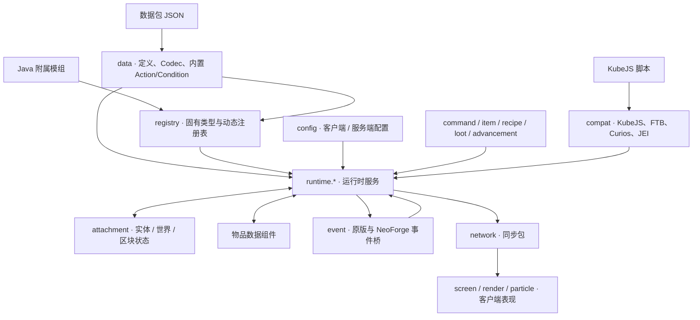
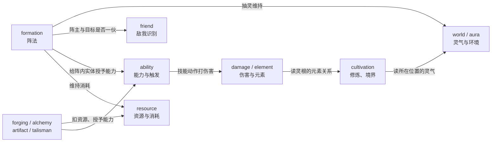

# 技术细节

这个大类放的是**源码级说明**：一个子系统在代码里由哪些类组成、一次调用怎么流过它们、为什么写成这样、边界和代价在哪里。

它和另外两个大类问的不是同一件事：

| 你想知道的 | 该看 |
| --- | --- |
| 一个 JSON 字段是什么意思、怎么写 | [数据包](/datapack/overview) |
| 哪个类、哪个服务可以调用 | [Java API](/java/) |
| 它内部**为什么**是这个样子 | 这里 |

## 文章

| 文章 | 内容 |
| --- | --- |
| [伤害系统](/technical/damage) | 一次攻击从发出到目标掉血的完整路径：出力与减免为什么必须分在两地结算、元素关系怎么参与、哪些发伤害路径被收拢进来、战斗数值在代码里的真实运算顺序。 |
| [敌我识别系统](/technical/identification) | 「这个实体算不算我的人」是怎么回答的：名单存在哪、判断事件如何覆盖、离线时谁替玩家回答、队伍类模组怎么接进来、以及现在有哪些调用方在问这个问题。 |
| [灵气计算](/technical/aura) | 一个坐标的灵气值是怎么算出来的：静态模板怎么选域、区块库存与方块发射器怎么合并、一次查询的 140 µs 花在哪、子区块近似的误差有多大（含两张误差研究图），以及客户端拿到的为什么只是快照。 |

## 源码地图

| 子系统 | 入口 | 主要源码 |
| --- | --- | --- |
| 伤害系统 | `DamageCalculationService` | `src/main/java/com/iafenvoy/mxt/runtime/damage/` |
| 敌我识别系统 | `FriendService` | `src/main/java/com/iafenvoy/mxt/runtime/friend/` |
| 灵气计算 | `AuraService` | `src/main/java/com/iafenvoy/mxt/runtime/world/` |

## 模块关系

代码分成四层：**输入**（数据包、KubeJS、附属模组）、**内核**（定义与注册）、**运行时服务**（真正干活的那些单例）、**状态与出口**（附件、事件、网络、客户端）。箭头表示「谁读谁、谁驱动谁」，不是严格的编译期依赖——内置行为就实现定义在 `data` 包里，却要调用 `runtime` 的服务。

运行时服务之间也是互相读的，而且方向基本是单向的：环境与状态是数据，玩法在上面读它、改它。下面这些是几组真实存在的读取关系（不是全部）：

## 阅读约定

- 类名与方法名按 Java 原样书写，公共包前缀 `com.iafenvoy.mxt` 从简，只在第一次出现时写全（例如 `runtime.damage.DamageCalculationService#deal` 指 `com.iafenvoy.mxt.runtime.damage.DamageCalculationService` 的 `deal` 方法）。
- 源码路径以仓库根目录为基准。
- 这里描述的是**当前实现**。它比数据包字段和公开 API 变化得更随意：字段名和接口在有兼容性顾虑时会保留，内部结构不会。所以这些页面适合用来读懂代码、判断一段逻辑为什么这么写，而不适合当成版本间的兼容性承诺——那两件事由[数据包](/datapack/overview)与 [Java API](/java/) 负责。
- 每篇尽量给出「为什么不是另一种写法」：这类章节才是读源码时最花时间、也最容易在下次改动时被忘掉的部分。
