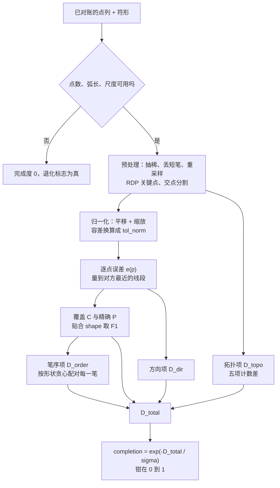

# 画符判分

画符工作站那条链是：工作站展示符形 → 玩家照着誊写 → 服务端拿**已对账的**点列算出一个完成度（`0~1`）→ 完成度同时决定成败与档位，并作为公式变量 `percentage` 喂给产物公式。

字段怎么写见 [talisman_drawing（画符配方）](/datapack/json/talisman_drawing)；这一页讲那个数**是怎么算出来的**。

## 代码位置

| 类 | 职责 |
| --- | --- |
| `runtime.talisman.TalismanDrawingScorer` | 判分本身：预处理、归一化、各项公式、完成度。纯函数，只读配方与点列。 |
| `runtime.talisman.TalismanWorkstationService` | 会话与结算：逐笔上报与拒收、扣颜料、提交时逐点对账、判档、把完成度注入 `percentage`。 |

## 一次判分吃什么、吐什么

| 输入 | 说明 |
| --- | --- |
| 符形 | 配方的 `pattern.strokes`，`[0,1]²` 的归一化坐标 |
| `pattern.tolerance` | 判分容差，缺省 `0.06`，口径是**画布高度的比例**：`tol_px = tolerance × 210`，缺省 `12.6px` |
| `judgement` | `sigma`（缺省 `1.0`）、`direction_weight` / `topology_weight` / `order_weight`（各缺省 `0.25`）、`stroke_count_strict`（缺省 `false`）、`min_stroke_length`（缺省 `0.02`）、`preview`（缺省 `true`） |
| 画布 | 本体常量，固定 `90 × 210`；配方里没有声明尺寸的字段 |
| 重采样步长、RDP 阈值系数 | 本体常量 `2.0`（像素）与 `0.5`（× 容差），**不是配方字段** |
| 玩家笔画 | 画布位图坐标系的点列（`x` 在 0 到 90，`y` 在 0 到 210），判分前归一化 |

`preview` 只被客户端界面读：`false` 时客户端不算本地预览分。判分器不读它。

输出是一个 `0~1` 的完成度，外加覆盖 / 精确 / 贴合 / 方向 / 拓扑 / 笔序各分量、总距离、玩家的简化关键点数、是否闭合、是否退化——后面这些只给探针与调试看，客户端只拿完成度。

## 算法：第 0 步到第 7 步



### 第 0 步 —— 退化输入

任一方留在点列里的点不足 2（抽稀前后各查一次）、抽稀后玩家的总弧长短于 `min_stroke_length × 210`（缺省 `4.2px`）、任一侧点云的 RMS 半径小到 `1e-6` 以下、或总距离算成了非有限值，都返回完成度恰好 `0`，退化标志为真。不抛异常、不记日志——"还没画完就提交"是正常输入。

### 第 1 步 —— 预处理（两侧同一套，都在像素空间）

1. **抽稀**：丢掉与上一个保留点距离小于 1px 的点（鼠标事件的重复点）。
2. **丢短笔**：只丢**玩家**的整笔——弧长短于 `min_stroke_length × 210` 的那些；符形那一侧不丢。
3. **重采样**：每笔按弧长等距取 `clamp(round(长度 / 2), 16, 256)` 点。上报多密、画得多快都不影响判分。
4. **关键点**：RDP 简化，阈值 `0.5 × tol_px`（缺省 `6.3px`）；同一笔简化后的首尾两点距离小于 `2 × tol_px`（缺省 `25.2px`）记为**闭合笔**。
5. **交点分割**：线段两两求交，先按包围盒预筛；交点处把两条线段各切一刀，交点数同时数出来。交点正好落在端点上时复用那个端点，两条笔才算真的接上。
6. **三份表示**：稠密的采样点列（算距离与方向）、采样点云（算覆盖与精确）、简化关键点图（算拓扑计数）。

### 第 2 步 —— 归一化：平移 + 缩放，不旋转

两侧各自把点云的质心移到原点，再各除以自己的 RMS 半径（每个点到质心的均方根距离），于是两边都是"尺寸 1"。容差跟着换算成 `tol_norm = tol_px / rms_ref`，后面的逐点误差就在这个单位尺度的坐标里量。

不搜角度，也不对齐主方向：朝向的差异全部落到第 3、4 步的距离与方向项上。

### 第 3 步 —— 逐点误差

`d'` 是到对方**最近线段**的距离（不是到最近的采样点，否则笔画的快慢会改分数），在归一化坐标里量：

```text
e(p) = min(1, (d' / tol_norm)²)
```

误差在容差之外饱和为 `1`。平方让"贴着画"与"擦着容差画"拉开距离：缺省参数下 `tol_norm` 约 `0.2`，偏差 2px / 5px / 12.6px 换算过去是 `0.032 / 0.079 / 0.2`，分别记 `0.03 / 0.16 / 1.0`。

查最近线段之前先按包围盒挡一层：包围盒的距离已经够远就直接记满误差，不再逐段扫。

### 第 4 步 —— 覆盖、精确、贴合，加上方向与拓扑

```text
覆盖   C = 1 − mean(参考点 e)
精确   P = 1 − mean(玩家点 e)
贴合   shape = 2·C·P / (C + P)      （C + P = 0 时记 0）
D_shape = 1 − shape

方向   D_dir：参考点的切线方向与它在玩家笔画上最近那一段的方向比，
              夹角折到 [0, π/2] 再除以 π/2，按 (1 − e(p)) 加权平均；
              权重和为 0 时记 1
拓扑   D_topo：五项计数差，逐项软化后加权相加
```

拓扑的五项：

| 项 | 松弛量 | 权重 |
| --- | --- | --- |
| 笔画数 | 0 | 0.15 |
| 端点数 | 1 | 0.25 |
| 交点数 | 1 | 0.25 |
| 闭合区域数 | 1 | 0.25 |
| 总长度 | 5% | 0.10 |

计数项是 `max(0, |a − b| − slack) / max(max(a, b), 1)`；总长度那一项的分母换成较大的那个长度（下限 `1`）。闭合区域数按欧拉公式算：`边 − 节点 + 分量 + 1`。

交点数与闭合区域数各留 `1` 的松弛：容差是 `12.6px`，手画的一条线到底真的穿过了另一条、还是差几个像素停住，几乎就是掷硬币；把这种差别算成结构差异，等于对同一条描红罚两次——线画在哪儿，形状项已经判过了。

### 第 5 步 —— 笔序

不按序号配对：对每一对（参考笔、玩家笔）各算一次 `pair(i, j) = 2·C(i, j)·P(i, j) / (C(i, j) + P(i, j))`，两个方向都只在这一对的范围里量；然后贪心取分最高的那一对，取走的两笔不再参与，一轮一轮配到没得配为止。

```text
配对：每一对（参考笔、玩家笔）各算一次 F1 贴合，贪心取最优，一笔只用一次
笔数相等：D_order = 1 − mean(配上的 pair)
笔数不等：D_order = 1 − mean(配上的 pair) × min(n, m) / max(n, m)
stroke_count_strict 为 true 时笔数不等直接 D_order = 1
```

按形状配对是因为**笔顺不在屏幕上**：工作站不画笔序，除非配方自己写了 `pattern.show_order`；同一组笔画换个先后画出来，玩家看到的是同一张符，不该因此掉分。笔数对不上照旧把整个笔序项按比例缩小（少画一笔、多画一笔、一笔被中途抬手断成两笔），那一层仍然是"笔画有多少"的信息。

### 第 6 步 —— 总距离与完成度

```text
D_total = (1 − shape) + direction_weight × D_dir + topology_weight × D_topo + order_weight × D_order
completion = clamp(exp(−D_total / sigma), 0, 1)
```

缺省参数下 `D_total` 最坏是 `1 + 0.25 + 0.25 + 0.25 = 1.75`，所以完成度下限约 `0.17`，不会到 0。

### 第 7 步 —— 输出

完成度、命中的档（判档见 [talisman_drawing（画符配方）](/datapack/json/talisman_drawing)），以及上面那几个分量、总距离、玩家的简化关键点数、是否闭合、是否退化。

## 为什么是这些项

- **贴合用 F1 而不是算术平均**。乱涂时覆盖高、精确低：示例符形上覆盖约 `0.85`、精确约 `0.10`，算术平均仍有 `0.48`，F1 只有 `0.18`——F1 对两个方向的失衡更敏感，而"描得准"那一侧几乎不受影响。
- **方向项按 `1 − e` 加权**。离得远的点没有"走向"可言，拿它们比方向只是往分数里掺噪声；误差已经到容差的点权重就是 0，不参与。
- **平移与缩放不判，旋转要扣分**。符箓有正倒，转过来的符不是同一张；手抖的几度由容差吸收，要更严就把 `tolerance` 调小。
- **容差写成画布高度的比例**。`tol_px` 与参考点云的 RMS 半径都由画布像素量出来，归一化时两边一起缩放，所以换算出的 `tol_norm` 与画布本身的像素尺寸无关，只跟符形占画布多大有关：`90 × 210` 上一个铺满画布的符形 `rms_ref` 约 `63`，`tol_norm` 约 `0.2`。
- **笔序项按形状配对，不按序号，也不搜全局最优排列**。笔顺不在屏幕上（除非配方写了 `pattern.show_order`），按序号配等于拿一个玩家看不见的东西扣分；贪心配对够用，全局最优排列的收益只落在交点与闭合区域密集的图形上，不值得那份实现成本。

## 实测数字

下面这组数是**探针腿在专用服务端上实测**的（不是手测），画布是 `90 × 210` 的位图，参数就是不写 `judgement` 时那一套：`tolerance 0.06`、`sigma 1.0`、三个权重各 `0.25`、`min_stroke_length 0.02`。「手绘」是合成的认真手描：抖动 ±2px、弓形 3px、两端各超出 8px；「潦草手绘」是抖动 ±5px、弓形 6px、两端各超出 16px。

| 画法 | 完成度 |
| --- | --- |
| 完美复刻 | `0.999` |
| 完美复刻，抖动 2px | `0.961` |
| 认真手绘 | `0.933` |
| 认真手绘，笔顺换过 | `0.933` |
| 认真手绘，中途抬笔 | `0.857` |
| 潦草手绘 | `0.815` |
| 同一个形状画在别处 | `0.998` |
| 同一个形状放大一倍 | `0.998` |
| 同一个形状缩到一半 | `0.934` |
| 整体转 15° | `0.545` |
| 整体转 90° | `0.239` |
| 缺一笔 | `0.818` |
| 多一笔 | `0.677` |
| 整张乱涂（锯齿涂满画布） | `0.398` |

「认真手绘」与「认真手绘，笔顺换过」两行逐项完全相同：笔序项按形状配对，先后不再进分数。

两条已知偏差，先记在这里：

- **缩到一半是 `0.934`，放大一倍是 `0.998`**，而按"大小不判"两者本该同档。原因是预处理阈值（RDP 阈值、闭合笔判据、抽稀步长）都是**绝对像素**，半尺寸的图里它们占的比重更大：缩到一半的形状项掉到 `0.968`、笔序项涨到 `0.069`，放大一倍时两项都接近 `0`。要修就得改设计：归一化之后才找角点与判闭合，或者让这些阈值随图形尺寸缩放。
- **整体转 90° 是 `0.239`，不是 0**。缺省权重下 `D_total` 最坏 `1.75`，完成度下限本来就约 `0.17`，"接近 0"在这套参数下不可能成立。

这些数是**初值**：参数按几何推算取，标定还没做，表里的数会随标定移动。

## 作者怎么调

| 想要的效果 | 动哪个 |
| --- | --- |
| 整体更难 / 更松 | `judgement.sigma` 是总旋钮，四项的罚分一起被它缩放。`sigma = 1.0` 时 `D_total = 1` 映射成 `0.37`，落在表里转 15°（`0.545`）与转 90°（`0.239`）两条之间。 |
| 只收紧"画得准不准" | `pattern.tolerance`：它同时是逐点误差的分母、RDP 阈值（`0.5 ×`）与闭合笔判据（`2 ×`）的基准。调小就是"贴着画才算对"。 |
| 只调某一项的份量 | `direction_weight` / `topology_weight` / `order_weight`（各缺省 `0.25`）：方向管"描成了另一条走向"，拓扑管"断笔、多出的端点与交点、多出来的区域、长度不对"，笔序管"画出来的哪一笔对应符形的哪一笔"。三个都是 `0` 就只剩形状项，允许，但加载期会记一条警告。 |
| 笔数不对就直接判死 | `judgement.stroke_count_strict: true`：笔数与符形不符时笔序项直接判满。 |
| 让"手抖点一下"不作数 | `judgement.min_stroke_length`，口径同样是画布高度的比例。 |
| 判档阈值 | 照上面那张实测表写 `result.grades[].min_completion`。想让"整体画歪"落在下品档，就把最低档写在转 15° 那条（`0.545`）附近或更高；想让手抖也能过，就压在抖动用例以下。最低那一档就是及格线。 |

有两点别动：重采样步长与 RDP 阈值系数是本体常量，不是字段。`judgement` 里写同名键（或任何未知键）会被**静默忽略**，不报错也不生效——"调了没反应"先回来看看是不是写在这儿了。

## 服务端权威与对账

- **颜料按服务端自己量的长度扣**：每一笔上报到服务端，长度由服务端拿收到的原始点列自己算（在预处理之前量），客户端报上来的长度与用量一律不读。
- **时间检测**：相邻两笔（含"开画 → 第一笔"）的间隔不足最小落笔间隔就**拒收该笔**；判定用的是服务端收到包时的游戏刻，客户端给的时间戳不读。被拒笔数超过允许值 → 本次会话判失败，材料不退。只有"过快"与"颜料不够"计入被拒数；"光标上已经没有那支笔了"是物理事实，不计，也不因此判失败。
- **提交时逐点对账**：整幅图案与逐笔记录必须逐笔、逐点一致——多一笔、少一笔、坐标变了、顺序变了，都算不一致 → 判失败、材料不退，日志里留一条警告。少了这一步，客户端可以离线画好一幅图再当成结算提交上来。
- **上限**：单笔点数超限拒收该笔；一次绘制累计的点数或笔画数超限，整次提交被拒收并记一条警告。
- **完成度一律由服务端重算**，客户端算的那份只用于预览，不回传也不被采信。

它拦得住什么、拦不住什么，说清楚：拦得住"一瞬间灌进几百笔"（时间检测）、"离线画好再交"与"改包塞一笔"（逐点对账）；**拦不住按同样节奏自动描图的脚本**——那种脚本画得和人一样准，数据上与"人照着描红描得很准"完全同形。这套东西**不是万无一失**。

## 服务端配置项

| 条目 | 默认 | 管什么 |
| --- | --- | --- |
| 服务端配置「符箓 → 最小落笔间隔」 | `300`（毫秒） | 相邻两笔之间、以及"开画 → 第一笔"之间的最小间隔，`0` 关闭。 |
| 服务端配置「符箓 → 允许被拒的笔数」 | `3` | 一次绘制里被拒的笔数超过它，本次会话判失败。 |
| 服务端配置「符箓 → 单笔点数上限」 | `512` | 一笔上报的点数超过它，这一笔被拒收。 |
| 服务端配置「符箓 → 单次绘制点数上限」 | `4096` | 整次提交的累计点数上限，超了整次被拒收。 |
| 服务端配置「符箓 → 单次绘制笔画上限」 | `64` | 整次提交的笔画数上限，同上。 |
| 服务端配置「符箓 → 符笔容量」 | `4000` | 一支符笔能装多少颜料（单位是像素弧长）。 |
| 服务端配置「符箓 → 一份颜料的点数」 | `1000` | 一份颜料蘸进符笔后给多少颜料。 |
| 服务端配置「符箓 → 颜料换算率」 | `1.0` | 每像素弧长扣多少颜料。 |
| 服务端配置「符箓 → 单笔颜料保底」 | `1` | 每一笔至少扣多少，免得"点一下"不花钱。 |
| 服务端配置「符箓 → 单笔颜料上限」 | `0` | 单笔最多扣多少，`0` 表示不封顶。 |

十项的完整说明见[服务端配置](/player-guide/config)。

## 代价与限制

- **判分是纯函数，每次都现算**：参考侧的预处理**没有缓存**，每调用一次算一遍。结算一张符只算一次、客户端预览也有限流，暂时够用；要加缓存就按"配方 id + 注册表实例"开键，并在数据包重载时失效。
- **判分成本**是"参考点数 × 玩家线段数"，重采样后每笔最多 256 点，量级在 `10⁵` 以内。
- **预处理阈值是绝对像素**：它们不随图形尺寸缩放，所以同一条缓弯在半尺寸的图里可能算闭合、在放大后的图里就未必——判据的松紧跟着图形大小走。
- **旋转不归一化是有意的**：整个符形转过来的分数会实打实地掉，这不是待修的 bug；`tolerance` 只吸收手抖的那几度。

## 相关阅读

- [talisman_drawing（画符配方）](/datapack/json/talisman_drawing)：`pattern` / `judgement` / `result` 每个键的字段表、默认值与加载期校验。
- [符箓定义](/datapack/json/talisman)：产物本体、容量、耐久与发动规则；[定义符箓](/tutorial/inscribe-a-talisman)：从定义到灌注发动的完整教程。
- [服务端配置](/player-guide/config)：上面九项与使用冷却的完整说明。
